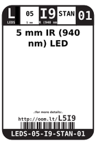
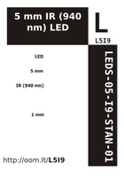

Contents
========

* [L5I9 > 5 mm IR (940 nm) LED](#l5i9--5-mm-ir-940-nm-led)
	* [Datasheets](#datasheets)
	* [Labels](#labels)
	* [EDA](#eda)
	* [Images](#images)
	* [Tags](#tags)

# L5I9 > 5 mm IR (940 nm) LED

- ID: LEDS-05-I9-STAN-01
- Hex ID: L5I9
- Name: 5 mm IR (940 nm) LED
- Description: 5 mm IR (940 nm) LED
- Long Link: [http://oom.lt/LEDS-05-I9-STAN-01](http://oom.lt/LEDS-05-I9-STAN-01)
- Long Link: [http://oom.lt/L5I9](http://oom.lt/L5I9)

## Datasheets

- Datasheet: [datasheet.pdf](datasheet.pdf)

## Labels
  
  

|label-front|label-inventory|label-spec|
| :---: | :---: | :---: |
||||

## EDA

### Symbols

## Images
  
  

|label-front|label-inventory|label-spec|
| :---: | :---: | :---: |
||||

## Tags

- oompID: LEDS-05-I9-STAN-01
- name: 5 mm IR (940 nm) LED
- hexID: L5I9
- oompSort: 
- oompClass: Through Hole
- oompClassCode: THTH
- oompType: LEDS
- oompSize: 05
- oompColor: I9
- oompDesc: STAN
- oompIndex: 01
- oompVersion: 40
- oompBbls: template;LEDS-05-X-XXXX-01-bbls
- oompDiag: template;LEDS-05-X-XXXX-01-diag
- oompIden: template;LEDS-05-X-XXXX-01-iden
- oompSchem: template;LEDS-XXXX-X-XXXX-XX-schem
- oompSimp: template;LEDS-05-X-XXXX-01-simp
- ooDesignator: D1
