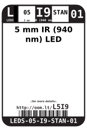
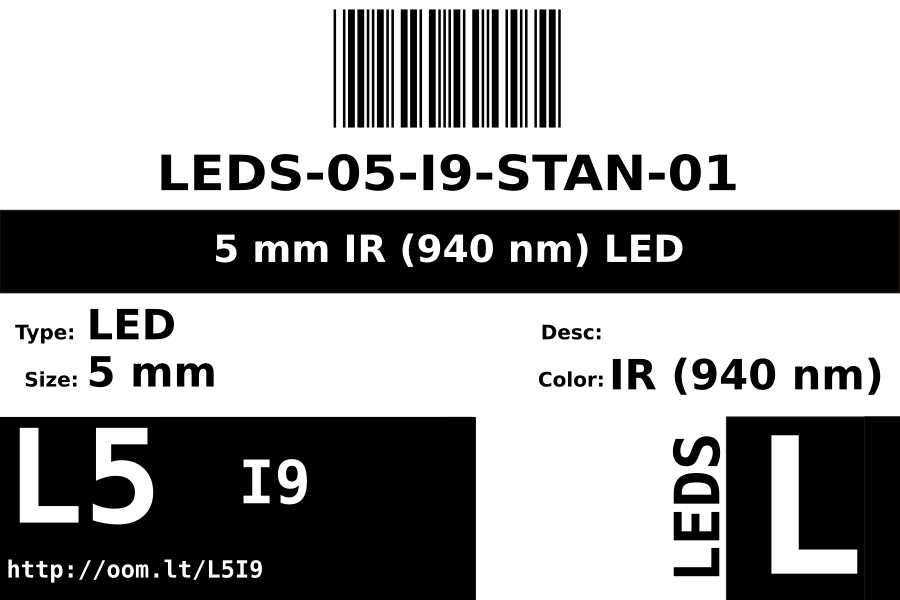

Contents
========

* [LEDS-05-I9-STAN-01>5 mm IR (940 nm) LED](#leds-05-i9-stan-015-mm-ir-940-nm-led)
	* [Datasheets](#datasheets)
	* [Labels](#labels)
	* [EDA](#eda)
		* [Symbols](#symbols)
	* [Tags](#tags)

# LEDS-05-I9-STAN-01>5 mm IR (940 nm) LED

- ID: LEDS-05-I9-STAN-01
- Name: LEDS-05-I9-STAN-01

## Datasheets

- Datasheet: [datasheet.pdf](datasheet.pdf)

## Labels
  
  

|Front|Inventory|Specifications|
| :---: | :---: | :---: |
||||

## EDA

### Symbols

## Tags

- index: 12659
- oompID: LEDS-05-I9-STAN-01
- name: 5 mm IR (940 nm) LED
- hexID: L5I9
- oompSort: 
- oompClass: Through Hole
- oompClassCode: THTH
- oompType: LEDS
- oompSize: 05
- oompColor: I9
- oompDesc: STAN
- oompIndex: 01
- oompVersion: 40
- oompBbls: template;LEDS-05-X-XXXX-01-bbls
- oompDiag: template;LEDS-05-X-XXXX-01-diag
- oompIden: template;LEDS-05-X-XXXX-01-iden
- oompSchem: template;LEDS-XXXX-X-XXXX-XX-schem
- oompSimp: template;LEDS-05-X-XXXX-01-simp
- ooDesignator: D1
