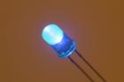
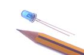
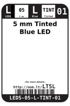
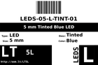
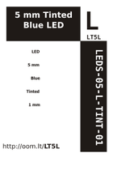

Contents
========

* [LT5L > 5 mm Tinted Blue LED](#lt5l--5-mm-tinted-blue-led)
	* [Images](#images)
	* [Datasheets](#datasheets)
	* [Labels](#labels)
	* [EDA](#eda)
	* [Tags](#tags)
  
![][im]
# LT5L > 5 mm Tinted Blue LED

- ID: LEDS-05-L-TINT-01
- Hex ID: LT5L
- Name: 5 mm Tinted Blue LED
- Description: 5 mm Tinted Blue LED

## Images
  
  

|image|image_RE|label-front|label-inventory|label-spec|
| :---: | :---: | :---: | :---: | :---: |
||||||

## Datasheets

- Datasheet: [datasheet.pdf](datasheet.pdf)

## Labels
  
  

|label-front|label-inventory|label-spec|
| :---: | :---: | :---: |
||||

## EDA

### Symbols

## Tags

- oompID: LEDS-05-L-TINT-01
- name: 5 mm Tinted Blue LED
- hexID: LT5L
- oompSort: 0505ZTINTL
- oompType: LEDS
- oompSize: 05
- oompColor: L
- oompDesc: TINT
- oompIndex: 01
- oompVersion: 99
- oompClass: Through Hole Component
- oompClassCode: THTH
- oompBbls: template;LEDS-05-X-XXXX-01-bbls
- oompDiag: template;LEDS-05-X-XXXX-01-diag
- oompIden: template;LEDS-05-X-XXXX-01-iden
- oompSchem: template;LEDS-XXXX-X-XXXX-XX-schem
- oompSimp: template;LEDS-05-X-XXXX-01-simp
- ooDesignator: D1

[im]: image_450.jpg
