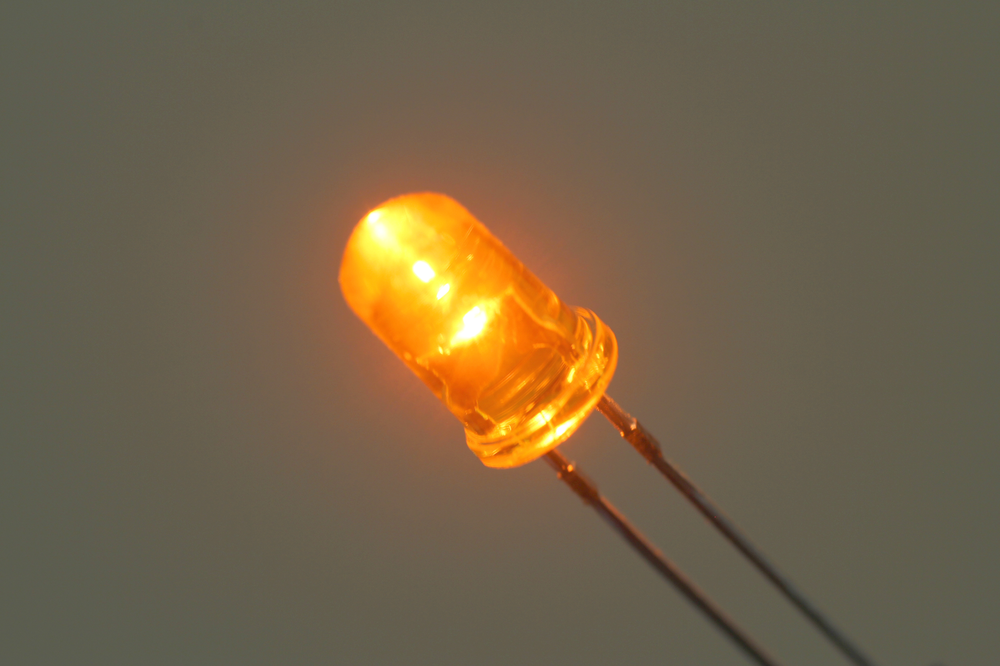
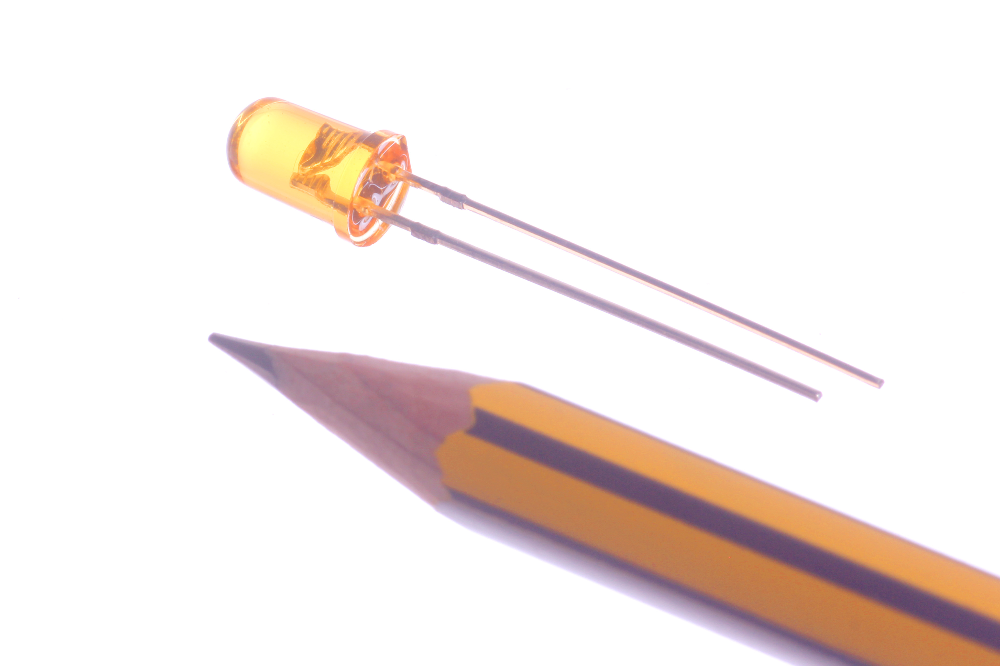

Contents
========

* [LEDS-05-O-TINT-01>5 mm Tinted Orange LED](#leds-05-o-tint-015-mm-tinted-orange-led)
	* [Images](#images)
	* [Datasheets](#datasheets)
	* [EDA](#eda)
		* [Footprints](#footprints)
		* [Symbols](#symbols)
	* [Tags](#tags)
  
![][im]
# LEDS-05-O-TINT-01>5 mm Tinted Orange LED

- ID: LEDS-05-O-TINT-01
- Name: LEDS-05-O-TINT-01

## Images
  
  

|Main|Reference|
| :---: | :---: |
|||

## Datasheets

- Datasheet: [datasheet.pdf](datasheet.pdf)

## EDA

### Footprints
  

|||||
| :---: | :---: | :---: | :---: |

### Symbols

## Tags

- index: 364
- index: 9876
- oompID: LEDS-05-O-TINT-01
- name: 5 mm Tinted Orange LED
- hexID: LT5O
- oompSort: 0505ZTINTO
- oompType: LEDS
- oompSize: 05
- oompColor: O
- oompDesc: TINT
- oompIndex: 01
- oompVersion: 99
- oompClass: Through Hole Component
- oompClassCode: THTH
- oompBbls: template;LEDS-05-X-XXXX-01-bbls
- oompDiag: template;LEDS-05-X-XXXX-01-diag
- oompIden: template;LEDS-05-X-XXXX-01-iden
- oompSchem: template;LEDS-XXXX-X-XXXX-XX-schem
- oompSimp: template;LEDS-05-X-XXXX-01-simp
- ooDesignator: D1

[im]: image_600.jpg
