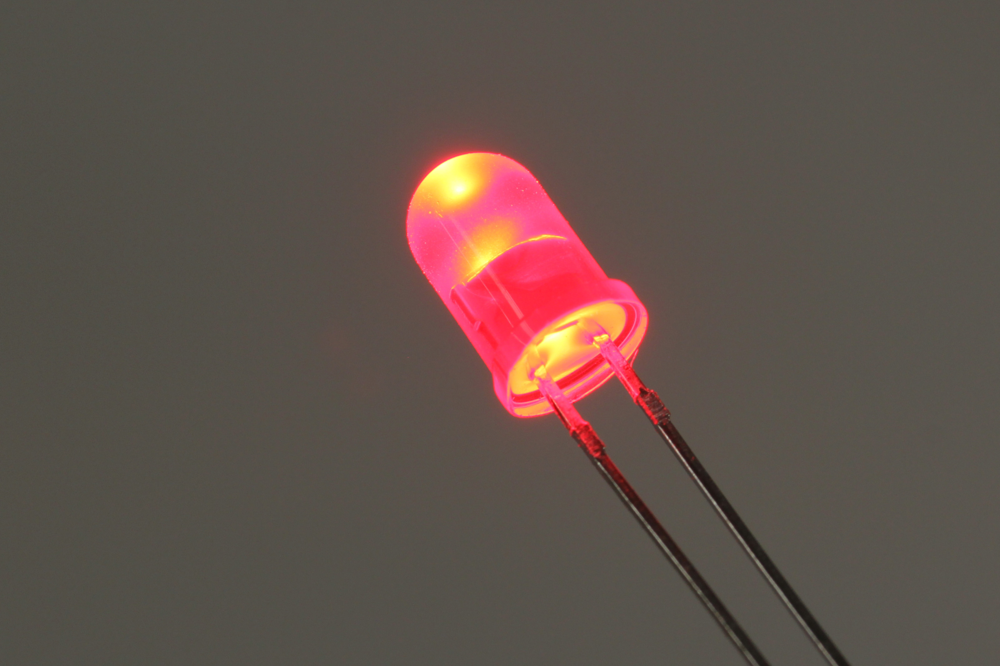
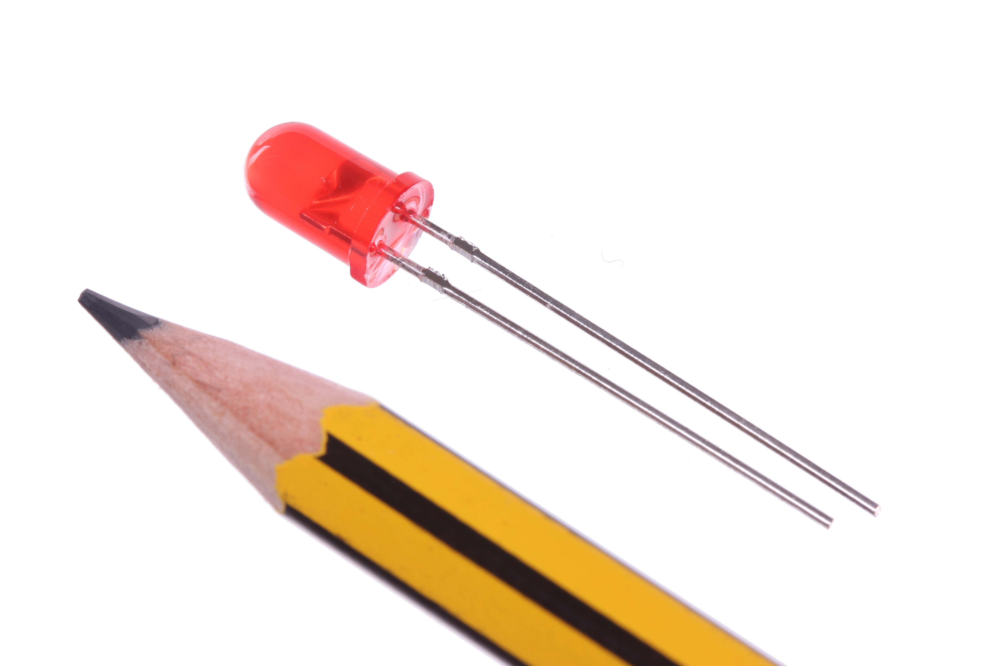
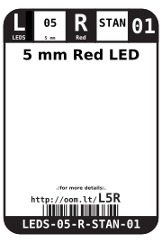
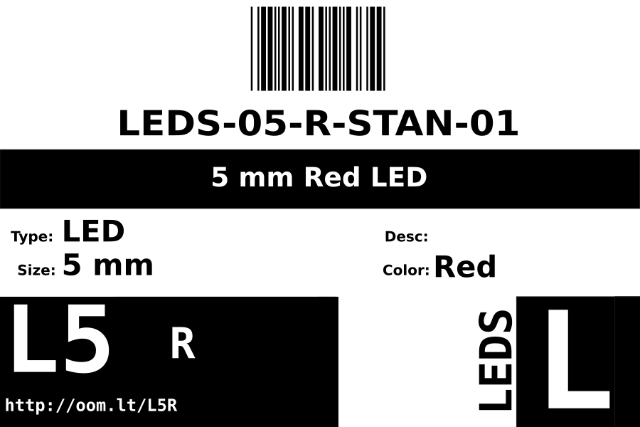
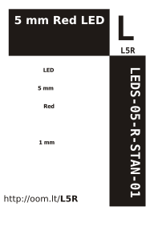

Contents
========

* [LEDS-05-R-STAN-01>5 mm Red LED](#leds-05-r-stan-015-mm-red-led)
	* [Images](#images)
	* [Datasheets](#datasheets)
	* [Labels](#labels)
	* [EDA](#eda)
		* [Symbols](#symbols)
	* [Tags](#tags)
  
![][im]
# LEDS-05-R-STAN-01>5 mm Red LED

- ID: LEDS-05-R-STAN-01
- Name: LEDS-05-R-STAN-01

## Images
  
  

|Main|Reference|
| :---: | :---: |
|||

## Datasheets

- Datasheet: [datasheet.pdf](datasheet.pdf)

## Labels
  
  

|Front|Inventory|Specifications|
| :---: | :---: | :---: |
||||

## EDA

### Symbols

## Tags

- index: 12665
- index: 3982
- oompID: LEDS-05-R-STAN-01
- name: 5 mm Red LED
- hexID: L5R
- oompSort: 0505R
- oompType: LEDS
- oompSize: 05
- oompColor: R
- oompDesc: STAN
- oompIndex: 01
- oompVersion: 99
- ooPitch: 2.54 mm
- ooLensColor: Red
- ooForwardVoltage: 2.0 V
- ooForwardCurrent: 15 mA
- ooIntensity: 3,500 mcd
- ooPowerAngle: 25 deg
- ooWavelength: 623 nm
- oompClass: Through Hole Component
- oompClassCode: THTH
- oompBbls: template;LEDS-05-X-XXXX-01-bbls
- oompDiag: template;LEDS-05-X-XXXX-01-diag
- oompIden: template;LEDS-05-X-XXXX-01-iden
- oompSchem: template;LEDS-XXXX-X-XXXX-XX-schem
- oompSimp: template;LEDS-05-X-XXXX-01-simp
- ooDesignator: D1

[im]: image_600.jpg
