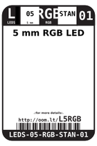
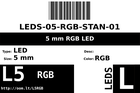

Contents
========

* [L5RGB > 5 mm RGB LED](#l5rgb--5-mm-rgb-led)
	* [Images](#images)
	* [Datasheets](#datasheets)
	* [Labels](#labels)
	* [EDA](#eda)
	* [Tags](#tags)

# L5RGB > 5 mm RGB LED

- ID: LEDS-05-RGB-STAN-01
- Hex ID: L5RGB
- Name: 5 mm RGB LED
- Description: 5 mm RGB LED

## Images
  
  

|label-front|label-inventory|label-spec|
| :---: | :---: | :---: |
||||

## Datasheets

- Datasheet: [datasheet.pdf](datasheet.pdf)

## Labels
  
  

|label-front|label-inventory|label-spec|
| :---: | :---: | :---: |
||||

## EDA

### Symbols

## Tags

- oompID: LEDS-05-RGB-STAN-01
- name: 5 mm RGB LED
- hexID: L5RGB
- oompSort: LEDS05STAN
- oompType: LEDS
- oompSize: 05
- oompColor: RGB
- oompDesc: STAN
- oompIndex: 01
- oompVersion: 98
- ooPitch: 2.54
- ooDiameter: 5.0 mm
- ooNumPins: 2
- ooDesignator: D1
