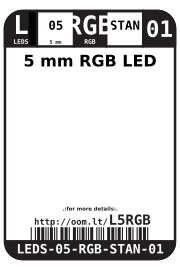
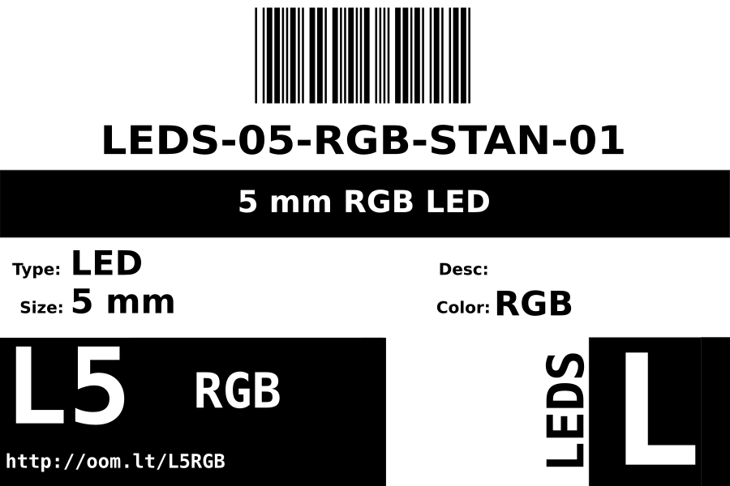
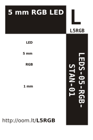

Contents
========

* [LEDS-05-RGB-STAN-01>5 mm RGB LED](#leds-05-rgb-stan-015-mm-rgb-led)
	* [Datasheets](#datasheets)
	* [Labels](#labels)
	* [EDA](#eda)
		* [Symbols](#symbols)
	* [Tags](#tags)

# LEDS-05-RGB-STAN-01>5 mm RGB LED

- ID: LEDS-05-RGB-STAN-01
- Name: LEDS-05-RGB-STAN-01

## Datasheets

- Datasheet: [datasheet.pdf](datasheet.pdf)

## Labels
  
  

|Front|Inventory|Specifications|
| :---: | :---: | :---: |
||||

## EDA

### Symbols

## Tags

- index: 12667
- oompID: LEDS-05-RGB-STAN-01
- name: 5 mm RGB LED
- hexID: L5RGB
- oompSort: LEDS05STAN
- oompType: LEDS
- oompSize: 05
- oompColor: RGB
- oompDesc: STAN
- oompIndex: 01
- oompVersion: 98
- ooPitch: 2.54
- ooDiameter: 5.0 mm
- ooNumPins: 2
- ooDesignator: D1
