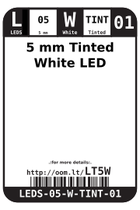
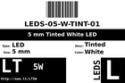
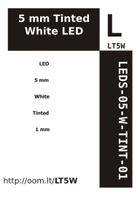
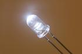
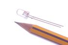

Contents
========

* [LT5W > 5 mm Tinted White LED](#lt5w--5-mm-tinted-white-led)
	* [Datasheets](#datasheets)
	* [Labels](#labels)
	* [EDA](#eda)
	* [Images](#images)
	* [Tags](#tags)
  
![][im]
# LT5W > 5 mm Tinted White LED

- ID: LEDS-05-W-TINT-01
- Hex ID: LT5W
- Name: 5 mm Tinted White LED
- Description: 5 mm Tinted White LED
- Long Link: [http://oom.lt/LEDS-05-W-TINT-01](http://oom.lt/LEDS-05-W-TINT-01)
- Short Link: [http://oom.lt/LT5W](http://oom.lt/LT5W)

## Datasheets

- Datasheet: [datasheet.pdf](datasheet.pdf)

## Labels
  
  

|label-front|label-inventory|label-spec|
| :---: | :---: | :---: |
||||

## EDA

### Symbols
  

|[  SYMBOL-kicad-kicad-symbols-Device-LED](https://github.com/oomlout/oomlout_OOMP_eda/tree/main/SYMBOL/kicad/kicad-symbols/Device/LED/)||||
| :---: | :---: | :---: | :---: |

## Images
  
  

|image|image_RE|label-front|label-inventory|label-spec|
| :---: | :---: | :---: | :---: | :---: |
||||||

## Tags

- oompID: LEDS-05-W-TINT-01
- name: 5 mm Tinted White LED
- hexID: LT5W
- oompSort: 0505ZTINTW
- oompType: LEDS
- oompSize: 05
- oompColor: W
- oompDesc: TINT
- oompIndex: 01
- oompVersion: 99
- oompClass: Through Hole Component
- oompClassCode: THTH
- oompBbls: template;LEDS-05-X-XXXX-01-bbls
- oompDiag: template;LEDS-05-X-XXXX-01-diag
- oompIden: template;LEDS-05-X-XXXX-01-iden
- oompSchem: template;LEDS-XXXX-X-XXXX-XX-schem
- oompSimp: template;LEDS-05-X-XXXX-01-simp
- ooDesignator: D1
- symbolKicad: SYMBOL-kicad-kicad-symbols-Device-LED

[im]: image_450.jpg
