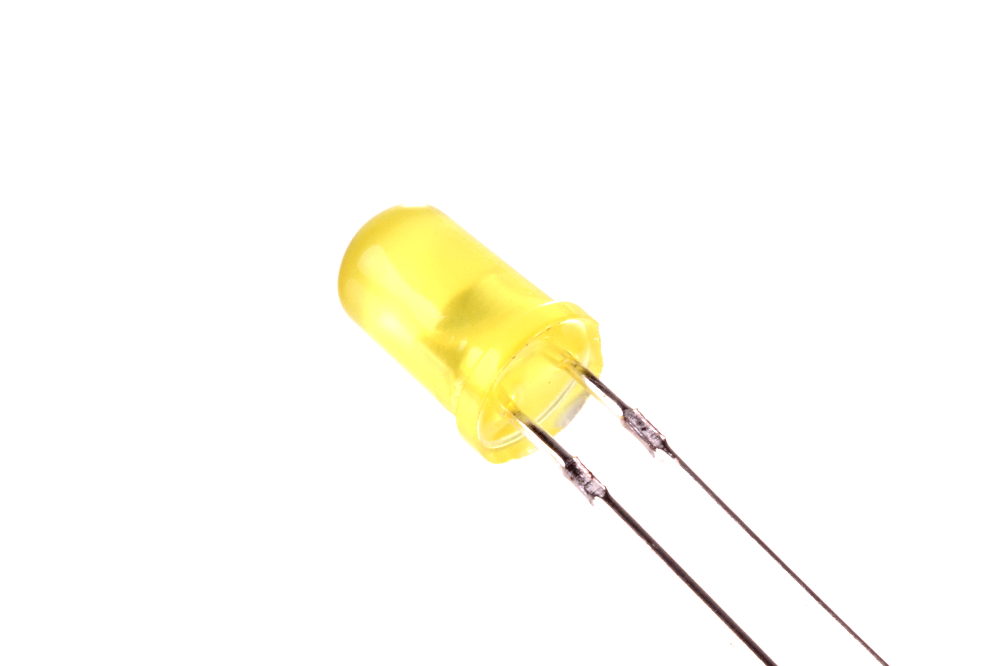
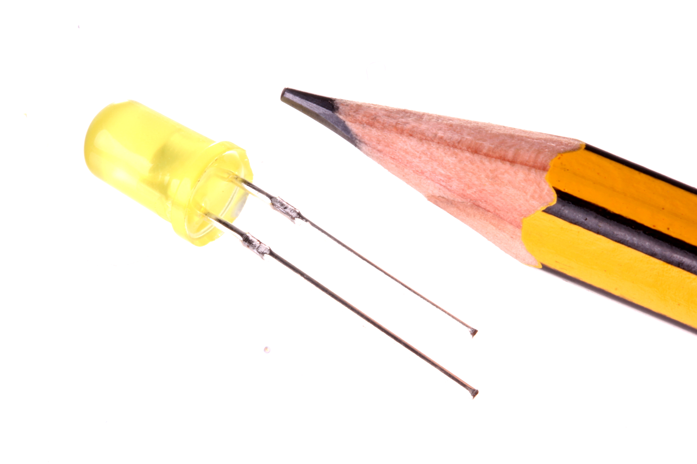

Contents
========

* [LEDS-05-Y-STAN-01>5 mm Yellow LED](#leds-05-y-stan-015-mm-yellow-led)
	* [Images](#images)
	* [Datasheets](#datasheets)
	* [EDA](#eda)
		* [Footprints](#footprints)
		* [Symbols](#symbols)
	* [Tags](#tags)

# LEDS-05-Y-STAN-01>5 mm Yellow LED

- ID: LEDS-05-Y-STAN-01
- Name: LEDS-05-Y-STAN-01

## Images
  
  

|Main|Reference|
| :---: | :---: |
|||

## Datasheets

- Datasheet: [datasheet.pdf](datasheet.pdf)

## EDA

### Footprints
  

|||||
| :---: | :---: | :---: | :---: |

### Symbols

## Tags

- index: 373
- oompID: LEDS-05-Y-STAN-01
- name: 5 mm Yellow LED
- hexID: L5Y
- oompSort: LEDS05STAN
- oompType: LEDS
- oompSize: 05
- oompColor: Y
- oompDesc: STAN
- oompIndex: 01
- oompVersion: 98
- ooPitch: 2.54
- ooDiameter: 5.0 mm
- ooNumPins: 2
- oompBbls: template;LEDS-05-X-XXXX-01-bbls
- oompDiag: template;LEDS-05-X-XXXX-01-diag
- oompIden: template;LEDS-05-X-XXXX-01-iden
- oompSchem: template;LEDS-XXXX-X-XXXX-XX-schem
- oompSimp: template;LEDS-05-X-XXXX-01-simp
- ooDesignator: D1
