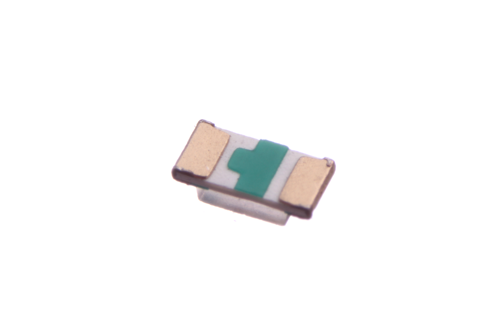

Contents
========

* [LEDS-0603-G-STAN-01>SMD (0603) Green LED](#leds-0603-g-stan-01smd-0603-green-led)
	* [Images](#images)
	* [Datasheets](#datasheets)
	* [EDA](#eda)
		* [Symbols](#symbols)
	* [Tags](#tags)

# LEDS-0603-G-STAN-01>SMD (0603) Green LED

- ID: LEDS-0603-G-STAN-01
- Name: LEDS-0603-G-STAN-01

## Images
  
  

|Bottom|
| :---: |
||

## Datasheets

- Datasheet: [datasheet.pdf](datasheet.pdf)

## EDA

### Symbols

## Tags

- index: 375
- index: 4182
- oompID: LEDS-0603-G-STAN-01
- name: SMD (0603) Green LED
- hexID: L6G
- oompSort: 0603G
- oompType: LEDS
- oompSize: 0603
- oompColor: G
- oompDesc: STAN
- oompIndex: 01
- oompVersion: 99
- oompClass: Surface Mount
- oompClassCode: SMDS
- oompBbls: template;XXXX-0603-X-XXXX-XX-bbls
- oompDiag: template;XXXX-0603-X-XXXX-XX-diag
- oompIden: template;XXXX-0603-X-XXXX-XX-iden
- oompSchem: template;LEDS-XXXX-X-XXXX-XX-schem
- oompSimp: template;XXXX-0603-X-XXXX-XX-simp
- ooDesignator: D1
