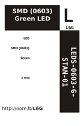

Contents
========

* [L6G > SMD (0603) Green LED](#l6g--smd-0603-green-led)
	* [Datasheets](#datasheets)
	* [Labels](#labels)
	* [EDA](#eda)
	* [Images](#images)
	* [Tags](#tags)

# L6G > SMD (0603) Green LED

- ID: LEDS-0603-G-STAN-01
- Hex ID: L6G
- Name: SMD (0603) Green LED
- Description: SMD (0603) Green LED
- Long Link: [http://oom.lt/LEDS-0603-G-STAN-01](http://oom.lt/LEDS-0603-G-STAN-01)
- Short Link: [http://oom.lt/L6G](http://oom.lt/L6G)

## Datasheets

- Datasheet: [datasheet.pdf](datasheet.pdf)

## Labels
  
  

|label-front|label-inventory|label-spec|
| :---: | :---: | :---: |
||||

## EDA

### Footprints
  

|[  FOOTPRINT-kicad-kicad-footprints-LED_SMD-LED_0603_1608Metric](https://github.com/oomlout/oomlout_OOMP_eda/tree/main/FOOTPRINT/kicad/kicad-footprints/LED_SMD/LED_0603_1608Metric/)|[  FOOTPRINT-kicad-kicad-footprints-LED_SMD-LED_0603_1608Metric_Pad1.05x0.95mm_HandSolder](https://github.com/oomlout/oomlout_OOMP_eda/tree/main/FOOTPRINT/kicad/kicad-footprints/LED_SMD/LED_0603_1608Metric_Pad1.05x0.95mm_HandSolder/)|||
| :---: | :---: | :---: | :---: |
  

### Instances
  
Used 201 times.  
Prevalance: (201\10986) 1.8296%  

|Project|Occur- rences|Identifiers|
| :---: | :---: | :---: |
|[PROJ-ADAF-1231-STAN-01 Adafruit_ADXL345_PCB](https://github.com/oomlout/oomlout_OOMP_projects/tree/main/PROJ-ADAF-1231-STAN-01/)|[1](https://github.com/oomlout/oomlout_OOMP_projects/tree/main/PROJ-ADAF-1231-STAN-01/)|[D1](https://github.com/oomlout/oomlout_OOMP_projects/tree/main/PROJ-ADAF-1231-STAN-01/)|
|[PROJ-ADAF-1982-STAN-01 Adafruit MPR121 PCB](https://github.com/oomlout/oomlout_OOMP_projects/tree/main/PROJ-ADAF-1982-STAN-01/)|[1](https://github.com/oomlout/oomlout_OOMP_projects/tree/main/PROJ-ADAF-1982-STAN-01/)|[D2](https://github.com/oomlout/oomlout_OOMP_projects/tree/main/PROJ-ADAF-1982-STAN-01/)|
|[PROJ-ADAF-2809-STAN-01 Adafruit LIS3DH Breakout PCB](https://github.com/oomlout/oomlout_OOMP_projects/tree/main/PROJ-ADAF-2809-STAN-01/)|[1](https://github.com/oomlout/oomlout_OOMP_projects/tree/main/PROJ-ADAF-2809-STAN-01/)|[D1](https://github.com/oomlout/oomlout_OOMP_projects/tree/main/PROJ-ADAF-2809-STAN-01/)|
|[PROJ-ADAF-2857-STAN-01 Adafruit SHT31 Sensor Breakout PCB](https://github.com/oomlout/oomlout_OOMP_projects/tree/main/PROJ-ADAF-2857-STAN-01/)|[1](https://github.com/oomlout/oomlout_OOMP_projects/tree/main/PROJ-ADAF-2857-STAN-01/)|[D1](https://github.com/oomlout/oomlout_OOMP_projects/tree/main/PROJ-ADAF-2857-STAN-01/)|
|[PROJ-ADAF-3251-STAN-01 Adafruit Si7021 PCB](https://github.com/oomlout/oomlout_OOMP_projects/tree/main/PROJ-ADAF-3251-STAN-01/)|[1](https://github.com/oomlout/oomlout_OOMP_projects/tree/main/PROJ-ADAF-3251-STAN-01/)|[D1](https://github.com/oomlout/oomlout_OOMP_projects/tree/main/PROJ-ADAF-3251-STAN-01/)|
|[PROJ-ADAF-3387-STAN-01 Adafruit LSM9DS1 Breakout PCB](https://github.com/oomlout/oomlout_OOMP_projects/tree/main/PROJ-ADAF-3387-STAN-01/)|[1](https://github.com/oomlout/oomlout_OOMP_projects/tree/main/PROJ-ADAF-3387-STAN-01/)|[D1](https://github.com/oomlout/oomlout_OOMP_projects/tree/main/PROJ-ADAF-3387-STAN-01/)|
|[PROJ-ADAF-3500-STAN-01 Adafruit Trinket M0 PCB](https://github.com/oomlout/oomlout_OOMP_projects/tree/main/PROJ-ADAF-3500-STAN-01/)|[1](https://github.com/oomlout/oomlout_OOMP_projects/tree/main/PROJ-ADAF-3500-STAN-01/)|[PWR](https://github.com/oomlout/oomlout_OOMP_projects/tree/main/PROJ-ADAF-3500-STAN-01/)|
|[PROJ-ADAF-3589-STAN-01 Adafruit PiUART PCB](https://github.com/oomlout/oomlout_OOMP_projects/tree/main/PROJ-ADAF-3589-STAN-01/)|[1](https://github.com/oomlout/oomlout_OOMP_projects/tree/main/PROJ-ADAF-3589-STAN-01/)|[D3](https://github.com/oomlout/oomlout_OOMP_projects/tree/main/PROJ-ADAF-3589-STAN-01/)|
|[PROJ-ADAF-3660-STAN-01 Adafruit BME680 PCB](https://github.com/oomlout/oomlout_OOMP_projects/tree/main/PROJ-ADAF-3660-STAN-01/)|[1](https://github.com/oomlout/oomlout_OOMP_projects/tree/main/PROJ-ADAF-3660-STAN-01/)|[D1](https://github.com/oomlout/oomlout_OOMP_projects/tree/main/PROJ-ADAF-3660-STAN-01/)|
|[PROJ-ADAF-3886-STAN-01 Adafruit MPU6050 PCB](https://github.com/oomlout/oomlout_OOMP_projects/tree/main/PROJ-ADAF-3886-STAN-01/)|[1](https://github.com/oomlout/oomlout_OOMP_projects/tree/main/PROJ-ADAF-3886-STAN-01/)|[D1](https://github.com/oomlout/oomlout_OOMP_projects/tree/main/PROJ-ADAF-3886-STAN-01/)|
|[PROJ-ADAF-3966-STAN-01 Adafruit BMP3xx PCB](https://github.com/oomlout/oomlout_OOMP_projects/tree/main/PROJ-ADAF-3966-STAN-01/)|[1](https://github.com/oomlout/oomlout_OOMP_projects/tree/main/PROJ-ADAF-3966-STAN-01/)|[D1](https://github.com/oomlout/oomlout_OOMP_projects/tree/main/PROJ-ADAF-3966-STAN-01/)|
|[PROJ-ADAF-3967-STAN-01 Adafruit VL53L1X PCB](https://github.com/oomlout/oomlout_OOMP_projects/tree/main/PROJ-ADAF-3967-STAN-01/)|[1](https://github.com/oomlout/oomlout_OOMP_projects/tree/main/PROJ-ADAF-3967-STAN-01/)|[D2](https://github.com/oomlout/oomlout_OOMP_projects/tree/main/PROJ-ADAF-3967-STAN-01/)|
|[PROJ-ADAF-4161-STAN-01 Adafruit VCNL4040 PCB](https://github.com/oomlout/oomlout_OOMP_projects/tree/main/PROJ-ADAF-4161-STAN-01/)|[1](https://github.com/oomlout/oomlout_OOMP_projects/tree/main/PROJ-ADAF-4161-STAN-01/)|[D1](https://github.com/oomlout/oomlout_OOMP_projects/tree/main/PROJ-ADAF-4161-STAN-01/)|
|[PROJ-ADAF-4201-STAN-01 Adafruit AirLift Breakout PCB](https://github.com/oomlout/oomlout_OOMP_projects/tree/main/PROJ-ADAF-4201-STAN-01/)|[1](https://github.com/oomlout/oomlout_OOMP_projects/tree/main/PROJ-ADAF-4201-STAN-01/)|[D1](https://github.com/oomlout/oomlout_OOMP_projects/tree/main/PROJ-ADAF-4201-STAN-01/)|
|[PROJ-ADAF-4286-STAN-01 Adafruit DS3502 PCB](https://github.com/oomlout/oomlout_OOMP_projects/tree/main/PROJ-ADAF-4286-STAN-01/)|[1](https://github.com/oomlout/oomlout_OOMP_projects/tree/main/PROJ-ADAF-4286-STAN-01/)|[D1](https://github.com/oomlout/oomlout_OOMP_projects/tree/main/PROJ-ADAF-4286-STAN-01/)|
|[PROJ-ADAF-4314-STAN-01 Adafruit ATECC608 PCB](https://github.com/oomlout/oomlout_OOMP_projects/tree/main/PROJ-ADAF-4314-STAN-01/)|[1](https://github.com/oomlout/oomlout_OOMP_projects/tree/main/PROJ-ADAF-4314-STAN-01/)|[D1](https://github.com/oomlout/oomlout_OOMP_projects/tree/main/PROJ-ADAF-4314-STAN-01/)|
|[PROJ-ADAF-4319-STAN-01 Adafruit PyRuler PCB](https://github.com/oomlout/oomlout_OOMP_projects/tree/main/PROJ-ADAF-4319-STAN-01/)|[2](https://github.com/oomlout/oomlout_OOMP_projects/tree/main/PROJ-ADAF-4319-STAN-01/)|[L4, PWR](https://github.com/oomlout/oomlout_OOMP_projects/tree/main/PROJ-ADAF-4319-STAN-01/)|
|[PROJ-ADAF-4333-STAN-01 Adafruit Circuit Playground Bluefruit PCB](https://github.com/oomlout/oomlout_OOMP_projects/tree/main/PROJ-ADAF-4333-STAN-01/)|[1](https://github.com/oomlout/oomlout_OOMP_projects/tree/main/PROJ-ADAF-4333-STAN-01/)|[PWR](https://github.com/oomlout/oomlout_OOMP_projects/tree/main/PROJ-ADAF-4333-STAN-01/)|
|[PROJ-ADAF-4344-STAN-01 Adafruit MSA301 PCB](https://github.com/oomlout/oomlout_OOMP_projects/tree/main/PROJ-ADAF-4344-STAN-01/)|[1](https://github.com/oomlout/oomlout_OOMP_projects/tree/main/PROJ-ADAF-4344-STAN-01/)|[D1](https://github.com/oomlout/oomlout_OOMP_projects/tree/main/PROJ-ADAF-4344-STAN-01/)|
|[PROJ-ADAF-4366-STAN-01 Adafruit TLV493D PCB](https://github.com/oomlout/oomlout_OOMP_projects/tree/main/PROJ-ADAF-4366-STAN-01/)|[1](https://github.com/oomlout/oomlout_OOMP_projects/tree/main/PROJ-ADAF-4366-STAN-01/)|[D1](https://github.com/oomlout/oomlout_OOMP_projects/tree/main/PROJ-ADAF-4366-STAN-01/)|
|[PROJ-ADAF-4369-STAN-01 Adafruit PCT2075 PCB](https://github.com/oomlout/oomlout_OOMP_projects/tree/main/PROJ-ADAF-4369-STAN-01/)|[1](https://github.com/oomlout/oomlout_OOMP_projects/tree/main/PROJ-ADAF-4369-STAN-01/)|[D1](https://github.com/oomlout/oomlout_OOMP_projects/tree/main/PROJ-ADAF-4369-STAN-01/)|
|[PROJ-ADAF-4407-STAN-01 Adafruit MLX90640 PCB](https://github.com/oomlout/oomlout_OOMP_projects/tree/main/PROJ-ADAF-4407-STAN-01/)|[1](https://github.com/oomlout/oomlout_OOMP_projects/tree/main/PROJ-ADAF-4407-STAN-01/)|[D1](https://github.com/oomlout/oomlout_OOMP_projects/tree/main/PROJ-ADAF-4407-STAN-01/)|
|[PROJ-ADAF-4413-STAN-01 Adafruit LSM303AGR PCB](https://github.com/oomlout/oomlout_OOMP_projects/tree/main/PROJ-ADAF-4413-STAN-01/)|[1](https://github.com/oomlout/oomlout_OOMP_projects/tree/main/PROJ-ADAF-4413-STAN-01/)|[D1](https://github.com/oomlout/oomlout_OOMP_projects/tree/main/PROJ-ADAF-4413-STAN-01/)|
|[PROJ-ADAF-4415-STAN-01 Adafruit PA1010D Mini GPS PCB](https://github.com/oomlout/oomlout_OOMP_projects/tree/main/PROJ-ADAF-4415-STAN-01/)|[1](https://github.com/oomlout/oomlout_OOMP_projects/tree/main/PROJ-ADAF-4415-STAN-01/)|[D1](https://github.com/oomlout/oomlout_OOMP_projects/tree/main/PROJ-ADAF-4415-STAN-01/)|
|[PROJ-ADAF-4438-STAN-01 Adafruit LSM6DSOX PCB](https://github.com/oomlout/oomlout_OOMP_projects/tree/main/PROJ-ADAF-4438-STAN-01/)|[1](https://github.com/oomlout/oomlout_OOMP_projects/tree/main/PROJ-ADAF-4438-STAN-01/)|[D1](https://github.com/oomlout/oomlout_OOMP_projects/tree/main/PROJ-ADAF-4438-STAN-01/)|
|[PROJ-ADAF-4464-STAN-01 Adafruit ICM20649 PCB](https://github.com/oomlout/oomlout_OOMP_projects/tree/main/PROJ-ADAF-4464-STAN-01/)|[1](https://github.com/oomlout/oomlout_OOMP_projects/tree/main/PROJ-ADAF-4464-STAN-01/)|[D1](https://github.com/oomlout/oomlout_OOMP_projects/tree/main/PROJ-ADAF-4464-STAN-01/)|
|[PROJ-ADAF-4470-STAN-01 Adafruit MCP4728 PCB](https://github.com/oomlout/oomlout_OOMP_projects/tree/main/PROJ-ADAF-4470-STAN-01/)|[1](https://github.com/oomlout/oomlout_OOMP_projects/tree/main/PROJ-ADAF-4470-STAN-01/)|[D1](https://github.com/oomlout/oomlout_OOMP_projects/tree/main/PROJ-ADAF-4470-STAN-01/)|
|[PROJ-ADAF-4471-STAN-01 Adafruit MCP2221 PCB](https://github.com/oomlout/oomlout_OOMP_projects/tree/main/PROJ-ADAF-4471-STAN-01/)|[1](https://github.com/oomlout/oomlout_OOMP_projects/tree/main/PROJ-ADAF-4471-STAN-01/)|[LED1](https://github.com/oomlout/oomlout_OOMP_projects/tree/main/PROJ-ADAF-4471-STAN-01/)|
|[PROJ-ADAF-4479-STAN-01 Adafruit LIS3MDL PCB](https://github.com/oomlout/oomlout_OOMP_projects/tree/main/PROJ-ADAF-4479-STAN-01/)|[1](https://github.com/oomlout/oomlout_OOMP_projects/tree/main/PROJ-ADAF-4479-STAN-01/)|[D1](https://github.com/oomlout/oomlout_OOMP_projects/tree/main/PROJ-ADAF-4479-STAN-01/)|
|[PROJ-ADAF-4480-STAN-01 Adafruit LSM6DS33 PCB](https://github.com/oomlout/oomlout_OOMP_projects/tree/main/PROJ-ADAF-4480-STAN-01/)|[1](https://github.com/oomlout/oomlout_OOMP_projects/tree/main/PROJ-ADAF-4480-STAN-01/)|[D1](https://github.com/oomlout/oomlout_OOMP_projects/tree/main/PROJ-ADAF-4480-STAN-01/)|
|[PROJ-ADAF-4485-STAN-01 Adafruit LSM6DS33 LIS3MDL PCB](https://github.com/oomlout/oomlout_OOMP_projects/tree/main/PROJ-ADAF-4485-STAN-01/)|[1](https://github.com/oomlout/oomlout_OOMP_projects/tree/main/PROJ-ADAF-4485-STAN-01/)|[D1](https://github.com/oomlout/oomlout_OOMP_projects/tree/main/PROJ-ADAF-4485-STAN-01/)|
|[PROJ-ADAF-4488-STAN-01 Adafruit LIS2MDL PCB](https://github.com/oomlout/oomlout_OOMP_projects/tree/main/PROJ-ADAF-4488-STAN-01/)|[1](https://github.com/oomlout/oomlout_OOMP_projects/tree/main/PROJ-ADAF-4488-STAN-01/)|[D1](https://github.com/oomlout/oomlout_OOMP_projects/tree/main/PROJ-ADAF-4488-STAN-01/)|
|[PROJ-ADAF-4494-STAN-01 Adafruit DPS310 PCB](https://github.com/oomlout/oomlout_OOMP_projects/tree/main/PROJ-ADAF-4494-STAN-01/)|[1](https://github.com/oomlout/oomlout_OOMP_projects/tree/main/PROJ-ADAF-4494-STAN-01/)|[D1](https://github.com/oomlout/oomlout_OOMP_projects/tree/main/PROJ-ADAF-4494-STAN-01/)|
|[PROJ-ADAF-4517-STAN-01 Adafruit LSM6DSOX LIS3MDL PCB](https://github.com/oomlout/oomlout_OOMP_projects/tree/main/PROJ-ADAF-4517-STAN-01/)|[1](https://github.com/oomlout/oomlout_OOMP_projects/tree/main/PROJ-ADAF-4517-STAN-01/)|[D1](https://github.com/oomlout/oomlout_OOMP_projects/tree/main/PROJ-ADAF-4517-STAN-01/)|
|[PROJ-ADAF-4530-STAN-01 Adafruit LPS2X PCB](https://github.com/oomlout/oomlout_OOMP_projects/tree/main/PROJ-ADAF-4530-STAN-01/)|[1](https://github.com/oomlout/oomlout_OOMP_projects/tree/main/PROJ-ADAF-4530-STAN-01/)|[D1](https://github.com/oomlout/oomlout_OOMP_projects/tree/main/PROJ-ADAF-4530-STAN-01/)|
|[PROJ-ADAF-4535-STAN-01 Adafruit HTS221 PCB](https://github.com/oomlout/oomlout_OOMP_projects/tree/main/PROJ-ADAF-4535-STAN-01/)|[1](https://github.com/oomlout/oomlout_OOMP_projects/tree/main/PROJ-ADAF-4535-STAN-01/)|[D1](https://github.com/oomlout/oomlout_OOMP_projects/tree/main/PROJ-ADAF-4535-STAN-01/)|
|[PROJ-ADAF-4538-STAN-01 Adafruit NAU7802 PCB](https://github.com/oomlout/oomlout_OOMP_projects/tree/main/PROJ-ADAF-4538-STAN-01/)|[1](https://github.com/oomlout/oomlout_OOMP_projects/tree/main/PROJ-ADAF-4538-STAN-01/)|[D1](https://github.com/oomlout/oomlout_OOMP_projects/tree/main/PROJ-ADAF-4538-STAN-01/)|
|[PROJ-ADAF-4566-STAN-01 Adafruit AHT20 PCB](https://github.com/oomlout/oomlout_OOMP_projects/tree/main/PROJ-ADAF-4566-STAN-01/)|[1](https://github.com/oomlout/oomlout_OOMP_projects/tree/main/PROJ-ADAF-4566-STAN-01/)|[D1](https://github.com/oomlout/oomlout_OOMP_projects/tree/main/PROJ-ADAF-4566-STAN-01/)|
|[PROJ-ADAF-4570-STAN-01 Adafruit DS1841 PCB](https://github.com/oomlout/oomlout_OOMP_projects/tree/main/PROJ-ADAF-4570-STAN-01/)|[1](https://github.com/oomlout/oomlout_OOMP_projects/tree/main/PROJ-ADAF-4570-STAN-01/)|[D1](https://github.com/oomlout/oomlout_OOMP_projects/tree/main/PROJ-ADAF-4570-STAN-01/)|
|[PROJ-ADAF-4632-STAN-01 Adafruit PMSA003I PCB](https://github.com/oomlout/oomlout_OOMP_projects/tree/main/PROJ-ADAF-4632-STAN-01/)|[1](https://github.com/oomlout/oomlout_OOMP_projects/tree/main/PROJ-ADAF-4632-STAN-01/)|[D1](https://github.com/oomlout/oomlout_OOMP_projects/tree/main/PROJ-ADAF-4632-STAN-01/)|
|[PROJ-ADAF-4636-STAN-01 Adafruit SHTC3 PCB](https://github.com/oomlout/oomlout_OOMP_projects/tree/main/PROJ-ADAF-4636-STAN-01/)|[1](https://github.com/oomlout/oomlout_OOMP_projects/tree/main/PROJ-ADAF-4636-STAN-01/)|[D1](https://github.com/oomlout/oomlout_OOMP_projects/tree/main/PROJ-ADAF-4636-STAN-01/)|
|[PROJ-ADAF-4681-STAN-01 Adafruit BH1750 PCB](https://github.com/oomlout/oomlout_OOMP_projects/tree/main/PROJ-ADAF-4681-STAN-01/)|[1](https://github.com/oomlout/oomlout_OOMP_projects/tree/main/PROJ-ADAF-4681-STAN-01/)|[D1](https://github.com/oomlout/oomlout_OOMP_projects/tree/main/PROJ-ADAF-4681-STAN-01/)|
|[PROJ-ADAF-4698-STAN-01 Adafruit AS7341 PCB](https://github.com/oomlout/oomlout_OOMP_projects/tree/main/PROJ-ADAF-4698-STAN-01/)|[1](https://github.com/oomlout/oomlout_OOMP_projects/tree/main/PROJ-ADAF-4698-STAN-01/)|[D1](https://github.com/oomlout/oomlout_OOMP_projects/tree/main/PROJ-ADAF-4698-STAN-01/)|
|[PROJ-ADAF-4701-STAN-01 Adafruit ST25DV16 PCB](https://github.com/oomlout/oomlout_OOMP_projects/tree/main/PROJ-ADAF-4701-STAN-01/)|[1](https://github.com/oomlout/oomlout_OOMP_projects/tree/main/PROJ-ADAF-4701-STAN-01/)|[D1](https://github.com/oomlout/oomlout_OOMP_projects/tree/main/PROJ-ADAF-4701-STAN-01/)|
|[PROJ-ADAF-4712-STAN-01 Adafruit LC709203F PCB](https://github.com/oomlout/oomlout_OOMP_projects/tree/main/PROJ-ADAF-4712-STAN-01/)|[1](https://github.com/oomlout/oomlout_OOMP_projects/tree/main/PROJ-ADAF-4712-STAN-01/)|[D1](https://github.com/oomlout/oomlout_OOMP_projects/tree/main/PROJ-ADAF-4712-STAN-01/)|
|[PROJ-ADAF-4716-STAN-01 Adafruit MS8607 PCB](https://github.com/oomlout/oomlout_OOMP_projects/tree/main/PROJ-ADAF-4716-STAN-01/)|[1](https://github.com/oomlout/oomlout_OOMP_projects/tree/main/PROJ-ADAF-4716-STAN-01/)|[D1](https://github.com/oomlout/oomlout_OOMP_projects/tree/main/PROJ-ADAF-4716-STAN-01/)|
|[PROJ-ADAF-4741-STAN-01 Adafruit Grayscale 1.5 inch 128x128 OLED PCB](https://github.com/oomlout/oomlout_OOMP_projects/tree/main/PROJ-ADAF-4741-STAN-01/)|[1](https://github.com/oomlout/oomlout_OOMP_projects/tree/main/PROJ-ADAF-4741-STAN-01/)|[D1](https://github.com/oomlout/oomlout_OOMP_projects/tree/main/PROJ-ADAF-4741-STAN-01/)|
|[PROJ-ADAF-4754-STAN-01 Adafruit BNO08x PCB](https://github.com/oomlout/oomlout_OOMP_projects/tree/main/PROJ-ADAF-4754-STAN-01/)|[1](https://github.com/oomlout/oomlout_OOMP_projects/tree/main/PROJ-ADAF-4754-STAN-01/)|[D1](https://github.com/oomlout/oomlout_OOMP_projects/tree/main/PROJ-ADAF-4754-STAN-01/)|
|[PROJ-ADAF-4756-STAN-01 Adafruit LTC4311 PCB](https://github.com/oomlout/oomlout_OOMP_projects/tree/main/PROJ-ADAF-4756-STAN-01/)|[1](https://github.com/oomlout/oomlout_OOMP_projects/tree/main/PROJ-ADAF-4756-STAN-01/)|[D1](https://github.com/oomlout/oomlout_OOMP_projects/tree/main/PROJ-ADAF-4756-STAN-01/)|
|[PROJ-ADAF-4775-STAN-01 Adafruit Metro ESP32 S2 PCB](https://github.com/oomlout/oomlout_OOMP_projects/tree/main/PROJ-ADAF-4775-STAN-01/)|[1](https://github.com/oomlout/oomlout_OOMP_projects/tree/main/PROJ-ADAF-4775-STAN-01/)|[ON](https://github.com/oomlout/oomlout_OOMP_projects/tree/main/PROJ-ADAF-4775-STAN-01/)|
|[PROJ-ADAF-4800-STAN-01 Adafruit_MagTag_PCBs](https://github.com/oomlout/oomlout_OOMP_projects/tree/main/PROJ-ADAF-4800-STAN-01/)|[1](https://github.com/oomlout/oomlout_OOMP_projects/tree/main/PROJ-ADAF-4800-STAN-01/)|[ON](https://github.com/oomlout/oomlout_OOMP_projects/tree/main/PROJ-ADAF-4800-STAN-01/)|
|[PROJ-ADAF-4808-STAN-01 Adafruit EMC2101 PCB](https://github.com/oomlout/oomlout_OOMP_projects/tree/main/PROJ-ADAF-4808-STAN-01/)|[1](https://github.com/oomlout/oomlout_OOMP_projects/tree/main/PROJ-ADAF-4808-STAN-01/)|[D1](https://github.com/oomlout/oomlout_OOMP_projects/tree/main/PROJ-ADAF-4808-STAN-01/)|
|[PROJ-ADAF-4821-STAN-01 Adafruit TMP117 PCB](https://github.com/oomlout/oomlout_OOMP_projects/tree/main/PROJ-ADAF-4821-STAN-01/)|[1](https://github.com/oomlout/oomlout_OOMP_projects/tree/main/PROJ-ADAF-4821-STAN-01/)|[D1](https://github.com/oomlout/oomlout_OOMP_projects/tree/main/PROJ-ADAF-4821-STAN-01/)|
|[PROJ-ADAF-4829-STAN-01 Adafruit SGP40 PCB](https://github.com/oomlout/oomlout_OOMP_projects/tree/main/PROJ-ADAF-4829-STAN-01/)|[1](https://github.com/oomlout/oomlout_OOMP_projects/tree/main/PROJ-ADAF-4829-STAN-01/)|[D1](https://github.com/oomlout/oomlout_OOMP_projects/tree/main/PROJ-ADAF-4829-STAN-01/)|
|[PROJ-ADAF-4831-STAN-01 Adafruit LTR390 PCB](https://github.com/oomlout/oomlout_OOMP_projects/tree/main/PROJ-ADAF-4831-STAN-01/)|[1](https://github.com/oomlout/oomlout_OOMP_projects/tree/main/PROJ-ADAF-4831-STAN-01/)|[D1](https://github.com/oomlout/oomlout_OOMP_projects/tree/main/PROJ-ADAF-4831-STAN-01/)|
|[PROJ-ADAF-4832-STAN-01 Adafruit HTU31 PCB](https://github.com/oomlout/oomlout_OOMP_projects/tree/main/PROJ-ADAF-4832-STAN-01/)|[1](https://github.com/oomlout/oomlout_OOMP_projects/tree/main/PROJ-ADAF-4832-STAN-01/)|[D1](https://github.com/oomlout/oomlout_OOMP_projects/tree/main/PROJ-ADAF-4832-STAN-01/)|
|[PROJ-ADAF-4836-STAN-01 Adafruit Wii Nunchuck Breakout Adapter PCB](https://github.com/oomlout/oomlout_OOMP_projects/tree/main/PROJ-ADAF-4836-STAN-01/)|[1](https://github.com/oomlout/oomlout_OOMP_projects/tree/main/PROJ-ADAF-4836-STAN-01/)|[D1](https://github.com/oomlout/oomlout_OOMP_projects/tree/main/PROJ-ADAF-4836-STAN-01/)|
|[PROJ-ADAF-4867-STAN-01 Adafruit SCD 30 PCB](https://github.com/oomlout/oomlout_OOMP_projects/tree/main/PROJ-ADAF-4867-STAN-01/)|[1](https://github.com/oomlout/oomlout_OOMP_projects/tree/main/PROJ-ADAF-4867-STAN-01/)|[D1](https://github.com/oomlout/oomlout_OOMP_projects/tree/main/PROJ-ADAF-4867-STAN-01/)|
|[PROJ-ADAF-4885-STAN-01 Adafruit SHT40 PCB](https://github.com/oomlout/oomlout_OOMP_projects/tree/main/PROJ-ADAF-4885-STAN-01/)|[1](https://github.com/oomlout/oomlout_OOMP_projects/tree/main/PROJ-ADAF-4885-STAN-01/)|[D1](https://github.com/oomlout/oomlout_OOMP_projects/tree/main/PROJ-ADAF-4885-STAN-01/)|
|[PROJ-ADAF-4886-STAN-01 Adafruit AW9523 PCB](https://github.com/oomlout/oomlout_OOMP_projects/tree/main/PROJ-ADAF-4886-STAN-01/)|[1](https://github.com/oomlout/oomlout_OOMP_projects/tree/main/PROJ-ADAF-4886-STAN-01/)|[D1](https://github.com/oomlout/oomlout_OOMP_projects/tree/main/PROJ-ADAF-4886-STAN-01/)|
|[PROJ-ADAF-4903-STAN-01 Adafruit ISO1540 PCB](https://github.com/oomlout/oomlout_OOMP_projects/tree/main/PROJ-ADAF-4903-STAN-01/)|[2](https://github.com/oomlout/oomlout_OOMP_projects/tree/main/PROJ-ADAF-4903-STAN-01/)|[D1, D2](https://github.com/oomlout/oomlout_OOMP_projects/tree/main/PROJ-ADAF-4903-STAN-01/)|
|[PROJ-ADAF-4920-STAN-01 Adafruit TPS62827 PCB](https://github.com/oomlout/oomlout_OOMP_projects/tree/main/PROJ-ADAF-4920-STAN-01/)|[1](https://github.com/oomlout/oomlout_OOMP_projects/tree/main/PROJ-ADAF-4920-STAN-01/)|[D1](https://github.com/oomlout/oomlout_OOMP_projects/tree/main/PROJ-ADAF-4920-STAN-01/)|
|[PROJ-ADAF-4980-STAN-01 Adafruit NeoKey 1x4 PCB](https://github.com/oomlout/oomlout_OOMP_projects/tree/main/PROJ-ADAF-4980-STAN-01/)|[1](https://github.com/oomlout/oomlout_OOMP_projects/tree/main/PROJ-ADAF-4980-STAN-01/)|[D2](https://github.com/oomlout/oomlout_OOMP_projects/tree/main/PROJ-ADAF-4980-STAN-01/)|
|[PROJ-ADAF-4985-STAN-01 Adafruit FunHouse PCB](https://github.com/oomlout/oomlout_OOMP_projects/tree/main/PROJ-ADAF-4985-STAN-01/)|[1](https://github.com/oomlout/oomlout_OOMP_projects/tree/main/PROJ-ADAF-4985-STAN-01/)|[ON](https://github.com/oomlout/oomlout_OOMP_projects/tree/main/PROJ-ADAF-4985-STAN-01/)|
|[PROJ-ADAF-4991-STAN-01 Adafruit I2C QT Rotary Encoder PCB](https://github.com/oomlout/oomlout_OOMP_projects/tree/main/PROJ-ADAF-4991-STAN-01/)|[1](https://github.com/oomlout/oomlout_OOMP_projects/tree/main/PROJ-ADAF-4991-STAN-01/)|[D1](https://github.com/oomlout/oomlout_OOMP_projects/tree/main/PROJ-ADAF-4991-STAN-01/)|
|[PROJ-ADAF-5027-STAN-01 Adafruit MCP9808 Breakout PCB](https://github.com/oomlout/oomlout_OOMP_projects/tree/main/PROJ-ADAF-5027-STAN-01/)|[1](https://github.com/oomlout/oomlout_OOMP_projects/tree/main/PROJ-ADAF-5027-STAN-01/)|[D1](https://github.com/oomlout/oomlout_OOMP_projects/tree/main/PROJ-ADAF-5027-STAN-01/)|
|[PROJ-ADAF-5146-STAN-01 Adafruit 24LC32 PCB](https://github.com/oomlout/oomlout_OOMP_projects/tree/main/PROJ-ADAF-5146-STAN-01/)|[1](https://github.com/oomlout/oomlout_OOMP_projects/tree/main/PROJ-ADAF-5146-STAN-01/)|[D1](https://github.com/oomlout/oomlout_OOMP_projects/tree/main/PROJ-ADAF-5146-STAN-01/)|
|[PROJ-ADAF-5159-STAN-01 Adafruit TCA4307 PCB](https://github.com/oomlout/oomlout_OOMP_projects/tree/main/PROJ-ADAF-5159-STAN-01/)|[1](https://github.com/oomlout/oomlout_OOMP_projects/tree/main/PROJ-ADAF-5159-STAN-01/)|[D2](https://github.com/oomlout/oomlout_OOMP_projects/tree/main/PROJ-ADAF-5159-STAN-01/)|
|[PROJ-ADAF-5165-STAN-01 Adafruit MCP9601 PCB](https://github.com/oomlout/oomlout_OOMP_projects/tree/main/PROJ-ADAF-5165-STAN-01/)|[1](https://github.com/oomlout/oomlout_OOMP_projects/tree/main/PROJ-ADAF-5165-STAN-01/)|[D1](https://github.com/oomlout/oomlout_OOMP_projects/tree/main/PROJ-ADAF-5165-STAN-01/)|
|[PROJ-ADAF-5188-STAN-01 Adafruit DS3231 Precision RTC Breakout PCB](https://github.com/oomlout/oomlout_OOMP_projects/tree/main/PROJ-ADAF-5188-STAN-01/)|[1](https://github.com/oomlout/oomlout_OOMP_projects/tree/main/PROJ-ADAF-5188-STAN-01/)|[D1](https://github.com/oomlout/oomlout_OOMP_projects/tree/main/PROJ-ADAF-5188-STAN-01/)|
|[PROJ-ADAF-5190-STAN-01 Adafruit SCD 4x PCB](https://github.com/oomlout/oomlout_OOMP_projects/tree/main/PROJ-ADAF-5190-STAN-01/)|[1](https://github.com/oomlout/oomlout_OOMP_projects/tree/main/PROJ-ADAF-5190-STAN-01/)|[D1](https://github.com/oomlout/oomlout_OOMP_projects/tree/main/PROJ-ADAF-5190-STAN-01/)|
|[PROJ-ADAF-5233-STAN-01 Adafruit ATtiny8x7 Breakout PCB](https://github.com/oomlout/oomlout_OOMP_projects/tree/main/PROJ-ADAF-5233-STAN-01/)|[1](https://github.com/oomlout/oomlout_OOMP_projects/tree/main/PROJ-ADAF-5233-STAN-01/)|[D3](https://github.com/oomlout/oomlout_OOMP_projects/tree/main/PROJ-ADAF-5233-STAN-01/)|
|[PROJ-ADAF-5295-STAN-01 Adafruit NeoSlider PCB](https://github.com/oomlout/oomlout_OOMP_projects/tree/main/PROJ-ADAF-5295-STAN-01/)|[1](https://github.com/oomlout/oomlout_OOMP_projects/tree/main/PROJ-ADAF-5295-STAN-01/)|[D2](https://github.com/oomlout/oomlout_OOMP_projects/tree/main/PROJ-ADAF-5295-STAN-01/)|
|[PROJ-ADAF-5296-STAN-01 Adafruit LED Arcade Button 1x4 PCB](https://github.com/oomlout/oomlout_OOMP_projects/tree/main/PROJ-ADAF-5296-STAN-01/)|[1](https://github.com/oomlout/oomlout_OOMP_projects/tree/main/PROJ-ADAF-5296-STAN-01/)|[D2](https://github.com/oomlout/oomlout_OOMP_projects/tree/main/PROJ-ADAF-5296-STAN-01/)|
|[PROJ-ADAF-5297-STAN-01 Adafruit 1.12in 128x128 OLED PCB](https://github.com/oomlout/oomlout_OOMP_projects/tree/main/PROJ-ADAF-5297-STAN-01/)|[1](https://github.com/oomlout/oomlout_OOMP_projects/tree/main/PROJ-ADAF-5297-STAN-01/)|[D1](https://github.com/oomlout/oomlout_OOMP_projects/tree/main/PROJ-ADAF-5297-STAN-01/)|
|[PROJ-ADAF-5302-STAN-01 Adafruit KB2040 PCB](https://github.com/oomlout/oomlout_OOMP_projects/tree/main/PROJ-ADAF-5302-STAN-01/)|[1](https://github.com/oomlout/oomlout_OOMP_projects/tree/main/PROJ-ADAF-5302-STAN-01/)|[D2](https://github.com/oomlout/oomlout_OOMP_projects/tree/main/PROJ-ADAF-5302-STAN-01/)|
|[PROJ-ADAF-5309-STAN-01 Adafruit_MSA311_PCB](https://github.com/oomlout/oomlout_OOMP_projects/tree/main/PROJ-ADAF-5309-STAN-01/)|[1](https://github.com/oomlout/oomlout_OOMP_projects/tree/main/PROJ-ADAF-5309-STAN-01/)|[D1](https://github.com/oomlout/oomlout_OOMP_projects/tree/main/PROJ-ADAF-5309-STAN-01/)|
|[PROJ-ADAF-5335-STAN-01 Adafruit CP2102N Friend PCB](https://github.com/oomlout/oomlout_OOMP_projects/tree/main/PROJ-ADAF-5335-STAN-01/)|[1](https://github.com/oomlout/oomlout_OOMP_projects/tree/main/PROJ-ADAF-5335-STAN-01/)|[D2](https://github.com/oomlout/oomlout_OOMP_projects/tree/main/PROJ-ADAF-5335-STAN-01/)|
|[PROJ-ADAF-5374-STAN-01 Adafruit_ADXL375_PCB](https://github.com/oomlout/oomlout_OOMP_projects/tree/main/PROJ-ADAF-5374-STAN-01/)|[1](https://github.com/oomlout/oomlout_OOMP_projects/tree/main/PROJ-ADAF-5374-STAN-01/)|[D1](https://github.com/oomlout/oomlout_OOMP_projects/tree/main/PROJ-ADAF-5374-STAN-01/)|
|[PROJ-ADAF-5396-STAN-01 Adafruit VL53L4CD PCB](https://github.com/oomlout/oomlout_OOMP_projects/tree/main/PROJ-ADAF-5396-STAN-01/)|[1](https://github.com/oomlout/oomlout_OOMP_projects/tree/main/PROJ-ADAF-5396-STAN-01/)|[D2](https://github.com/oomlout/oomlout_OOMP_projects/tree/main/PROJ-ADAF-5396-STAN-01/)|
|[PROJ-ADAF-5423-STAN-01 Adafruit TSC2007 PCB](https://github.com/oomlout/oomlout_OOMP_projects/tree/main/PROJ-ADAF-5423-STAN-01/)|[1](https://github.com/oomlout/oomlout_OOMP_projects/tree/main/PROJ-ADAF-5423-STAN-01/)|[D1](https://github.com/oomlout/oomlout_OOMP_projects/tree/main/PROJ-ADAF-5423-STAN-01/)|
|[PROJ-ADAF-5425-STAN-01 Adafruit VL53L4CX PCB](https://github.com/oomlout/oomlout_OOMP_projects/tree/main/PROJ-ADAF-5425-STAN-01/)|[1](https://github.com/oomlout/oomlout_OOMP_projects/tree/main/PROJ-ADAF-5425-STAN-01/)|[D2](https://github.com/oomlout/oomlout_OOMP_projects/tree/main/PROJ-ADAF-5425-STAN-01/)|
|[PROJ-ADAF-935-STAN-01 Adafruit MCP4725 PCB](https://github.com/oomlout/oomlout_OOMP_projects/tree/main/PROJ-ADAF-935-STAN-01/)|[1](https://github.com/oomlout/oomlout_OOMP_projects/tree/main/PROJ-ADAF-935-STAN-01/)|[D1](https://github.com/oomlout/oomlout_OOMP_projects/tree/main/PROJ-ADAF-935-STAN-01/)|
|[PROJ-SPAR-10025-STAN-01 EiBotBoard](https://github.com/oomlout/oomlout_OOMP_projects/tree/main/PROJ-SPAR-10025-STAN-01/)|[2](https://github.com/oomlout/oomlout_OOMP_projects/tree/main/PROJ-SPAR-10025-STAN-01/)|[PWR, USB](https://github.com/oomlout/oomlout_OOMP_projects/tree/main/PROJ-SPAR-10025-STAN-01/)|
|[PROJ-SPAR-10050-STAN-01 WiFly GSX Breakout](https://github.com/oomlout/oomlout_OOMP_projects/tree/main/PROJ-SPAR-10050-STAN-01/)|[1](https://github.com/oomlout/oomlout_OOMP_projects/tree/main/PROJ-SPAR-10050-STAN-01/)|[LED1](https://github.com/oomlout/oomlout_OOMP_projects/tree/main/PROJ-SPAR-10050-STAN-01/)|
|[PROJ-SPAR-10101-STAN-01 Window Comparator](https://github.com/oomlout/oomlout_OOMP_projects/tree/main/PROJ-SPAR-10101-STAN-01/)|[1](https://github.com/oomlout/oomlout_OOMP_projects/tree/main/PROJ-SPAR-10101-STAN-01/)|[STAT](https://github.com/oomlout/oomlout_OOMP_projects/tree/main/PROJ-SPAR-10101-STAN-01/)|
|[PROJ-SPAR-10116-STAN-01 Arduino Fio](https://github.com/oomlout/oomlout_OOMP_projects/tree/main/PROJ-SPAR-10116-STAN-01/)|[1](https://github.com/oomlout/oomlout_OOMP_projects/tree/main/PROJ-SPAR-10116-STAN-01/)|[D2](https://github.com/oomlout/oomlout_OOMP_projects/tree/main/PROJ-SPAR-10116-STAN-01/)|
|[PROJ-SPAR-10124-STAN-01 RS-485 Breakout](https://github.com/oomlout/oomlout_OOMP_projects/tree/main/PROJ-SPAR-10124-STAN-01/)|[1](https://github.com/oomlout/oomlout_OOMP_projects/tree/main/PROJ-SPAR-10124-STAN-01/)|[LED3](https://github.com/oomlout/oomlout_OOMP_projects/tree/main/PROJ-SPAR-10124-STAN-01/)|
|[PROJ-SPAR-10182-STAN-01 Monster Moto Shield](https://github.com/oomlout/oomlout_OOMP_projects/tree/main/PROJ-SPAR-10182-STAN-01/)|[4](https://github.com/oomlout/oomlout_OOMP_projects/tree/main/PROJ-SPAR-10182-STAN-01/)|[LED2, LED3, LED4, LED5](https://github.com/oomlout/oomlout_OOMP_projects/tree/main/PROJ-SPAR-10182-STAN-01/)|
|[PROJ-SPAR-10274-STAN-01 LilyPad Arduino Simple](https://github.com/oomlout/oomlout_OOMP_projects/tree/main/PROJ-SPAR-10274-STAN-01/)|[1](https://github.com/oomlout/oomlout_OOMP_projects/tree/main/PROJ-SPAR-10274-STAN-01/)|[D2](https://github.com/oomlout/oomlout_OOMP_projects/tree/main/PROJ-SPAR-10274-STAN-01/)|
|[PROJ-SPAR-10311-STAN-01 PicoBoard](https://github.com/oomlout/oomlout_OOMP_projects/tree/main/PROJ-SPAR-10311-STAN-01/)|[1](https://github.com/oomlout/oomlout_OOMP_projects/tree/main/PROJ-SPAR-10311-STAN-01/)|[LED2](https://github.com/oomlout/oomlout_OOMP_projects/tree/main/PROJ-SPAR-10311-STAN-01/)|
|[PROJ-SPAR-10406-STAN-01 RFID Evaluation Shield](https://github.com/oomlout/oomlout_OOMP_projects/tree/main/PROJ-SPAR-10406-STAN-01/)|[1](https://github.com/oomlout/oomlout_OOMP_projects/tree/main/PROJ-SPAR-10406-STAN-01/)|[LED2](https://github.com/oomlout/oomlout_OOMP_projects/tree/main/PROJ-SPAR-10406-STAN-01/)|
|[PROJ-SPAR-10507-STAN-01 Quadstepper Motor Driver](https://github.com/oomlout/oomlout_OOMP_projects/tree/main/PROJ-SPAR-10507-STAN-01/)|[4](https://github.com/oomlout/oomlout_OOMP_projects/tree/main/PROJ-SPAR-10507-STAN-01/)|[LED1, LED2, LED3, LED4](https://github.com/oomlout/oomlout_OOMP_projects/tree/main/PROJ-SPAR-10507-STAN-01/)|
|[PROJ-SPAR-10587-STAN-01 Music Instrument Shield](https://github.com/oomlout/oomlout_OOMP_projects/tree/main/PROJ-SPAR-10587-STAN-01/)|[1](https://github.com/oomlout/oomlout_OOMP_projects/tree/main/PROJ-SPAR-10587-STAN-01/)|[LED1](https://github.com/oomlout/oomlout_OOMP_projects/tree/main/PROJ-SPAR-10587-STAN-01/)|
|[PROJ-SPAR-10608-STAN-01 MP3 Breakout-VS1033D](https://github.com/oomlout/oomlout_OOMP_projects/tree/main/PROJ-SPAR-10608-STAN-01/)|[1](https://github.com/oomlout/oomlout_OOMP_projects/tree/main/PROJ-SPAR-10608-STAN-01/)|[LED1](https://github.com/oomlout/oomlout_OOMP_projects/tree/main/PROJ-SPAR-10608-STAN-01/)|
|[PROJ-SPAR-10661-STAN-01 VoiceBox Shield](https://github.com/oomlout/oomlout_OOMP_projects/tree/main/PROJ-SPAR-10661-STAN-01/)|[1](https://github.com/oomlout/oomlout_OOMP_projects/tree/main/PROJ-SPAR-10661-STAN-01/)|[LED1](https://github.com/oomlout/oomlout_OOMP_projects/tree/main/PROJ-SPAR-10661-STAN-01/)|
|[PROJ-SPAR-10701-STAN-01 Color Light Sensor Evaluation Board](https://github.com/oomlout/oomlout_OOMP_projects/tree/main/PROJ-SPAR-10701-STAN-01/)|[1](https://github.com/oomlout/oomlout_OOMP_projects/tree/main/PROJ-SPAR-10701-STAN-01/)|[LED1](https://github.com/oomlout/oomlout_OOMP_projects/tree/main/PROJ-SPAR-10701-STAN-01/)|
|[PROJ-SPAR-10740-STAN-01 IR Thermometer Evaluation Board-MLX90614](https://github.com/oomlout/oomlout_OOMP_projects/tree/main/PROJ-SPAR-10740-STAN-01/)|[1](https://github.com/oomlout/oomlout_OOMP_projects/tree/main/PROJ-SPAR-10740-STAN-01/)|[LED2](https://github.com/oomlout/oomlout_OOMP_projects/tree/main/PROJ-SPAR-10740-STAN-01/)|
|[PROJ-SPAR-10743-STAN-01 Mega Pro Mini](https://github.com/oomlout/oomlout_OOMP_projects/tree/main/PROJ-SPAR-10743-STAN-01/)|[1](https://github.com/oomlout/oomlout_OOMP_projects/tree/main/PROJ-SPAR-10743-STAN-01/)|[LED2](https://github.com/oomlout/oomlout_OOMP_projects/tree/main/PROJ-SPAR-10743-STAN-01/)|
|[PROJ-SPAR-10864-STAN-01 PoEthernet Shield](https://github.com/oomlout/oomlout_OOMP_projects/tree/main/PROJ-SPAR-10864-STAN-01/)|[2](https://github.com/oomlout/oomlout_OOMP_projects/tree/main/PROJ-SPAR-10864-STAN-01/)|[LED2, LED5](https://github.com/oomlout/oomlout_OOMP_projects/tree/main/PROJ-SPAR-10864-STAN-01/)|
|[PROJ-SPAR-10878-STAN-01 EL Escudo Dos](https://github.com/oomlout/oomlout_OOMP_projects/tree/main/PROJ-SPAR-10878-STAN-01/)|[1](https://github.com/oomlout/oomlout_OOMP_projects/tree/main/PROJ-SPAR-10878-STAN-01/)|[D1](https://github.com/oomlout/oomlout_OOMP_projects/tree/main/PROJ-SPAR-10878-STAN-01/)|
|[PROJ-SPAR-10889-STAN-01 ProtoSnap-Pro Mini](https://github.com/oomlout/oomlout_OOMP_projects/tree/main/PROJ-SPAR-10889-STAN-01/)|[2](https://github.com/oomlout/oomlout_OOMP_projects/tree/main/PROJ-SPAR-10889-STAN-01/)|[D3, LED3](https://github.com/oomlout/oomlout_OOMP_projects/tree/main/PROJ-SPAR-10889-STAN-01/)|
|[PROJ-SPAR-10914-STAN-01 Arduino Pro 328](https://github.com/oomlout/oomlout_OOMP_projects/tree/main/PROJ-SPAR-10914-STAN-01/)|[1](https://github.com/oomlout/oomlout_OOMP_projects/tree/main/PROJ-SPAR-10914-STAN-01/)|[D3](https://github.com/oomlout/oomlout_OOMP_projects/tree/main/PROJ-SPAR-10914-STAN-01/)|
|[PROJ-SPAR-10920-STAN-01 Venus GPS Logger SMA](https://github.com/oomlout/oomlout_OOMP_projects/tree/main/PROJ-SPAR-10920-STAN-01/)|[1](https://github.com/oomlout/oomlout_OOMP_projects/tree/main/PROJ-SPAR-10920-STAN-01/)|[LED3](https://github.com/oomlout/oomlout_OOMP_projects/tree/main/PROJ-SPAR-10920-STAN-01/)|
|[PROJ-SPAR-10941-STAN-01 LilyPad Arduino SimpleSnap](https://github.com/oomlout/oomlout_OOMP_projects/tree/main/PROJ-SPAR-10941-STAN-01/)|[1](https://github.com/oomlout/oomlout_OOMP_projects/tree/main/PROJ-SPAR-10941-STAN-01/)|[D2](https://github.com/oomlout/oomlout_OOMP_projects/tree/main/PROJ-SPAR-10941-STAN-01/)|
|[PROJ-SPAR-11007-STAN-01 Mega Pro](https://github.com/oomlout/oomlout_OOMP_projects/tree/main/PROJ-SPAR-11007-STAN-01/)|[1](https://github.com/oomlout/oomlout_OOMP_projects/tree/main/PROJ-SPAR-11007-STAN-01/)|[LED1](https://github.com/oomlout/oomlout_OOMP_projects/tree/main/PROJ-SPAR-11007-STAN-01/)|
|[PROJ-SPAR-11044-STAN-01 Mono Audio Amp Breakout-TPA2005D1](https://github.com/oomlout/oomlout_OOMP_projects/tree/main/PROJ-SPAR-11044-STAN-01/)|[1](https://github.com/oomlout/oomlout_OOMP_projects/tree/main/PROJ-SPAR-11044-STAN-01/)|[LED1](https://github.com/oomlout/oomlout_OOMP_projects/tree/main/PROJ-SPAR-11044-STAN-01/)|
|[PROJ-SPAR-11088-STAN-01 Run-SPOT-Run](https://github.com/oomlout/oomlout_OOMP_projects/tree/main/PROJ-SPAR-11088-STAN-01/)|[1](https://github.com/oomlout/oomlout_OOMP_projects/tree/main/PROJ-SPAR-11088-STAN-01/)|[LED3](https://github.com/oomlout/oomlout_OOMP_projects/tree/main/PROJ-SPAR-11088-STAN-01/)|
|[PROJ-SPAR-11113-STAN-01 Pro Mini Candy](https://github.com/oomlout/oomlout_OOMP_projects/tree/main/PROJ-SPAR-11113-STAN-01/)|[1](https://github.com/oomlout/oomlout_OOMP_projects/tree/main/PROJ-SPAR-11113-STAN-01/)|[D3](https://github.com/oomlout/oomlout_OOMP_projects/tree/main/PROJ-SPAR-11113-STAN-01/)|
|[PROJ-SPAR-11117-STAN-01 32U4 Breakout Board](https://github.com/oomlout/oomlout_OOMP_projects/tree/main/PROJ-SPAR-11117-STAN-01/)|[1](https://github.com/oomlout/oomlout_OOMP_projects/tree/main/PROJ-SPAR-11117-STAN-01/)|[LED1](https://github.com/oomlout/oomlout_OOMP_projects/tree/main/PROJ-SPAR-11117-STAN-01/)|
|[PROJ-SPAR-11168-STAN-01 AVR ISP Shield](https://github.com/oomlout/oomlout_OOMP_projects/tree/main/PROJ-SPAR-11168-STAN-01/)|[2](https://github.com/oomlout/oomlout_OOMP_projects/tree/main/PROJ-SPAR-11168-STAN-01/)|[LED1, LED2](https://github.com/oomlout/oomlout_OOMP_projects/tree/main/PROJ-SPAR-11168-STAN-01/)|
|[PROJ-SPAR-11197-STAN-01 ATmega128RFA1 Dev](https://github.com/oomlout/oomlout_OOMP_projects/tree/main/PROJ-SPAR-11197-STAN-01/)|[2](https://github.com/oomlout/oomlout_OOMP_projects/tree/main/PROJ-SPAR-11197-STAN-01/)|[LED2, LED3](https://github.com/oomlout/oomlout_OOMP_projects/tree/main/PROJ-SPAR-11197-STAN-01/)|
|[PROJ-SPAR-11201-STAN-01 ProtoSnap-LilyPad Dev Simple](https://github.com/oomlout/oomlout_OOMP_projects/tree/main/PROJ-SPAR-11201-STAN-01/)|[1](https://github.com/oomlout/oomlout_OOMP_projects/tree/main/PROJ-SPAR-11201-STAN-01/)|[D1](https://github.com/oomlout/oomlout_OOMP_projects/tree/main/PROJ-SPAR-11201-STAN-01/)|
|[PROJ-SPAR-11262-STAN-01 ProtoSnap-LilyPad Development Board](https://github.com/oomlout/oomlout_OOMP_projects/tree/main/PROJ-SPAR-11262-STAN-01/)|[1](https://github.com/oomlout/oomlout_OOMP_projects/tree/main/PROJ-SPAR-11262-STAN-01/)|[D1](https://github.com/oomlout/oomlout_OOMP_projects/tree/main/PROJ-SPAR-11262-STAN-01/)|
|[PROJ-SPAR-11323-STAN-01 EL Sequencer](https://github.com/oomlout/oomlout_OOMP_projects/tree/main/PROJ-SPAR-11323-STAN-01/)|[2](https://github.com/oomlout/oomlout_OOMP_projects/tree/main/PROJ-SPAR-11323-STAN-01/)|[LED1, LED2](https://github.com/oomlout/oomlout_OOMP_projects/tree/main/PROJ-SPAR-11323-STAN-01/)|
|[PROJ-SPAR-11373-STAN-01 XBee Explorer Regulated](https://github.com/oomlout/oomlout_OOMP_projects/tree/main/PROJ-SPAR-11373-STAN-01/)|[2](https://github.com/oomlout/oomlout_OOMP_projects/tree/main/PROJ-SPAR-11373-STAN-01/)|[LED3, LED4](https://github.com/oomlout/oomlout_OOMP_projects/tree/main/PROJ-SPAR-11373-STAN-01/)|
|[PROJ-SPAR-11509-STAN-01 Papilio Button LED Wing](https://github.com/oomlout/oomlout_OOMP_projects/tree/main/PROJ-SPAR-11509-STAN-01/)|[1](https://github.com/oomlout/oomlout_OOMP_projects/tree/main/PROJ-SPAR-11509-STAN-01/)|[LED3](https://github.com/oomlout/oomlout_OOMP_projects/tree/main/PROJ-SPAR-11509-STAN-01/)|
|[PROJ-SPAR-11520-STAN-01 Fio v3](https://github.com/oomlout/oomlout_OOMP_projects/tree/main/PROJ-SPAR-11520-STAN-01/)|[1](https://github.com/oomlout/oomlout_OOMP_projects/tree/main/PROJ-SPAR-11520-STAN-01/)|[D2](https://github.com/oomlout/oomlout_OOMP_projects/tree/main/PROJ-SPAR-11520-STAN-01/)|
|[PROJ-SPAR-11622-STAN-01 RedBot with Optical Encoder](https://github.com/oomlout/oomlout_OOMP_projects/tree/main/PROJ-SPAR-11622-STAN-01/)|[4](https://github.com/oomlout/oomlout_OOMP_projects/tree/main/PROJ-SPAR-11622-STAN-01/)|[D3, D4, D5, D6](https://github.com/oomlout/oomlout_OOMP_projects/tree/main/PROJ-SPAR-11622-STAN-01/)|
|[PROJ-SPAR-11684-STAN-01 MP3 Breakout-VS1063](https://github.com/oomlout/oomlout_OOMP_projects/tree/main/PROJ-SPAR-11684-STAN-01/)|[1](https://github.com/oomlout/oomlout_OOMP_projects/tree/main/PROJ-SPAR-11684-STAN-01/)|[LED1](https://github.com/oomlout/oomlout_OOMP_projects/tree/main/PROJ-SPAR-11684-STAN-01/)|
|[PROJ-SPAR-11697-STAN-01 XBee Explorer Dongle](https://github.com/oomlout/oomlout_OOMP_projects/tree/main/PROJ-SPAR-11697-STAN-01/)|[2](https://github.com/oomlout/oomlout_OOMP_projects/tree/main/PROJ-SPAR-11697-STAN-01/)|[D1, D3](https://github.com/oomlout/oomlout_OOMP_projects/tree/main/PROJ-SPAR-11697-STAN-01/)|
|[PROJ-SPAR-11703-STAN-01 UDB5](https://github.com/oomlout/oomlout_OOMP_projects/tree/main/PROJ-SPAR-11703-STAN-01/)|[1](https://github.com/oomlout/oomlout_OOMP_projects/tree/main/PROJ-SPAR-11703-STAN-01/)|[STAT2](https://github.com/oomlout/oomlout_OOMP_projects/tree/main/PROJ-SPAR-11703-STAN-01/)|
|[PROJ-SPAR-11924-STAN-01 Purpletooth Jamboree](https://github.com/oomlout/oomlout_OOMP_projects/tree/main/PROJ-SPAR-11924-STAN-01/)|[1](https://github.com/oomlout/oomlout_OOMP_projects/tree/main/PROJ-SPAR-11924-STAN-01/)|[D1](https://github.com/oomlout/oomlout_OOMP_projects/tree/main/PROJ-SPAR-11924-STAN-01/)|
|[PROJ-SPAR-11927-STAN-01 BC127 Breakout Board](https://github.com/oomlout/oomlout_OOMP_projects/tree/main/PROJ-SPAR-11927-STAN-01/)|[1](https://github.com/oomlout/oomlout_OOMP_projects/tree/main/PROJ-SPAR-11927-STAN-01/)|[D1](https://github.com/oomlout/oomlout_OOMP_projects/tree/main/PROJ-SPAR-11927-STAN-01/)|
|[PROJ-SPAR-12000-STAN-01 WAV Trigger](https://github.com/oomlout/oomlout_OOMP_projects/tree/main/PROJ-SPAR-12000-STAN-01/)|[1](https://github.com/oomlout/oomlout_OOMP_projects/tree/main/PROJ-SPAR-12000-STAN-01/)|[LED1](https://github.com/oomlout/oomlout_OOMP_projects/tree/main/PROJ-SPAR-12000-STAN-01/)|
|[PROJ-SPAR-12071-STAN-01 CC3000 WiFi Shield](https://github.com/oomlout/oomlout_OOMP_projects/tree/main/PROJ-SPAR-12071-STAN-01/)|[1](https://github.com/oomlout/oomlout_OOMP_projects/tree/main/PROJ-SPAR-12071-STAN-01/)|[D1](https://github.com/oomlout/oomlout_OOMP_projects/tree/main/PROJ-SPAR-12071-STAN-01/)|
|[PROJ-SPAR-12081-STAN-01 USB Weather Board](https://github.com/oomlout/oomlout_OOMP_projects/tree/main/PROJ-SPAR-12081-STAN-01/)|[1](https://github.com/oomlout/oomlout_OOMP_projects/tree/main/PROJ-SPAR-12081-STAN-01/)|[D2](https://github.com/oomlout/oomlout_OOMP_projects/tree/main/PROJ-SPAR-12081-STAN-01/)|
|[PROJ-SPAR-12582-STAN-01 BlueSMiRF](https://github.com/oomlout/oomlout_OOMP_projects/tree/main/PROJ-SPAR-12582-STAN-01/)|[1](https://github.com/oomlout/oomlout_OOMP_projects/tree/main/PROJ-SPAR-12582-STAN-01/)|[D2](https://github.com/oomlout/oomlout_OOMP_projects/tree/main/PROJ-SPAR-12582-STAN-01/)|
|[PROJ-SPAR-12651-STAN-01 Digital Sandbox](https://github.com/oomlout/oomlout_OOMP_projects/tree/main/PROJ-SPAR-12651-STAN-01/)|[1](https://github.com/oomlout/oomlout_OOMP_projects/tree/main/PROJ-SPAR-12651-STAN-01/)|[LED7](https://github.com/oomlout/oomlout_OOMP_projects/tree/main/PROJ-SPAR-12651-STAN-01/)|
|[PROJ-SPAR-12660-STAN-01 MP3 Player Shield](https://github.com/oomlout/oomlout_OOMP_projects/tree/main/PROJ-SPAR-12660-STAN-01/)|[1](https://github.com/oomlout/oomlout_OOMP_projects/tree/main/PROJ-SPAR-12660-STAN-01/)|[LED1](https://github.com/oomlout/oomlout_OOMP_projects/tree/main/PROJ-SPAR-12660-STAN-01/)|
|[PROJ-SPAR-12731-STAN-01 FT232RL USB Breakout](https://github.com/oomlout/oomlout_OOMP_projects/tree/main/PROJ-SPAR-12731-STAN-01/)|[1](https://github.com/oomlout/oomlout_OOMP_projects/tree/main/PROJ-SPAR-12731-STAN-01/)|[LED2](https://github.com/oomlout/oomlout_OOMP_projects/tree/main/PROJ-SPAR-12731-STAN-01/)|
|[PROJ-SPAR-12772-STAN-01 Logomatic](https://github.com/oomlout/oomlout_OOMP_projects/tree/main/PROJ-SPAR-12772-STAN-01/)|[2](https://github.com/oomlout/oomlout_OOMP_projects/tree/main/PROJ-SPAR-12772-STAN-01/)|[LED3, LED4](https://github.com/oomlout/oomlout_OOMP_projects/tree/main/PROJ-SPAR-12772-STAN-01/)|
|[PROJ-SPAR-12773-STAN-01 CryptoCape](https://github.com/oomlout/oomlout_OOMP_projects/tree/main/PROJ-SPAR-12773-STAN-01/)|[1](https://github.com/oomlout/oomlout_OOMP_projects/tree/main/PROJ-SPAR-12773-STAN-01/)|[D1](https://github.com/oomlout/oomlout_OOMP_projects/tree/main/PROJ-SPAR-12773-STAN-01/)|
|[PROJ-SPAR-12847-STAN-01 XBee Shield](https://github.com/oomlout/oomlout_OOMP_projects/tree/main/PROJ-SPAR-12847-STAN-01/)|[3](https://github.com/oomlout/oomlout_OOMP_projects/tree/main/PROJ-SPAR-12847-STAN-01/)|[LED3, LED4, LED5](https://github.com/oomlout/oomlout_OOMP_projects/tree/main/PROJ-SPAR-12847-STAN-01/)|
|[PROJ-SPAR-12849-STAN-01 RN-52](https://github.com/oomlout/oomlout_OOMP_projects/tree/main/PROJ-SPAR-12849-STAN-01/)|[1](https://github.com/oomlout/oomlout_OOMP_projects/tree/main/PROJ-SPAR-12849-STAN-01/)|[D1](https://github.com/oomlout/oomlout_OOMP_projects/tree/main/PROJ-SPAR-12849-STAN-01/)|
|[PROJ-SPAR-12887-STAN-01 Electric Imp Shield](https://github.com/oomlout/oomlout_OOMP_projects/tree/main/PROJ-SPAR-12887-STAN-01/)|[1](https://github.com/oomlout/oomlout_OOMP_projects/tree/main/PROJ-SPAR-12887-STAN-01/)|[LED3](https://github.com/oomlout/oomlout_OOMP_projects/tree/main/PROJ-SPAR-12887-STAN-01/)|
|[PROJ-SPAR-12898-STAN-01 MIDI Shield](https://github.com/oomlout/oomlout_OOMP_projects/tree/main/PROJ-SPAR-12898-STAN-01/)|[1](https://github.com/oomlout/oomlout_OOMP_projects/tree/main/PROJ-SPAR-12898-STAN-01/)|[LED2](https://github.com/oomlout/oomlout_OOMP_projects/tree/main/PROJ-SPAR-12898-STAN-01/)|
|[PROJ-SPAR-12935-STAN-01 FTDI SmartBasic](https://github.com/oomlout/oomlout_OOMP_projects/tree/main/PROJ-SPAR-12935-STAN-01/)|[2](https://github.com/oomlout/oomlout_OOMP_projects/tree/main/PROJ-SPAR-12935-STAN-01/)|[D1, D4](https://github.com/oomlout/oomlout_OOMP_projects/tree/main/PROJ-SPAR-12935-STAN-01/)|
|[PROJ-SPAR-13058-STAN-01 MiP ProMini-Pack](https://github.com/oomlout/oomlout_OOMP_projects/tree/main/PROJ-SPAR-13058-STAN-01/)|[2](https://github.com/oomlout/oomlout_OOMP_projects/tree/main/PROJ-SPAR-13058-STAN-01/)|[D3, D4](https://github.com/oomlout/oomlout_OOMP_projects/tree/main/PROJ-SPAR-13058-STAN-01/)|
|[PROJ-SPAR-13183-STAN-01 CryptoShield](https://github.com/oomlout/oomlout_OOMP_projects/tree/main/PROJ-SPAR-13183-STAN-01/)|[1](https://github.com/oomlout/oomlout_OOMP_projects/tree/main/PROJ-SPAR-13183-STAN-01/)|[STAT](https://github.com/oomlout/oomlout_OOMP_projects/tree/main/PROJ-SPAR-13183-STAN-01/)|
|[PROJ-SPAR-13262-STAN-01 CAN-Bus Shield](https://github.com/oomlout/oomlout_OOMP_projects/tree/main/PROJ-SPAR-13262-STAN-01/)|[2](https://github.com/oomlout/oomlout_OOMP_projects/tree/main/PROJ-SPAR-13262-STAN-01/)|[D2, D3](https://github.com/oomlout/oomlout_OOMP_projects/tree/main/PROJ-SPAR-13262-STAN-01/)|
|[PROJ-SPAR-13614-STAN-01 Qduino Mini SFE](https://github.com/oomlout/oomlout_OOMP_projects/tree/main/PROJ-SPAR-13614-STAN-01/)|[1](https://github.com/oomlout/oomlout_OOMP_projects/tree/main/PROJ-SPAR-13614-STAN-01/)|[D4](https://github.com/oomlout/oomlout_OOMP_projects/tree/main/PROJ-SPAR-13614-STAN-01/)|
|[PROJ-SPAR-13664-STAN-01 SAMD21 Mini Breakout](https://github.com/oomlout/oomlout_OOMP_projects/tree/main/PROJ-SPAR-13664-STAN-01/)|[1](https://github.com/oomlout/oomlout_OOMP_projects/tree/main/PROJ-SPAR-13664-STAN-01/)|[D1](https://github.com/oomlout/oomlout_OOMP_projects/tree/main/PROJ-SPAR-13664-STAN-01/)|
|[PROJ-SPAR-13672-STAN-01 SAMD21 Dev Breakout](https://github.com/oomlout/oomlout_OOMP_projects/tree/main/PROJ-SPAR-13672-STAN-01/)|[1](https://github.com/oomlout/oomlout_OOMP_projects/tree/main/PROJ-SPAR-13672-STAN-01/)|[D5](https://github.com/oomlout/oomlout_OOMP_projects/tree/main/PROJ-SPAR-13672-STAN-01/)|
|[PROJ-SPAR-13688-STAN-01 MyoWare LED Shield](https://github.com/oomlout/oomlout_OOMP_projects/tree/main/PROJ-SPAR-13688-STAN-01/)|[1](https://github.com/oomlout/oomlout_OOMP_projects/tree/main/PROJ-SPAR-13688-STAN-01/)|[D2](https://github.com/oomlout/oomlout_OOMP_projects/tree/main/PROJ-SPAR-13688-STAN-01/)|
|[PROJ-SPAR-13711-STAN-01 ESP8266 Thing Dev 4H](https://github.com/oomlout/oomlout_OOMP_projects/tree/main/PROJ-SPAR-13711-STAN-01/)|[1](https://github.com/oomlout/oomlout_OOMP_projects/tree/main/PROJ-SPAR-13711-STAN-01/)|[D5](https://github.com/oomlout/oomlout_OOMP_projects/tree/main/PROJ-SPAR-13711-STAN-01/)|
|[PROJ-SPAR-13712-STAN-01 OpenLog](https://github.com/oomlout/oomlout_OOMP_projects/tree/main/PROJ-SPAR-13712-STAN-01/)|[1](https://github.com/oomlout/oomlout_OOMP_projects/tree/main/PROJ-SPAR-13712-STAN-01/)|[D3](https://github.com/oomlout/oomlout_OOMP_projects/tree/main/PROJ-SPAR-13712-STAN-01/)|
|[PROJ-SPAR-13741-STAN-01 RedStick](https://github.com/oomlout/oomlout_OOMP_projects/tree/main/PROJ-SPAR-13741-STAN-01/)|[1](https://github.com/oomlout/oomlout_OOMP_projects/tree/main/PROJ-SPAR-13741-STAN-01/)|[D3](https://github.com/oomlout/oomlout_OOMP_projects/tree/main/PROJ-SPAR-13741-STAN-01/)|
|[PROJ-SPAR-13746-STAN-01 Beefy 3](https://github.com/oomlout/oomlout_OOMP_projects/tree/main/PROJ-SPAR-13746-STAN-01/)|[1](https://github.com/oomlout/oomlout_OOMP_projects/tree/main/PROJ-SPAR-13746-STAN-01/)|[D1](https://github.com/oomlout/oomlout_OOMP_projects/tree/main/PROJ-SPAR-13746-STAN-01/)|
|[PROJ-SPAR-13830-STAN-01 USB UART Serial Breakout-CY7C65213](https://github.com/oomlout/oomlout_OOMP_projects/tree/main/PROJ-SPAR-13830-STAN-01/)|[1](https://github.com/oomlout/oomlout_OOMP_projects/tree/main/PROJ-SPAR-13830-STAN-01/)|[D2](https://github.com/oomlout/oomlout_OOMP_projects/tree/main/PROJ-SPAR-13830-STAN-01/)|
|[PROJ-SPAR-13956-STAN-01 Weather Shield](https://github.com/oomlout/oomlout_OOMP_projects/tree/main/PROJ-SPAR-13956-STAN-01/)|[1](https://github.com/oomlout/oomlout_OOMP_projects/tree/main/PROJ-SPAR-13956-STAN-01/)|[D3](https://github.com/oomlout/oomlout_OOMP_projects/tree/main/PROJ-SPAR-13956-STAN-01/)|
|[PROJ-SPAR-14050-STAN-01 Serial Basic Breakout-CH340G](https://github.com/oomlout/oomlout_OOMP_projects/tree/main/PROJ-SPAR-14050-STAN-01/)|[1](https://github.com/oomlout/oomlout_OOMP_projects/tree/main/PROJ-SPAR-14050-STAN-01/)|[D1](https://github.com/oomlout/oomlout_OOMP_projects/tree/main/PROJ-SPAR-14050-STAN-01/)|
|[PROJ-SPAR-14051-STAN-01 Wireless Joystick](https://github.com/oomlout/oomlout_OOMP_projects/tree/main/PROJ-SPAR-14051-STAN-01/)|[1](https://github.com/oomlout/oomlout_OOMP_projects/tree/main/PROJ-SPAR-14051-STAN-01/)|[D3](https://github.com/oomlout/oomlout_OOMP_projects/tree/main/PROJ-SPAR-14051-STAN-01/)|
|[PROJ-SPAR-14285-STAN-01 Wireless Motor Driver Shield](https://github.com/oomlout/oomlout_OOMP_projects/tree/main/PROJ-SPAR-14285-STAN-01/)|[2](https://github.com/oomlout/oomlout_OOMP_projects/tree/main/PROJ-SPAR-14285-STAN-01/)|[D2, D8](https://github.com/oomlout/oomlout_OOMP_projects/tree/main/PROJ-SPAR-14285-STAN-01/)|
|[PROJ-SPAR-14346-STAN-01 LilyPad ProtoSnap Plus](https://github.com/oomlout/oomlout_OOMP_projects/tree/main/PROJ-SPAR-14346-STAN-01/)|[7](https://github.com/oomlout/oomlout_OOMP_projects/tree/main/PROJ-SPAR-14346-STAN-01/)|[LED3, LED4, LED5, LED6, LED7, LED8, LED9](https://github.com/oomlout/oomlout_OOMP_projects/tree/main/PROJ-SPAR-14346-STAN-01/)|
|[PROJ-SPAR-14478-STAN-01 MaKeyMaKey](https://github.com/oomlout/oomlout_OOMP_projects/tree/main/PROJ-SPAR-14478-STAN-01/)|[2](https://github.com/oomlout/oomlout_OOMP_projects/tree/main/PROJ-SPAR-14478-STAN-01/)|[LED8, LED9](https://github.com/oomlout/oomlout_OOMP_projects/tree/main/PROJ-SPAR-14478-STAN-01/)|
|[PROJ-SPAR-14554-STAN-01 Papa Soundie Audio Player](https://github.com/oomlout/oomlout_OOMP_projects/tree/main/PROJ-SPAR-14554-STAN-01/)|[1](https://github.com/oomlout/oomlout_OOMP_projects/tree/main/PROJ-SPAR-14554-STAN-01/)|[D1](https://github.com/oomlout/oomlout_OOMP_projects/tree/main/PROJ-SPAR-14554-STAN-01/)|
|[PROJ-SPAR-14631-STAN-01 LilyPad USB Plus Standalone](https://github.com/oomlout/oomlout_OOMP_projects/tree/main/PROJ-SPAR-14631-STAN-01/)|[7](https://github.com/oomlout/oomlout_OOMP_projects/tree/main/PROJ-SPAR-14631-STAN-01/)|[LED3, LED4, LED5, LED6, LED7, LED8, LED9](https://github.com/oomlout/oomlout_OOMP_projects/tree/main/PROJ-SPAR-14631-STAN-01/)|
|[PROJ-SPAR-14812-STAN-01 RedBoard Turbo](https://github.com/oomlout/oomlout_OOMP_projects/tree/main/PROJ-SPAR-14812-STAN-01/)|[1](https://github.com/oomlout/oomlout_OOMP_projects/tree/main/PROJ-SPAR-14812-STAN-01/)|[D5](https://github.com/oomlout/oomlout_OOMP_projects/tree/main/PROJ-SPAR-14812-STAN-01/)|
|[PROJ-SPAR-14916-STAN-01 SAMD21 Pro RF](https://github.com/oomlout/oomlout_OOMP_projects/tree/main/PROJ-SPAR-14916-STAN-01/)|[1](https://github.com/oomlout/oomlout_OOMP_projects/tree/main/PROJ-SPAR-14916-STAN-01/)|[D1](https://github.com/oomlout/oomlout_OOMP_projects/tree/main/PROJ-SPAR-14916-STAN-01/)|
|[PROJ-SPAR-15005-STAN-01 Qwiic GPS-RTK](https://github.com/oomlout/oomlout_OOMP_projects/tree/main/PROJ-SPAR-15005-STAN-01/)|[1](https://github.com/oomlout/oomlout_OOMP_projects/tree/main/PROJ-SPAR-15005-STAN-01/)|[D3](https://github.com/oomlout/oomlout_OOMP_projects/tree/main/PROJ-SPAR-15005-STAN-01/)|
|[PROJ-SPAR-15031-STAN-01 ESP8266 WiFi IR Blaster](https://github.com/oomlout/oomlout_OOMP_projects/tree/main/PROJ-SPAR-15031-STAN-01/)|[1](https://github.com/oomlout/oomlout_OOMP_projects/tree/main/PROJ-SPAR-15031-STAN-01/)|[D2](https://github.com/oomlout/oomlout_OOMP_projects/tree/main/PROJ-SPAR-15031-STAN-01/)|

## Images
  
  

|image_BOTTOM|label-front|label-inventory|label-spec|
| :---: | :---: | :---: | :---: |
|||||

## Tags

- oompID: LEDS-0603-G-STAN-01
- name: SMD (0603) Green LED
- hexID: L6G
- oompSort: 0603G
- oompType: LEDS
- oompSize: 0603
- oompColor: G
- oompDesc: STAN
- oompIndex: 01
- oompVersion: 99
- oompClass: Surface Mount
- oompClassCode: SMDS
- oompBbls: template;XXXX-0603-X-XXXX-XX-bbls
- oompDiag: template;XXXX-0603-X-XXXX-XX-diag
- oompIden: template;XXXX-0603-X-XXXX-XX-iden
- oompSchem: template;LEDS-XXXX-X-XXXX-XX-schem
- oompSimp: template;XXXX-0603-X-XXXX-XX-simp
- ooDesignator: D1
- oompInstances: {'PROJECT': 'PROJ-ADAF-1231-STAN-01', 'ID': 'D1'}
- oompInstances: {'PROJECT': 'PROJ-ADAF-1982-STAN-01', 'ID': 'D2'}
- oompInstances: {'PROJECT': 'PROJ-ADAF-2809-STAN-01', 'ID': 'D1'}
- oompInstances: {'PROJECT': 'PROJ-ADAF-2857-STAN-01', 'ID': 'D1'}
- oompInstances: {'PROJECT': 'PROJ-ADAF-3251-STAN-01', 'ID': 'D1'}
- oompInstances: {'PROJECT': 'PROJ-ADAF-3387-STAN-01', 'ID': 'D1'}
- oompInstances: {'PROJECT': 'PROJ-ADAF-3500-STAN-01', 'ID': 'PWR'}
- oompInstances: {'PROJECT': 'PROJ-ADAF-3589-STAN-01', 'ID': 'D3'}
- oompInstances: {'PROJECT': 'PROJ-ADAF-3660-STAN-01', 'ID': 'D1'}
- oompInstances: {'PROJECT': 'PROJ-ADAF-3886-STAN-01', 'ID': 'D1'}
- oompInstances: {'PROJECT': 'PROJ-ADAF-3966-STAN-01', 'ID': 'D1'}
- oompInstances: {'PROJECT': 'PROJ-ADAF-3967-STAN-01', 'ID': 'D2'}
- oompInstances: {'PROJECT': 'PROJ-ADAF-4161-STAN-01', 'ID': 'D1'}
- oompInstances: {'PROJECT': 'PROJ-ADAF-4201-STAN-01', 'ID': 'D1'}
- oompInstances: {'PROJECT': 'PROJ-ADAF-4286-STAN-01', 'ID': 'D1'}
- oompInstances: {'PROJECT': 'PROJ-ADAF-4314-STAN-01', 'ID': 'D1'}
- oompInstances: {'PROJECT': 'PROJ-ADAF-4319-STAN-01', 'ID': 'L4'}
- oompInstances: {'PROJECT': 'PROJ-ADAF-4319-STAN-01', 'ID': 'PWR'}
- oompInstances: {'PROJECT': 'PROJ-ADAF-4333-STAN-01', 'ID': 'PWR'}
- oompInstances: {'PROJECT': 'PROJ-ADAF-4344-STAN-01', 'ID': 'D1'}
- oompInstances: {'PROJECT': 'PROJ-ADAF-4366-STAN-01', 'ID': 'D1'}
- oompInstances: {'PROJECT': 'PROJ-ADAF-4369-STAN-01', 'ID': 'D1'}
- oompInstances: {'PROJECT': 'PROJ-ADAF-4407-STAN-01', 'ID': 'D1'}
- oompInstances: {'PROJECT': 'PROJ-ADAF-4413-STAN-01', 'ID': 'D1'}
- oompInstances: {'PROJECT': 'PROJ-ADAF-4415-STAN-01', 'ID': 'D1'}
- oompInstances: {'PROJECT': 'PROJ-ADAF-4438-STAN-01', 'ID': 'D1'}
- oompInstances: {'PROJECT': 'PROJ-ADAF-4464-STAN-01', 'ID': 'D1'}
- oompInstances: {'PROJECT': 'PROJ-ADAF-4470-STAN-01', 'ID': 'D1'}
- oompInstances: {'PROJECT': 'PROJ-ADAF-4471-STAN-01', 'ID': 'LED1'}
- oompInstances: {'PROJECT': 'PROJ-ADAF-4479-STAN-01', 'ID': 'D1'}
- oompInstances: {'PROJECT': 'PROJ-ADAF-4480-STAN-01', 'ID': 'D1'}
- oompInstances: {'PROJECT': 'PROJ-ADAF-4485-STAN-01', 'ID': 'D1'}
- oompInstances: {'PROJECT': 'PROJ-ADAF-4488-STAN-01', 'ID': 'D1'}
- oompInstances: {'PROJECT': 'PROJ-ADAF-4494-STAN-01', 'ID': 'D1'}
- oompInstances: {'PROJECT': 'PROJ-ADAF-4517-STAN-01', 'ID': 'D1'}
- oompInstances: {'PROJECT': 'PROJ-ADAF-4530-STAN-01', 'ID': 'D1'}
- oompInstances: {'PROJECT': 'PROJ-ADAF-4535-STAN-01', 'ID': 'D1'}
- oompInstances: {'PROJECT': 'PROJ-ADAF-4538-STAN-01', 'ID': 'D1'}
- oompInstances: {'PROJECT': 'PROJ-ADAF-4566-STAN-01', 'ID': 'D1'}
- oompInstances: {'PROJECT': 'PROJ-ADAF-4570-STAN-01', 'ID': 'D1'}
- oompInstances: {'PROJECT': 'PROJ-ADAF-4632-STAN-01', 'ID': 'D1'}
- oompInstances: {'PROJECT': 'PROJ-ADAF-4636-STAN-01', 'ID': 'D1'}
- oompInstances: {'PROJECT': 'PROJ-ADAF-4681-STAN-01', 'ID': 'D1'}
- oompInstances: {'PROJECT': 'PROJ-ADAF-4698-STAN-01', 'ID': 'D1'}
- oompInstances: {'PROJECT': 'PROJ-ADAF-4701-STAN-01', 'ID': 'D1'}
- oompInstances: {'PROJECT': 'PROJ-ADAF-4712-STAN-01', 'ID': 'D1'}
- oompInstances: {'PROJECT': 'PROJ-ADAF-4716-STAN-01', 'ID': 'D1'}
- oompInstances: {'PROJECT': 'PROJ-ADAF-4741-STAN-01', 'ID': 'D1'}
- oompInstances: {'PROJECT': 'PROJ-ADAF-4754-STAN-01', 'ID': 'D1'}
- oompInstances: {'PROJECT': 'PROJ-ADAF-4756-STAN-01', 'ID': 'D1'}
- oompInstances: {'PROJECT': 'PROJ-ADAF-4775-STAN-01', 'ID': 'ON'}
- oompInstances: {'PROJECT': 'PROJ-ADAF-4800-STAN-01', 'ID': 'ON'}
- oompInstances: {'PROJECT': 'PROJ-ADAF-4808-STAN-01', 'ID': 'D1'}
- oompInstances: {'PROJECT': 'PROJ-ADAF-4821-STAN-01', 'ID': 'D1'}
- oompInstances: {'PROJECT': 'PROJ-ADAF-4829-STAN-01', 'ID': 'D1'}
- oompInstances: {'PROJECT': 'PROJ-ADAF-4831-STAN-01', 'ID': 'D1'}
- oompInstances: {'PROJECT': 'PROJ-ADAF-4832-STAN-01', 'ID': 'D1'}
- oompInstances: {'PROJECT': 'PROJ-ADAF-4836-STAN-01', 'ID': 'D1'}
- oompInstances: {'PROJECT': 'PROJ-ADAF-4867-STAN-01', 'ID': 'D1'}
- oompInstances: {'PROJECT': 'PROJ-ADAF-4885-STAN-01', 'ID': 'D1'}
- oompInstances: {'PROJECT': 'PROJ-ADAF-4886-STAN-01', 'ID': 'D1'}
- oompInstances: {'PROJECT': 'PROJ-ADAF-4903-STAN-01', 'ID': 'D1'}
- oompInstances: {'PROJECT': 'PROJ-ADAF-4903-STAN-01', 'ID': 'D2'}
- oompInstances: {'PROJECT': 'PROJ-ADAF-4920-STAN-01', 'ID': 'D1'}
- oompInstances: {'PROJECT': 'PROJ-ADAF-4980-STAN-01', 'ID': 'D2'}
- oompInstances: {'PROJECT': 'PROJ-ADAF-4985-STAN-01', 'ID': 'ON'}
- oompInstances: {'PROJECT': 'PROJ-ADAF-4991-STAN-01', 'ID': 'D1'}
- oompInstances: {'PROJECT': 'PROJ-ADAF-5027-STAN-01', 'ID': 'D1'}
- oompInstances: {'PROJECT': 'PROJ-ADAF-5146-STAN-01', 'ID': 'D1'}
- oompInstances: {'PROJECT': 'PROJ-ADAF-5159-STAN-01', 'ID': 'D2'}
- oompInstances: {'PROJECT': 'PROJ-ADAF-5165-STAN-01', 'ID': 'D1'}
- oompInstances: {'PROJECT': 'PROJ-ADAF-5188-STAN-01', 'ID': 'D1'}
- oompInstances: {'PROJECT': 'PROJ-ADAF-5190-STAN-01', 'ID': 'D1'}
- oompInstances: {'PROJECT': 'PROJ-ADAF-5233-STAN-01', 'ID': 'D3'}
- oompInstances: {'PROJECT': 'PROJ-ADAF-5295-STAN-01', 'ID': 'D2'}
- oompInstances: {'PROJECT': 'PROJ-ADAF-5296-STAN-01', 'ID': 'D2'}
- oompInstances: {'PROJECT': 'PROJ-ADAF-5297-STAN-01', 'ID': 'D1'}
- oompInstances: {'PROJECT': 'PROJ-ADAF-5302-STAN-01', 'ID': 'D2'}
- oompInstances: {'PROJECT': 'PROJ-ADAF-5309-STAN-01', 'ID': 'D1'}
- oompInstances: {'PROJECT': 'PROJ-ADAF-5335-STAN-01', 'ID': 'D2'}
- oompInstances: {'PROJECT': 'PROJ-ADAF-5374-STAN-01', 'ID': 'D1'}
- oompInstances: {'PROJECT': 'PROJ-ADAF-5396-STAN-01', 'ID': 'D2'}
- oompInstances: {'PROJECT': 'PROJ-ADAF-5423-STAN-01', 'ID': 'D1'}
- oompInstances: {'PROJECT': 'PROJ-ADAF-5425-STAN-01', 'ID': 'D2'}
- oompInstances: {'PROJECT': 'PROJ-ADAF-935-STAN-01', 'ID': 'D1'}
- oompInstances: {'PROJECT': 'PROJ-SPAR-10025-STAN-01', 'ID': 'PWR'}
- oompInstances: {'PROJECT': 'PROJ-SPAR-10025-STAN-01', 'ID': 'USB'}
- oompInstances: {'PROJECT': 'PROJ-SPAR-10050-STAN-01', 'ID': 'LED1'}
- oompInstances: {'PROJECT': 'PROJ-SPAR-10101-STAN-01', 'ID': 'STAT'}
- oompInstances: {'PROJECT': 'PROJ-SPAR-10116-STAN-01', 'ID': 'D2'}
- oompInstances: {'PROJECT': 'PROJ-SPAR-10124-STAN-01', 'ID': 'LED3'}
- oompInstances: {'PROJECT': 'PROJ-SPAR-10182-STAN-01', 'ID': 'LED2'}
- oompInstances: {'PROJECT': 'PROJ-SPAR-10182-STAN-01', 'ID': 'LED3'}
- oompInstances: {'PROJECT': 'PROJ-SPAR-10182-STAN-01', 'ID': 'LED4'}
- oompInstances: {'PROJECT': 'PROJ-SPAR-10182-STAN-01', 'ID': 'LED5'}
- oompInstances: {'PROJECT': 'PROJ-SPAR-10274-STAN-01', 'ID': 'D2'}
- oompInstances: {'PROJECT': 'PROJ-SPAR-10311-STAN-01', 'ID': 'LED2'}
- oompInstances: {'PROJECT': 'PROJ-SPAR-10406-STAN-01', 'ID': 'LED2'}
- oompInstances: {'PROJECT': 'PROJ-SPAR-10507-STAN-01', 'ID': 'LED1'}
- oompInstances: {'PROJECT': 'PROJ-SPAR-10507-STAN-01', 'ID': 'LED2'}
- oompInstances: {'PROJECT': 'PROJ-SPAR-10507-STAN-01', 'ID': 'LED3'}
- oompInstances: {'PROJECT': 'PROJ-SPAR-10507-STAN-01', 'ID': 'LED4'}
- oompInstances: {'PROJECT': 'PROJ-SPAR-10587-STAN-01', 'ID': 'LED1'}
- oompInstances: {'PROJECT': 'PROJ-SPAR-10608-STAN-01', 'ID': 'LED1'}
- oompInstances: {'PROJECT': 'PROJ-SPAR-10661-STAN-01', 'ID': 'LED1'}
- oompInstances: {'PROJECT': 'PROJ-SPAR-10701-STAN-01', 'ID': 'LED1'}
- oompInstances: {'PROJECT': 'PROJ-SPAR-10740-STAN-01', 'ID': 'LED2'}
- oompInstances: {'PROJECT': 'PROJ-SPAR-10743-STAN-01', 'ID': 'LED2'}
- oompInstances: {'PROJECT': 'PROJ-SPAR-10864-STAN-01', 'ID': 'LED2'}
- oompInstances: {'PROJECT': 'PROJ-SPAR-10864-STAN-01', 'ID': 'LED5'}
- oompInstances: {'PROJECT': 'PROJ-SPAR-10878-STAN-01', 'ID': 'D1'}
- oompInstances: {'PROJECT': 'PROJ-SPAR-10889-STAN-01', 'ID': 'D3'}
- oompInstances: {'PROJECT': 'PROJ-SPAR-10889-STAN-01', 'ID': 'LED3'}
- oompInstances: {'PROJECT': 'PROJ-SPAR-10914-STAN-01', 'ID': 'D3'}
- oompInstances: {'PROJECT': 'PROJ-SPAR-10920-STAN-01', 'ID': 'LED3'}
- oompInstances: {'PROJECT': 'PROJ-SPAR-10941-STAN-01', 'ID': 'D2'}
- oompInstances: {'PROJECT': 'PROJ-SPAR-11007-STAN-01', 'ID': 'LED1'}
- oompInstances: {'PROJECT': 'PROJ-SPAR-11044-STAN-01', 'ID': 'LED1'}
- oompInstances: {'PROJECT': 'PROJ-SPAR-11088-STAN-01', 'ID': 'LED3'}
- oompInstances: {'PROJECT': 'PROJ-SPAR-11113-STAN-01', 'ID': 'D3'}
- oompInstances: {'PROJECT': 'PROJ-SPAR-11117-STAN-01', 'ID': 'LED1'}
- oompInstances: {'PROJECT': 'PROJ-SPAR-11168-STAN-01', 'ID': 'LED1'}
- oompInstances: {'PROJECT': 'PROJ-SPAR-11168-STAN-01', 'ID': 'LED2'}
- oompInstances: {'PROJECT': 'PROJ-SPAR-11197-STAN-01', 'ID': 'LED2'}
- oompInstances: {'PROJECT': 'PROJ-SPAR-11197-STAN-01', 'ID': 'LED3'}
- oompInstances: {'PROJECT': 'PROJ-SPAR-11201-STAN-01', 'ID': 'D1'}
- oompInstances: {'PROJECT': 'PROJ-SPAR-11262-STAN-01', 'ID': 'D1'}
- oompInstances: {'PROJECT': 'PROJ-SPAR-11323-STAN-01', 'ID': 'LED1'}
- oompInstances: {'PROJECT': 'PROJ-SPAR-11323-STAN-01', 'ID': 'LED2'}
- oompInstances: {'PROJECT': 'PROJ-SPAR-11373-STAN-01', 'ID': 'LED3'}
- oompInstances: {'PROJECT': 'PROJ-SPAR-11373-STAN-01', 'ID': 'LED4'}
- oompInstances: {'PROJECT': 'PROJ-SPAR-11509-STAN-01', 'ID': 'LED3'}
- oompInstances: {'PROJECT': 'PROJ-SPAR-11520-STAN-01', 'ID': 'D2'}
- oompInstances: {'PROJECT': 'PROJ-SPAR-11622-STAN-01', 'ID': 'D3'}
- oompInstances: {'PROJECT': 'PROJ-SPAR-11622-STAN-01', 'ID': 'D4'}
- oompInstances: {'PROJECT': 'PROJ-SPAR-11622-STAN-01', 'ID': 'D5'}
- oompInstances: {'PROJECT': 'PROJ-SPAR-11622-STAN-01', 'ID': 'D6'}
- oompInstances: {'PROJECT': 'PROJ-SPAR-11684-STAN-01', 'ID': 'LED1'}
- oompInstances: {'PROJECT': 'PROJ-SPAR-11697-STAN-01', 'ID': 'D1'}
- oompInstances: {'PROJECT': 'PROJ-SPAR-11697-STAN-01', 'ID': 'D3'}
- oompInstances: {'PROJECT': 'PROJ-SPAR-11703-STAN-01', 'ID': 'STAT2'}
- oompInstances: {'PROJECT': 'PROJ-SPAR-11924-STAN-01', 'ID': 'D1'}
- oompInstances: {'PROJECT': 'PROJ-SPAR-11927-STAN-01', 'ID': 'D1'}
- oompInstances: {'PROJECT': 'PROJ-SPAR-12000-STAN-01', 'ID': 'LED1'}
- oompInstances: {'PROJECT': 'PROJ-SPAR-12071-STAN-01', 'ID': 'D1'}
- oompInstances: {'PROJECT': 'PROJ-SPAR-12081-STAN-01', 'ID': 'D2'}
- oompInstances: {'PROJECT': 'PROJ-SPAR-12582-STAN-01', 'ID': 'D2'}
- oompInstances: {'PROJECT': 'PROJ-SPAR-12651-STAN-01', 'ID': 'LED7'}
- oompInstances: {'PROJECT': 'PROJ-SPAR-12660-STAN-01', 'ID': 'LED1'}
- oompInstances: {'PROJECT': 'PROJ-SPAR-12731-STAN-01', 'ID': 'LED2'}
- oompInstances: {'PROJECT': 'PROJ-SPAR-12772-STAN-01', 'ID': 'LED3'}
- oompInstances: {'PROJECT': 'PROJ-SPAR-12772-STAN-01', 'ID': 'LED4'}
- oompInstances: {'PROJECT': 'PROJ-SPAR-12773-STAN-01', 'ID': 'D1'}
- oompInstances: {'PROJECT': 'PROJ-SPAR-12847-STAN-01', 'ID': 'LED3'}
- oompInstances: {'PROJECT': 'PROJ-SPAR-12847-STAN-01', 'ID': 'LED4'}
- oompInstances: {'PROJECT': 'PROJ-SPAR-12847-STAN-01', 'ID': 'LED5'}
- oompInstances: {'PROJECT': 'PROJ-SPAR-12849-STAN-01', 'ID': 'D1'}
- oompInstances: {'PROJECT': 'PROJ-SPAR-12887-STAN-01', 'ID': 'LED3'}
- oompInstances: {'PROJECT': 'PROJ-SPAR-12898-STAN-01', 'ID': 'LED2'}
- oompInstances: {'PROJECT': 'PROJ-SPAR-12935-STAN-01', 'ID': 'D1'}
- oompInstances: {'PROJECT': 'PROJ-SPAR-12935-STAN-01', 'ID': 'D4'}
- oompInstances: {'PROJECT': 'PROJ-SPAR-13058-STAN-01', 'ID': 'D3'}
- oompInstances: {'PROJECT': 'PROJ-SPAR-13058-STAN-01', 'ID': 'D4'}
- oompInstances: {'PROJECT': 'PROJ-SPAR-13183-STAN-01', 'ID': 'STAT'}
- oompInstances: {'PROJECT': 'PROJ-SPAR-13262-STAN-01', 'ID': 'D2'}
- oompInstances: {'PROJECT': 'PROJ-SPAR-13262-STAN-01', 'ID': 'D3'}
- oompInstances: {'PROJECT': 'PROJ-SPAR-13614-STAN-01', 'ID': 'D4'}
- oompInstances: {'PROJECT': 'PROJ-SPAR-13664-STAN-01', 'ID': 'D1'}
- oompInstances: {'PROJECT': 'PROJ-SPAR-13672-STAN-01', 'ID': 'D5'}
- oompInstances: {'PROJECT': 'PROJ-SPAR-13688-STAN-01', 'ID': 'D2'}
- oompInstances: {'PROJECT': 'PROJ-SPAR-13711-STAN-01', 'ID': 'D5'}
- oompInstances: {'PROJECT': 'PROJ-SPAR-13712-STAN-01', 'ID': 'D3'}
- oompInstances: {'PROJECT': 'PROJ-SPAR-13741-STAN-01', 'ID': 'D3'}
- oompInstances: {'PROJECT': 'PROJ-SPAR-13746-STAN-01', 'ID': 'D1'}
- oompInstances: {'PROJECT': 'PROJ-SPAR-13830-STAN-01', 'ID': 'D2'}
- oompInstances: {'PROJECT': 'PROJ-SPAR-13956-STAN-01', 'ID': 'D3'}
- oompInstances: {'PROJECT': 'PROJ-SPAR-14050-STAN-01', 'ID': 'D1'}
- oompInstances: {'PROJECT': 'PROJ-SPAR-14051-STAN-01', 'ID': 'D3'}
- oompInstances: {'PROJECT': 'PROJ-SPAR-14285-STAN-01', 'ID': 'D2'}
- oompInstances: {'PROJECT': 'PROJ-SPAR-14285-STAN-01', 'ID': 'D8'}
- oompInstances: {'PROJECT': 'PROJ-SPAR-14346-STAN-01', 'ID': 'LED3'}
- oompInstances: {'PROJECT': 'PROJ-SPAR-14346-STAN-01', 'ID': 'LED4'}
- oompInstances: {'PROJECT': 'PROJ-SPAR-14346-STAN-01', 'ID': 'LED5'}
- oompInstances: {'PROJECT': 'PROJ-SPAR-14346-STAN-01', 'ID': 'LED6'}
- oompInstances: {'PROJECT': 'PROJ-SPAR-14346-STAN-01', 'ID': 'LED7'}
- oompInstances: {'PROJECT': 'PROJ-SPAR-14346-STAN-01', 'ID': 'LED8'}
- oompInstances: {'PROJECT': 'PROJ-SPAR-14346-STAN-01', 'ID': 'LED9'}
- oompInstances: {'PROJECT': 'PROJ-SPAR-14478-STAN-01', 'ID': 'LED8'}
- oompInstances: {'PROJECT': 'PROJ-SPAR-14478-STAN-01', 'ID': 'LED9'}
- oompInstances: {'PROJECT': 'PROJ-SPAR-14554-STAN-01', 'ID': 'D1'}
- oompInstances: {'PROJECT': 'PROJ-SPAR-14631-STAN-01', 'ID': 'LED3'}
- oompInstances: {'PROJECT': 'PROJ-SPAR-14631-STAN-01', 'ID': 'LED4'}
- oompInstances: {'PROJECT': 'PROJ-SPAR-14631-STAN-01', 'ID': 'LED5'}
- oompInstances: {'PROJECT': 'PROJ-SPAR-14631-STAN-01', 'ID': 'LED6'}
- oompInstances: {'PROJECT': 'PROJ-SPAR-14631-STAN-01', 'ID': 'LED7'}
- oompInstances: {'PROJECT': 'PROJ-SPAR-14631-STAN-01', 'ID': 'LED8'}
- oompInstances: {'PROJECT': 'PROJ-SPAR-14631-STAN-01', 'ID': 'LED9'}
- oompInstances: {'PROJECT': 'PROJ-SPAR-14812-STAN-01', 'ID': 'D5'}
- oompInstances: {'PROJECT': 'PROJ-SPAR-14916-STAN-01', 'ID': 'D1'}
- oompInstances: {'PROJECT': 'PROJ-SPAR-15005-STAN-01', 'ID': 'D3'}
- oompInstances: {'PROJECT': 'PROJ-SPAR-15031-STAN-01', 'ID': 'D2'}
- footprintKicad: FOOTPRINT-kicad-kicad-footprints-LED_SMD-LED_0603_1608Metric
- footprintKicad: FOOTPRINT-kicad-kicad-footprints-LED_SMD-LED_0603_1608Metric_Pad1.05x0.95mm_HandSolder
