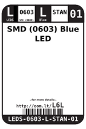
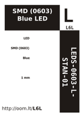
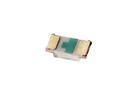

Contents
========

* [L6L > SMD (0603) Blue LED](#l6l--smd-0603-blue-led)
	* [Datasheets](#datasheets)
	* [Labels](#labels)
	* [EDA](#eda)
	* [Images](#images)
	* [Tags](#tags)
  
![][im]
# L6L > SMD (0603) Blue LED

- ID: LEDS-0603-L-STAN-01
- Hex ID: L6L
- Name: SMD (0603) Blue LED
- Description: SMD (0603) Blue LED
- Long Link: [http://oom.lt/LEDS-0603-L-STAN-01](http://oom.lt/LEDS-0603-L-STAN-01)
- Short Link: [http://oom.lt/L6L](http://oom.lt/L6L)

## Datasheets

- Datasheet: [datasheet.pdf](datasheet.pdf)

## Labels
  
  

|label-front|label-inventory|label-spec|
| :---: | :---: | :---: |
||||

## EDA
  

### Instances
  
Used 180 times.  
Prevalance: (180\10986) 1.6384%  

|OOMP Instances|
| :---: |
|[PROJ-ADAF-3467-STAN-01  Adafruit CharliePlex Bonnet PCBs  Used 128 times. C2-1, C2-2, C2-3, C2-4, C2-5, C2-6, C2-7, C2-8, C2-9, C2-10, C2-11, C2-12, C2-13, C2-14, C2-15, C2-16, C3-1, C3-2, C3-3, C3-4, C3-5, C3-6, C3-7, C3-8, C3-9, C3-10, C3-11, C3-12, C3-13, C3-14, C3-15, C3-16, C4-1, C4-2, C4-3, C4-4, C4-5, C4-6, C4-7, C4-8, C4-9, C4-10, C4-11, C4-12, C4-13, C4-14, C4-15, C4-16, C5-1, C5-2, C5-3, C5-4, C5-5, C5-6, C5-7, C5-8, C5-9, C5-10, C5-11, C5-12, C5-13, C5-14, C5-15, C5-16, C6-1, C6-2, C6-3, C6-4, C6-5, C6-6, C6-7, C6-8, C6-9, C6-10, C6-11, C6-12, C6-13, C6-14, C6-15, C6-16, C7-1, C7-2, C7-3, C7-4, C7-5, C7-6, C7-7, C7-8, C7-9, C7-10, C7-11, C7-12, C7-13, C7-14, C7-15, C7-16, C8-1, C8-2, C8-3, C8-4, C8-5, C8-6, C8-7, C8-8, C8-9, C8-10, C8-11, C8-12, C8-13, C8-14, C8-15, C8-16, C9-1, C9-2, C9-3, C9-4, C9-5, C9-6, C9-7, C9-8, C9-9, C9-10, C9-11, C9-12, C9-13, C9-14, C9-15, C9-16](https://github.com/oomlout/oomlout_OOMP_projects/tree/main/PROJ-ADAF-3467-STAN-01/)|
|[PROJ-ADAF-4201-STAN-01  Adafruit AirLift Breakout PCB  Used 1 times. D2](https://github.com/oomlout/oomlout_OOMP_projects/tree/main/PROJ-ADAF-4201-STAN-01/)|
|[PROJ-ADAF-4319-STAN-01  Adafruit PyRuler PCB  Used 1 times. L3](https://github.com/oomlout/oomlout_OOMP_projects/tree/main/PROJ-ADAF-4319-STAN-01/)|
|[PROJ-ADAF-4516-STAN-01  Adafruit Feather nRF52840 Sense PCB  Used 1 times. D4](https://github.com/oomlout/oomlout_OOMP_projects/tree/main/PROJ-ADAF-4516-STAN-01/)|
|[PROJ-ADAF-4740-STAN-01  Adafruit MIDI FeatherWing PCB  Used 2 times. D2, D3](https://github.com/oomlout/oomlout_OOMP_projects/tree/main/PROJ-ADAF-4740-STAN-01/)|
|[PROJ-SPAR-10864-STAN-01  PoEthernet Shield  Used 1 times. LED1](https://github.com/oomlout/oomlout_OOMP_projects/tree/main/PROJ-SPAR-10864-STAN-01/)|
|[PROJ-SPAR-11088-STAN-01  Run-SPOT-Run  Used 1 times. LED2](https://github.com/oomlout/oomlout_OOMP_projects/tree/main/PROJ-SPAR-11088-STAN-01/)|
|[PROJ-SPAR-11168-STAN-01  AVR ISP Shield  Used 1 times. LED4](https://github.com/oomlout/oomlout_OOMP_projects/tree/main/PROJ-SPAR-11168-STAN-01/)|
|[PROJ-SPAR-11509-STAN-01  Papilio Button LED Wing  Used 1 times. LED4](https://github.com/oomlout/oomlout_OOMP_projects/tree/main/PROJ-SPAR-11509-STAN-01/)|
|[PROJ-SPAR-11520-STAN-01  Fio v3  Used 1 times. D6](https://github.com/oomlout/oomlout_OOMP_projects/tree/main/PROJ-SPAR-11520-STAN-01/)|
|[PROJ-SPAR-11703-STAN-01  UDB5  Used 1 times. STAT4](https://github.com/oomlout/oomlout_OOMP_projects/tree/main/PROJ-SPAR-11703-STAN-01/)|
|[PROJ-SPAR-11924-STAN-01  Purpletooth Jamboree  Used 1 times. D3](https://github.com/oomlout/oomlout_OOMP_projects/tree/main/PROJ-SPAR-11924-STAN-01/)|
|[PROJ-SPAR-11927-STAN-01  BC127 Breakout Board  Used 1 times. D3](https://github.com/oomlout/oomlout_OOMP_projects/tree/main/PROJ-SPAR-11927-STAN-01/)|
|[PROJ-SPAR-13019-STAN-01  BLE Mate2  Used 1 times. LED0](https://github.com/oomlout/oomlout_OOMP_projects/tree/main/PROJ-SPAR-13019-STAN-01/)|
|[PROJ-SPAR-13037-STAN-01  Edison Battery Block  Used 1 times. D2](https://github.com/oomlout/oomlout_OOMP_projects/tree/main/PROJ-SPAR-13037-STAN-01/)|
|[PROJ-SPAR-13040-STAN-01  Edison UART Block  Used 1 times. D3](https://github.com/oomlout/oomlout_OOMP_projects/tree/main/PROJ-SPAR-13040-STAN-01/)|
|[PROJ-SPAR-13044-STAN-01  Edison Pi Block  Used 1 times. D3](https://github.com/oomlout/oomlout_OOMP_projects/tree/main/PROJ-SPAR-13044-STAN-01/)|
|[PROJ-SPAR-13287-STAN-01  ESP8266 WiFi Shield  Used 1 times. D2](https://github.com/oomlout/oomlout_OOMP_projects/tree/main/PROJ-SPAR-13287-STAN-01/)|
|[PROJ-SPAR-13310-STAN-01  Ludus ProtoShield  Used 3 times. LED3, LED4, LED5](https://github.com/oomlout/oomlout_OOMP_projects/tree/main/PROJ-SPAR-13310-STAN-01/)|
|[PROJ-SPAR-13633-STAN-01  SparkFun LilyPad Simblee  Used 1 times. D2](https://github.com/oomlout/oomlout_OOMP_projects/tree/main/PROJ-SPAR-13633-STAN-01/)|
|[PROJ-SPAR-13664-STAN-01  SAMD21 Mini Breakout  Used 1 times. D3](https://github.com/oomlout/oomlout_OOMP_projects/tree/main/PROJ-SPAR-13664-STAN-01/)|
|[PROJ-SPAR-13672-STAN-01  SAMD21 Dev Breakout  Used 1 times. D4](https://github.com/oomlout/oomlout_OOMP_projects/tree/main/PROJ-SPAR-13672-STAN-01/)|
|[PROJ-SPAR-13711-STAN-01  ESP8266 Thing Dev 4H  Used 1 times. D3](https://github.com/oomlout/oomlout_OOMP_projects/tree/main/PROJ-SPAR-13711-STAN-01/)|
|[PROJ-SPAR-13712-STAN-01  OpenLog  Used 1 times. D1](https://github.com/oomlout/oomlout_OOMP_projects/tree/main/PROJ-SPAR-13712-STAN-01/)|
|[PROJ-SPAR-13750-STAN-01  GPS Shield  Used 1 times. D2](https://github.com/oomlout/oomlout_OOMP_projects/tree/main/PROJ-SPAR-13750-STAN-01/)|
|[PROJ-SPAR-13777-STAN-01  Battery Babysitter  Used 1 times. D1](https://github.com/oomlout/oomlout_OOMP_projects/tree/main/PROJ-SPAR-13777-STAN-01/)|
|[PROJ-SPAR-13794-STAN-01  Blynk Board ESP8266  Used 1 times. D3](https://github.com/oomlout/oomlout_OOMP_projects/tree/main/PROJ-SPAR-13794-STAN-01/)|
|[PROJ-SPAR-13810-STAN-01  tsunami  Used 1 times. D2](https://github.com/oomlout/oomlout_OOMP_projects/tree/main/PROJ-SPAR-13810-STAN-01/)|
|[PROJ-SPAR-13956-STAN-01  Weather Shield  Used 1 times. D1](https://github.com/oomlout/oomlout_OOMP_projects/tree/main/PROJ-SPAR-13956-STAN-01/)|
|[PROJ-SPAR-13990-STAN-01  nRF52832 Breakout  Used 1 times. D2](https://github.com/oomlout/oomlout_OOMP_projects/tree/main/PROJ-SPAR-13990-STAN-01/)|
|[PROJ-SPAR-14001-STAN-01  9DOF Razor IMU  Used 1 times. D4](https://github.com/oomlout/oomlout_OOMP_projects/tree/main/PROJ-SPAR-14001-STAN-01/)|
|[PROJ-SPAR-14030-STAN-01  Mini GPS Shield  Used 1 times. D1](https://github.com/oomlout/oomlout_OOMP_projects/tree/main/PROJ-SPAR-14030-STAN-01/)|
|[PROJ-SPAR-14051-STAN-01  Wireless Joystick  Used 1 times. D2](https://github.com/oomlout/oomlout_OOMP_projects/tree/main/PROJ-SPAR-14051-STAN-01/)|
|[PROJ-SPAR-14129-STAN-01  Ardumoto-Motor Driver Shield  Used 2 times. LED1, LED4](https://github.com/oomlout/oomlout_OOMP_projects/tree/main/PROJ-SPAR-14129-STAN-01/)|
|[PROJ-SPAR-14285-STAN-01  Wireless Motor Driver Shield  Used 2 times. D4, D6](https://github.com/oomlout/oomlout_OOMP_projects/tree/main/PROJ-SPAR-14285-STAN-01/)|
|[PROJ-SPAR-14347-STAN-01  Qwiic Spectral Sensor AS726X  Used 1 times. D1](https://github.com/oomlout/oomlout_OOMP_projects/tree/main/PROJ-SPAR-14347-STAN-01/)|
|[PROJ-SPAR-14380-STAN-01  Adjustable Lipo Charger  Used 1 times. D1](https://github.com/oomlout/oomlout_OOMP_projects/tree/main/PROJ-SPAR-14380-STAN-01/)|
|[PROJ-SPAR-14411-STAN-01  LiPo Charger Booster 5V 1A  Used 1 times. D4](https://github.com/oomlout/oomlout_OOMP_projects/tree/main/PROJ-SPAR-14411-STAN-01/)|
|[PROJ-SPAR-14414-STAN-01  SparkFun GPS Breakout XA1110 Qwiic  Used 1 times. D1](https://github.com/oomlout/oomlout_OOMP_projects/tree/main/PROJ-SPAR-14414-STAN-01/)|
|[PROJ-SPAR-14430-STAN-01  ESP32 Motion Shield  Used 1 times. D1](https://github.com/oomlout/oomlout_OOMP_projects/tree/main/PROJ-SPAR-14430-STAN-01/)|
|[PROJ-SPAR-14713-STAN-01  SAMD51 Thing Plus  Used 1 times. D4](https://github.com/oomlout/oomlout_OOMP_projects/tree/main/PROJ-SPAR-14713-STAN-01/)|
|[PROJ-SPAR-14779-STAN-01  LumiDrive  Used 1 times. D9](https://github.com/oomlout/oomlout_OOMP_projects/tree/main/PROJ-SPAR-14779-STAN-01/)|
|[PROJ-SPAR-14812-STAN-01  RedBoard Turbo  Used 1 times. D4](https://github.com/oomlout/oomlout_OOMP_projects/tree/main/PROJ-SPAR-14812-STAN-01/)|
|[PROJ-SPAR-14916-STAN-01  SAMD21 Pro RF  Used 2 times. D2, D4](https://github.com/oomlout/oomlout_OOMP_projects/tree/main/PROJ-SPAR-14916-STAN-01/)|
|[PROJ-SPAR-14997-STAN-01  LTE Cat M1 Shield  Used 1 times. D5](https://github.com/oomlout/oomlout_OOMP_projects/tree/main/PROJ-SPAR-14997-STAN-01/)|
|[PROJ-SPAR-15005-STAN-01  Qwiic GPS-RTK  Used 1 times. D4](https://github.com/oomlout/oomlout_OOMP_projects/tree/main/PROJ-SPAR-15005-STAN-01/)|
|[PROJ-SPAR-15006-STAN-01  ESP32 LoRa 1Ch Gateway  Used 1 times. D2](https://github.com/oomlout/oomlout_OOMP_projects/tree/main/PROJ-SPAR-15006-STAN-01/)|

## Images
  
  

|image|image_BOTTOM|label-front|label-inventory|label-spec|
| :---: | :---: | :---: | :---: | :---: |
||||||

## Tags

- oompID: LEDS-0603-L-STAN-01
- name: SMD (0603) Blue LED
- hexID: L6L
- oompSort: 
- oompClass: Through Hole
- oompClassCode: THTH
- oompType: LEDS
- oompSize: 0603
- oompColor: L
- oompDesc: STAN
- oompIndex: 01
- oompVersion: 40
- oompBbls: template;XXXX-0603-X-XXXX-XX-bbls
- oompDiag: template;XXXX-0603-X-XXXX-XX-diag
- oompIden: template;XXXX-0603-X-XXXX-XX-iden
- oompSchem: template;LEDS-XXXX-X-XXXX-XX-schem
- oompSimp: template;XXXX-0603-X-XXXX-XX-simp
- ooDesignator: D1
- oompInstances: {'PROJECT': 'PROJ-ADAF-3467-STAN-01', 'ID': 'C2-1'}
- oompInstances: {'PROJECT': 'PROJ-ADAF-3467-STAN-01', 'ID': 'C2-2'}
- oompInstances: {'PROJECT': 'PROJ-ADAF-3467-STAN-01', 'ID': 'C2-3'}
- oompInstances: {'PROJECT': 'PROJ-ADAF-3467-STAN-01', 'ID': 'C2-4'}
- oompInstances: {'PROJECT': 'PROJ-ADAF-3467-STAN-01', 'ID': 'C2-5'}
- oompInstances: {'PROJECT': 'PROJ-ADAF-3467-STAN-01', 'ID': 'C2-6'}
- oompInstances: {'PROJECT': 'PROJ-ADAF-3467-STAN-01', 'ID': 'C2-7'}
- oompInstances: {'PROJECT': 'PROJ-ADAF-3467-STAN-01', 'ID': 'C2-8'}
- oompInstances: {'PROJECT': 'PROJ-ADAF-3467-STAN-01', 'ID': 'C2-9'}
- oompInstances: {'PROJECT': 'PROJ-ADAF-3467-STAN-01', 'ID': 'C2-10'}
- oompInstances: {'PROJECT': 'PROJ-ADAF-3467-STAN-01', 'ID': 'C2-11'}
- oompInstances: {'PROJECT': 'PROJ-ADAF-3467-STAN-01', 'ID': 'C2-12'}
- oompInstances: {'PROJECT': 'PROJ-ADAF-3467-STAN-01', 'ID': 'C2-13'}
- oompInstances: {'PROJECT': 'PROJ-ADAF-3467-STAN-01', 'ID': 'C2-14'}
- oompInstances: {'PROJECT': 'PROJ-ADAF-3467-STAN-01', 'ID': 'C2-15'}
- oompInstances: {'PROJECT': 'PROJ-ADAF-3467-STAN-01', 'ID': 'C2-16'}
- oompInstances: {'PROJECT': 'PROJ-ADAF-3467-STAN-01', 'ID': 'C3-1'}
- oompInstances: {'PROJECT': 'PROJ-ADAF-3467-STAN-01', 'ID': 'C3-2'}
- oompInstances: {'PROJECT': 'PROJ-ADAF-3467-STAN-01', 'ID': 'C3-3'}
- oompInstances: {'PROJECT': 'PROJ-ADAF-3467-STAN-01', 'ID': 'C3-4'}
- oompInstances: {'PROJECT': 'PROJ-ADAF-3467-STAN-01', 'ID': 'C3-5'}
- oompInstances: {'PROJECT': 'PROJ-ADAF-3467-STAN-01', 'ID': 'C3-6'}
- oompInstances: {'PROJECT': 'PROJ-ADAF-3467-STAN-01', 'ID': 'C3-7'}
- oompInstances: {'PROJECT': 'PROJ-ADAF-3467-STAN-01', 'ID': 'C3-8'}
- oompInstances: {'PROJECT': 'PROJ-ADAF-3467-STAN-01', 'ID': 'C3-9'}
- oompInstances: {'PROJECT': 'PROJ-ADAF-3467-STAN-01', 'ID': 'C3-10'}
- oompInstances: {'PROJECT': 'PROJ-ADAF-3467-STAN-01', 'ID': 'C3-11'}
- oompInstances: {'PROJECT': 'PROJ-ADAF-3467-STAN-01', 'ID': 'C3-12'}
- oompInstances: {'PROJECT': 'PROJ-ADAF-3467-STAN-01', 'ID': 'C3-13'}
- oompInstances: {'PROJECT': 'PROJ-ADAF-3467-STAN-01', 'ID': 'C3-14'}
- oompInstances: {'PROJECT': 'PROJ-ADAF-3467-STAN-01', 'ID': 'C3-15'}
- oompInstances: {'PROJECT': 'PROJ-ADAF-3467-STAN-01', 'ID': 'C3-16'}
- oompInstances: {'PROJECT': 'PROJ-ADAF-3467-STAN-01', 'ID': 'C4-1'}
- oompInstances: {'PROJECT': 'PROJ-ADAF-3467-STAN-01', 'ID': 'C4-2'}
- oompInstances: {'PROJECT': 'PROJ-ADAF-3467-STAN-01', 'ID': 'C4-3'}
- oompInstances: {'PROJECT': 'PROJ-ADAF-3467-STAN-01', 'ID': 'C4-4'}
- oompInstances: {'PROJECT': 'PROJ-ADAF-3467-STAN-01', 'ID': 'C4-5'}
- oompInstances: {'PROJECT': 'PROJ-ADAF-3467-STAN-01', 'ID': 'C4-6'}
- oompInstances: {'PROJECT': 'PROJ-ADAF-3467-STAN-01', 'ID': 'C4-7'}
- oompInstances: {'PROJECT': 'PROJ-ADAF-3467-STAN-01', 'ID': 'C4-8'}
- oompInstances: {'PROJECT': 'PROJ-ADAF-3467-STAN-01', 'ID': 'C4-9'}
- oompInstances: {'PROJECT': 'PROJ-ADAF-3467-STAN-01', 'ID': 'C4-10'}
- oompInstances: {'PROJECT': 'PROJ-ADAF-3467-STAN-01', 'ID': 'C4-11'}
- oompInstances: {'PROJECT': 'PROJ-ADAF-3467-STAN-01', 'ID': 'C4-12'}
- oompInstances: {'PROJECT': 'PROJ-ADAF-3467-STAN-01', 'ID': 'C4-13'}
- oompInstances: {'PROJECT': 'PROJ-ADAF-3467-STAN-01', 'ID': 'C4-14'}
- oompInstances: {'PROJECT': 'PROJ-ADAF-3467-STAN-01', 'ID': 'C4-15'}
- oompInstances: {'PROJECT': 'PROJ-ADAF-3467-STAN-01', 'ID': 'C4-16'}
- oompInstances: {'PROJECT': 'PROJ-ADAF-3467-STAN-01', 'ID': 'C5-1'}
- oompInstances: {'PROJECT': 'PROJ-ADAF-3467-STAN-01', 'ID': 'C5-2'}
- oompInstances: {'PROJECT': 'PROJ-ADAF-3467-STAN-01', 'ID': 'C5-3'}
- oompInstances: {'PROJECT': 'PROJ-ADAF-3467-STAN-01', 'ID': 'C5-4'}
- oompInstances: {'PROJECT': 'PROJ-ADAF-3467-STAN-01', 'ID': 'C5-5'}
- oompInstances: {'PROJECT': 'PROJ-ADAF-3467-STAN-01', 'ID': 'C5-6'}
- oompInstances: {'PROJECT': 'PROJ-ADAF-3467-STAN-01', 'ID': 'C5-7'}
- oompInstances: {'PROJECT': 'PROJ-ADAF-3467-STAN-01', 'ID': 'C5-8'}
- oompInstances: {'PROJECT': 'PROJ-ADAF-3467-STAN-01', 'ID': 'C5-9'}
- oompInstances: {'PROJECT': 'PROJ-ADAF-3467-STAN-01', 'ID': 'C5-10'}
- oompInstances: {'PROJECT': 'PROJ-ADAF-3467-STAN-01', 'ID': 'C5-11'}
- oompInstances: {'PROJECT': 'PROJ-ADAF-3467-STAN-01', 'ID': 'C5-12'}
- oompInstances: {'PROJECT': 'PROJ-ADAF-3467-STAN-01', 'ID': 'C5-13'}
- oompInstances: {'PROJECT': 'PROJ-ADAF-3467-STAN-01', 'ID': 'C5-14'}
- oompInstances: {'PROJECT': 'PROJ-ADAF-3467-STAN-01', 'ID': 'C5-15'}
- oompInstances: {'PROJECT': 'PROJ-ADAF-3467-STAN-01', 'ID': 'C5-16'}
- oompInstances: {'PROJECT': 'PROJ-ADAF-3467-STAN-01', 'ID': 'C6-1'}
- oompInstances: {'PROJECT': 'PROJ-ADAF-3467-STAN-01', 'ID': 'C6-2'}
- oompInstances: {'PROJECT': 'PROJ-ADAF-3467-STAN-01', 'ID': 'C6-3'}
- oompInstances: {'PROJECT': 'PROJ-ADAF-3467-STAN-01', 'ID': 'C6-4'}
- oompInstances: {'PROJECT': 'PROJ-ADAF-3467-STAN-01', 'ID': 'C6-5'}
- oompInstances: {'PROJECT': 'PROJ-ADAF-3467-STAN-01', 'ID': 'C6-6'}
- oompInstances: {'PROJECT': 'PROJ-ADAF-3467-STAN-01', 'ID': 'C6-7'}
- oompInstances: {'PROJECT': 'PROJ-ADAF-3467-STAN-01', 'ID': 'C6-8'}
- oompInstances: {'PROJECT': 'PROJ-ADAF-3467-STAN-01', 'ID': 'C6-9'}
- oompInstances: {'PROJECT': 'PROJ-ADAF-3467-STAN-01', 'ID': 'C6-10'}
- oompInstances: {'PROJECT': 'PROJ-ADAF-3467-STAN-01', 'ID': 'C6-11'}
- oompInstances: {'PROJECT': 'PROJ-ADAF-3467-STAN-01', 'ID': 'C6-12'}
- oompInstances: {'PROJECT': 'PROJ-ADAF-3467-STAN-01', 'ID': 'C6-13'}
- oompInstances: {'PROJECT': 'PROJ-ADAF-3467-STAN-01', 'ID': 'C6-14'}
- oompInstances: {'PROJECT': 'PROJ-ADAF-3467-STAN-01', 'ID': 'C6-15'}
- oompInstances: {'PROJECT': 'PROJ-ADAF-3467-STAN-01', 'ID': 'C6-16'}
- oompInstances: {'PROJECT': 'PROJ-ADAF-3467-STAN-01', 'ID': 'C7-1'}
- oompInstances: {'PROJECT': 'PROJ-ADAF-3467-STAN-01', 'ID': 'C7-2'}
- oompInstances: {'PROJECT': 'PROJ-ADAF-3467-STAN-01', 'ID': 'C7-3'}
- oompInstances: {'PROJECT': 'PROJ-ADAF-3467-STAN-01', 'ID': 'C7-4'}
- oompInstances: {'PROJECT': 'PROJ-ADAF-3467-STAN-01', 'ID': 'C7-5'}
- oompInstances: {'PROJECT': 'PROJ-ADAF-3467-STAN-01', 'ID': 'C7-6'}
- oompInstances: {'PROJECT': 'PROJ-ADAF-3467-STAN-01', 'ID': 'C7-7'}
- oompInstances: {'PROJECT': 'PROJ-ADAF-3467-STAN-01', 'ID': 'C7-8'}
- oompInstances: {'PROJECT': 'PROJ-ADAF-3467-STAN-01', 'ID': 'C7-9'}
- oompInstances: {'PROJECT': 'PROJ-ADAF-3467-STAN-01', 'ID': 'C7-10'}
- oompInstances: {'PROJECT': 'PROJ-ADAF-3467-STAN-01', 'ID': 'C7-11'}
- oompInstances: {'PROJECT': 'PROJ-ADAF-3467-STAN-01', 'ID': 'C7-12'}
- oompInstances: {'PROJECT': 'PROJ-ADAF-3467-STAN-01', 'ID': 'C7-13'}
- oompInstances: {'PROJECT': 'PROJ-ADAF-3467-STAN-01', 'ID': 'C7-14'}
- oompInstances: {'PROJECT': 'PROJ-ADAF-3467-STAN-01', 'ID': 'C7-15'}
- oompInstances: {'PROJECT': 'PROJ-ADAF-3467-STAN-01', 'ID': 'C7-16'}
- oompInstances: {'PROJECT': 'PROJ-ADAF-3467-STAN-01', 'ID': 'C8-1'}
- oompInstances: {'PROJECT': 'PROJ-ADAF-3467-STAN-01', 'ID': 'C8-2'}
- oompInstances: {'PROJECT': 'PROJ-ADAF-3467-STAN-01', 'ID': 'C8-3'}
- oompInstances: {'PROJECT': 'PROJ-ADAF-3467-STAN-01', 'ID': 'C8-4'}
- oompInstances: {'PROJECT': 'PROJ-ADAF-3467-STAN-01', 'ID': 'C8-5'}
- oompInstances: {'PROJECT': 'PROJ-ADAF-3467-STAN-01', 'ID': 'C8-6'}
- oompInstances: {'PROJECT': 'PROJ-ADAF-3467-STAN-01', 'ID': 'C8-7'}
- oompInstances: {'PROJECT': 'PROJ-ADAF-3467-STAN-01', 'ID': 'C8-8'}
- oompInstances: {'PROJECT': 'PROJ-ADAF-3467-STAN-01', 'ID': 'C8-9'}
- oompInstances: {'PROJECT': 'PROJ-ADAF-3467-STAN-01', 'ID': 'C8-10'}
- oompInstances: {'PROJECT': 'PROJ-ADAF-3467-STAN-01', 'ID': 'C8-11'}
- oompInstances: {'PROJECT': 'PROJ-ADAF-3467-STAN-01', 'ID': 'C8-12'}
- oompInstances: {'PROJECT': 'PROJ-ADAF-3467-STAN-01', 'ID': 'C8-13'}
- oompInstances: {'PROJECT': 'PROJ-ADAF-3467-STAN-01', 'ID': 'C8-14'}
- oompInstances: {'PROJECT': 'PROJ-ADAF-3467-STAN-01', 'ID': 'C8-15'}
- oompInstances: {'PROJECT': 'PROJ-ADAF-3467-STAN-01', 'ID': 'C8-16'}
- oompInstances: {'PROJECT': 'PROJ-ADAF-3467-STAN-01', 'ID': 'C9-1'}
- oompInstances: {'PROJECT': 'PROJ-ADAF-3467-STAN-01', 'ID': 'C9-2'}
- oompInstances: {'PROJECT': 'PROJ-ADAF-3467-STAN-01', 'ID': 'C9-3'}
- oompInstances: {'PROJECT': 'PROJ-ADAF-3467-STAN-01', 'ID': 'C9-4'}
- oompInstances: {'PROJECT': 'PROJ-ADAF-3467-STAN-01', 'ID': 'C9-5'}
- oompInstances: {'PROJECT': 'PROJ-ADAF-3467-STAN-01', 'ID': 'C9-6'}
- oompInstances: {'PROJECT': 'PROJ-ADAF-3467-STAN-01', 'ID': 'C9-7'}
- oompInstances: {'PROJECT': 'PROJ-ADAF-3467-STAN-01', 'ID': 'C9-8'}
- oompInstances: {'PROJECT': 'PROJ-ADAF-3467-STAN-01', 'ID': 'C9-9'}
- oompInstances: {'PROJECT': 'PROJ-ADAF-3467-STAN-01', 'ID': 'C9-10'}
- oompInstances: {'PROJECT': 'PROJ-ADAF-3467-STAN-01', 'ID': 'C9-11'}
- oompInstances: {'PROJECT': 'PROJ-ADAF-3467-STAN-01', 'ID': 'C9-12'}
- oompInstances: {'PROJECT': 'PROJ-ADAF-3467-STAN-01', 'ID': 'C9-13'}
- oompInstances: {'PROJECT': 'PROJ-ADAF-3467-STAN-01', 'ID': 'C9-14'}
- oompInstances: {'PROJECT': 'PROJ-ADAF-3467-STAN-01', 'ID': 'C9-15'}
- oompInstances: {'PROJECT': 'PROJ-ADAF-3467-STAN-01', 'ID': 'C9-16'}
- oompInstances: {'PROJECT': 'PROJ-ADAF-4201-STAN-01', 'ID': 'D2'}
- oompInstances: {'PROJECT': 'PROJ-ADAF-4319-STAN-01', 'ID': 'L3'}
- oompInstances: {'PROJECT': 'PROJ-ADAF-4516-STAN-01', 'ID': 'D4'}
- oompInstances: {'PROJECT': 'PROJ-ADAF-4740-STAN-01', 'ID': 'D2'}
- oompInstances: {'PROJECT': 'PROJ-ADAF-4740-STAN-01', 'ID': 'D3'}
- oompInstances: {'PROJECT': 'PROJ-SPAR-10864-STAN-01', 'ID': 'LED1'}
- oompInstances: {'PROJECT': 'PROJ-SPAR-11088-STAN-01', 'ID': 'LED2'}
- oompInstances: {'PROJECT': 'PROJ-SPAR-11168-STAN-01', 'ID': 'LED4'}
- oompInstances: {'PROJECT': 'PROJ-SPAR-11509-STAN-01', 'ID': 'LED4'}
- oompInstances: {'PROJECT': 'PROJ-SPAR-11520-STAN-01', 'ID': 'D6'}
- oompInstances: {'PROJECT': 'PROJ-SPAR-11703-STAN-01', 'ID': 'STAT4'}
- oompInstances: {'PROJECT': 'PROJ-SPAR-11924-STAN-01', 'ID': 'D3'}
- oompInstances: {'PROJECT': 'PROJ-SPAR-11927-STAN-01', 'ID': 'D3'}
- oompInstances: {'PROJECT': 'PROJ-SPAR-13019-STAN-01', 'ID': 'LED0'}
- oompInstances: {'PROJECT': 'PROJ-SPAR-13037-STAN-01', 'ID': 'D2'}
- oompInstances: {'PROJECT': 'PROJ-SPAR-13040-STAN-01', 'ID': 'D3'}
- oompInstances: {'PROJECT': 'PROJ-SPAR-13044-STAN-01', 'ID': 'D3'}
- oompInstances: {'PROJECT': 'PROJ-SPAR-13287-STAN-01', 'ID': 'D2'}
- oompInstances: {'PROJECT': 'PROJ-SPAR-13310-STAN-01', 'ID': 'LED3'}
- oompInstances: {'PROJECT': 'PROJ-SPAR-13310-STAN-01', 'ID': 'LED4'}
- oompInstances: {'PROJECT': 'PROJ-SPAR-13310-STAN-01', 'ID': 'LED5'}
- oompInstances: {'PROJECT': 'PROJ-SPAR-13633-STAN-01', 'ID': 'D2'}
- oompInstances: {'PROJECT': 'PROJ-SPAR-13664-STAN-01', 'ID': 'D3'}
- oompInstances: {'PROJECT': 'PROJ-SPAR-13672-STAN-01', 'ID': 'D4'}
- oompInstances: {'PROJECT': 'PROJ-SPAR-13711-STAN-01', 'ID': 'D3'}
- oompInstances: {'PROJECT': 'PROJ-SPAR-13712-STAN-01', 'ID': 'D1'}
- oompInstances: {'PROJECT': 'PROJ-SPAR-13750-STAN-01', 'ID': 'D2'}
- oompInstances: {'PROJECT': 'PROJ-SPAR-13777-STAN-01', 'ID': 'D1'}
- oompInstances: {'PROJECT': 'PROJ-SPAR-13794-STAN-01', 'ID': 'D3'}
- oompInstances: {'PROJECT': 'PROJ-SPAR-13810-STAN-01', 'ID': 'D2'}
- oompInstances: {'PROJECT': 'PROJ-SPAR-13956-STAN-01', 'ID': 'D1'}
- oompInstances: {'PROJECT': 'PROJ-SPAR-13990-STAN-01', 'ID': 'D2'}
- oompInstances: {'PROJECT': 'PROJ-SPAR-14001-STAN-01', 'ID': 'D4'}
- oompInstances: {'PROJECT': 'PROJ-SPAR-14030-STAN-01', 'ID': 'D1'}
- oompInstances: {'PROJECT': 'PROJ-SPAR-14051-STAN-01', 'ID': 'D2'}
- oompInstances: {'PROJECT': 'PROJ-SPAR-14129-STAN-01', 'ID': 'LED1'}
- oompInstances: {'PROJECT': 'PROJ-SPAR-14129-STAN-01', 'ID': 'LED4'}
- oompInstances: {'PROJECT': 'PROJ-SPAR-14285-STAN-01', 'ID': 'D4'}
- oompInstances: {'PROJECT': 'PROJ-SPAR-14285-STAN-01', 'ID': 'D6'}
- oompInstances: {'PROJECT': 'PROJ-SPAR-14347-STAN-01', 'ID': 'D1'}
- oompInstances: {'PROJECT': 'PROJ-SPAR-14380-STAN-01', 'ID': 'D1'}
- oompInstances: {'PROJECT': 'PROJ-SPAR-14411-STAN-01', 'ID': 'D4'}
- oompInstances: {'PROJECT': 'PROJ-SPAR-14414-STAN-01', 'ID': 'D1'}
- oompInstances: {'PROJECT': 'PROJ-SPAR-14430-STAN-01', 'ID': 'D1'}
- oompInstances: {'PROJECT': 'PROJ-SPAR-14713-STAN-01', 'ID': 'D4'}
- oompInstances: {'PROJECT': 'PROJ-SPAR-14779-STAN-01', 'ID': 'D9'}
- oompInstances: {'PROJECT': 'PROJ-SPAR-14812-STAN-01', 'ID': 'D4'}
- oompInstances: {'PROJECT': 'PROJ-SPAR-14916-STAN-01', 'ID': 'D2'}
- oompInstances: {'PROJECT': 'PROJ-SPAR-14916-STAN-01', 'ID': 'D4'}
- oompInstances: {'PROJECT': 'PROJ-SPAR-14997-STAN-01', 'ID': 'D5'}
- oompInstances: {'PROJECT': 'PROJ-SPAR-15005-STAN-01', 'ID': 'D4'}
- oompInstances: {'PROJECT': 'PROJ-SPAR-15006-STAN-01', 'ID': 'D2'}

[im]: image_450.jpg
