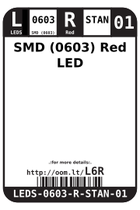
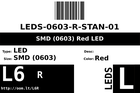
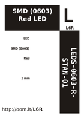
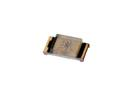
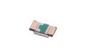

Contents
========

* [L6R > SMD (0603) Red LED](#l6r--smd-0603-red-led)
	* [Datasheets](#datasheets)
	* [Labels](#labels)
	* [EDA](#eda)
	* [Images](#images)
	* [Tags](#tags)
  
![][im]
# L6R > SMD (0603) Red LED

- ID: LEDS-0603-R-STAN-01
- Hex ID: L6R
- Name: SMD (0603) Red LED
- Description: SMD (0603) Red LED
- Long Link: [http://oom.lt/LEDS-0603-R-STAN-01](http://oom.lt/LEDS-0603-R-STAN-01)
- Short Link: [http://oom.lt/L6R](http://oom.lt/L6R)

## Datasheets

- Datasheet: [datasheet.pdf](datasheet.pdf)

## Labels
  
  

|label-front|label-inventory|label-spec|
| :---: | :---: | :---: |
||||

## EDA

### Footprints
  

|[  FOOTPRINT-kicad-kicad-footprints-LED_SMD-LED_0603_1608Metric](https://github.com/oomlout/oomlout_OOMP_eda/tree/main/FOOTPRINT/kicad/kicad-footprints/LED_SMD/LED_0603_1608Metric/)|[  FOOTPRINT-kicad-kicad-footprints-LED_SMD-LED_0603_1608Metric_Pad1.05x0.95mm_HandSolder](https://github.com/oomlout/oomlout_OOMP_eda/tree/main/FOOTPRINT/kicad/kicad-footprints/LED_SMD/LED_0603_1608Metric_Pad1.05x0.95mm_HandSolder/)|||
| :---: | :---: | :---: | :---: |

### Symbols
  

|[  SYMBOL-kicad-kicad-symbols-Device-LED](https://github.com/oomlout/oomlout_OOMP_eda/tree/main/SYMBOL/kicad/kicad-symbols/Device/LED/)||||
| :---: | :---: | :---: | :---: |
  

### Instances
  
Used 313 times.  
Prevalance: (313\10986) 2.8491%  

|Project|Occur- rences|Identifiers|
| :---: | :---: | :---: |
|[PROJ-ADAF-1982-STAN-01 Adafruit MPR121 PCB](https://github.com/oomlout/oomlout_OOMP_projects/tree/main/PROJ-ADAF-1982-STAN-01/)|[1](https://github.com/oomlout/oomlout_OOMP_projects/tree/main/PROJ-ADAF-1982-STAN-01/)|[D1](https://github.com/oomlout/oomlout_OOMP_projects/tree/main/PROJ-ADAF-1982-STAN-01/)|
|[PROJ-ADAF-3134-STAN-01 Adafruit 7x15 CharliePlex LED FeatherWing](https://github.com/oomlout/oomlout_OOMP_projects/tree/main/PROJ-ADAF-3134-STAN-01/)|[105](https://github.com/oomlout/oomlout_OOMP_projects/tree/main/PROJ-ADAF-3134-STAN-01/)|[C1-2, C1-3, C1-4, C1-5, C1-6, C1-7, C1-8, C2-2, C2-3, C2-4, C2-5, C2-6, C2-7, C2-8, C2-9, C2-10, C2-11, C2-12, C2-13, C2-14, C2-15, C3-2, C3-3, C3-4, C3-5, C3-6, C3-7, C3-8, C3-9, C3-10, C3-11, C3-12, C3-13, C3-14, C3-15, C4-2, C4-3, C4-4, C4-5, C4-6, C4-7, C4-8, C4-9, C4-10, C4-11, C4-12, C4-13, C4-14, C4-15, C5-2, C5-3, C5-4, C5-5, C5-6, C5-7, C5-8, C5-9, C5-10, C5-11, C5-12, C5-13, C5-14, C5-15, C6-2, C6-3, C6-4, C6-5, C6-6, C6-7, C6-8, C6-9, C6-10, C6-11, C6-12, C6-13, C6-14, C6-15, C7-2, C7-3, C7-4, C7-5, C7-6, C7-7, C7-8, C7-9, C7-10, C7-11, C7-12, C7-13, C7-14, C7-15, C8-2, C8-3, C8-4, C8-5, C8-6, C8-7, C8-8, C8-9, C8-10, C8-11, C8-12, C8-13, C8-14, C8-15](https://github.com/oomlout/oomlout_OOMP_projects/tree/main/PROJ-ADAF-3134-STAN-01/)|
|[PROJ-ADAF-3500-STAN-01 Adafruit Trinket M0 PCB](https://github.com/oomlout/oomlout_OOMP_projects/tree/main/PROJ-ADAF-3500-STAN-01/)|[1](https://github.com/oomlout/oomlout_OOMP_projects/tree/main/PROJ-ADAF-3500-STAN-01/)|[L](https://github.com/oomlout/oomlout_OOMP_projects/tree/main/PROJ-ADAF-3500-STAN-01/)|
|[PROJ-ADAF-3501-STAN-01 Adafruit Gemma M0 PCB](https://github.com/oomlout/oomlout_OOMP_projects/tree/main/PROJ-ADAF-3501-STAN-01/)|[1](https://github.com/oomlout/oomlout_OOMP_projects/tree/main/PROJ-ADAF-3501-STAN-01/)|[PWR](https://github.com/oomlout/oomlout_OOMP_projects/tree/main/PROJ-ADAF-3501-STAN-01/)|
|[PROJ-ADAF-3589-STAN-01 Adafruit PiUART PCB](https://github.com/oomlout/oomlout_OOMP_projects/tree/main/PROJ-ADAF-3589-STAN-01/)|[1](https://github.com/oomlout/oomlout_OOMP_projects/tree/main/PROJ-ADAF-3589-STAN-01/)|[D1](https://github.com/oomlout/oomlout_OOMP_projects/tree/main/PROJ-ADAF-3589-STAN-01/)|
|[PROJ-ADAF-3709-STAN-01 Adafruit SGP30 PCB](https://github.com/oomlout/oomlout_OOMP_projects/tree/main/PROJ-ADAF-3709-STAN-01/)|[1](https://github.com/oomlout/oomlout_OOMP_projects/tree/main/PROJ-ADAF-3709-STAN-01/)|[D1](https://github.com/oomlout/oomlout_OOMP_projects/tree/main/PROJ-ADAF-3709-STAN-01/)|
|[PROJ-ADAF-3800-STAN-01 Adafruit ItsyBitsy M4 Express PCB](https://github.com/oomlout/oomlout_OOMP_projects/tree/main/PROJ-ADAF-3800-STAN-01/)|[1](https://github.com/oomlout/oomlout_OOMP_projects/tree/main/PROJ-ADAF-3800-STAN-01/)|[L](https://github.com/oomlout/oomlout_OOMP_projects/tree/main/PROJ-ADAF-3800-STAN-01/)|
|[PROJ-ADAF-4201-STAN-01 Adafruit AirLift Breakout PCB](https://github.com/oomlout/oomlout_OOMP_projects/tree/main/PROJ-ADAF-4201-STAN-01/)|[1](https://github.com/oomlout/oomlout_OOMP_projects/tree/main/PROJ-ADAF-4201-STAN-01/)|[D3](https://github.com/oomlout/oomlout_OOMP_projects/tree/main/PROJ-ADAF-4201-STAN-01/)|
|[PROJ-ADAF-4319-STAN-01 Adafruit PyRuler PCB](https://github.com/oomlout/oomlout_OOMP_projects/tree/main/PROJ-ADAF-4319-STAN-01/)|[2](https://github.com/oomlout/oomlout_OOMP_projects/tree/main/PROJ-ADAF-4319-STAN-01/)|[L, L2](https://github.com/oomlout/oomlout_OOMP_projects/tree/main/PROJ-ADAF-4319-STAN-01/)|
|[PROJ-ADAF-4333-STAN-01 Adafruit Circuit Playground Bluefruit PCB](https://github.com/oomlout/oomlout_OOMP_projects/tree/main/PROJ-ADAF-4333-STAN-01/)|[1](https://github.com/oomlout/oomlout_OOMP_projects/tree/main/PROJ-ADAF-4333-STAN-01/)|[L](https://github.com/oomlout/oomlout_OOMP_projects/tree/main/PROJ-ADAF-4333-STAN-01/)|
|[PROJ-ADAF-4415-STAN-01 Adafruit PA1010D Mini GPS PCB](https://github.com/oomlout/oomlout_OOMP_projects/tree/main/PROJ-ADAF-4415-STAN-01/)|[1](https://github.com/oomlout/oomlout_OOMP_projects/tree/main/PROJ-ADAF-4415-STAN-01/)|[D3](https://github.com/oomlout/oomlout_OOMP_projects/tree/main/PROJ-ADAF-4415-STAN-01/)|
|[PROJ-ADAF-4500-STAN-01 Adafruit CLUE PCB](https://github.com/oomlout/oomlout_OOMP_projects/tree/main/PROJ-ADAF-4500-STAN-01/)|[1](https://github.com/oomlout/oomlout_OOMP_projects/tree/main/PROJ-ADAF-4500-STAN-01/)|[D2](https://github.com/oomlout/oomlout_OOMP_projects/tree/main/PROJ-ADAF-4500-STAN-01/)|
|[PROJ-ADAF-4745-STAN-01 Adafruit MatrixPortal M4 PCB](https://github.com/oomlout/oomlout_OOMP_projects/tree/main/PROJ-ADAF-4745-STAN-01/)|[1](https://github.com/oomlout/oomlout_OOMP_projects/tree/main/PROJ-ADAF-4745-STAN-01/)|[L](https://github.com/oomlout/oomlout_OOMP_projects/tree/main/PROJ-ADAF-4745-STAN-01/)|
|[PROJ-ADAF-4759-STAN-01 Adafruit Feather M4 CAN PCB](https://github.com/oomlout/oomlout_OOMP_projects/tree/main/PROJ-ADAF-4759-STAN-01/)|[1](https://github.com/oomlout/oomlout_OOMP_projects/tree/main/PROJ-ADAF-4759-STAN-01/)|[L](https://github.com/oomlout/oomlout_OOMP_projects/tree/main/PROJ-ADAF-4759-STAN-01/)|
|[PROJ-ADAF-4775-STAN-01 Adafruit Metro ESP32 S2 PCB](https://github.com/oomlout/oomlout_OOMP_projects/tree/main/PROJ-ADAF-4775-STAN-01/)|[1](https://github.com/oomlout/oomlout_OOMP_projects/tree/main/PROJ-ADAF-4775-STAN-01/)|[L](https://github.com/oomlout/oomlout_OOMP_projects/tree/main/PROJ-ADAF-4775-STAN-01/)|
|[PROJ-ADAF-4800-STAN-01 Adafruit_MagTag_PCBs](https://github.com/oomlout/oomlout_OOMP_projects/tree/main/PROJ-ADAF-4800-STAN-01/)|[1](https://github.com/oomlout/oomlout_OOMP_projects/tree/main/PROJ-ADAF-4800-STAN-01/)|[L](https://github.com/oomlout/oomlout_OOMP_projects/tree/main/PROJ-ADAF-4800-STAN-01/)|
|[PROJ-ADAF-4888-STAN-01 Adafruit ItsyBitsy RP2040 PCB](https://github.com/oomlout/oomlout_OOMP_projects/tree/main/PROJ-ADAF-4888-STAN-01/)|[1](https://github.com/oomlout/oomlout_OOMP_projects/tree/main/PROJ-ADAF-4888-STAN-01/)|[L](https://github.com/oomlout/oomlout_OOMP_projects/tree/main/PROJ-ADAF-4888-STAN-01/)|
|[PROJ-ADAF-4985-STAN-01 Adafruit FunHouse PCB](https://github.com/oomlout/oomlout_OOMP_projects/tree/main/PROJ-ADAF-4985-STAN-01/)|[1](https://github.com/oomlout/oomlout_OOMP_projects/tree/main/PROJ-ADAF-4985-STAN-01/)|[L](https://github.com/oomlout/oomlout_OOMP_projects/tree/main/PROJ-ADAF-4985-STAN-01/)|
|[PROJ-ADAF-4991-STAN-01 Adafruit I2C QT Rotary Encoder PCB](https://github.com/oomlout/oomlout_OOMP_projects/tree/main/PROJ-ADAF-4991-STAN-01/)|[1](https://github.com/oomlout/oomlout_OOMP_projects/tree/main/PROJ-ADAF-4991-STAN-01/)|[D2](https://github.com/oomlout/oomlout_OOMP_projects/tree/main/PROJ-ADAF-4991-STAN-01/)|
|[PROJ-ADAF-5000-STAN-01 Adafruit Feather ESP32 S2 PCB](https://github.com/oomlout/oomlout_OOMP_projects/tree/main/PROJ-ADAF-5000-STAN-01/)|[1](https://github.com/oomlout/oomlout_OOMP_projects/tree/main/PROJ-ADAF-5000-STAN-01/)|[D3](https://github.com/oomlout/oomlout_OOMP_projects/tree/main/PROJ-ADAF-5000-STAN-01/)|
|[PROJ-ADAF-5100-STAN-01 Adafruit MacroPad RP2040 PCB](https://github.com/oomlout/oomlout_OOMP_projects/tree/main/PROJ-ADAF-5100-STAN-01/)|[1](https://github.com/oomlout/oomlout_OOMP_projects/tree/main/PROJ-ADAF-5100-STAN-01/)|[L](https://github.com/oomlout/oomlout_OOMP_projects/tree/main/PROJ-ADAF-5100-STAN-01/)|
|[PROJ-ADAF-5233-STAN-01 Adafruit ATtiny8x7 Breakout PCB](https://github.com/oomlout/oomlout_OOMP_projects/tree/main/PROJ-ADAF-5233-STAN-01/)|[1](https://github.com/oomlout/oomlout_OOMP_projects/tree/main/PROJ-ADAF-5233-STAN-01/)|[D4](https://github.com/oomlout/oomlout_OOMP_projects/tree/main/PROJ-ADAF-5233-STAN-01/)|
|[PROJ-ADAF-5300-STAN-01 Adafruit ESP32 S2 TFT Feather PCB](https://github.com/oomlout/oomlout_OOMP_projects/tree/main/PROJ-ADAF-5300-STAN-01/)|[1](https://github.com/oomlout/oomlout_OOMP_projects/tree/main/PROJ-ADAF-5300-STAN-01/)|[D3](https://github.com/oomlout/oomlout_OOMP_projects/tree/main/PROJ-ADAF-5300-STAN-01/)|
|[PROJ-ADAF-5323-STAN-01 Adafruit Feather ESP32 S3 PCB](https://github.com/oomlout/oomlout_OOMP_projects/tree/main/PROJ-ADAF-5323-STAN-01/)|[1](https://github.com/oomlout/oomlout_OOMP_projects/tree/main/PROJ-ADAF-5323-STAN-01/)|[D3](https://github.com/oomlout/oomlout_OOMP_projects/tree/main/PROJ-ADAF-5323-STAN-01/)|
|[PROJ-ADAF-5335-STAN-01 Adafruit CP2102N Friend PCB](https://github.com/oomlout/oomlout_OOMP_projects/tree/main/PROJ-ADAF-5335-STAN-01/)|[1](https://github.com/oomlout/oomlout_OOMP_projects/tree/main/PROJ-ADAF-5335-STAN-01/)|[D1](https://github.com/oomlout/oomlout_OOMP_projects/tree/main/PROJ-ADAF-5335-STAN-01/)|
|[PROJ-ADAF-5400-STAN-01 Adafruit ESP32 Feather V2 PCB](https://github.com/oomlout/oomlout_OOMP_projects/tree/main/PROJ-ADAF-5400-STAN-01/)|[1](https://github.com/oomlout/oomlout_OOMP_projects/tree/main/PROJ-ADAF-5400-STAN-01/)|[D3](https://github.com/oomlout/oomlout_OOMP_projects/tree/main/PROJ-ADAF-5400-STAN-01/)|
|[PROJ-ADAF-5423-STAN-01 Adafruit TSC2007 PCB](https://github.com/oomlout/oomlout_OOMP_projects/tree/main/PROJ-ADAF-5423-STAN-01/)|[1](https://github.com/oomlout/oomlout_OOMP_projects/tree/main/PROJ-ADAF-5423-STAN-01/)|[D2](https://github.com/oomlout/oomlout_OOMP_projects/tree/main/PROJ-ADAF-5423-STAN-01/)|
|[PROJ-SPAR-10025-STAN-01 EiBotBoard](https://github.com/oomlout/oomlout_OOMP_projects/tree/main/PROJ-SPAR-10025-STAN-01/)|[3](https://github.com/oomlout/oomlout_OOMP_projects/tree/main/PROJ-SPAR-10025-STAN-01/)|[LED1, LED2, USR](https://github.com/oomlout/oomlout_OOMP_projects/tree/main/PROJ-SPAR-10025-STAN-01/)|
|[PROJ-SPAR-10050-STAN-01 WiFly GSX Breakout](https://github.com/oomlout/oomlout_OOMP_projects/tree/main/PROJ-SPAR-10050-STAN-01/)|[1](https://github.com/oomlout/oomlout_OOMP_projects/tree/main/PROJ-SPAR-10050-STAN-01/)|[LED2](https://github.com/oomlout/oomlout_OOMP_projects/tree/main/PROJ-SPAR-10050-STAN-01/)|
|[PROJ-SPAR-10116-STAN-01 Arduino Fio](https://github.com/oomlout/oomlout_OOMP_projects/tree/main/PROJ-SPAR-10116-STAN-01/)|[2](https://github.com/oomlout/oomlout_OOMP_projects/tree/main/PROJ-SPAR-10116-STAN-01/)|[D1, D3](https://github.com/oomlout/oomlout_OOMP_projects/tree/main/PROJ-SPAR-10116-STAN-01/)|
|[PROJ-SPAR-10182-STAN-01 Monster Moto Shield](https://github.com/oomlout/oomlout_OOMP_projects/tree/main/PROJ-SPAR-10182-STAN-01/)|[1](https://github.com/oomlout/oomlout_OOMP_projects/tree/main/PROJ-SPAR-10182-STAN-01/)|[LED1](https://github.com/oomlout/oomlout_OOMP_projects/tree/main/PROJ-SPAR-10182-STAN-01/)|
|[PROJ-SPAR-10217-STAN-01 Lipo Charger Basic-microUSB](https://github.com/oomlout/oomlout_OOMP_projects/tree/main/PROJ-SPAR-10217-STAN-01/)|[1](https://github.com/oomlout/oomlout_OOMP_projects/tree/main/PROJ-SPAR-10217-STAN-01/)|[D11](https://github.com/oomlout/oomlout_OOMP_projects/tree/main/PROJ-SPAR-10217-STAN-01/)|
|[PROJ-SPAR-10311-STAN-01 PicoBoard](https://github.com/oomlout/oomlout_OOMP_projects/tree/main/PROJ-SPAR-10311-STAN-01/)|[1](https://github.com/oomlout/oomlout_OOMP_projects/tree/main/PROJ-SPAR-10311-STAN-01/)|[LED1](https://github.com/oomlout/oomlout_OOMP_projects/tree/main/PROJ-SPAR-10311-STAN-01/)|
|[PROJ-SPAR-10401-STAN-01 Lipo Charger Basic-miniUSB](https://github.com/oomlout/oomlout_OOMP_projects/tree/main/PROJ-SPAR-10401-STAN-01/)|[1](https://github.com/oomlout/oomlout_OOMP_projects/tree/main/PROJ-SPAR-10401-STAN-01/)|[D11](https://github.com/oomlout/oomlout_OOMP_projects/tree/main/PROJ-SPAR-10401-STAN-01/)|
|[PROJ-SPAR-10406-STAN-01 RFID Evaluation Shield](https://github.com/oomlout/oomlout_OOMP_projects/tree/main/PROJ-SPAR-10406-STAN-01/)|[1](https://github.com/oomlout/oomlout_OOMP_projects/tree/main/PROJ-SPAR-10406-STAN-01/)|[LED3](https://github.com/oomlout/oomlout_OOMP_projects/tree/main/PROJ-SPAR-10406-STAN-01/)|
|[PROJ-SPAR-10507-STAN-01 Quadstepper Motor Driver](https://github.com/oomlout/oomlout_OOMP_projects/tree/main/PROJ-SPAR-10507-STAN-01/)|[1](https://github.com/oomlout/oomlout_OOMP_projects/tree/main/PROJ-SPAR-10507-STAN-01/)|[LED5](https://github.com/oomlout/oomlout_OOMP_projects/tree/main/PROJ-SPAR-10507-STAN-01/)|
|[PROJ-SPAR-10653-STAN-01 Voice Recorder Breakout-ISD1932](https://github.com/oomlout/oomlout_OOMP_projects/tree/main/PROJ-SPAR-10653-STAN-01/)|[1](https://github.com/oomlout/oomlout_OOMP_projects/tree/main/PROJ-SPAR-10653-STAN-01/)|[LED1](https://github.com/oomlout/oomlout_OOMP_projects/tree/main/PROJ-SPAR-10653-STAN-01/)|
|[PROJ-SPAR-10740-STAN-01 IR Thermometer Evaluation Board-MLX90614](https://github.com/oomlout/oomlout_OOMP_projects/tree/main/PROJ-SPAR-10740-STAN-01/)|[1](https://github.com/oomlout/oomlout_OOMP_projects/tree/main/PROJ-SPAR-10740-STAN-01/)|[LED1](https://github.com/oomlout/oomlout_OOMP_projects/tree/main/PROJ-SPAR-10740-STAN-01/)|
|[PROJ-SPAR-10864-STAN-01 PoEthernet Shield](https://github.com/oomlout/oomlout_OOMP_projects/tree/main/PROJ-SPAR-10864-STAN-01/)|[1](https://github.com/oomlout/oomlout_OOMP_projects/tree/main/PROJ-SPAR-10864-STAN-01/)|[LED4](https://github.com/oomlout/oomlout_OOMP_projects/tree/main/PROJ-SPAR-10864-STAN-01/)|
|[PROJ-SPAR-10889-STAN-01 ProtoSnap-Pro Mini](https://github.com/oomlout/oomlout_OOMP_projects/tree/main/PROJ-SPAR-10889-STAN-01/)|[2](https://github.com/oomlout/oomlout_OOMP_projects/tree/main/PROJ-SPAR-10889-STAN-01/)|[LED1, LED2](https://github.com/oomlout/oomlout_OOMP_projects/tree/main/PROJ-SPAR-10889-STAN-01/)|
|[PROJ-SPAR-10914-STAN-01 Arduino Pro 328](https://github.com/oomlout/oomlout_OOMP_projects/tree/main/PROJ-SPAR-10914-STAN-01/)|[1](https://github.com/oomlout/oomlout_OOMP_projects/tree/main/PROJ-SPAR-10914-STAN-01/)|[LED1](https://github.com/oomlout/oomlout_OOMP_projects/tree/main/PROJ-SPAR-10914-STAN-01/)|
|[PROJ-SPAR-10995-STAN-01 GPS Evaluation Board GP-2106](https://github.com/oomlout/oomlout_OOMP_projects/tree/main/PROJ-SPAR-10995-STAN-01/)|[1](https://github.com/oomlout/oomlout_OOMP_projects/tree/main/PROJ-SPAR-10995-STAN-01/)|[LED1](https://github.com/oomlout/oomlout_OOMP_projects/tree/main/PROJ-SPAR-10995-STAN-01/)|
|[PROJ-SPAR-11013-STAN-01 LilyPad MP3 Player](https://github.com/oomlout/oomlout_OOMP_projects/tree/main/PROJ-SPAR-11013-STAN-01/)|[1](https://github.com/oomlout/oomlout_OOMP_projects/tree/main/PROJ-SPAR-11013-STAN-01/)|[LED1](https://github.com/oomlout/oomlout_OOMP_projects/tree/main/PROJ-SPAR-11013-STAN-01/)|
|[PROJ-SPAR-11018-STAN-01 RFM22 Shield-434MHz](https://github.com/oomlout/oomlout_OOMP_projects/tree/main/PROJ-SPAR-11018-STAN-01/)|[1](https://github.com/oomlout/oomlout_OOMP_projects/tree/main/PROJ-SPAR-11018-STAN-01/)|[LED1](https://github.com/oomlout/oomlout_OOMP_projects/tree/main/PROJ-SPAR-11018-STAN-01/)|
|[PROJ-SPAR-11058-STAN-01 Venus GPS SMA Connector](https://github.com/oomlout/oomlout_OOMP_projects/tree/main/PROJ-SPAR-11058-STAN-01/)|[1](https://github.com/oomlout/oomlout_OOMP_projects/tree/main/PROJ-SPAR-11058-STAN-01/)|[LED1](https://github.com/oomlout/oomlout_OOMP_projects/tree/main/PROJ-SPAR-11058-STAN-01/)|
|[PROJ-SPAR-11088-STAN-01 Run-SPOT-Run](https://github.com/oomlout/oomlout_OOMP_projects/tree/main/PROJ-SPAR-11088-STAN-01/)|[1](https://github.com/oomlout/oomlout_OOMP_projects/tree/main/PROJ-SPAR-11088-STAN-01/)|[LED1](https://github.com/oomlout/oomlout_OOMP_projects/tree/main/PROJ-SPAR-11088-STAN-01/)|
|[PROJ-SPAR-11113-STAN-01 Pro Mini Candy](https://github.com/oomlout/oomlout_OOMP_projects/tree/main/PROJ-SPAR-11113-STAN-01/)|[1](https://github.com/oomlout/oomlout_OOMP_projects/tree/main/PROJ-SPAR-11113-STAN-01/)|[LED1](https://github.com/oomlout/oomlout_OOMP_projects/tree/main/PROJ-SPAR-11113-STAN-01/)|
|[PROJ-SPAR-11168-STAN-01 AVR ISP Shield](https://github.com/oomlout/oomlout_OOMP_projects/tree/main/PROJ-SPAR-11168-STAN-01/)|[1](https://github.com/oomlout/oomlout_OOMP_projects/tree/main/PROJ-SPAR-11168-STAN-01/)|[LED3](https://github.com/oomlout/oomlout_OOMP_projects/tree/main/PROJ-SPAR-11168-STAN-01/)|
|[PROJ-SPAR-11190-STAN-01 LilyPad Arduino USB](https://github.com/oomlout/oomlout_OOMP_projects/tree/main/PROJ-SPAR-11190-STAN-01/)|[4](https://github.com/oomlout/oomlout_OOMP_projects/tree/main/PROJ-SPAR-11190-STAN-01/)|[LED1, LED2, LED3, LED4](https://github.com/oomlout/oomlout_OOMP_projects/tree/main/PROJ-SPAR-11190-STAN-01/)|
|[PROJ-SPAR-11197-STAN-01 ATmega128RFA1 Dev](https://github.com/oomlout/oomlout_OOMP_projects/tree/main/PROJ-SPAR-11197-STAN-01/)|[1](https://github.com/oomlout/oomlout_OOMP_projects/tree/main/PROJ-SPAR-11197-STAN-01/)|[LED1](https://github.com/oomlout/oomlout_OOMP_projects/tree/main/PROJ-SPAR-11197-STAN-01/)|
|[PROJ-SPAR-11343-STAN-01 IOIO-OTG](https://github.com/oomlout/oomlout_OOMP_projects/tree/main/PROJ-SPAR-11343-STAN-01/)|[1](https://github.com/oomlout/oomlout_OOMP_projects/tree/main/PROJ-SPAR-11343-STAN-01/)|[D5](https://github.com/oomlout/oomlout_OOMP_projects/tree/main/PROJ-SPAR-11343-STAN-01/)|
|[PROJ-SPAR-11373-STAN-01 XBee Explorer Regulated](https://github.com/oomlout/oomlout_OOMP_projects/tree/main/PROJ-SPAR-11373-STAN-01/)|[2](https://github.com/oomlout/oomlout_OOMP_projects/tree/main/PROJ-SPAR-11373-STAN-01/)|[LED1, LED2](https://github.com/oomlout/oomlout_OOMP_projects/tree/main/PROJ-SPAR-11373-STAN-01/)|
|[PROJ-SPAR-11420-STAN-01 MiniGen](https://github.com/oomlout/oomlout_OOMP_projects/tree/main/PROJ-SPAR-11420-STAN-01/)|[1](https://github.com/oomlout/oomlout_OOMP_projects/tree/main/PROJ-SPAR-11420-STAN-01/)|[LED1](https://github.com/oomlout/oomlout_OOMP_projects/tree/main/PROJ-SPAR-11420-STAN-01/)|
|[PROJ-SPAR-11509-STAN-01 Papilio Button LED Wing](https://github.com/oomlout/oomlout_OOMP_projects/tree/main/PROJ-SPAR-11509-STAN-01/)|[1](https://github.com/oomlout/oomlout_OOMP_projects/tree/main/PROJ-SPAR-11509-STAN-01/)|[LED1](https://github.com/oomlout/oomlout_OOMP_projects/tree/main/PROJ-SPAR-11509-STAN-01/)|
|[PROJ-SPAR-11520-STAN-01 Fio v3](https://github.com/oomlout/oomlout_OOMP_projects/tree/main/PROJ-SPAR-11520-STAN-01/)|[2](https://github.com/oomlout/oomlout_OOMP_projects/tree/main/PROJ-SPAR-11520-STAN-01/)|[D3, LED1](https://github.com/oomlout/oomlout_OOMP_projects/tree/main/PROJ-SPAR-11520-STAN-01/)|
|[PROJ-SPAR-11525-STAN-01 P8X32A Breakout](https://github.com/oomlout/oomlout_OOMP_projects/tree/main/PROJ-SPAR-11525-STAN-01/)|[1](https://github.com/oomlout/oomlout_OOMP_projects/tree/main/PROJ-SPAR-11525-STAN-01/)|[LED1](https://github.com/oomlout/oomlout_OOMP_projects/tree/main/PROJ-SPAR-11525-STAN-01/)|
|[PROJ-SPAR-11645-STAN-01 OpenSegment](https://github.com/oomlout/oomlout_OOMP_projects/tree/main/PROJ-SPAR-11645-STAN-01/)|[1](https://github.com/oomlout/oomlout_OOMP_projects/tree/main/PROJ-SPAR-11645-STAN-01/)|[LED1](https://github.com/oomlout/oomlout_OOMP_projects/tree/main/PROJ-SPAR-11645-STAN-01/)|
|[PROJ-SPAR-11697-STAN-01 XBee Explorer Dongle](https://github.com/oomlout/oomlout_OOMP_projects/tree/main/PROJ-SPAR-11697-STAN-01/)|[1](https://github.com/oomlout/oomlout_OOMP_projects/tree/main/PROJ-SPAR-11697-STAN-01/)|[D4](https://github.com/oomlout/oomlout_OOMP_projects/tree/main/PROJ-SPAR-11697-STAN-01/)|
|[PROJ-SPAR-11703-STAN-01 UDB5](https://github.com/oomlout/oomlout_OOMP_projects/tree/main/PROJ-SPAR-11703-STAN-01/)|[1](https://github.com/oomlout/oomlout_OOMP_projects/tree/main/PROJ-SPAR-11703-STAN-01/)|[STAT1](https://github.com/oomlout/oomlout_OOMP_projects/tree/main/PROJ-SPAR-11703-STAN-01/)|
|[PROJ-SPAR-11736-STAN-01 FT231X Breakout](https://github.com/oomlout/oomlout_OOMP_projects/tree/main/PROJ-SPAR-11736-STAN-01/)|[1](https://github.com/oomlout/oomlout_OOMP_projects/tree/main/PROJ-SPAR-11736-STAN-01/)|[LED1](https://github.com/oomlout/oomlout_OOMP_projects/tree/main/PROJ-SPAR-11736-STAN-01/)|
|[PROJ-SPAR-11924-STAN-01 Purpletooth Jamboree](https://github.com/oomlout/oomlout_OOMP_projects/tree/main/PROJ-SPAR-11924-STAN-01/)|[1](https://github.com/oomlout/oomlout_OOMP_projects/tree/main/PROJ-SPAR-11924-STAN-01/)|[D2](https://github.com/oomlout/oomlout_OOMP_projects/tree/main/PROJ-SPAR-11924-STAN-01/)|
|[PROJ-SPAR-11927-STAN-01 BC127 Breakout Board](https://github.com/oomlout/oomlout_OOMP_projects/tree/main/PROJ-SPAR-11927-STAN-01/)|[1](https://github.com/oomlout/oomlout_OOMP_projects/tree/main/PROJ-SPAR-11927-STAN-01/)|[D2](https://github.com/oomlout/oomlout_OOMP_projects/tree/main/PROJ-SPAR-11927-STAN-01/)|
|[PROJ-SPAR-12081-STAN-01 USB Weather Board](https://github.com/oomlout/oomlout_OOMP_projects/tree/main/PROJ-SPAR-12081-STAN-01/)|[1](https://github.com/oomlout/oomlout_OOMP_projects/tree/main/PROJ-SPAR-12081-STAN-01/)|[D1](https://github.com/oomlout/oomlout_OOMP_projects/tree/main/PROJ-SPAR-12081-STAN-01/)|
|[PROJ-SPAR-12582-STAN-01 BlueSMiRF](https://github.com/oomlout/oomlout_OOMP_projects/tree/main/PROJ-SPAR-12582-STAN-01/)|[1](https://github.com/oomlout/oomlout_OOMP_projects/tree/main/PROJ-SPAR-12582-STAN-01/)|[D1](https://github.com/oomlout/oomlout_OOMP_projects/tree/main/PROJ-SPAR-12582-STAN-01/)|
|[PROJ-SPAR-12642-STAN-01 Sound Detector](https://github.com/oomlout/oomlout_OOMP_projects/tree/main/PROJ-SPAR-12642-STAN-01/)|[1](https://github.com/oomlout/oomlout_OOMP_projects/tree/main/PROJ-SPAR-12642-STAN-01/)|[D3](https://github.com/oomlout/oomlout_OOMP_projects/tree/main/PROJ-SPAR-12642-STAN-01/)|
|[PROJ-SPAR-12650-STAN-01 AD8232 Heart Rate Monitor](https://github.com/oomlout/oomlout_OOMP_projects/tree/main/PROJ-SPAR-12650-STAN-01/)|[1](https://github.com/oomlout/oomlout_OOMP_projects/tree/main/PROJ-SPAR-12650-STAN-01/)|[D1](https://github.com/oomlout/oomlout_OOMP_projects/tree/main/PROJ-SPAR-12650-STAN-01/)|
|[PROJ-SPAR-12651-STAN-01 Digital Sandbox](https://github.com/oomlout/oomlout_OOMP_projects/tree/main/PROJ-SPAR-12651-STAN-01/)|[1](https://github.com/oomlout/oomlout_OOMP_projects/tree/main/PROJ-SPAR-12651-STAN-01/)|[LED6](https://github.com/oomlout/oomlout_OOMP_projects/tree/main/PROJ-SPAR-12651-STAN-01/)|
|[PROJ-SPAR-12711-STAN-01 USB LiPolyCharger SingleCell](https://github.com/oomlout/oomlout_OOMP_projects/tree/main/PROJ-SPAR-12711-STAN-01/)|[1](https://github.com/oomlout/oomlout_OOMP_projects/tree/main/PROJ-SPAR-12711-STAN-01/)|[LED2](https://github.com/oomlout/oomlout_OOMP_projects/tree/main/PROJ-SPAR-12711-STAN-01/)|
|[PROJ-SPAR-12731-STAN-01 FT232RL USB Breakout](https://github.com/oomlout/oomlout_OOMP_projects/tree/main/PROJ-SPAR-12731-STAN-01/)|[1](https://github.com/oomlout/oomlout_OOMP_projects/tree/main/PROJ-SPAR-12731-STAN-01/)|[LED1](https://github.com/oomlout/oomlout_OOMP_projects/tree/main/PROJ-SPAR-12731-STAN-01/)|
|[PROJ-SPAR-12761-STAN-01 microSD Shield](https://github.com/oomlout/oomlout_OOMP_projects/tree/main/PROJ-SPAR-12761-STAN-01/)|[1](https://github.com/oomlout/oomlout_OOMP_projects/tree/main/PROJ-SPAR-12761-STAN-01/)|[LED1](https://github.com/oomlout/oomlout_OOMP_projects/tree/main/PROJ-SPAR-12761-STAN-01/)|
|[PROJ-SPAR-12772-STAN-01 Logomatic](https://github.com/oomlout/oomlout_OOMP_projects/tree/main/PROJ-SPAR-12772-STAN-01/)|[2](https://github.com/oomlout/oomlout_OOMP_projects/tree/main/PROJ-SPAR-12772-STAN-01/)|[LED1, LED2](https://github.com/oomlout/oomlout_OOMP_projects/tree/main/PROJ-SPAR-12772-STAN-01/)|
|[PROJ-SPAR-12774-STAN-01 BeagleBone Black Proto Cape](https://github.com/oomlout/oomlout_OOMP_projects/tree/main/PROJ-SPAR-12774-STAN-01/)|[2](https://github.com/oomlout/oomlout_OOMP_projects/tree/main/PROJ-SPAR-12774-STAN-01/)|[D1, D2](https://github.com/oomlout/oomlout_OOMP_projects/tree/main/PROJ-SPAR-12774-STAN-01/)|
|[PROJ-SPAR-12847-STAN-01 XBee Shield](https://github.com/oomlout/oomlout_OOMP_projects/tree/main/PROJ-SPAR-12847-STAN-01/)|[2](https://github.com/oomlout/oomlout_OOMP_projects/tree/main/PROJ-SPAR-12847-STAN-01/)|[LED1, LED2](https://github.com/oomlout/oomlout_OOMP_projects/tree/main/PROJ-SPAR-12847-STAN-01/)|
|[PROJ-SPAR-12849-STAN-01 RN-52](https://github.com/oomlout/oomlout_OOMP_projects/tree/main/PROJ-SPAR-12849-STAN-01/)|[1](https://github.com/oomlout/oomlout_OOMP_projects/tree/main/PROJ-SPAR-12849-STAN-01/)|[D2](https://github.com/oomlout/oomlout_OOMP_projects/tree/main/PROJ-SPAR-12849-STAN-01/)|
|[PROJ-SPAR-12887-STAN-01 Electric Imp Shield](https://github.com/oomlout/oomlout_OOMP_projects/tree/main/PROJ-SPAR-12887-STAN-01/)|[1](https://github.com/oomlout/oomlout_OOMP_projects/tree/main/PROJ-SPAR-12887-STAN-01/)|[LED1](https://github.com/oomlout/oomlout_OOMP_projects/tree/main/PROJ-SPAR-12887-STAN-01/)|
|[PROJ-SPAR-12898-STAN-01 MIDI Shield](https://github.com/oomlout/oomlout_OOMP_projects/tree/main/PROJ-SPAR-12898-STAN-01/)|[1](https://github.com/oomlout/oomlout_OOMP_projects/tree/main/PROJ-SPAR-12898-STAN-01/)|[LED1](https://github.com/oomlout/oomlout_OOMP_projects/tree/main/PROJ-SPAR-12898-STAN-01/)|
|[PROJ-SPAR-12935-STAN-01 FTDI SmartBasic](https://github.com/oomlout/oomlout_OOMP_projects/tree/main/PROJ-SPAR-12935-STAN-01/)|[1](https://github.com/oomlout/oomlout_OOMP_projects/tree/main/PROJ-SPAR-12935-STAN-01/)|[D2](https://github.com/oomlout/oomlout_OOMP_projects/tree/main/PROJ-SPAR-12935-STAN-01/)|
|[PROJ-SPAR-12942-STAN-01 Bus Pirate](https://github.com/oomlout/oomlout_OOMP_projects/tree/main/PROJ-SPAR-12942-STAN-01/)|[4](https://github.com/oomlout/oomlout_OOMP_projects/tree/main/PROJ-SPAR-12942-STAN-01/)|[LED1, LED3, LED5, LED7](https://github.com/oomlout/oomlout_OOMP_projects/tree/main/PROJ-SPAR-12942-STAN-01/)|
|[PROJ-SPAR-13019-STAN-01 BLE Mate2](https://github.com/oomlout/oomlout_OOMP_projects/tree/main/PROJ-SPAR-13019-STAN-01/)|[1](https://github.com/oomlout/oomlout_OOMP_projects/tree/main/PROJ-SPAR-13019-STAN-01/)|[LED1](https://github.com/oomlout/oomlout_OOMP_projects/tree/main/PROJ-SPAR-13019-STAN-01/)|
|[PROJ-SPAR-13037-STAN-01 Edison Battery Block](https://github.com/oomlout/oomlout_OOMP_projects/tree/main/PROJ-SPAR-13037-STAN-01/)|[1](https://github.com/oomlout/oomlout_OOMP_projects/tree/main/PROJ-SPAR-13037-STAN-01/)|[D1](https://github.com/oomlout/oomlout_OOMP_projects/tree/main/PROJ-SPAR-13037-STAN-01/)|
|[PROJ-SPAR-13116-STAN-01 Spectrum Shield](https://github.com/oomlout/oomlout_OOMP_projects/tree/main/PROJ-SPAR-13116-STAN-01/)|[1](https://github.com/oomlout/oomlout_OOMP_projects/tree/main/PROJ-SPAR-13116-STAN-01/)|[D1](https://github.com/oomlout/oomlout_OOMP_projects/tree/main/PROJ-SPAR-13116-STAN-01/)|
|[PROJ-SPAR-13124-STAN-01 Proto Pedal](https://github.com/oomlout/oomlout_OOMP_projects/tree/main/PROJ-SPAR-13124-STAN-01/)|[1](https://github.com/oomlout/oomlout_OOMP_projects/tree/main/PROJ-SPAR-13124-STAN-01/)|[D1](https://github.com/oomlout/oomlout_OOMP_projects/tree/main/PROJ-SPAR-13124-STAN-01/)|
|[PROJ-SPAR-13158-STAN-01 LiPower-Shield](https://github.com/oomlout/oomlout_OOMP_projects/tree/main/PROJ-SPAR-13158-STAN-01/)|[2](https://github.com/oomlout/oomlout_OOMP_projects/tree/main/PROJ-SPAR-13158-STAN-01/)|[D1, D2](https://github.com/oomlout/oomlout_OOMP_projects/tree/main/PROJ-SPAR-13158-STAN-01/)|
|[PROJ-SPAR-13262-STAN-01 CAN-Bus Shield](https://github.com/oomlout/oomlout_OOMP_projects/tree/main/PROJ-SPAR-13262-STAN-01/)|[1](https://github.com/oomlout/oomlout_OOMP_projects/tree/main/PROJ-SPAR-13262-STAN-01/)|[D4](https://github.com/oomlout/oomlout_OOMP_projects/tree/main/PROJ-SPAR-13262-STAN-01/)|
|[PROJ-SPAR-13287-STAN-01 ESP8266 WiFi Shield](https://github.com/oomlout/oomlout_OOMP_projects/tree/main/PROJ-SPAR-13287-STAN-01/)|[1](https://github.com/oomlout/oomlout_OOMP_projects/tree/main/PROJ-SPAR-13287-STAN-01/)|[D1](https://github.com/oomlout/oomlout_OOMP_projects/tree/main/PROJ-SPAR-13287-STAN-01/)|
|[PROJ-SPAR-13626-STAN-01 Photon Battery Shield](https://github.com/oomlout/oomlout_OOMP_projects/tree/main/PROJ-SPAR-13626-STAN-01/)|[1](https://github.com/oomlout/oomlout_OOMP_projects/tree/main/PROJ-SPAR-13626-STAN-01/)|[D2](https://github.com/oomlout/oomlout_OOMP_projects/tree/main/PROJ-SPAR-13626-STAN-01/)|
|[PROJ-SPAR-13632-STAN-01 SparkFun Simblee Breakout Board](https://github.com/oomlout/oomlout_OOMP_projects/tree/main/PROJ-SPAR-13632-STAN-01/)|[1](https://github.com/oomlout/oomlout_OOMP_projects/tree/main/PROJ-SPAR-13632-STAN-01/)|[D2](https://github.com/oomlout/oomlout_OOMP_projects/tree/main/PROJ-SPAR-13632-STAN-01/)|
|[PROJ-SPAR-13633-STAN-01 SparkFun LilyPad Simblee](https://github.com/oomlout/oomlout_OOMP_projects/tree/main/PROJ-SPAR-13633-STAN-01/)|[1](https://github.com/oomlout/oomlout_OOMP_projects/tree/main/PROJ-SPAR-13633-STAN-01/)|[D4](https://github.com/oomlout/oomlout_OOMP_projects/tree/main/PROJ-SPAR-13633-STAN-01/)|
|[PROJ-SPAR-13664-STAN-01 SAMD21 Mini Breakout](https://github.com/oomlout/oomlout_OOMP_projects/tree/main/PROJ-SPAR-13664-STAN-01/)|[1](https://github.com/oomlout/oomlout_OOMP_projects/tree/main/PROJ-SPAR-13664-STAN-01/)|[D2](https://github.com/oomlout/oomlout_OOMP_projects/tree/main/PROJ-SPAR-13664-STAN-01/)|
|[PROJ-SPAR-13672-STAN-01 SAMD21 Dev Breakout](https://github.com/oomlout/oomlout_OOMP_projects/tree/main/PROJ-SPAR-13672-STAN-01/)|[2](https://github.com/oomlout/oomlout_OOMP_projects/tree/main/PROJ-SPAR-13672-STAN-01/)|[D2, D3](https://github.com/oomlout/oomlout_OOMP_projects/tree/main/PROJ-SPAR-13672-STAN-01/)|
|[PROJ-SPAR-13688-STAN-01 MyoWare LED Shield](https://github.com/oomlout/oomlout_OOMP_projects/tree/main/PROJ-SPAR-13688-STAN-01/)|[1](https://github.com/oomlout/oomlout_OOMP_projects/tree/main/PROJ-SPAR-13688-STAN-01/)|[D1](https://github.com/oomlout/oomlout_OOMP_projects/tree/main/PROJ-SPAR-13688-STAN-01/)|
|[PROJ-SPAR-13711-STAN-01 ESP8266 Thing Dev 4H](https://github.com/oomlout/oomlout_OOMP_projects/tree/main/PROJ-SPAR-13711-STAN-01/)|[1](https://github.com/oomlout/oomlout_OOMP_projects/tree/main/PROJ-SPAR-13711-STAN-01/)|[D2](https://github.com/oomlout/oomlout_OOMP_projects/tree/main/PROJ-SPAR-13711-STAN-01/)|
|[PROJ-SPAR-13714-STAN-01 FreeSoc2](https://github.com/oomlout/oomlout_OOMP_projects/tree/main/PROJ-SPAR-13714-STAN-01/)|[2](https://github.com/oomlout/oomlout_OOMP_projects/tree/main/PROJ-SPAR-13714-STAN-01/)|[D5, D6](https://github.com/oomlout/oomlout_OOMP_projects/tree/main/PROJ-SPAR-13714-STAN-01/)|
|[PROJ-SPAR-13741-STAN-01 RedStick](https://github.com/oomlout/oomlout_OOMP_projects/tree/main/PROJ-SPAR-13741-STAN-01/)|[1](https://github.com/oomlout/oomlout_OOMP_projects/tree/main/PROJ-SPAR-13741-STAN-01/)|[D2](https://github.com/oomlout/oomlout_OOMP_projects/tree/main/PROJ-SPAR-13741-STAN-01/)|
|[PROJ-SPAR-13746-STAN-01 Beefy 3](https://github.com/oomlout/oomlout_OOMP_projects/tree/main/PROJ-SPAR-13746-STAN-01/)|[1](https://github.com/oomlout/oomlout_OOMP_projects/tree/main/PROJ-SPAR-13746-STAN-01/)|[D2](https://github.com/oomlout/oomlout_OOMP_projects/tree/main/PROJ-SPAR-13746-STAN-01/)|
|[PROJ-SPAR-13750-STAN-01 GPS Shield](https://github.com/oomlout/oomlout_OOMP_projects/tree/main/PROJ-SPAR-13750-STAN-01/)|[1](https://github.com/oomlout/oomlout_OOMP_projects/tree/main/PROJ-SPAR-13750-STAN-01/)|[D1](https://github.com/oomlout/oomlout_OOMP_projects/tree/main/PROJ-SPAR-13750-STAN-01/)|
|[PROJ-SPAR-13777-STAN-01 Battery Babysitter](https://github.com/oomlout/oomlout_OOMP_projects/tree/main/PROJ-SPAR-13777-STAN-01/)|[1](https://github.com/oomlout/oomlout_OOMP_projects/tree/main/PROJ-SPAR-13777-STAN-01/)|[D2](https://github.com/oomlout/oomlout_OOMP_projects/tree/main/PROJ-SPAR-13777-STAN-01/)|
|[PROJ-SPAR-13794-STAN-01 Blynk Board ESP8266](https://github.com/oomlout/oomlout_OOMP_projects/tree/main/PROJ-SPAR-13794-STAN-01/)|[1](https://github.com/oomlout/oomlout_OOMP_projects/tree/main/PROJ-SPAR-13794-STAN-01/)|[D5](https://github.com/oomlout/oomlout_OOMP_projects/tree/main/PROJ-SPAR-13794-STAN-01/)|
|[PROJ-SPAR-13795-STAN-01 LED Array 8x7](https://github.com/oomlout/oomlout_OOMP_projects/tree/main/PROJ-SPAR-13795-STAN-01/)|[56](https://github.com/oomlout/oomlout_OOMP_projects/tree/main/PROJ-SPAR-13795-STAN-01/)|[D1, D2, D3, D4, D5, D6, D7, D8, D9, D10, D11, D12, D13, D14, D15, D16, D17, D18, D19, D20, D21, D22, D23, D24, D25, D26, D27, D28, D29, D30, D31, D32, D33, D34, D35, D36, D37, D38, D39, D40, D41, D42, D43, D44, D45, D46, D47, D48, D49, D50, D51, D52, D53, D54, D55, D56](https://github.com/oomlout/oomlout_OOMP_projects/tree/main/PROJ-SPAR-13795-STAN-01/)|
|[PROJ-SPAR-13830-STAN-01 USB UART Serial Breakout-CY7C65213](https://github.com/oomlout/oomlout_OOMP_projects/tree/main/PROJ-SPAR-13830-STAN-01/)|[1](https://github.com/oomlout/oomlout_OOMP_projects/tree/main/PROJ-SPAR-13830-STAN-01/)|[D1](https://github.com/oomlout/oomlout_OOMP_projects/tree/main/PROJ-SPAR-13830-STAN-01/)|
|[PROJ-SPAR-13911-STAN-01 Serial Controlled Motor Driver](https://github.com/oomlout/oomlout_OOMP_projects/tree/main/PROJ-SPAR-13911-STAN-01/)|[1](https://github.com/oomlout/oomlout_OOMP_projects/tree/main/PROJ-SPAR-13911-STAN-01/)|[D1](https://github.com/oomlout/oomlout_OOMP_projects/tree/main/PROJ-SPAR-13911-STAN-01/)|
|[PROJ-SPAR-13990-STAN-01 nRF52832 Breakout](https://github.com/oomlout/oomlout_OOMP_projects/tree/main/PROJ-SPAR-13990-STAN-01/)|[1](https://github.com/oomlout/oomlout_OOMP_projects/tree/main/PROJ-SPAR-13990-STAN-01/)|[D1](https://github.com/oomlout/oomlout_OOMP_projects/tree/main/PROJ-SPAR-13990-STAN-01/)|
|[PROJ-SPAR-14001-STAN-01 9DOF Razor IMU](https://github.com/oomlout/oomlout_OOMP_projects/tree/main/PROJ-SPAR-14001-STAN-01/)|[1](https://github.com/oomlout/oomlout_OOMP_projects/tree/main/PROJ-SPAR-14001-STAN-01/)|[D3](https://github.com/oomlout/oomlout_OOMP_projects/tree/main/PROJ-SPAR-14001-STAN-01/)|
|[PROJ-SPAR-14006-STAN-01 Lil Soundie Audio Player](https://github.com/oomlout/oomlout_OOMP_projects/tree/main/PROJ-SPAR-14006-STAN-01/)|[1](https://github.com/oomlout/oomlout_OOMP_projects/tree/main/PROJ-SPAR-14006-STAN-01/)|[D3](https://github.com/oomlout/oomlout_OOMP_projects/tree/main/PROJ-SPAR-14006-STAN-01/)|
|[PROJ-SPAR-14051-STAN-01 Wireless Joystick](https://github.com/oomlout/oomlout_OOMP_projects/tree/main/PROJ-SPAR-14051-STAN-01/)|[2](https://github.com/oomlout/oomlout_OOMP_projects/tree/main/PROJ-SPAR-14051-STAN-01/)|[D1, D5](https://github.com/oomlout/oomlout_OOMP_projects/tree/main/PROJ-SPAR-14051-STAN-01/)|
|[PROJ-SPAR-14066-STAN-01 Simultaneous RFID Tag Reader](https://github.com/oomlout/oomlout_OOMP_projects/tree/main/PROJ-SPAR-14066-STAN-01/)|[1](https://github.com/oomlout/oomlout_OOMP_projects/tree/main/PROJ-SPAR-14066-STAN-01/)|[D1](https://github.com/oomlout/oomlout_OOMP_projects/tree/main/PROJ-SPAR-14066-STAN-01/)|
|[PROJ-SPAR-14129-STAN-01 Ardumoto-Motor Driver Shield](https://github.com/oomlout/oomlout_OOMP_projects/tree/main/PROJ-SPAR-14129-STAN-01/)|[4](https://github.com/oomlout/oomlout_OOMP_projects/tree/main/PROJ-SPAR-14129-STAN-01/)|[D9, D10, D11, D12](https://github.com/oomlout/oomlout_OOMP_projects/tree/main/PROJ-SPAR-14129-STAN-01/)|
|[PROJ-SPAR-14130-STAN-01 Roshamglo](https://github.com/oomlout/oomlout_OOMP_projects/tree/main/PROJ-SPAR-14130-STAN-01/)|[1](https://github.com/oomlout/oomlout_OOMP_projects/tree/main/PROJ-SPAR-14130-STAN-01/)|[D5](https://github.com/oomlout/oomlout_OOMP_projects/tree/main/PROJ-SPAR-14130-STAN-01/)|
|[PROJ-SPAR-14285-STAN-01 Wireless Motor Driver Shield](https://github.com/oomlout/oomlout_OOMP_projects/tree/main/PROJ-SPAR-14285-STAN-01/)|[1](https://github.com/oomlout/oomlout_OOMP_projects/tree/main/PROJ-SPAR-14285-STAN-01/)|[D3](https://github.com/oomlout/oomlout_OOMP_projects/tree/main/PROJ-SPAR-14285-STAN-01/)|
|[PROJ-SPAR-14346-STAN-01 LilyPad ProtoSnap Plus](https://github.com/oomlout/oomlout_OOMP_projects/tree/main/PROJ-SPAR-14346-STAN-01/)|[1](https://github.com/oomlout/oomlout_OOMP_projects/tree/main/PROJ-SPAR-14346-STAN-01/)|[LED1](https://github.com/oomlout/oomlout_OOMP_projects/tree/main/PROJ-SPAR-14346-STAN-01/)|
|[PROJ-SPAR-14380-STAN-01 Adjustable Lipo Charger](https://github.com/oomlout/oomlout_OOMP_projects/tree/main/PROJ-SPAR-14380-STAN-01/)|[1](https://github.com/oomlout/oomlout_OOMP_projects/tree/main/PROJ-SPAR-14380-STAN-01/)|[D2](https://github.com/oomlout/oomlout_OOMP_projects/tree/main/PROJ-SPAR-14380-STAN-01/)|
|[PROJ-SPAR-14411-STAN-01 LiPo Charger Booster 5V 1A](https://github.com/oomlout/oomlout_OOMP_projects/tree/main/PROJ-SPAR-14411-STAN-01/)|[1](https://github.com/oomlout/oomlout_OOMP_projects/tree/main/PROJ-SPAR-14411-STAN-01/)|[D3](https://github.com/oomlout/oomlout_OOMP_projects/tree/main/PROJ-SPAR-14411-STAN-01/)|
|[PROJ-SPAR-14478-STAN-01 MaKeyMaKey](https://github.com/oomlout/oomlout_OOMP_projects/tree/main/PROJ-SPAR-14478-STAN-01/)|[3](https://github.com/oomlout/oomlout_OOMP_projects/tree/main/PROJ-SPAR-14478-STAN-01/)|[LED7, LED10, LED11](https://github.com/oomlout/oomlout_OOMP_projects/tree/main/PROJ-SPAR-14478-STAN-01/)|
|[PROJ-SPAR-14531-STAN-01 Pioneer IoT Kit Shield](https://github.com/oomlout/oomlout_OOMP_projects/tree/main/PROJ-SPAR-14531-STAN-01/)|[2](https://github.com/oomlout/oomlout_OOMP_projects/tree/main/PROJ-SPAR-14531-STAN-01/)|[LED1, LED2](https://github.com/oomlout/oomlout_OOMP_projects/tree/main/PROJ-SPAR-14531-STAN-01/)|
|[PROJ-SPAR-14554-STAN-01 Papa Soundie Audio Player](https://github.com/oomlout/oomlout_OOMP_projects/tree/main/PROJ-SPAR-14554-STAN-01/)|[2](https://github.com/oomlout/oomlout_OOMP_projects/tree/main/PROJ-SPAR-14554-STAN-01/)|[D2, D3](https://github.com/oomlout/oomlout_OOMP_projects/tree/main/PROJ-SPAR-14554-STAN-01/)|
|[PROJ-SPAR-14631-STAN-01 LilyPad USB Plus Standalone](https://github.com/oomlout/oomlout_OOMP_projects/tree/main/PROJ-SPAR-14631-STAN-01/)|[1](https://github.com/oomlout/oomlout_OOMP_projects/tree/main/PROJ-SPAR-14631-STAN-01/)|[LED1](https://github.com/oomlout/oomlout_OOMP_projects/tree/main/PROJ-SPAR-14631-STAN-01/)|
|[PROJ-SPAR-14666-STAN-01 Qwiic Flex Glove Controller](https://github.com/oomlout/oomlout_OOMP_projects/tree/main/PROJ-SPAR-14666-STAN-01/)|[1](https://github.com/oomlout/oomlout_OOMP_projects/tree/main/PROJ-SPAR-14666-STAN-01/)|[D1](https://github.com/oomlout/oomlout_OOMP_projects/tree/main/PROJ-SPAR-14666-STAN-01/)|
|[PROJ-SPAR-14686-STAN-01 Qwiic IMU BNO080](https://github.com/oomlout/oomlout_OOMP_projects/tree/main/PROJ-SPAR-14686-STAN-01/)|[1](https://github.com/oomlout/oomlout_OOMP_projects/tree/main/PROJ-SPAR-14686-STAN-01/)|[D1](https://github.com/oomlout/oomlout_OOMP_projects/tree/main/PROJ-SPAR-14686-STAN-01/)|
|[PROJ-SPAR-14691-STAN-01 Qwiic Transparent OLED HUD](https://github.com/oomlout/oomlout_OOMP_projects/tree/main/PROJ-SPAR-14691-STAN-01/)|[1](https://github.com/oomlout/oomlout_OOMP_projects/tree/main/PROJ-SPAR-14691-STAN-01/)|[D1](https://github.com/oomlout/oomlout_OOMP_projects/tree/main/PROJ-SPAR-14691-STAN-01/)|
|[PROJ-SPAR-14722-STAN-01 Qwiic Distance VL53L1X](https://github.com/oomlout/oomlout_OOMP_projects/tree/main/PROJ-SPAR-14722-STAN-01/)|[1](https://github.com/oomlout/oomlout_OOMP_projects/tree/main/PROJ-SPAR-14722-STAN-01/)|[D1](https://github.com/oomlout/oomlout_OOMP_projects/tree/main/PROJ-SPAR-14722-STAN-01/)|
|[PROJ-SPAR-14765-STAN-01 Single Supply Logic Level Converter](https://github.com/oomlout/oomlout_OOMP_projects/tree/main/PROJ-SPAR-14765-STAN-01/)|[1](https://github.com/oomlout/oomlout_OOMP_projects/tree/main/PROJ-SPAR-14765-STAN-01/)|[D1](https://github.com/oomlout/oomlout_OOMP_projects/tree/main/PROJ-SPAR-14765-STAN-01/)|
|[PROJ-SPAR-14812-STAN-01 RedBoard Turbo](https://github.com/oomlout/oomlout_OOMP_projects/tree/main/PROJ-SPAR-14812-STAN-01/)|[1](https://github.com/oomlout/oomlout_OOMP_projects/tree/main/PROJ-SPAR-14812-STAN-01/)|[D3](https://github.com/oomlout/oomlout_OOMP_projects/tree/main/PROJ-SPAR-14812-STAN-01/)|
|[PROJ-SPAR-14843-STAN-01 Qwiic IR Array MLX90640](https://github.com/oomlout/oomlout_OOMP_projects/tree/main/PROJ-SPAR-14843-STAN-01/)|[1](https://github.com/oomlout/oomlout_OOMP_projects/tree/main/PROJ-SPAR-14843-STAN-01/)|[D1](https://github.com/oomlout/oomlout_OOMP_projects/tree/main/PROJ-SPAR-14843-STAN-01/)|
|[PROJ-SPAR-14916-STAN-01 SAMD21 Pro RF](https://github.com/oomlout/oomlout_OOMP_projects/tree/main/PROJ-SPAR-14916-STAN-01/)|[1](https://github.com/oomlout/oomlout_OOMP_projects/tree/main/PROJ-SPAR-14916-STAN-01/)|[LED1](https://github.com/oomlout/oomlout_OOMP_projects/tree/main/PROJ-SPAR-14916-STAN-01/)|
|[PROJ-SPAR-14997-STAN-01 LTE Cat M1 Shield](https://github.com/oomlout/oomlout_OOMP_projects/tree/main/PROJ-SPAR-14997-STAN-01/)|[1](https://github.com/oomlout/oomlout_OOMP_projects/tree/main/PROJ-SPAR-14997-STAN-01/)|[D4](https://github.com/oomlout/oomlout_OOMP_projects/tree/main/PROJ-SPAR-14997-STAN-01/)|
|[PROJ-SPAR-15005-STAN-01 Qwiic GPS-RTK](https://github.com/oomlout/oomlout_OOMP_projects/tree/main/PROJ-SPAR-15005-STAN-01/)|[1](https://github.com/oomlout/oomlout_OOMP_projects/tree/main/PROJ-SPAR-15005-STAN-01/)|[LED2](https://github.com/oomlout/oomlout_OOMP_projects/tree/main/PROJ-SPAR-15005-STAN-01/)|
|[PROJ-SPAR-15006-STAN-01 ESP32 LoRa 1Ch Gateway](https://github.com/oomlout/oomlout_OOMP_projects/tree/main/PROJ-SPAR-15006-STAN-01/)|[1](https://github.com/oomlout/oomlout_OOMP_projects/tree/main/PROJ-SPAR-15006-STAN-01/)|[D1](https://github.com/oomlout/oomlout_OOMP_projects/tree/main/PROJ-SPAR-15006-STAN-01/)|

## Images
  
  

|image|image_BOTTOM|label-front|label-inventory|label-spec|
| :---: | :---: | :---: | :---: | :---: |
||||||

## Tags

- oompID: LEDS-0603-R-STAN-01
- name: SMD (0603) Red LED
- hexID: L6R
- oompSort: 0603R
- oompType: LEDS
- oompSize: 0603
- oompColor: R
- oompDesc: STAN
- oompIndex: 01
- oompVersion: 99
- oompClass: Surface Mount
- oompClassCode: SMDS
- oompBbls: template;XXXX-0603-X-XXXX-XX-bbls
- oompDiag: template;XXXX-0603-X-XXXX-XX-diag
- oompIden: template;XXXX-0603-X-XXXX-XX-iden
- oompSchem: template;LEDS-XXXX-X-XXXX-XX-schem
- oompSimp: template;XXXX-0603-X-XXXX-XX-simp
- ooDesignator: D1
- oompInstances: {'PROJECT': 'PROJ-ADAF-1982-STAN-01', 'ID': 'D1'}
- oompInstances: {'PROJECT': 'PROJ-ADAF-3134-STAN-01', 'ID': 'C1-2'}
- oompInstances: {'PROJECT': 'PROJ-ADAF-3134-STAN-01', 'ID': 'C1-3'}
- oompInstances: {'PROJECT': 'PROJ-ADAF-3134-STAN-01', 'ID': 'C1-4'}
- oompInstances: {'PROJECT': 'PROJ-ADAF-3134-STAN-01', 'ID': 'C1-5'}
- oompInstances: {'PROJECT': 'PROJ-ADAF-3134-STAN-01', 'ID': 'C1-6'}
- oompInstances: {'PROJECT': 'PROJ-ADAF-3134-STAN-01', 'ID': 'C1-7'}
- oompInstances: {'PROJECT': 'PROJ-ADAF-3134-STAN-01', 'ID': 'C1-8'}
- oompInstances: {'PROJECT': 'PROJ-ADAF-3134-STAN-01', 'ID': 'C2-2'}
- oompInstances: {'PROJECT': 'PROJ-ADAF-3134-STAN-01', 'ID': 'C2-3'}
- oompInstances: {'PROJECT': 'PROJ-ADAF-3134-STAN-01', 'ID': 'C2-4'}
- oompInstances: {'PROJECT': 'PROJ-ADAF-3134-STAN-01', 'ID': 'C2-5'}
- oompInstances: {'PROJECT': 'PROJ-ADAF-3134-STAN-01', 'ID': 'C2-6'}
- oompInstances: {'PROJECT': 'PROJ-ADAF-3134-STAN-01', 'ID': 'C2-7'}
- oompInstances: {'PROJECT': 'PROJ-ADAF-3134-STAN-01', 'ID': 'C2-8'}
- oompInstances: {'PROJECT': 'PROJ-ADAF-3134-STAN-01', 'ID': 'C2-9'}
- oompInstances: {'PROJECT': 'PROJ-ADAF-3134-STAN-01', 'ID': 'C2-10'}
- oompInstances: {'PROJECT': 'PROJ-ADAF-3134-STAN-01', 'ID': 'C2-11'}
- oompInstances: {'PROJECT': 'PROJ-ADAF-3134-STAN-01', 'ID': 'C2-12'}
- oompInstances: {'PROJECT': 'PROJ-ADAF-3134-STAN-01', 'ID': 'C2-13'}
- oompInstances: {'PROJECT': 'PROJ-ADAF-3134-STAN-01', 'ID': 'C2-14'}
- oompInstances: {'PROJECT': 'PROJ-ADAF-3134-STAN-01', 'ID': 'C2-15'}
- oompInstances: {'PROJECT': 'PROJ-ADAF-3134-STAN-01', 'ID': 'C3-2'}
- oompInstances: {'PROJECT': 'PROJ-ADAF-3134-STAN-01', 'ID': 'C3-3'}
- oompInstances: {'PROJECT': 'PROJ-ADAF-3134-STAN-01', 'ID': 'C3-4'}
- oompInstances: {'PROJECT': 'PROJ-ADAF-3134-STAN-01', 'ID': 'C3-5'}
- oompInstances: {'PROJECT': 'PROJ-ADAF-3134-STAN-01', 'ID': 'C3-6'}
- oompInstances: {'PROJECT': 'PROJ-ADAF-3134-STAN-01', 'ID': 'C3-7'}
- oompInstances: {'PROJECT': 'PROJ-ADAF-3134-STAN-01', 'ID': 'C3-8'}
- oompInstances: {'PROJECT': 'PROJ-ADAF-3134-STAN-01', 'ID': 'C3-9'}
- oompInstances: {'PROJECT': 'PROJ-ADAF-3134-STAN-01', 'ID': 'C3-10'}
- oompInstances: {'PROJECT': 'PROJ-ADAF-3134-STAN-01', 'ID': 'C3-11'}
- oompInstances: {'PROJECT': 'PROJ-ADAF-3134-STAN-01', 'ID': 'C3-12'}
- oompInstances: {'PROJECT': 'PROJ-ADAF-3134-STAN-01', 'ID': 'C3-13'}
- oompInstances: {'PROJECT': 'PROJ-ADAF-3134-STAN-01', 'ID': 'C3-14'}
- oompInstances: {'PROJECT': 'PROJ-ADAF-3134-STAN-01', 'ID': 'C3-15'}
- oompInstances: {'PROJECT': 'PROJ-ADAF-3134-STAN-01', 'ID': 'C4-2'}
- oompInstances: {'PROJECT': 'PROJ-ADAF-3134-STAN-01', 'ID': 'C4-3'}
- oompInstances: {'PROJECT': 'PROJ-ADAF-3134-STAN-01', 'ID': 'C4-4'}
- oompInstances: {'PROJECT': 'PROJ-ADAF-3134-STAN-01', 'ID': 'C4-5'}
- oompInstances: {'PROJECT': 'PROJ-ADAF-3134-STAN-01', 'ID': 'C4-6'}
- oompInstances: {'PROJECT': 'PROJ-ADAF-3134-STAN-01', 'ID': 'C4-7'}
- oompInstances: {'PROJECT': 'PROJ-ADAF-3134-STAN-01', 'ID': 'C4-8'}
- oompInstances: {'PROJECT': 'PROJ-ADAF-3134-STAN-01', 'ID': 'C4-9'}
- oompInstances: {'PROJECT': 'PROJ-ADAF-3134-STAN-01', 'ID': 'C4-10'}
- oompInstances: {'PROJECT': 'PROJ-ADAF-3134-STAN-01', 'ID': 'C4-11'}
- oompInstances: {'PROJECT': 'PROJ-ADAF-3134-STAN-01', 'ID': 'C4-12'}
- oompInstances: {'PROJECT': 'PROJ-ADAF-3134-STAN-01', 'ID': 'C4-13'}
- oompInstances: {'PROJECT': 'PROJ-ADAF-3134-STAN-01', 'ID': 'C4-14'}
- oompInstances: {'PROJECT': 'PROJ-ADAF-3134-STAN-01', 'ID': 'C4-15'}
- oompInstances: {'PROJECT': 'PROJ-ADAF-3134-STAN-01', 'ID': 'C5-2'}
- oompInstances: {'PROJECT': 'PROJ-ADAF-3134-STAN-01', 'ID': 'C5-3'}
- oompInstances: {'PROJECT': 'PROJ-ADAF-3134-STAN-01', 'ID': 'C5-4'}
- oompInstances: {'PROJECT': 'PROJ-ADAF-3134-STAN-01', 'ID': 'C5-5'}
- oompInstances: {'PROJECT': 'PROJ-ADAF-3134-STAN-01', 'ID': 'C5-6'}
- oompInstances: {'PROJECT': 'PROJ-ADAF-3134-STAN-01', 'ID': 'C5-7'}
- oompInstances: {'PROJECT': 'PROJ-ADAF-3134-STAN-01', 'ID': 'C5-8'}
- oompInstances: {'PROJECT': 'PROJ-ADAF-3134-STAN-01', 'ID': 'C5-9'}
- oompInstances: {'PROJECT': 'PROJ-ADAF-3134-STAN-01', 'ID': 'C5-10'}
- oompInstances: {'PROJECT': 'PROJ-ADAF-3134-STAN-01', 'ID': 'C5-11'}
- oompInstances: {'PROJECT': 'PROJ-ADAF-3134-STAN-01', 'ID': 'C5-12'}
- oompInstances: {'PROJECT': 'PROJ-ADAF-3134-STAN-01', 'ID': 'C5-13'}
- oompInstances: {'PROJECT': 'PROJ-ADAF-3134-STAN-01', 'ID': 'C5-14'}
- oompInstances: {'PROJECT': 'PROJ-ADAF-3134-STAN-01', 'ID': 'C5-15'}
- oompInstances: {'PROJECT': 'PROJ-ADAF-3134-STAN-01', 'ID': 'C6-2'}
- oompInstances: {'PROJECT': 'PROJ-ADAF-3134-STAN-01', 'ID': 'C6-3'}
- oompInstances: {'PROJECT': 'PROJ-ADAF-3134-STAN-01', 'ID': 'C6-4'}
- oompInstances: {'PROJECT': 'PROJ-ADAF-3134-STAN-01', 'ID': 'C6-5'}
- oompInstances: {'PROJECT': 'PROJ-ADAF-3134-STAN-01', 'ID': 'C6-6'}
- oompInstances: {'PROJECT': 'PROJ-ADAF-3134-STAN-01', 'ID': 'C6-7'}
- oompInstances: {'PROJECT': 'PROJ-ADAF-3134-STAN-01', 'ID': 'C6-8'}
- oompInstances: {'PROJECT': 'PROJ-ADAF-3134-STAN-01', 'ID': 'C6-9'}
- oompInstances: {'PROJECT': 'PROJ-ADAF-3134-STAN-01', 'ID': 'C6-10'}
- oompInstances: {'PROJECT': 'PROJ-ADAF-3134-STAN-01', 'ID': 'C6-11'}
- oompInstances: {'PROJECT': 'PROJ-ADAF-3134-STAN-01', 'ID': 'C6-12'}
- oompInstances: {'PROJECT': 'PROJ-ADAF-3134-STAN-01', 'ID': 'C6-13'}
- oompInstances: {'PROJECT': 'PROJ-ADAF-3134-STAN-01', 'ID': 'C6-14'}
- oompInstances: {'PROJECT': 'PROJ-ADAF-3134-STAN-01', 'ID': 'C6-15'}
- oompInstances: {'PROJECT': 'PROJ-ADAF-3134-STAN-01', 'ID': 'C7-2'}
- oompInstances: {'PROJECT': 'PROJ-ADAF-3134-STAN-01', 'ID': 'C7-3'}
- oompInstances: {'PROJECT': 'PROJ-ADAF-3134-STAN-01', 'ID': 'C7-4'}
- oompInstances: {'PROJECT': 'PROJ-ADAF-3134-STAN-01', 'ID': 'C7-5'}
- oompInstances: {'PROJECT': 'PROJ-ADAF-3134-STAN-01', 'ID': 'C7-6'}
- oompInstances: {'PROJECT': 'PROJ-ADAF-3134-STAN-01', 'ID': 'C7-7'}
- oompInstances: {'PROJECT': 'PROJ-ADAF-3134-STAN-01', 'ID': 'C7-8'}
- oompInstances: {'PROJECT': 'PROJ-ADAF-3134-STAN-01', 'ID': 'C7-9'}
- oompInstances: {'PROJECT': 'PROJ-ADAF-3134-STAN-01', 'ID': 'C7-10'}
- oompInstances: {'PROJECT': 'PROJ-ADAF-3134-STAN-01', 'ID': 'C7-11'}
- oompInstances: {'PROJECT': 'PROJ-ADAF-3134-STAN-01', 'ID': 'C7-12'}
- oompInstances: {'PROJECT': 'PROJ-ADAF-3134-STAN-01', 'ID': 'C7-13'}
- oompInstances: {'PROJECT': 'PROJ-ADAF-3134-STAN-01', 'ID': 'C7-14'}
- oompInstances: {'PROJECT': 'PROJ-ADAF-3134-STAN-01', 'ID': 'C7-15'}
- oompInstances: {'PROJECT': 'PROJ-ADAF-3134-STAN-01', 'ID': 'C8-2'}
- oompInstances: {'PROJECT': 'PROJ-ADAF-3134-STAN-01', 'ID': 'C8-3'}
- oompInstances: {'PROJECT': 'PROJ-ADAF-3134-STAN-01', 'ID': 'C8-4'}
- oompInstances: {'PROJECT': 'PROJ-ADAF-3134-STAN-01', 'ID': 'C8-5'}
- oompInstances: {'PROJECT': 'PROJ-ADAF-3134-STAN-01', 'ID': 'C8-6'}
- oompInstances: {'PROJECT': 'PROJ-ADAF-3134-STAN-01', 'ID': 'C8-7'}
- oompInstances: {'PROJECT': 'PROJ-ADAF-3134-STAN-01', 'ID': 'C8-8'}
- oompInstances: {'PROJECT': 'PROJ-ADAF-3134-STAN-01', 'ID': 'C8-9'}
- oompInstances: {'PROJECT': 'PROJ-ADAF-3134-STAN-01', 'ID': 'C8-10'}
- oompInstances: {'PROJECT': 'PROJ-ADAF-3134-STAN-01', 'ID': 'C8-11'}
- oompInstances: {'PROJECT': 'PROJ-ADAF-3134-STAN-01', 'ID': 'C8-12'}
- oompInstances: {'PROJECT': 'PROJ-ADAF-3134-STAN-01', 'ID': 'C8-13'}
- oompInstances: {'PROJECT': 'PROJ-ADAF-3134-STAN-01', 'ID': 'C8-14'}
- oompInstances: {'PROJECT': 'PROJ-ADAF-3134-STAN-01', 'ID': 'C8-15'}
- oompInstances: {'PROJECT': 'PROJ-ADAF-3500-STAN-01', 'ID': 'L'}
- oompInstances: {'PROJECT': 'PROJ-ADAF-3501-STAN-01', 'ID': 'PWR'}
- oompInstances: {'PROJECT': 'PROJ-ADAF-3589-STAN-01', 'ID': 'D1'}
- oompInstances: {'PROJECT': 'PROJ-ADAF-3709-STAN-01', 'ID': 'D1'}
- oompInstances: {'PROJECT': 'PROJ-ADAF-3800-STAN-01', 'ID': 'L'}
- oompInstances: {'PROJECT': 'PROJ-ADAF-4201-STAN-01', 'ID': 'D3'}
- oompInstances: {'PROJECT': 'PROJ-ADAF-4319-STAN-01', 'ID': 'L'}
- oompInstances: {'PROJECT': 'PROJ-ADAF-4319-STAN-01', 'ID': 'L2'}
- oompInstances: {'PROJECT': 'PROJ-ADAF-4333-STAN-01', 'ID': 'L'}
- oompInstances: {'PROJECT': 'PROJ-ADAF-4415-STAN-01', 'ID': 'D3'}
- oompInstances: {'PROJECT': 'PROJ-ADAF-4500-STAN-01', 'ID': 'D2'}
- oompInstances: {'PROJECT': 'PROJ-ADAF-4745-STAN-01', 'ID': 'L'}
- oompInstances: {'PROJECT': 'PROJ-ADAF-4759-STAN-01', 'ID': 'L'}
- oompInstances: {'PROJECT': 'PROJ-ADAF-4775-STAN-01', 'ID': 'L'}
- oompInstances: {'PROJECT': 'PROJ-ADAF-4800-STAN-01', 'ID': 'L'}
- oompInstances: {'PROJECT': 'PROJ-ADAF-4888-STAN-01', 'ID': 'L'}
- oompInstances: {'PROJECT': 'PROJ-ADAF-4985-STAN-01', 'ID': 'L'}
- oompInstances: {'PROJECT': 'PROJ-ADAF-4991-STAN-01', 'ID': 'D2'}
- oompInstances: {'PROJECT': 'PROJ-ADAF-5000-STAN-01', 'ID': 'D3'}
- oompInstances: {'PROJECT': 'PROJ-ADAF-5100-STAN-01', 'ID': 'L'}
- oompInstances: {'PROJECT': 'PROJ-ADAF-5233-STAN-01', 'ID': 'D4'}
- oompInstances: {'PROJECT': 'PROJ-ADAF-5300-STAN-01', 'ID': 'D3'}
- oompInstances: {'PROJECT': 'PROJ-ADAF-5323-STAN-01', 'ID': 'D3'}
- oompInstances: {'PROJECT': 'PROJ-ADAF-5335-STAN-01', 'ID': 'D1'}
- oompInstances: {'PROJECT': 'PROJ-ADAF-5400-STAN-01', 'ID': 'D3'}
- oompInstances: {'PROJECT': 'PROJ-ADAF-5423-STAN-01', 'ID': 'D2'}
- oompInstances: {'PROJECT': 'PROJ-SPAR-10025-STAN-01', 'ID': 'LED1'}
- oompInstances: {'PROJECT': 'PROJ-SPAR-10025-STAN-01', 'ID': 'LED2'}
- oompInstances: {'PROJECT': 'PROJ-SPAR-10025-STAN-01', 'ID': 'USR'}
- oompInstances: {'PROJECT': 'PROJ-SPAR-10050-STAN-01', 'ID': 'LED2'}
- oompInstances: {'PROJECT': 'PROJ-SPAR-10116-STAN-01', 'ID': 'D1'}
- oompInstances: {'PROJECT': 'PROJ-SPAR-10116-STAN-01', 'ID': 'D3'}
- oompInstances: {'PROJECT': 'PROJ-SPAR-10182-STAN-01', 'ID': 'LED1'}
- oompInstances: {'PROJECT': 'PROJ-SPAR-10217-STAN-01', 'ID': 'D11'}
- oompInstances: {'PROJECT': 'PROJ-SPAR-10311-STAN-01', 'ID': 'LED1'}
- oompInstances: {'PROJECT': 'PROJ-SPAR-10401-STAN-01', 'ID': 'D11'}
- oompInstances: {'PROJECT': 'PROJ-SPAR-10406-STAN-01', 'ID': 'LED3'}
- oompInstances: {'PROJECT': 'PROJ-SPAR-10507-STAN-01', 'ID': 'LED5'}
- oompInstances: {'PROJECT': 'PROJ-SPAR-10653-STAN-01', 'ID': 'LED1'}
- oompInstances: {'PROJECT': 'PROJ-SPAR-10740-STAN-01', 'ID': 'LED1'}
- oompInstances: {'PROJECT': 'PROJ-SPAR-10864-STAN-01', 'ID': 'LED4'}
- oompInstances: {'PROJECT': 'PROJ-SPAR-10889-STAN-01', 'ID': 'LED1'}
- oompInstances: {'PROJECT': 'PROJ-SPAR-10889-STAN-01', 'ID': 'LED2'}
- oompInstances: {'PROJECT': 'PROJ-SPAR-10914-STAN-01', 'ID': 'LED1'}
- oompInstances: {'PROJECT': 'PROJ-SPAR-10995-STAN-01', 'ID': 'LED1'}
- oompInstances: {'PROJECT': 'PROJ-SPAR-11013-STAN-01', 'ID': 'LED1'}
- oompInstances: {'PROJECT': 'PROJ-SPAR-11018-STAN-01', 'ID': 'LED1'}
- oompInstances: {'PROJECT': 'PROJ-SPAR-11058-STAN-01', 'ID': 'LED1'}
- oompInstances: {'PROJECT': 'PROJ-SPAR-11088-STAN-01', 'ID': 'LED1'}
- oompInstances: {'PROJECT': 'PROJ-SPAR-11113-STAN-01', 'ID': 'LED1'}
- oompInstances: {'PROJECT': 'PROJ-SPAR-11168-STAN-01', 'ID': 'LED3'}
- oompInstances: {'PROJECT': 'PROJ-SPAR-11190-STAN-01', 'ID': 'LED1'}
- oompInstances: {'PROJECT': 'PROJ-SPAR-11190-STAN-01', 'ID': 'LED2'}
- oompInstances: {'PROJECT': 'PROJ-SPAR-11190-STAN-01', 'ID': 'LED3'}
- oompInstances: {'PROJECT': 'PROJ-SPAR-11190-STAN-01', 'ID': 'LED4'}
- oompInstances: {'PROJECT': 'PROJ-SPAR-11197-STAN-01', 'ID': 'LED1'}
- oompInstances: {'PROJECT': 'PROJ-SPAR-11343-STAN-01', 'ID': 'D5'}
- oompInstances: {'PROJECT': 'PROJ-SPAR-11373-STAN-01', 'ID': 'LED1'}
- oompInstances: {'PROJECT': 'PROJ-SPAR-11373-STAN-01', 'ID': 'LED2'}
- oompInstances: {'PROJECT': 'PROJ-SPAR-11420-STAN-01', 'ID': 'LED1'}
- oompInstances: {'PROJECT': 'PROJ-SPAR-11509-STAN-01', 'ID': 'LED1'}
- oompInstances: {'PROJECT': 'PROJ-SPAR-11520-STAN-01', 'ID': 'D3'}
- oompInstances: {'PROJECT': 'PROJ-SPAR-11520-STAN-01', 'ID': 'LED1'}
- oompInstances: {'PROJECT': 'PROJ-SPAR-11525-STAN-01', 'ID': 'LED1'}
- oompInstances: {'PROJECT': 'PROJ-SPAR-11645-STAN-01', 'ID': 'LED1'}
- oompInstances: {'PROJECT': 'PROJ-SPAR-11697-STAN-01', 'ID': 'D4'}
- oompInstances: {'PROJECT': 'PROJ-SPAR-11703-STAN-01', 'ID': 'STAT1'}
- oompInstances: {'PROJECT': 'PROJ-SPAR-11736-STAN-01', 'ID': 'LED1'}
- oompInstances: {'PROJECT': 'PROJ-SPAR-11924-STAN-01', 'ID': 'D2'}
- oompInstances: {'PROJECT': 'PROJ-SPAR-11927-STAN-01', 'ID': 'D2'}
- oompInstances: {'PROJECT': 'PROJ-SPAR-12081-STAN-01', 'ID': 'D1'}
- oompInstances: {'PROJECT': 'PROJ-SPAR-12582-STAN-01', 'ID': 'D1'}
- oompInstances: {'PROJECT': 'PROJ-SPAR-12642-STAN-01', 'ID': 'D3'}
- oompInstances: {'PROJECT': 'PROJ-SPAR-12650-STAN-01', 'ID': 'D1'}
- oompInstances: {'PROJECT': 'PROJ-SPAR-12651-STAN-01', 'ID': 'LED6'}
- oompInstances: {'PROJECT': 'PROJ-SPAR-12711-STAN-01', 'ID': 'LED2'}
- oompInstances: {'PROJECT': 'PROJ-SPAR-12731-STAN-01', 'ID': 'LED1'}
- oompInstances: {'PROJECT': 'PROJ-SPAR-12761-STAN-01', 'ID': 'LED1'}
- oompInstances: {'PROJECT': 'PROJ-SPAR-12772-STAN-01', 'ID': 'LED1'}
- oompInstances: {'PROJECT': 'PROJ-SPAR-12772-STAN-01', 'ID': 'LED2'}
- oompInstances: {'PROJECT': 'PROJ-SPAR-12774-STAN-01', 'ID': 'D1'}
- oompInstances: {'PROJECT': 'PROJ-SPAR-12774-STAN-01', 'ID': 'D2'}
- oompInstances: {'PROJECT': 'PROJ-SPAR-12847-STAN-01', 'ID': 'LED1'}
- oompInstances: {'PROJECT': 'PROJ-SPAR-12847-STAN-01', 'ID': 'LED2'}
- oompInstances: {'PROJECT': 'PROJ-SPAR-12849-STAN-01', 'ID': 'D2'}
- oompInstances: {'PROJECT': 'PROJ-SPAR-12887-STAN-01', 'ID': 'LED1'}
- oompInstances: {'PROJECT': 'PROJ-SPAR-12898-STAN-01', 'ID': 'LED1'}
- oompInstances: {'PROJECT': 'PROJ-SPAR-12935-STAN-01', 'ID': 'D2'}
- oompInstances: {'PROJECT': 'PROJ-SPAR-12942-STAN-01', 'ID': 'LED1'}
- oompInstances: {'PROJECT': 'PROJ-SPAR-12942-STAN-01', 'ID': 'LED3'}
- oompInstances: {'PROJECT': 'PROJ-SPAR-12942-STAN-01', 'ID': 'LED5'}
- oompInstances: {'PROJECT': 'PROJ-SPAR-12942-STAN-01', 'ID': 'LED7'}
- oompInstances: {'PROJECT': 'PROJ-SPAR-13019-STAN-01', 'ID': 'LED1'}
- oompInstances: {'PROJECT': 'PROJ-SPAR-13037-STAN-01', 'ID': 'D1'}
- oompInstances: {'PROJECT': 'PROJ-SPAR-13116-STAN-01', 'ID': 'D1'}
- oompInstances: {'PROJECT': 'PROJ-SPAR-13124-STAN-01', 'ID': 'D1'}
- oompInstances: {'PROJECT': 'PROJ-SPAR-13158-STAN-01', 'ID': 'D1'}
- oompInstances: {'PROJECT': 'PROJ-SPAR-13158-STAN-01', 'ID': 'D2'}
- oompInstances: {'PROJECT': 'PROJ-SPAR-13262-STAN-01', 'ID': 'D4'}
- oompInstances: {'PROJECT': 'PROJ-SPAR-13287-STAN-01', 'ID': 'D1'}
- oompInstances: {'PROJECT': 'PROJ-SPAR-13626-STAN-01', 'ID': 'D2'}
- oompInstances: {'PROJECT': 'PROJ-SPAR-13632-STAN-01', 'ID': 'D2'}
- oompInstances: {'PROJECT': 'PROJ-SPAR-13633-STAN-01', 'ID': 'D4'}
- oompInstances: {'PROJECT': 'PROJ-SPAR-13664-STAN-01', 'ID': 'D2'}
- oompInstances: {'PROJECT': 'PROJ-SPAR-13672-STAN-01', 'ID': 'D2'}
- oompInstances: {'PROJECT': 'PROJ-SPAR-13672-STAN-01', 'ID': 'D3'}
- oompInstances: {'PROJECT': 'PROJ-SPAR-13688-STAN-01', 'ID': 'D1'}
- oompInstances: {'PROJECT': 'PROJ-SPAR-13711-STAN-01', 'ID': 'D2'}
- oompInstances: {'PROJECT': 'PROJ-SPAR-13714-STAN-01', 'ID': 'D5'}
- oompInstances: {'PROJECT': 'PROJ-SPAR-13714-STAN-01', 'ID': 'D6'}
- oompInstances: {'PROJECT': 'PROJ-SPAR-13741-STAN-01', 'ID': 'D2'}
- oompInstances: {'PROJECT': 'PROJ-SPAR-13746-STAN-01', 'ID': 'D2'}
- oompInstances: {'PROJECT': 'PROJ-SPAR-13750-STAN-01', 'ID': 'D1'}
- oompInstances: {'PROJECT': 'PROJ-SPAR-13777-STAN-01', 'ID': 'D2'}
- oompInstances: {'PROJECT': 'PROJ-SPAR-13794-STAN-01', 'ID': 'D5'}
- oompInstances: {'PROJECT': 'PROJ-SPAR-13795-STAN-01', 'ID': 'D1'}
- oompInstances: {'PROJECT': 'PROJ-SPAR-13795-STAN-01', 'ID': 'D2'}
- oompInstances: {'PROJECT': 'PROJ-SPAR-13795-STAN-01', 'ID': 'D3'}
- oompInstances: {'PROJECT': 'PROJ-SPAR-13795-STAN-01', 'ID': 'D4'}
- oompInstances: {'PROJECT': 'PROJ-SPAR-13795-STAN-01', 'ID': 'D5'}
- oompInstances: {'PROJECT': 'PROJ-SPAR-13795-STAN-01', 'ID': 'D6'}
- oompInstances: {'PROJECT': 'PROJ-SPAR-13795-STAN-01', 'ID': 'D7'}
- oompInstances: {'PROJECT': 'PROJ-SPAR-13795-STAN-01', 'ID': 'D8'}
- oompInstances: {'PROJECT': 'PROJ-SPAR-13795-STAN-01', 'ID': 'D9'}
- oompInstances: {'PROJECT': 'PROJ-SPAR-13795-STAN-01', 'ID': 'D10'}
- oompInstances: {'PROJECT': 'PROJ-SPAR-13795-STAN-01', 'ID': 'D11'}
- oompInstances: {'PROJECT': 'PROJ-SPAR-13795-STAN-01', 'ID': 'D12'}
- oompInstances: {'PROJECT': 'PROJ-SPAR-13795-STAN-01', 'ID': 'D13'}
- oompInstances: {'PROJECT': 'PROJ-SPAR-13795-STAN-01', 'ID': 'D14'}
- oompInstances: {'PROJECT': 'PROJ-SPAR-13795-STAN-01', 'ID': 'D15'}
- oompInstances: {'PROJECT': 'PROJ-SPAR-13795-STAN-01', 'ID': 'D16'}
- oompInstances: {'PROJECT': 'PROJ-SPAR-13795-STAN-01', 'ID': 'D17'}
- oompInstances: {'PROJECT': 'PROJ-SPAR-13795-STAN-01', 'ID': 'D18'}
- oompInstances: {'PROJECT': 'PROJ-SPAR-13795-STAN-01', 'ID': 'D19'}
- oompInstances: {'PROJECT': 'PROJ-SPAR-13795-STAN-01', 'ID': 'D20'}
- oompInstances: {'PROJECT': 'PROJ-SPAR-13795-STAN-01', 'ID': 'D21'}
- oompInstances: {'PROJECT': 'PROJ-SPAR-13795-STAN-01', 'ID': 'D22'}
- oompInstances: {'PROJECT': 'PROJ-SPAR-13795-STAN-01', 'ID': 'D23'}
- oompInstances: {'PROJECT': 'PROJ-SPAR-13795-STAN-01', 'ID': 'D24'}
- oompInstances: {'PROJECT': 'PROJ-SPAR-13795-STAN-01', 'ID': 'D25'}
- oompInstances: {'PROJECT': 'PROJ-SPAR-13795-STAN-01', 'ID': 'D26'}
- oompInstances: {'PROJECT': 'PROJ-SPAR-13795-STAN-01', 'ID': 'D27'}
- oompInstances: {'PROJECT': 'PROJ-SPAR-13795-STAN-01', 'ID': 'D28'}
- oompInstances: {'PROJECT': 'PROJ-SPAR-13795-STAN-01', 'ID': 'D29'}
- oompInstances: {'PROJECT': 'PROJ-SPAR-13795-STAN-01', 'ID': 'D30'}
- oompInstances: {'PROJECT': 'PROJ-SPAR-13795-STAN-01', 'ID': 'D31'}
- oompInstances: {'PROJECT': 'PROJ-SPAR-13795-STAN-01', 'ID': 'D32'}
- oompInstances: {'PROJECT': 'PROJ-SPAR-13795-STAN-01', 'ID': 'D33'}
- oompInstances: {'PROJECT': 'PROJ-SPAR-13795-STAN-01', 'ID': 'D34'}
- oompInstances: {'PROJECT': 'PROJ-SPAR-13795-STAN-01', 'ID': 'D35'}
- oompInstances: {'PROJECT': 'PROJ-SPAR-13795-STAN-01', 'ID': 'D36'}
- oompInstances: {'PROJECT': 'PROJ-SPAR-13795-STAN-01', 'ID': 'D37'}
- oompInstances: {'PROJECT': 'PROJ-SPAR-13795-STAN-01', 'ID': 'D38'}
- oompInstances: {'PROJECT': 'PROJ-SPAR-13795-STAN-01', 'ID': 'D39'}
- oompInstances: {'PROJECT': 'PROJ-SPAR-13795-STAN-01', 'ID': 'D40'}
- oompInstances: {'PROJECT': 'PROJ-SPAR-13795-STAN-01', 'ID': 'D41'}
- oompInstances: {'PROJECT': 'PROJ-SPAR-13795-STAN-01', 'ID': 'D42'}
- oompInstances: {'PROJECT': 'PROJ-SPAR-13795-STAN-01', 'ID': 'D43'}
- oompInstances: {'PROJECT': 'PROJ-SPAR-13795-STAN-01', 'ID': 'D44'}
- oompInstances: {'PROJECT': 'PROJ-SPAR-13795-STAN-01', 'ID': 'D45'}
- oompInstances: {'PROJECT': 'PROJ-SPAR-13795-STAN-01', 'ID': 'D46'}
- oompInstances: {'PROJECT': 'PROJ-SPAR-13795-STAN-01', 'ID': 'D47'}
- oompInstances: {'PROJECT': 'PROJ-SPAR-13795-STAN-01', 'ID': 'D48'}
- oompInstances: {'PROJECT': 'PROJ-SPAR-13795-STAN-01', 'ID': 'D49'}
- oompInstances: {'PROJECT': 'PROJ-SPAR-13795-STAN-01', 'ID': 'D50'}
- oompInstances: {'PROJECT': 'PROJ-SPAR-13795-STAN-01', 'ID': 'D51'}
- oompInstances: {'PROJECT': 'PROJ-SPAR-13795-STAN-01', 'ID': 'D52'}
- oompInstances: {'PROJECT': 'PROJ-SPAR-13795-STAN-01', 'ID': 'D53'}
- oompInstances: {'PROJECT': 'PROJ-SPAR-13795-STAN-01', 'ID': 'D54'}
- oompInstances: {'PROJECT': 'PROJ-SPAR-13795-STAN-01', 'ID': 'D55'}
- oompInstances: {'PROJECT': 'PROJ-SPAR-13795-STAN-01', 'ID': 'D56'}
- oompInstances: {'PROJECT': 'PROJ-SPAR-13830-STAN-01', 'ID': 'D1'}
- oompInstances: {'PROJECT': 'PROJ-SPAR-13911-STAN-01', 'ID': 'D1'}
- oompInstances: {'PROJECT': 'PROJ-SPAR-13990-STAN-01', 'ID': 'D1'}
- oompInstances: {'PROJECT': 'PROJ-SPAR-14001-STAN-01', 'ID': 'D3'}
- oompInstances: {'PROJECT': 'PROJ-SPAR-14006-STAN-01', 'ID': 'D3'}
- oompInstances: {'PROJECT': 'PROJ-SPAR-14051-STAN-01', 'ID': 'D1'}
- oompInstances: {'PROJECT': 'PROJ-SPAR-14051-STAN-01', 'ID': 'D5'}
- oompInstances: {'PROJECT': 'PROJ-SPAR-14066-STAN-01', 'ID': 'D1'}
- oompInstances: {'PROJECT': 'PROJ-SPAR-14129-STAN-01', 'ID': 'D9'}
- oompInstances: {'PROJECT': 'PROJ-SPAR-14129-STAN-01', 'ID': 'D10'}
- oompInstances: {'PROJECT': 'PROJ-SPAR-14129-STAN-01', 'ID': 'D11'}
- oompInstances: {'PROJECT': 'PROJ-SPAR-14129-STAN-01', 'ID': 'D12'}
- oompInstances: {'PROJECT': 'PROJ-SPAR-14130-STAN-01', 'ID': 'D5'}
- oompInstances: {'PROJECT': 'PROJ-SPAR-14285-STAN-01', 'ID': 'D3'}
- oompInstances: {'PROJECT': 'PROJ-SPAR-14346-STAN-01', 'ID': 'LED1'}
- oompInstances: {'PROJECT': 'PROJ-SPAR-14380-STAN-01', 'ID': 'D2'}
- oompInstances: {'PROJECT': 'PROJ-SPAR-14411-STAN-01', 'ID': 'D3'}
- oompInstances: {'PROJECT': 'PROJ-SPAR-14478-STAN-01', 'ID': 'LED7'}
- oompInstances: {'PROJECT': 'PROJ-SPAR-14478-STAN-01', 'ID': 'LED10'}
- oompInstances: {'PROJECT': 'PROJ-SPAR-14478-STAN-01', 'ID': 'LED11'}
- oompInstances: {'PROJECT': 'PROJ-SPAR-14531-STAN-01', 'ID': 'LED1'}
- oompInstances: {'PROJECT': 'PROJ-SPAR-14531-STAN-01', 'ID': 'LED2'}
- oompInstances: {'PROJECT': 'PROJ-SPAR-14554-STAN-01', 'ID': 'D2'}
- oompInstances: {'PROJECT': 'PROJ-SPAR-14554-STAN-01', 'ID': 'D3'}
- oompInstances: {'PROJECT': 'PROJ-SPAR-14631-STAN-01', 'ID': 'LED1'}
- oompInstances: {'PROJECT': 'PROJ-SPAR-14666-STAN-01', 'ID': 'D1'}
- oompInstances: {'PROJECT': 'PROJ-SPAR-14686-STAN-01', 'ID': 'D1'}
- oompInstances: {'PROJECT': 'PROJ-SPAR-14691-STAN-01', 'ID': 'D1'}
- oompInstances: {'PROJECT': 'PROJ-SPAR-14722-STAN-01', 'ID': 'D1'}
- oompInstances: {'PROJECT': 'PROJ-SPAR-14765-STAN-01', 'ID': 'D1'}
- oompInstances: {'PROJECT': 'PROJ-SPAR-14812-STAN-01', 'ID': 'D3'}
- oompInstances: {'PROJECT': 'PROJ-SPAR-14843-STAN-01', 'ID': 'D1'}
- oompInstances: {'PROJECT': 'PROJ-SPAR-14916-STAN-01', 'ID': 'LED1'}
- oompInstances: {'PROJECT': 'PROJ-SPAR-14997-STAN-01', 'ID': 'D4'}
- oompInstances: {'PROJECT': 'PROJ-SPAR-15005-STAN-01', 'ID': 'LED2'}
- oompInstances: {'PROJECT': 'PROJ-SPAR-15006-STAN-01', 'ID': 'D1'}
- symbolKicad: SYMBOL-kicad-kicad-symbols-Device-LED
- footprintKicad: FOOTPRINT-kicad-kicad-footprints-LED_SMD-LED_0603_1608Metric
- footprintKicad: FOOTPRINT-kicad-kicad-footprints-LED_SMD-LED_0603_1608Metric_Pad1.05x0.95mm_HandSolder

[im]: image_450.jpg
