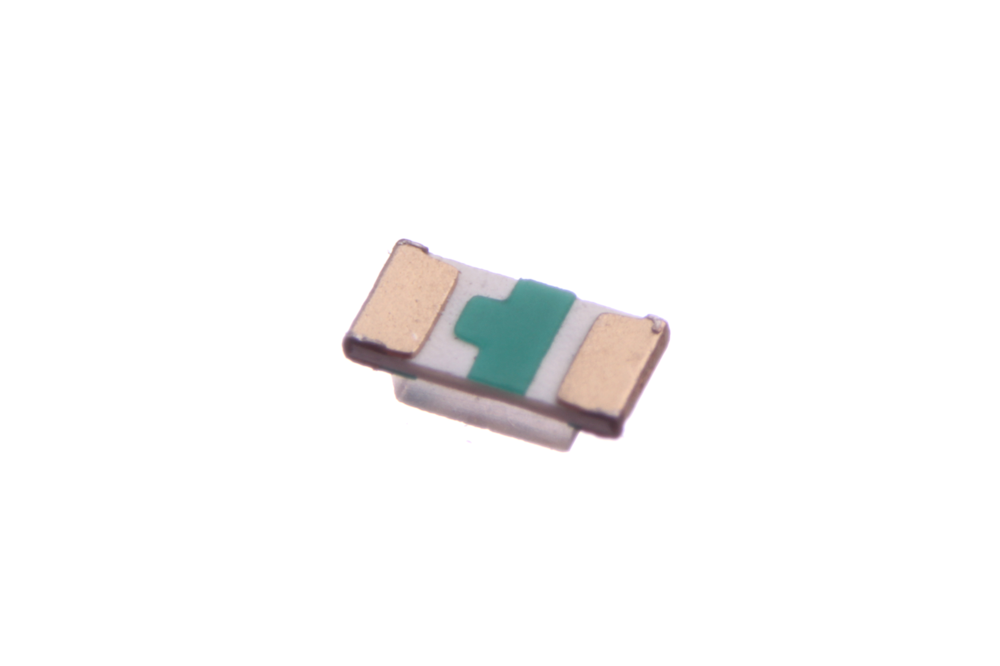
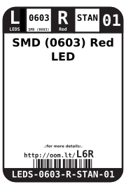
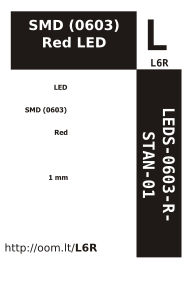

Contents
========

* [LEDS-0603-R-STAN-01>SMD (0603) Red LED](#leds-0603-r-stan-01smd-0603-red-led)
	* [Images](#images)
	* [Datasheets](#datasheets)
	* [Labels](#labels)
	* [EDA](#eda)
		* [Symbols](#symbols)
	* [Tags](#tags)
  
![][im]
# LEDS-0603-R-STAN-01>SMD (0603) Red LED

- ID: LEDS-0603-R-STAN-01
- Name: LEDS-0603-R-STAN-01

## Images
  
  

|Main|Bottom|
| :---: | :---: |
|||

## Datasheets

- Datasheet: [datasheet.pdf](datasheet.pdf)

## Labels
  
  

|Front|Inventory|Specifications|
| :---: | :---: | :---: |
||||

## EDA

### Symbols

## Tags

- index: 12676
- index: 4181
- oompID: LEDS-0603-R-STAN-01
- name: SMD (0603) Red LED
- hexID: L6R
- oompSort: 0603R
- oompType: LEDS
- oompSize: 0603
- oompColor: R
- oompDesc: STAN
- oompIndex: 01
- oompVersion: 99
- oompClass: Surface Mount
- oompClassCode: SMDS
- oompBbls: template;XXXX-0603-X-XXXX-XX-bbls
- oompDiag: template;XXXX-0603-X-XXXX-XX-diag
- oompIden: template;XXXX-0603-X-XXXX-XX-iden
- oompSchem: template;LEDS-XXXX-X-XXXX-XX-schem
- oompSimp: template;XXXX-0603-X-XXXX-XX-simp
- ooDesignator: D1

[im]: image_600.jpg
