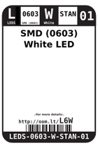
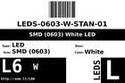
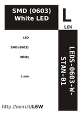
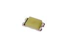
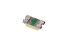

Contents
========

* [L6W > SMD (0603) White LED](#l6w--smd-0603-white-led)
	* [Datasheets](#datasheets)
	* [Labels](#labels)
	* [EDA](#eda)
	* [Images](#images)
	* [Tags](#tags)
  
![][im]
# L6W > SMD (0603) White LED

- ID: LEDS-0603-W-STAN-01
- Hex ID: L6W
- Name: SMD (0603) White LED
- Description: SMD (0603) White LED
- Long Link: [http://oom.lt/LEDS-0603-W-STAN-01](http://oom.lt/LEDS-0603-W-STAN-01)
- Short Link: [http://oom.lt/L6W](http://oom.lt/L6W)

## Datasheets

- Datasheet: [datasheet.pdf](datasheet.pdf)

## Labels
  
  

|label-front|label-inventory|label-spec|
| :---: | :---: | :---: |
||||

## EDA

### Instances
  
  
Used 144 times.  
Prevalance: (144\9905) 1.4538%  

|OOMP Instances|
| :---: |
|[PROJ-ADAF-2946-STAN-01  Adafruit IS31FL3731 CharliePlex LED Breakout PCB  Used 144 times. C1-1, C1-2, C1-3, C1-4, C1-5, C1-6, C1-7, C1-8, C1-9, C1-10, C1-11, C1-12, C1-13, C1-14, C1-15, C1-16, C2-1, C2-2, C2-3, C2-4, C2-5, C2-6, C2-7, C2-8, C2-9, C2-10, C2-11, C2-12, C2-13, C2-14, C2-15, C2-16, C3-1, C3-2, C3-3, C3-4, C3-5, C3-6, C3-7, C3-8, C3-9, C3-10, C3-11, C3-12, C3-13, C3-14, C3-15, C3-16, C4-1, C4-2, C4-3, C4-4, C4-5, C4-6, C4-7, C4-8, C4-9, C4-10, C4-11, C4-12, C4-13, C4-14, C4-15, C4-16, C5-1, C5-2, C5-3, C5-4, C5-5, C5-6, C5-7, C5-8, C5-9, C5-10, C5-11, C5-12, C5-13, C5-14, C5-15, C5-16, C6-1, C6-2, C6-3, C6-4, C6-5, C6-6, C6-7, C6-8, C6-9, C6-10, C6-11, C6-12, C6-13, C6-14, C6-15, C6-16, C7-1, C7-2, C7-3, C7-4, C7-5, C7-6, C7-7, C7-8, C7-9, C7-10, C7-11, C7-12, C7-13, C7-14, C7-15, C7-16, C8-1, C8-2, C8-3, C8-4, C8-5, C8-6, C8-7, C8-8, C8-9, C8-10, C8-11, C8-12, C8-13, C8-14, C8-15, C8-16, C9-1, C9-2, C9-3, C9-4, C9-5, C9-6, C9-7, C9-8, C9-9, C9-10, C9-11, C9-12, C9-13, C9-14, C9-15, C9-16](https://github.com/oomlout/oomlout_OOMP_projects/tree/main/PROJ-ADAF-2946-STAN-01/)|

### Symbols

## Images
  
  

|image|image_BOTTOM|label-front|label-inventory|label-spec|
| :---: | :---: | :---: | :---: | :---: |
||||||

## Tags

- oompID: LEDS-0603-W-STAN-01
- name: SMD (0603) White LED
- hexID: L6W
- oompSort: 
- oompClass: Surface Mount
- oompClassCode: SMDS
- oompType: LEDS
- oompSize: 0603
- oompColor: W
- oompDesc: STAN
- oompIndex: 01
- oompVersion: 40
- oompBbls: template;XXXX-0603-X-XXXX-XX-bbls
- oompDiag: template;XXXX-0603-X-XXXX-XX-diag
- oompIden: template;XXXX-0603-X-XXXX-XX-iden
- oompSchem: template;LEDS-XXXX-X-XXXX-XX-schem
- oompSimp: template;XXXX-0603-X-XXXX-XX-simp
- ooDesignator: D1
- oompInstances: {'PROJECT': 'PROJ-ADAF-2946-STAN-01', 'ID': 'C1-1'}
- oompInstances: {'PROJECT': 'PROJ-ADAF-2946-STAN-01', 'ID': 'C1-2'}
- oompInstances: {'PROJECT': 'PROJ-ADAF-2946-STAN-01', 'ID': 'C1-3'}
- oompInstances: {'PROJECT': 'PROJ-ADAF-2946-STAN-01', 'ID': 'C1-4'}
- oompInstances: {'PROJECT': 'PROJ-ADAF-2946-STAN-01', 'ID': 'C1-5'}
- oompInstances: {'PROJECT': 'PROJ-ADAF-2946-STAN-01', 'ID': 'C1-6'}
- oompInstances: {'PROJECT': 'PROJ-ADAF-2946-STAN-01', 'ID': 'C1-7'}
- oompInstances: {'PROJECT': 'PROJ-ADAF-2946-STAN-01', 'ID': 'C1-8'}
- oompInstances: {'PROJECT': 'PROJ-ADAF-2946-STAN-01', 'ID': 'C1-9'}
- oompInstances: {'PROJECT': 'PROJ-ADAF-2946-STAN-01', 'ID': 'C1-10'}
- oompInstances: {'PROJECT': 'PROJ-ADAF-2946-STAN-01', 'ID': 'C1-11'}
- oompInstances: {'PROJECT': 'PROJ-ADAF-2946-STAN-01', 'ID': 'C1-12'}
- oompInstances: {'PROJECT': 'PROJ-ADAF-2946-STAN-01', 'ID': 'C1-13'}
- oompInstances: {'PROJECT': 'PROJ-ADAF-2946-STAN-01', 'ID': 'C1-14'}
- oompInstances: {'PROJECT': 'PROJ-ADAF-2946-STAN-01', 'ID': 'C1-15'}
- oompInstances: {'PROJECT': 'PROJ-ADAF-2946-STAN-01', 'ID': 'C1-16'}
- oompInstances: {'PROJECT': 'PROJ-ADAF-2946-STAN-01', 'ID': 'C2-1'}
- oompInstances: {'PROJECT': 'PROJ-ADAF-2946-STAN-01', 'ID': 'C2-2'}
- oompInstances: {'PROJECT': 'PROJ-ADAF-2946-STAN-01', 'ID': 'C2-3'}
- oompInstances: {'PROJECT': 'PROJ-ADAF-2946-STAN-01', 'ID': 'C2-4'}
- oompInstances: {'PROJECT': 'PROJ-ADAF-2946-STAN-01', 'ID': 'C2-5'}
- oompInstances: {'PROJECT': 'PROJ-ADAF-2946-STAN-01', 'ID': 'C2-6'}
- oompInstances: {'PROJECT': 'PROJ-ADAF-2946-STAN-01', 'ID': 'C2-7'}
- oompInstances: {'PROJECT': 'PROJ-ADAF-2946-STAN-01', 'ID': 'C2-8'}
- oompInstances: {'PROJECT': 'PROJ-ADAF-2946-STAN-01', 'ID': 'C2-9'}
- oompInstances: {'PROJECT': 'PROJ-ADAF-2946-STAN-01', 'ID': 'C2-10'}
- oompInstances: {'PROJECT': 'PROJ-ADAF-2946-STAN-01', 'ID': 'C2-11'}
- oompInstances: {'PROJECT': 'PROJ-ADAF-2946-STAN-01', 'ID': 'C2-12'}
- oompInstances: {'PROJECT': 'PROJ-ADAF-2946-STAN-01', 'ID': 'C2-13'}
- oompInstances: {'PROJECT': 'PROJ-ADAF-2946-STAN-01', 'ID': 'C2-14'}
- oompInstances: {'PROJECT': 'PROJ-ADAF-2946-STAN-01', 'ID': 'C2-15'}
- oompInstances: {'PROJECT': 'PROJ-ADAF-2946-STAN-01', 'ID': 'C2-16'}
- oompInstances: {'PROJECT': 'PROJ-ADAF-2946-STAN-01', 'ID': 'C3-1'}
- oompInstances: {'PROJECT': 'PROJ-ADAF-2946-STAN-01', 'ID': 'C3-2'}
- oompInstances: {'PROJECT': 'PROJ-ADAF-2946-STAN-01', 'ID': 'C3-3'}
- oompInstances: {'PROJECT': 'PROJ-ADAF-2946-STAN-01', 'ID': 'C3-4'}
- oompInstances: {'PROJECT': 'PROJ-ADAF-2946-STAN-01', 'ID': 'C3-5'}
- oompInstances: {'PROJECT': 'PROJ-ADAF-2946-STAN-01', 'ID': 'C3-6'}
- oompInstances: {'PROJECT': 'PROJ-ADAF-2946-STAN-01', 'ID': 'C3-7'}
- oompInstances: {'PROJECT': 'PROJ-ADAF-2946-STAN-01', 'ID': 'C3-8'}
- oompInstances: {'PROJECT': 'PROJ-ADAF-2946-STAN-01', 'ID': 'C3-9'}
- oompInstances: {'PROJECT': 'PROJ-ADAF-2946-STAN-01', 'ID': 'C3-10'}
- oompInstances: {'PROJECT': 'PROJ-ADAF-2946-STAN-01', 'ID': 'C3-11'}
- oompInstances: {'PROJECT': 'PROJ-ADAF-2946-STAN-01', 'ID': 'C3-12'}
- oompInstances: {'PROJECT': 'PROJ-ADAF-2946-STAN-01', 'ID': 'C3-13'}
- oompInstances: {'PROJECT': 'PROJ-ADAF-2946-STAN-01', 'ID': 'C3-14'}
- oompInstances: {'PROJECT': 'PROJ-ADAF-2946-STAN-01', 'ID': 'C3-15'}
- oompInstances: {'PROJECT': 'PROJ-ADAF-2946-STAN-01', 'ID': 'C3-16'}
- oompInstances: {'PROJECT': 'PROJ-ADAF-2946-STAN-01', 'ID': 'C4-1'}
- oompInstances: {'PROJECT': 'PROJ-ADAF-2946-STAN-01', 'ID': 'C4-2'}
- oompInstances: {'PROJECT': 'PROJ-ADAF-2946-STAN-01', 'ID': 'C4-3'}
- oompInstances: {'PROJECT': 'PROJ-ADAF-2946-STAN-01', 'ID': 'C4-4'}
- oompInstances: {'PROJECT': 'PROJ-ADAF-2946-STAN-01', 'ID': 'C4-5'}
- oompInstances: {'PROJECT': 'PROJ-ADAF-2946-STAN-01', 'ID': 'C4-6'}
- oompInstances: {'PROJECT': 'PROJ-ADAF-2946-STAN-01', 'ID': 'C4-7'}
- oompInstances: {'PROJECT': 'PROJ-ADAF-2946-STAN-01', 'ID': 'C4-8'}
- oompInstances: {'PROJECT': 'PROJ-ADAF-2946-STAN-01', 'ID': 'C4-9'}
- oompInstances: {'PROJECT': 'PROJ-ADAF-2946-STAN-01', 'ID': 'C4-10'}
- oompInstances: {'PROJECT': 'PROJ-ADAF-2946-STAN-01', 'ID': 'C4-11'}
- oompInstances: {'PROJECT': 'PROJ-ADAF-2946-STAN-01', 'ID': 'C4-12'}
- oompInstances: {'PROJECT': 'PROJ-ADAF-2946-STAN-01', 'ID': 'C4-13'}
- oompInstances: {'PROJECT': 'PROJ-ADAF-2946-STAN-01', 'ID': 'C4-14'}
- oompInstances: {'PROJECT': 'PROJ-ADAF-2946-STAN-01', 'ID': 'C4-15'}
- oompInstances: {'PROJECT': 'PROJ-ADAF-2946-STAN-01', 'ID': 'C4-16'}
- oompInstances: {'PROJECT': 'PROJ-ADAF-2946-STAN-01', 'ID': 'C5-1'}
- oompInstances: {'PROJECT': 'PROJ-ADAF-2946-STAN-01', 'ID': 'C5-2'}
- oompInstances: {'PROJECT': 'PROJ-ADAF-2946-STAN-01', 'ID': 'C5-3'}
- oompInstances: {'PROJECT': 'PROJ-ADAF-2946-STAN-01', 'ID': 'C5-4'}
- oompInstances: {'PROJECT': 'PROJ-ADAF-2946-STAN-01', 'ID': 'C5-5'}
- oompInstances: {'PROJECT': 'PROJ-ADAF-2946-STAN-01', 'ID': 'C5-6'}
- oompInstances: {'PROJECT': 'PROJ-ADAF-2946-STAN-01', 'ID': 'C5-7'}
- oompInstances: {'PROJECT': 'PROJ-ADAF-2946-STAN-01', 'ID': 'C5-8'}
- oompInstances: {'PROJECT': 'PROJ-ADAF-2946-STAN-01', 'ID': 'C5-9'}
- oompInstances: {'PROJECT': 'PROJ-ADAF-2946-STAN-01', 'ID': 'C5-10'}
- oompInstances: {'PROJECT': 'PROJ-ADAF-2946-STAN-01', 'ID': 'C5-11'}
- oompInstances: {'PROJECT': 'PROJ-ADAF-2946-STAN-01', 'ID': 'C5-12'}
- oompInstances: {'PROJECT': 'PROJ-ADAF-2946-STAN-01', 'ID': 'C5-13'}
- oompInstances: {'PROJECT': 'PROJ-ADAF-2946-STAN-01', 'ID': 'C5-14'}
- oompInstances: {'PROJECT': 'PROJ-ADAF-2946-STAN-01', 'ID': 'C5-15'}
- oompInstances: {'PROJECT': 'PROJ-ADAF-2946-STAN-01', 'ID': 'C5-16'}
- oompInstances: {'PROJECT': 'PROJ-ADAF-2946-STAN-01', 'ID': 'C6-1'}
- oompInstances: {'PROJECT': 'PROJ-ADAF-2946-STAN-01', 'ID': 'C6-2'}
- oompInstances: {'PROJECT': 'PROJ-ADAF-2946-STAN-01', 'ID': 'C6-3'}
- oompInstances: {'PROJECT': 'PROJ-ADAF-2946-STAN-01', 'ID': 'C6-4'}
- oompInstances: {'PROJECT': 'PROJ-ADAF-2946-STAN-01', 'ID': 'C6-5'}
- oompInstances: {'PROJECT': 'PROJ-ADAF-2946-STAN-01', 'ID': 'C6-6'}
- oompInstances: {'PROJECT': 'PROJ-ADAF-2946-STAN-01', 'ID': 'C6-7'}
- oompInstances: {'PROJECT': 'PROJ-ADAF-2946-STAN-01', 'ID': 'C6-8'}
- oompInstances: {'PROJECT': 'PROJ-ADAF-2946-STAN-01', 'ID': 'C6-9'}
- oompInstances: {'PROJECT': 'PROJ-ADAF-2946-STAN-01', 'ID': 'C6-10'}
- oompInstances: {'PROJECT': 'PROJ-ADAF-2946-STAN-01', 'ID': 'C6-11'}
- oompInstances: {'PROJECT': 'PROJ-ADAF-2946-STAN-01', 'ID': 'C6-12'}
- oompInstances: {'PROJECT': 'PROJ-ADAF-2946-STAN-01', 'ID': 'C6-13'}
- oompInstances: {'PROJECT': 'PROJ-ADAF-2946-STAN-01', 'ID': 'C6-14'}
- oompInstances: {'PROJECT': 'PROJ-ADAF-2946-STAN-01', 'ID': 'C6-15'}
- oompInstances: {'PROJECT': 'PROJ-ADAF-2946-STAN-01', 'ID': 'C6-16'}
- oompInstances: {'PROJECT': 'PROJ-ADAF-2946-STAN-01', 'ID': 'C7-1'}
- oompInstances: {'PROJECT': 'PROJ-ADAF-2946-STAN-01', 'ID': 'C7-2'}
- oompInstances: {'PROJECT': 'PROJ-ADAF-2946-STAN-01', 'ID': 'C7-3'}
- oompInstances: {'PROJECT': 'PROJ-ADAF-2946-STAN-01', 'ID': 'C7-4'}
- oompInstances: {'PROJECT': 'PROJ-ADAF-2946-STAN-01', 'ID': 'C7-5'}
- oompInstances: {'PROJECT': 'PROJ-ADAF-2946-STAN-01', 'ID': 'C7-6'}
- oompInstances: {'PROJECT': 'PROJ-ADAF-2946-STAN-01', 'ID': 'C7-7'}
- oompInstances: {'PROJECT': 'PROJ-ADAF-2946-STAN-01', 'ID': 'C7-8'}
- oompInstances: {'PROJECT': 'PROJ-ADAF-2946-STAN-01', 'ID': 'C7-9'}
- oompInstances: {'PROJECT': 'PROJ-ADAF-2946-STAN-01', 'ID': 'C7-10'}
- oompInstances: {'PROJECT': 'PROJ-ADAF-2946-STAN-01', 'ID': 'C7-11'}
- oompInstances: {'PROJECT': 'PROJ-ADAF-2946-STAN-01', 'ID': 'C7-12'}
- oompInstances: {'PROJECT': 'PROJ-ADAF-2946-STAN-01', 'ID': 'C7-13'}
- oompInstances: {'PROJECT': 'PROJ-ADAF-2946-STAN-01', 'ID': 'C7-14'}
- oompInstances: {'PROJECT': 'PROJ-ADAF-2946-STAN-01', 'ID': 'C7-15'}
- oompInstances: {'PROJECT': 'PROJ-ADAF-2946-STAN-01', 'ID': 'C7-16'}
- oompInstances: {'PROJECT': 'PROJ-ADAF-2946-STAN-01', 'ID': 'C8-1'}
- oompInstances: {'PROJECT': 'PROJ-ADAF-2946-STAN-01', 'ID': 'C8-2'}
- oompInstances: {'PROJECT': 'PROJ-ADAF-2946-STAN-01', 'ID': 'C8-3'}
- oompInstances: {'PROJECT': 'PROJ-ADAF-2946-STAN-01', 'ID': 'C8-4'}
- oompInstances: {'PROJECT': 'PROJ-ADAF-2946-STAN-01', 'ID': 'C8-5'}
- oompInstances: {'PROJECT': 'PROJ-ADAF-2946-STAN-01', 'ID': 'C8-6'}
- oompInstances: {'PROJECT': 'PROJ-ADAF-2946-STAN-01', 'ID': 'C8-7'}
- oompInstances: {'PROJECT': 'PROJ-ADAF-2946-STAN-01', 'ID': 'C8-8'}
- oompInstances: {'PROJECT': 'PROJ-ADAF-2946-STAN-01', 'ID': 'C8-9'}
- oompInstances: {'PROJECT': 'PROJ-ADAF-2946-STAN-01', 'ID': 'C8-10'}
- oompInstances: {'PROJECT': 'PROJ-ADAF-2946-STAN-01', 'ID': 'C8-11'}
- oompInstances: {'PROJECT': 'PROJ-ADAF-2946-STAN-01', 'ID': 'C8-12'}
- oompInstances: {'PROJECT': 'PROJ-ADAF-2946-STAN-01', 'ID': 'C8-13'}
- oompInstances: {'PROJECT': 'PROJ-ADAF-2946-STAN-01', 'ID': 'C8-14'}
- oompInstances: {'PROJECT': 'PROJ-ADAF-2946-STAN-01', 'ID': 'C8-15'}
- oompInstances: {'PROJECT': 'PROJ-ADAF-2946-STAN-01', 'ID': 'C8-16'}
- oompInstances: {'PROJECT': 'PROJ-ADAF-2946-STAN-01', 'ID': 'C9-1'}
- oompInstances: {'PROJECT': 'PROJ-ADAF-2946-STAN-01', 'ID': 'C9-2'}
- oompInstances: {'PROJECT': 'PROJ-ADAF-2946-STAN-01', 'ID': 'C9-3'}
- oompInstances: {'PROJECT': 'PROJ-ADAF-2946-STAN-01', 'ID': 'C9-4'}
- oompInstances: {'PROJECT': 'PROJ-ADAF-2946-STAN-01', 'ID': 'C9-5'}
- oompInstances: {'PROJECT': 'PROJ-ADAF-2946-STAN-01', 'ID': 'C9-6'}
- oompInstances: {'PROJECT': 'PROJ-ADAF-2946-STAN-01', 'ID': 'C9-7'}
- oompInstances: {'PROJECT': 'PROJ-ADAF-2946-STAN-01', 'ID': 'C9-8'}
- oompInstances: {'PROJECT': 'PROJ-ADAF-2946-STAN-01', 'ID': 'C9-9'}
- oompInstances: {'PROJECT': 'PROJ-ADAF-2946-STAN-01', 'ID': 'C9-10'}
- oompInstances: {'PROJECT': 'PROJ-ADAF-2946-STAN-01', 'ID': 'C9-11'}
- oompInstances: {'PROJECT': 'PROJ-ADAF-2946-STAN-01', 'ID': 'C9-12'}
- oompInstances: {'PROJECT': 'PROJ-ADAF-2946-STAN-01', 'ID': 'C9-13'}
- oompInstances: {'PROJECT': 'PROJ-ADAF-2946-STAN-01', 'ID': 'C9-14'}
- oompInstances: {'PROJECT': 'PROJ-ADAF-2946-STAN-01', 'ID': 'C9-15'}
- oompInstances: {'PROJECT': 'PROJ-ADAF-2946-STAN-01', 'ID': 'C9-16'}

[im]: image_450.jpg
