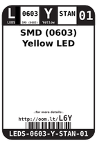
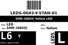
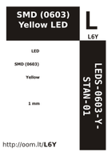
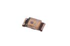

Contents
========

* [L6Y > SMD (0603) Yellow LED](#l6y--smd-0603-yellow-led)
	* [Datasheets](#datasheets)
	* [Labels](#labels)
	* [EDA](#eda)
	* [Images](#images)
	* [Tags](#tags)
  
![][im]
# L6Y > SMD (0603) Yellow LED

- ID: LEDS-0603-Y-STAN-01
- Hex ID: L6Y
- Name: SMD (0603) Yellow LED
- Description: SMD (0603) Yellow LED
- Long Link: [http://oom.lt/LEDS-0603-Y-STAN-01](http://oom.lt/LEDS-0603-Y-STAN-01)
- Short Link: [http://oom.lt/L6Y](http://oom.lt/L6Y)

## Datasheets

- Datasheet: [datasheet.pdf](datasheet.pdf)

## Labels
  
  

|label-front|label-inventory|label-spec|
| :---: | :---: | :---: |
||||

## EDA

### Footprints
  

|[  FOOTPRINT-kicad-kicad-footprints-LED_SMD-LED_0603_1608Metric](https://github.com/oomlout/oomlout_OOMP_eda/tree/main/FOOTPRINT/kicad/kicad-footprints/LED_SMD/LED_0603_1608Metric/)|[  FOOTPRINT-kicad-kicad-footprints-LED_SMD-LED_0603_1608Metric_Pad1.05x0.95mm_HandSolder](https://github.com/oomlout/oomlout_OOMP_eda/tree/main/FOOTPRINT/kicad/kicad-footprints/LED_SMD/LED_0603_1608Metric_Pad1.05x0.95mm_HandSolder/)|||
| :---: | :---: | :---: | :---: |

### Symbols
  

|[  SYMBOL-kicad-kicad-symbols-Device-LED](https://github.com/oomlout/oomlout_OOMP_eda/tree/main/SYMBOL/kicad/kicad-symbols/Device/LED/)||||
| :---: | :---: | :---: | :---: |
  

### Instances
  
Used 50 times.  
Prevalance: (50\10986) 0.4551%  

|Project|Occur- rences|Identifiers|
| :---: | :---: | :---: |
|[PROJ-ADAF-3589-STAN-01 Adafruit PiUART PCB](https://github.com/oomlout/oomlout_OOMP_projects/tree/main/PROJ-ADAF-3589-STAN-01/)|[1](https://github.com/oomlout/oomlout_OOMP_projects/tree/main/PROJ-ADAF-3589-STAN-01/)|[D2](https://github.com/oomlout/oomlout_OOMP_projects/tree/main/PROJ-ADAF-3589-STAN-01/)|
|[PROJ-ADAF-4319-STAN-01 Adafruit PyRuler PCB](https://github.com/oomlout/oomlout_OOMP_projects/tree/main/PROJ-ADAF-4319-STAN-01/)|[1](https://github.com/oomlout/oomlout_OOMP_projects/tree/main/PROJ-ADAF-4319-STAN-01/)|[L1](https://github.com/oomlout/oomlout_OOMP_projects/tree/main/PROJ-ADAF-4319-STAN-01/)|
|[PROJ-SPAR-10116-STAN-01 Arduino Fio](https://github.com/oomlout/oomlout_OOMP_projects/tree/main/PROJ-SPAR-10116-STAN-01/)|[1](https://github.com/oomlout/oomlout_OOMP_projects/tree/main/PROJ-SPAR-10116-STAN-01/)|[D4](https://github.com/oomlout/oomlout_OOMP_projects/tree/main/PROJ-SPAR-10116-STAN-01/)|
|[PROJ-SPAR-10274-STAN-01 LilyPad Arduino Simple](https://github.com/oomlout/oomlout_OOMP_projects/tree/main/PROJ-SPAR-10274-STAN-01/)|[1](https://github.com/oomlout/oomlout_OOMP_projects/tree/main/PROJ-SPAR-10274-STAN-01/)|[D4](https://github.com/oomlout/oomlout_OOMP_projects/tree/main/PROJ-SPAR-10274-STAN-01/)|
|[PROJ-SPAR-10406-STAN-01 RFID Evaluation Shield](https://github.com/oomlout/oomlout_OOMP_projects/tree/main/PROJ-SPAR-10406-STAN-01/)|[1](https://github.com/oomlout/oomlout_OOMP_projects/tree/main/PROJ-SPAR-10406-STAN-01/)|[LED1](https://github.com/oomlout/oomlout_OOMP_projects/tree/main/PROJ-SPAR-10406-STAN-01/)|
|[PROJ-SPAR-10743-STAN-01 Mega Pro Mini](https://github.com/oomlout/oomlout_OOMP_projects/tree/main/PROJ-SPAR-10743-STAN-01/)|[1](https://github.com/oomlout/oomlout_OOMP_projects/tree/main/PROJ-SPAR-10743-STAN-01/)|[LED1](https://github.com/oomlout/oomlout_OOMP_projects/tree/main/PROJ-SPAR-10743-STAN-01/)|
|[PROJ-SPAR-10864-STAN-01 PoEthernet Shield](https://github.com/oomlout/oomlout_OOMP_projects/tree/main/PROJ-SPAR-10864-STAN-01/)|[1](https://github.com/oomlout/oomlout_OOMP_projects/tree/main/PROJ-SPAR-10864-STAN-01/)|[LED3](https://github.com/oomlout/oomlout_OOMP_projects/tree/main/PROJ-SPAR-10864-STAN-01/)|
|[PROJ-SPAR-10941-STAN-01 LilyPad Arduino SimpleSnap](https://github.com/oomlout/oomlout_OOMP_projects/tree/main/PROJ-SPAR-10941-STAN-01/)|[1](https://github.com/oomlout/oomlout_OOMP_projects/tree/main/PROJ-SPAR-10941-STAN-01/)|[D4](https://github.com/oomlout/oomlout_OOMP_projects/tree/main/PROJ-SPAR-10941-STAN-01/)|
|[PROJ-SPAR-11007-STAN-01 Mega Pro](https://github.com/oomlout/oomlout_OOMP_projects/tree/main/PROJ-SPAR-11007-STAN-01/)|[1](https://github.com/oomlout/oomlout_OOMP_projects/tree/main/PROJ-SPAR-11007-STAN-01/)|[LED2](https://github.com/oomlout/oomlout_OOMP_projects/tree/main/PROJ-SPAR-11007-STAN-01/)|
|[PROJ-SPAR-11013-STAN-01 LilyPad MP3 Player](https://github.com/oomlout/oomlout_OOMP_projects/tree/main/PROJ-SPAR-11013-STAN-01/)|[1](https://github.com/oomlout/oomlout_OOMP_projects/tree/main/PROJ-SPAR-11013-STAN-01/)|[LED2](https://github.com/oomlout/oomlout_OOMP_projects/tree/main/PROJ-SPAR-11013-STAN-01/)|
|[PROJ-SPAR-11201-STAN-01 ProtoSnap-LilyPad Dev Simple](https://github.com/oomlout/oomlout_OOMP_projects/tree/main/PROJ-SPAR-11201-STAN-01/)|[1](https://github.com/oomlout/oomlout_OOMP_projects/tree/main/PROJ-SPAR-11201-STAN-01/)|[D4](https://github.com/oomlout/oomlout_OOMP_projects/tree/main/PROJ-SPAR-11201-STAN-01/)|
|[PROJ-SPAR-11262-STAN-01 ProtoSnap-LilyPad Development Board](https://github.com/oomlout/oomlout_OOMP_projects/tree/main/PROJ-SPAR-11262-STAN-01/)|[1](https://github.com/oomlout/oomlout_OOMP_projects/tree/main/PROJ-SPAR-11262-STAN-01/)|[D4](https://github.com/oomlout/oomlout_OOMP_projects/tree/main/PROJ-SPAR-11262-STAN-01/)|
|[PROJ-SPAR-11343-STAN-01 IOIO-OTG](https://github.com/oomlout/oomlout_OOMP_projects/tree/main/PROJ-SPAR-11343-STAN-01/)|[1](https://github.com/oomlout/oomlout_OOMP_projects/tree/main/PROJ-SPAR-11343-STAN-01/)|[D3](https://github.com/oomlout/oomlout_OOMP_projects/tree/main/PROJ-SPAR-11343-STAN-01/)|
|[PROJ-SPAR-11509-STAN-01 Papilio Button LED Wing](https://github.com/oomlout/oomlout_OOMP_projects/tree/main/PROJ-SPAR-11509-STAN-01/)|[1](https://github.com/oomlout/oomlout_OOMP_projects/tree/main/PROJ-SPAR-11509-STAN-01/)|[LED2](https://github.com/oomlout/oomlout_OOMP_projects/tree/main/PROJ-SPAR-11509-STAN-01/)|
|[PROJ-SPAR-11520-STAN-01 Fio v3](https://github.com/oomlout/oomlout_OOMP_projects/tree/main/PROJ-SPAR-11520-STAN-01/)|[3](https://github.com/oomlout/oomlout_OOMP_projects/tree/main/PROJ-SPAR-11520-STAN-01/)|[D1, D4, D5](https://github.com/oomlout/oomlout_OOMP_projects/tree/main/PROJ-SPAR-11520-STAN-01/)|
|[PROJ-SPAR-11525-STAN-01 P8X32A Breakout](https://github.com/oomlout/oomlout_OOMP_projects/tree/main/PROJ-SPAR-11525-STAN-01/)|[1](https://github.com/oomlout/oomlout_OOMP_projects/tree/main/PROJ-SPAR-11525-STAN-01/)|[LED2](https://github.com/oomlout/oomlout_OOMP_projects/tree/main/PROJ-SPAR-11525-STAN-01/)|
|[PROJ-SPAR-11697-STAN-01 XBee Explorer Dongle](https://github.com/oomlout/oomlout_OOMP_projects/tree/main/PROJ-SPAR-11697-STAN-01/)|[1](https://github.com/oomlout/oomlout_OOMP_projects/tree/main/PROJ-SPAR-11697-STAN-01/)|[D2](https://github.com/oomlout/oomlout_OOMP_projects/tree/main/PROJ-SPAR-11697-STAN-01/)|
|[PROJ-SPAR-11703-STAN-01 UDB5](https://github.com/oomlout/oomlout_OOMP_projects/tree/main/PROJ-SPAR-11703-STAN-01/)|[1](https://github.com/oomlout/oomlout_OOMP_projects/tree/main/PROJ-SPAR-11703-STAN-01/)|[STAT3](https://github.com/oomlout/oomlout_OOMP_projects/tree/main/PROJ-SPAR-11703-STAN-01/)|
|[PROJ-SPAR-11736-STAN-01 FT231X Breakout](https://github.com/oomlout/oomlout_OOMP_projects/tree/main/PROJ-SPAR-11736-STAN-01/)|[1](https://github.com/oomlout/oomlout_OOMP_projects/tree/main/PROJ-SPAR-11736-STAN-01/)|[LED2](https://github.com/oomlout/oomlout_OOMP_projects/tree/main/PROJ-SPAR-11736-STAN-01/)|
|[PROJ-SPAR-11801-STAN-01 Tiny-AVR-Programmer](https://github.com/oomlout/oomlout_OOMP_projects/tree/main/PROJ-SPAR-11801-STAN-01/)|[1](https://github.com/oomlout/oomlout_OOMP_projects/tree/main/PROJ-SPAR-11801-STAN-01/)|[LED1](https://github.com/oomlout/oomlout_OOMP_projects/tree/main/PROJ-SPAR-11801-STAN-01/)|
|[PROJ-SPAR-11893-STAN-01 LilyPad Simple Power](https://github.com/oomlout/oomlout_OOMP_projects/tree/main/PROJ-SPAR-11893-STAN-01/)|[1](https://github.com/oomlout/oomlout_OOMP_projects/tree/main/PROJ-SPAR-11893-STAN-01/)|[D1](https://github.com/oomlout/oomlout_OOMP_projects/tree/main/PROJ-SPAR-11893-STAN-01/)|
|[PROJ-SPAR-12651-STAN-01 Digital Sandbox](https://github.com/oomlout/oomlout_OOMP_projects/tree/main/PROJ-SPAR-12651-STAN-01/)|[1](https://github.com/oomlout/oomlout_OOMP_projects/tree/main/PROJ-SPAR-12651-STAN-01/)|[D1](https://github.com/oomlout/oomlout_OOMP_projects/tree/main/PROJ-SPAR-12651-STAN-01/)|
|[PROJ-SPAR-12779-STAN-01 Easy Driver](https://github.com/oomlout/oomlout_OOMP_projects/tree/main/PROJ-SPAR-12779-STAN-01/)|[1](https://github.com/oomlout/oomlout_OOMP_projects/tree/main/PROJ-SPAR-12779-STAN-01/)|[PWR_LED](https://github.com/oomlout/oomlout_OOMP_projects/tree/main/PROJ-SPAR-12779-STAN-01/)|
|[PROJ-SPAR-12859-STAN-01 Big Easy Driver](https://github.com/oomlout/oomlout_OOMP_projects/tree/main/PROJ-SPAR-12859-STAN-01/)|[1](https://github.com/oomlout/oomlout_OOMP_projects/tree/main/PROJ-SPAR-12859-STAN-01/)|[PWR_LED](https://github.com/oomlout/oomlout_OOMP_projects/tree/main/PROJ-SPAR-12859-STAN-01/)|
|[PROJ-SPAR-12887-STAN-01 Electric Imp Shield](https://github.com/oomlout/oomlout_OOMP_projects/tree/main/PROJ-SPAR-12887-STAN-01/)|[1](https://github.com/oomlout/oomlout_OOMP_projects/tree/main/PROJ-SPAR-12887-STAN-01/)|[LED2](https://github.com/oomlout/oomlout_OOMP_projects/tree/main/PROJ-SPAR-12887-STAN-01/)|
|[PROJ-SPAR-13310-STAN-01 Ludus ProtoShield](https://github.com/oomlout/oomlout_OOMP_projects/tree/main/PROJ-SPAR-13310-STAN-01/)|[2](https://github.com/oomlout/oomlout_OOMP_projects/tree/main/PROJ-SPAR-13310-STAN-01/)|[LED1, LED2](https://github.com/oomlout/oomlout_OOMP_projects/tree/main/PROJ-SPAR-13310-STAN-01/)|
|[PROJ-SPAR-13664-STAN-01 SAMD21 Mini Breakout](https://github.com/oomlout/oomlout_OOMP_projects/tree/main/PROJ-SPAR-13664-STAN-01/)|[1](https://github.com/oomlout/oomlout_OOMP_projects/tree/main/PROJ-SPAR-13664-STAN-01/)|[D4](https://github.com/oomlout/oomlout_OOMP_projects/tree/main/PROJ-SPAR-13664-STAN-01/)|
|[PROJ-SPAR-13672-STAN-01 SAMD21 Dev Breakout](https://github.com/oomlout/oomlout_OOMP_projects/tree/main/PROJ-SPAR-13672-STAN-01/)|[1](https://github.com/oomlout/oomlout_OOMP_projects/tree/main/PROJ-SPAR-13672-STAN-01/)|[D6](https://github.com/oomlout/oomlout_OOMP_projects/tree/main/PROJ-SPAR-13672-STAN-01/)|
|[PROJ-SPAR-13711-STAN-01 ESP8266 Thing Dev 4H](https://github.com/oomlout/oomlout_OOMP_projects/tree/main/PROJ-SPAR-13711-STAN-01/)|[1](https://github.com/oomlout/oomlout_OOMP_projects/tree/main/PROJ-SPAR-13711-STAN-01/)|[D4](https://github.com/oomlout/oomlout_OOMP_projects/tree/main/PROJ-SPAR-13711-STAN-01/)|
|[PROJ-SPAR-13794-STAN-01 Blynk Board ESP8266](https://github.com/oomlout/oomlout_OOMP_projects/tree/main/PROJ-SPAR-13794-STAN-01/)|[1](https://github.com/oomlout/oomlout_OOMP_projects/tree/main/PROJ-SPAR-13794-STAN-01/)|[D1](https://github.com/oomlout/oomlout_OOMP_projects/tree/main/PROJ-SPAR-13794-STAN-01/)|
|[PROJ-SPAR-14001-STAN-01 9DOF Razor IMU](https://github.com/oomlout/oomlout_OOMP_projects/tree/main/PROJ-SPAR-14001-STAN-01/)|[1](https://github.com/oomlout/oomlout_OOMP_projects/tree/main/PROJ-SPAR-14001-STAN-01/)|[D2](https://github.com/oomlout/oomlout_OOMP_projects/tree/main/PROJ-SPAR-14001-STAN-01/)|
|[PROJ-SPAR-14050-STAN-01 Serial Basic Breakout-CH340G](https://github.com/oomlout/oomlout_OOMP_projects/tree/main/PROJ-SPAR-14050-STAN-01/)|[1](https://github.com/oomlout/oomlout_OOMP_projects/tree/main/PROJ-SPAR-14050-STAN-01/)|[D2](https://github.com/oomlout/oomlout_OOMP_projects/tree/main/PROJ-SPAR-14050-STAN-01/)|
|[PROJ-SPAR-14051-STAN-01 Wireless Joystick](https://github.com/oomlout/oomlout_OOMP_projects/tree/main/PROJ-SPAR-14051-STAN-01/)|[1](https://github.com/oomlout/oomlout_OOMP_projects/tree/main/PROJ-SPAR-14051-STAN-01/)|[D4](https://github.com/oomlout/oomlout_OOMP_projects/tree/main/PROJ-SPAR-14051-STAN-01/)|
|[PROJ-SPAR-14129-STAN-01 Ardumoto-Motor Driver Shield](https://github.com/oomlout/oomlout_OOMP_projects/tree/main/PROJ-SPAR-14129-STAN-01/)|[2](https://github.com/oomlout/oomlout_OOMP_projects/tree/main/PROJ-SPAR-14129-STAN-01/)|[LED2, LED3](https://github.com/oomlout/oomlout_OOMP_projects/tree/main/PROJ-SPAR-14129-STAN-01/)|
|[PROJ-SPAR-14285-STAN-01 Wireless Motor Driver Shield](https://github.com/oomlout/oomlout_OOMP_projects/tree/main/PROJ-SPAR-14285-STAN-01/)|[3](https://github.com/oomlout/oomlout_OOMP_projects/tree/main/PROJ-SPAR-14285-STAN-01/)|[D1, D5, D7](https://github.com/oomlout/oomlout_OOMP_projects/tree/main/PROJ-SPAR-14285-STAN-01/)|
|[PROJ-SPAR-14346-STAN-01 LilyPad ProtoSnap Plus](https://github.com/oomlout/oomlout_OOMP_projects/tree/main/PROJ-SPAR-14346-STAN-01/)|[1](https://github.com/oomlout/oomlout_OOMP_projects/tree/main/PROJ-SPAR-14346-STAN-01/)|[LED2](https://github.com/oomlout/oomlout_OOMP_projects/tree/main/PROJ-SPAR-14346-STAN-01/)|
|[PROJ-SPAR-14631-STAN-01 LilyPad USB Plus Standalone](https://github.com/oomlout/oomlout_OOMP_projects/tree/main/PROJ-SPAR-14631-STAN-01/)|[1](https://github.com/oomlout/oomlout_OOMP_projects/tree/main/PROJ-SPAR-14631-STAN-01/)|[LED2](https://github.com/oomlout/oomlout_OOMP_projects/tree/main/PROJ-SPAR-14631-STAN-01/)|
|[PROJ-SPAR-14713-STAN-01 SAMD51 Thing Plus](https://github.com/oomlout/oomlout_OOMP_projects/tree/main/PROJ-SPAR-14713-STAN-01/)|[1](https://github.com/oomlout/oomlout_OOMP_projects/tree/main/PROJ-SPAR-14713-STAN-01/)|[D1](https://github.com/oomlout/oomlout_OOMP_projects/tree/main/PROJ-SPAR-14713-STAN-01/)|
|[PROJ-SPAR-14779-STAN-01 LumiDrive](https://github.com/oomlout/oomlout_OOMP_projects/tree/main/PROJ-SPAR-14779-STAN-01/)|[1](https://github.com/oomlout/oomlout_OOMP_projects/tree/main/PROJ-SPAR-14779-STAN-01/)|[D2](https://github.com/oomlout/oomlout_OOMP_projects/tree/main/PROJ-SPAR-14779-STAN-01/)|
|[PROJ-SPAR-14812-STAN-01 RedBoard Turbo](https://github.com/oomlout/oomlout_OOMP_projects/tree/main/PROJ-SPAR-14812-STAN-01/)|[2](https://github.com/oomlout/oomlout_OOMP_projects/tree/main/PROJ-SPAR-14812-STAN-01/)|[D2, D6](https://github.com/oomlout/oomlout_OOMP_projects/tree/main/PROJ-SPAR-14812-STAN-01/)|
|[PROJ-SPAR-14916-STAN-01 SAMD21 Pro RF](https://github.com/oomlout/oomlout_OOMP_projects/tree/main/PROJ-SPAR-14916-STAN-01/)|[1](https://github.com/oomlout/oomlout_OOMP_projects/tree/main/PROJ-SPAR-14916-STAN-01/)|[D6](https://github.com/oomlout/oomlout_OOMP_projects/tree/main/PROJ-SPAR-14916-STAN-01/)|
|[PROJ-SPAR-14997-STAN-01 LTE Cat M1 Shield](https://github.com/oomlout/oomlout_OOMP_projects/tree/main/PROJ-SPAR-14997-STAN-01/)|[1](https://github.com/oomlout/oomlout_OOMP_projects/tree/main/PROJ-SPAR-14997-STAN-01/)|[D2](https://github.com/oomlout/oomlout_OOMP_projects/tree/main/PROJ-SPAR-14997-STAN-01/)|
|[PROJ-SPAR-15005-STAN-01 Qwiic GPS-RTK](https://github.com/oomlout/oomlout_OOMP_projects/tree/main/PROJ-SPAR-15005-STAN-01/)|[1](https://github.com/oomlout/oomlout_OOMP_projects/tree/main/PROJ-SPAR-15005-STAN-01/)|[D1](https://github.com/oomlout/oomlout_OOMP_projects/tree/main/PROJ-SPAR-15005-STAN-01/)|

## Images
  
  

|image|image_BOTTOM|label-front|label-inventory|label-spec|
| :---: | :---: | :---: | :---: | :---: |
||||||

## Tags

- oompID: LEDS-0603-Y-STAN-01
- name: SMD (0603) Yellow LED
- hexID: L6Y
- oompSort: 
- oompClass: Surface Mount
- oompClassCode: SMDS
- oompType: LEDS
- oompSize: 0603
- oompColor: Y
- oompDesc: STAN
- oompIndex: 01
- oompVersion: 40
- oompBbls: template;XXXX-0603-X-XXXX-XX-bbls
- oompDiag: template;XXXX-0603-X-XXXX-XX-diag
- oompIden: template;XXXX-0603-X-XXXX-XX-iden
- oompSchem: template;LEDS-XXXX-X-XXXX-XX-schem
- oompSimp: template;XXXX-0603-X-XXXX-XX-simp
- ooDesignator: D1
- oompInstances: {'PROJECT': 'PROJ-ADAF-3589-STAN-01', 'ID': 'D2'}
- oompInstances: {'PROJECT': 'PROJ-ADAF-4319-STAN-01', 'ID': 'L1'}
- oompInstances: {'PROJECT': 'PROJ-SPAR-10116-STAN-01', 'ID': 'D4'}
- oompInstances: {'PROJECT': 'PROJ-SPAR-10274-STAN-01', 'ID': 'D4'}
- oompInstances: {'PROJECT': 'PROJ-SPAR-10406-STAN-01', 'ID': 'LED1'}
- oompInstances: {'PROJECT': 'PROJ-SPAR-10743-STAN-01', 'ID': 'LED1'}
- oompInstances: {'PROJECT': 'PROJ-SPAR-10864-STAN-01', 'ID': 'LED3'}
- oompInstances: {'PROJECT': 'PROJ-SPAR-10941-STAN-01', 'ID': 'D4'}
- oompInstances: {'PROJECT': 'PROJ-SPAR-11007-STAN-01', 'ID': 'LED2'}
- oompInstances: {'PROJECT': 'PROJ-SPAR-11013-STAN-01', 'ID': 'LED2'}
- oompInstances: {'PROJECT': 'PROJ-SPAR-11201-STAN-01', 'ID': 'D4'}
- oompInstances: {'PROJECT': 'PROJ-SPAR-11262-STAN-01', 'ID': 'D4'}
- oompInstances: {'PROJECT': 'PROJ-SPAR-11343-STAN-01', 'ID': 'D3'}
- oompInstances: {'PROJECT': 'PROJ-SPAR-11509-STAN-01', 'ID': 'LED2'}
- oompInstances: {'PROJECT': 'PROJ-SPAR-11520-STAN-01', 'ID': 'D1'}
- oompInstances: {'PROJECT': 'PROJ-SPAR-11520-STAN-01', 'ID': 'D4'}
- oompInstances: {'PROJECT': 'PROJ-SPAR-11520-STAN-01', 'ID': 'D5'}
- oompInstances: {'PROJECT': 'PROJ-SPAR-11525-STAN-01', 'ID': 'LED2'}
- oompInstances: {'PROJECT': 'PROJ-SPAR-11697-STAN-01', 'ID': 'D2'}
- oompInstances: {'PROJECT': 'PROJ-SPAR-11703-STAN-01', 'ID': 'STAT3'}
- oompInstances: {'PROJECT': 'PROJ-SPAR-11736-STAN-01', 'ID': 'LED2'}
- oompInstances: {'PROJECT': 'PROJ-SPAR-11801-STAN-01', 'ID': 'LED1'}
- oompInstances: {'PROJECT': 'PROJ-SPAR-11893-STAN-01', 'ID': 'D1'}
- oompInstances: {'PROJECT': 'PROJ-SPAR-12651-STAN-01', 'ID': 'D1'}
- oompInstances: {'PROJECT': 'PROJ-SPAR-12779-STAN-01', 'ID': 'PWR_LED'}
- oompInstances: {'PROJECT': 'PROJ-SPAR-12859-STAN-01', 'ID': 'PWR_LED'}
- oompInstances: {'PROJECT': 'PROJ-SPAR-12887-STAN-01', 'ID': 'LED2'}
- oompInstances: {'PROJECT': 'PROJ-SPAR-13310-STAN-01', 'ID': 'LED1'}
- oompInstances: {'PROJECT': 'PROJ-SPAR-13310-STAN-01', 'ID': 'LED2'}
- oompInstances: {'PROJECT': 'PROJ-SPAR-13664-STAN-01', 'ID': 'D4'}
- oompInstances: {'PROJECT': 'PROJ-SPAR-13672-STAN-01', 'ID': 'D6'}
- oompInstances: {'PROJECT': 'PROJ-SPAR-13711-STAN-01', 'ID': 'D4'}
- oompInstances: {'PROJECT': 'PROJ-SPAR-13794-STAN-01', 'ID': 'D1'}
- oompInstances: {'PROJECT': 'PROJ-SPAR-14001-STAN-01', 'ID': 'D2'}
- oompInstances: {'PROJECT': 'PROJ-SPAR-14050-STAN-01', 'ID': 'D2'}
- oompInstances: {'PROJECT': 'PROJ-SPAR-14051-STAN-01', 'ID': 'D4'}
- oompInstances: {'PROJECT': 'PROJ-SPAR-14129-STAN-01', 'ID': 'LED2'}
- oompInstances: {'PROJECT': 'PROJ-SPAR-14129-STAN-01', 'ID': 'LED3'}
- oompInstances: {'PROJECT': 'PROJ-SPAR-14285-STAN-01', 'ID': 'D1'}
- oompInstances: {'PROJECT': 'PROJ-SPAR-14285-STAN-01', 'ID': 'D5'}
- oompInstances: {'PROJECT': 'PROJ-SPAR-14285-STAN-01', 'ID': 'D7'}
- oompInstances: {'PROJECT': 'PROJ-SPAR-14346-STAN-01', 'ID': 'LED2'}
- oompInstances: {'PROJECT': 'PROJ-SPAR-14631-STAN-01', 'ID': 'LED2'}
- oompInstances: {'PROJECT': 'PROJ-SPAR-14713-STAN-01', 'ID': 'D1'}
- oompInstances: {'PROJECT': 'PROJ-SPAR-14779-STAN-01', 'ID': 'D2'}
- oompInstances: {'PROJECT': 'PROJ-SPAR-14812-STAN-01', 'ID': 'D2'}
- oompInstances: {'PROJECT': 'PROJ-SPAR-14812-STAN-01', 'ID': 'D6'}
- oompInstances: {'PROJECT': 'PROJ-SPAR-14916-STAN-01', 'ID': 'D6'}
- oompInstances: {'PROJECT': 'PROJ-SPAR-14997-STAN-01', 'ID': 'D2'}
- oompInstances: {'PROJECT': 'PROJ-SPAR-15005-STAN-01', 'ID': 'D1'}
- footprintKicad: FOOTPRINT-kicad-kicad-footprints-LED_SMD-LED_0603_1608Metric
- footprintKicad: FOOTPRINT-kicad-kicad-footprints-LED_SMD-LED_0603_1608Metric_Pad1.05x0.95mm_HandSolder
- symbolKicad: SYMBOL-kicad-kicad-symbols-Device-LED

[im]: image_450.jpg
