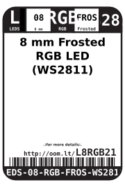
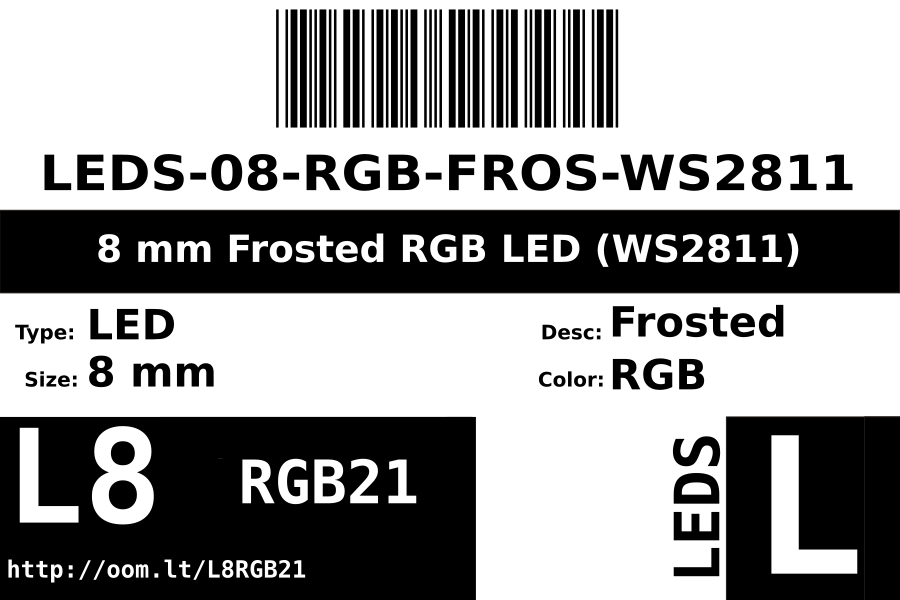
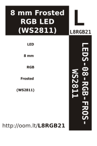

Contents
========

* [LEDS-08-RGB-FROS-WS2811>8 mm Frosted RGB LED (WS2811)](#leds-08-rgb-fros-ws28118-mm-frosted-rgb-led-ws2811)
	* [Datasheets](#datasheets)
	* [Labels](#labels)
	* [EDA](#eda)
		* [Symbols](#symbols)
	* [Tags](#tags)

# LEDS-08-RGB-FROS-WS2811>8 mm Frosted RGB LED (WS2811)

- ID: LEDS-08-RGB-FROS-WS2811
- Name: LEDS-08-RGB-FROS-WS2811

## Datasheets

- Datasheet: [datasheet.pdf](datasheet.pdf)

## Labels
  
  

|Front|Inventory|Specifications|
| :---: | :---: | :---: |
||||

## EDA

### Symbols

## Tags

- oompID: LEDS-08-RGB-FROS-WS2811
- hexID: L8RGB21
- oompSort: 0808RGBWS2811
- oompType: LEDS
- oompSize: 08
- oompColor: RGB
- oompDesc: FROS
- oompIndex: WS2811
- oompVersion: 20
- ooPitch: 2.54 mm
- ooLensColor: Frosted
- oompClass: Through Hole Component
- oompClassCode: THTH
- ooDesignator: D1
