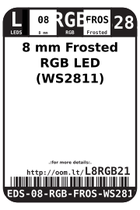

Contents
========

* [L8RGB21 > ](#l8rgb21--)
	* [Datasheets](#datasheets)
	* [Labels](#labels)
	* [EDA](#eda)
	* [Images](#images)
	* [Tags](#tags)

# L8RGB21 > 

- ID: LEDS-08-RGB-FROS-WS2811
- Hex ID: L8RGB21
- Name: 
- Description: 
- Long Link: [http://oom.lt/LEDS-08-RGB-FROS-WS2811](http://oom.lt/LEDS-08-RGB-FROS-WS2811)
- Short Link: [http://oom.lt/L8RGB21](http://oom.lt/L8RGB21)

## Datasheets

- Datasheet: [datasheet.pdf](datasheet.pdf)

## Labels
  
  

|label-front|label-inventory|label-spec|
| :---: | :---: | :---: |
||||

## EDA

### Symbols
  

|[  SYMBOL-kicad-kicad-symbols-Device-LED](https://github.com/oomlout/oomlout_OOMP_eda/tree/main/SYMBOL/kicad/kicad-symbols/Device/LED/)||||
| :---: | :---: | :---: | :---: |

## Images
  
  

|label-front|label-inventory|label-spec|
| :---: | :---: | :---: |
||||

## Tags

- oompID: LEDS-08-RGB-FROS-WS2811
- hexID: L8RGB21
- oompSort: 0808RGBWS2811
- oompType: LEDS
- oompSize: 08
- oompColor: RGB
- oompDesc: FROS
- oompIndex: WS2811
- oompVersion: 20
- ooPitch: 2.54 mm
- ooLensColor: Frosted
- oompClass: Through Hole Component
- oompClassCode: THTH
- ooDesignator: D1
- symbolKicad: SYMBOL-kicad-kicad-symbols-Device-LED
