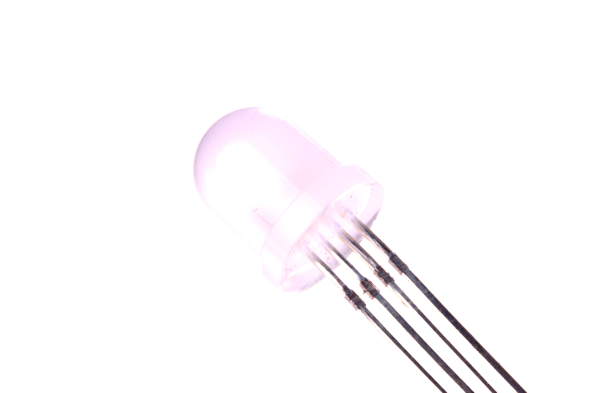

Contents
========

* [LEDS-08-RGB-STAN-CA>8 mm RGB LED Common Anode](#leds-08-rgb-stan-ca8-mm-rgb-led-common-anode)
	* [Images](#images)
	* [Datasheets](#datasheets)
	* [EDA](#eda)
		* [Footprints](#footprints)
		* [Symbols](#symbols)
	* [Tags](#tags)
  
![][im]
# LEDS-08-RGB-STAN-CA>8 mm RGB LED Common Anode

- ID: LEDS-08-RGB-STAN-CA
- Name: LEDS-08-RGB-STAN-CA

## Images
  
  

|Main|Reference|
| :---: | :---: |
|||

## Datasheets

- Datasheet: [datasheet.pdf](datasheet.pdf)

## EDA

### Footprints
  

|||||
| :---: | :---: | :---: | :---: |

### Symbols

## Tags

- index: 380
- oompID: LEDS-08-RGB-STAN-CA
- name: 8 mm RGB LED Common Anode
- hexID: L8RGB
- oompSort: 
- oompClass: Through Hole
- oompClassCode: THTH
- oompType: LEDS
- oompSize: 08
- oompColor: RGB
- oompDesc: STAN
- oompIndex: CA
- oompVersion: 40
- oompSchem: template;LEDS-XXXX-X-XXXX-XX-schem
- ooDesignator: D1

[im]: image_600.jpg
