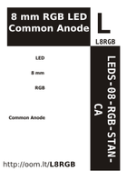

Contents
========

* [L8RGB > 8 mm RGB LED Common Anode](#l8rgb--8-mm-rgb-led-common-anode)
	* [Datasheets](#datasheets)
	* [Labels](#labels)
	* [EDA](#eda)
	* [Images](#images)
	* [Tags](#tags)
  
![][im]
# L8RGB > 8 mm RGB LED Common Anode

- ID: LEDS-08-RGB-STAN-CA
- Hex ID: L8RGB
- Name: 8 mm RGB LED Common Anode
- Description: 8 mm RGB LED Common Anode
- Long Link: [http://oom.lt/LEDS-08-RGB-STAN-CA](http://oom.lt/LEDS-08-RGB-STAN-CA)
- Short Link: [http://oom.lt/L8RGB](http://oom.lt/L8RGB)

## Datasheets

- Datasheet: [datasheet.pdf](datasheet.pdf)

## Labels
  
  

|label-front|label-inventory|label-spec|
| :---: | :---: | :---: |
||||

## EDA

### Symbols

## Images
  
  

|image|image_RE|label-front|label-inventory|label-spec|
| :---: | :---: | :---: | :---: | :---: |
||||||

## Tags

- oompID: LEDS-08-RGB-STAN-CA
- name: 8 mm RGB LED Common Anode
- hexID: L8RGB
- oompSort: 
- oompClass: Through Hole
- oompClassCode: THTH
- oompType: LEDS
- oompSize: 08
- oompColor: RGB
- oompDesc: STAN
- oompIndex: CA
- oompVersion: 40
- oompSchem: template;LEDS-XXXX-X-XXXX-XX-schem
- ooDesignator: D1

[im]: image_450.jpg
