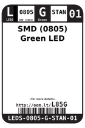
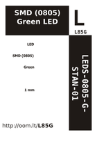
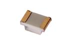

Contents
========

* [L85G > SMD (0805) Green LED](#l85g--smd-0805-green-led)
	* [Datasheets](#datasheets)
	* [Labels](#labels)
	* [EDA](#eda)
	* [Images](#images)
	* [Tags](#tags)
  
![][im]
# L85G > SMD (0805) Green LED

- ID: LEDS-0805-G-STAN-01
- Hex ID: L85G
- Name: SMD (0805) Green LED
- Description: SMD (0805) Green LED
- Long Link: [http://oom.lt/LEDS-0805-G-STAN-01](http://oom.lt/LEDS-0805-G-STAN-01)
- Short Link: [http://oom.lt/L85G](http://oom.lt/L85G)

## Datasheets

- Datasheet: [datasheet.pdf](datasheet.pdf)

## Labels
  
  

|label-front|label-inventory|label-spec|
| :---: | :---: | :---: |
||||

## EDA

### Footprints
  

|  [kicad/FOOTPRINT-kicad-kicad-footprints-Capacitor_SMD-C_0805_2012Metric](https://github.com/oomlout/oomlout_OOMP_eda/tree/main/footprints/kicad/FOOTPRINT-kicad-kicad-footprints-Capacitor_SMD-C_0805_2012Metric/)|  [kicad/FOOTPRINT-kicad-kicad-footprints-Capacitor_SMD-C_0805_2012Metric_Pad1.18x1.45mm_HandSolder](https://github.com/oomlout/oomlout_OOMP_eda/tree/main/footprints/kicad/FOOTPRINT-kicad-kicad-footprints-Capacitor_SMD-C_0805_2012Metric_Pad1.18x1.45mm_HandSolder/)|  [eagle/FOOTPRINT-eagle-Adafruit-Eagle-Library-adafruit-085CS_1W](https://github.com/oomlout/oomlout_OOMP_eda/tree/main/footprints/eagle/FOOTPRINT-eagle-Adafruit-Eagle-Library-adafruit-085CS_1W/)|  [eagle/FOOTPRINT-eagle-Adafruit-Eagle-Library-adafruit-085CS_1R](https://github.com/oomlout/oomlout_OOMP_eda/tree/main/footprints/eagle/FOOTPRINT-eagle-Adafruit-Eagle-Library-adafruit-085CS_1R/)|
| :---: | :---: | :---: | :---: |
|  [eagle/FOOTPRINT-eagle-Adafruit-Eagle-Library-adafruit-085CS_1AW](https://github.com/oomlout/oomlout_OOMP_eda/tree/main/footprints/eagle/FOOTPRINT-eagle-Adafruit-Eagle-Library-adafruit-085CS_1AW/)|  [eagle/FOOTPRINT-eagle-Adafruit-Eagle-Library-adafruit-085CS_1AR](https://github.com/oomlout/oomlout_OOMP_eda/tree/main/footprints/eagle/FOOTPRINT-eagle-Adafruit-Eagle-Library-adafruit-085CS_1AR/)|  [eagle/FOOTPRINT-eagle-Pimoroni-Eagle-Library-pimoroni-rc-0805_SENSE](https://github.com/oomlout/oomlout_OOMP_eda/tree/main/footprints/eagle/FOOTPRINT-eagle-Pimoroni-Eagle-Library-pimoroni-rc-0805_SENSE/)|  [eagle/FOOTPRINT-eagle-Pimoroni-Eagle-Library-pimoroni-rc-0805](https://github.com/oomlout/oomlout_OOMP_eda/tree/main/footprints/eagle/FOOTPRINT-eagle-Pimoroni-Eagle-Library-pimoroni-rc-0805/)|
|||||

### Instances
  
  
Used 91 times.  
Prevalance: (91\10986) 0.8283%  

|OOMP Instances|
| :---: |
|[PROJ-ADAF-1059-STAN-01  Adafruit Flora Ultimate GPS  Used 1 times. LED1](https://github.com/oomlout/oomlout_OOMP_projects/tree/main/PROJ-ADAF-1059-STAN-01/)|
|[PROJ-ADAF-1222-STAN-01  Adafruit Gemma PCB  Used 1 times. PWR](https://github.com/oomlout/oomlout_OOMP_projects/tree/main/PROJ-ADAF-1222-STAN-01/)|
|[PROJ-ADAF-1272-STAN-01  Adafruit GPS Logger Shield PCB  Used 1 times. LED5](https://github.com/oomlout/oomlout_OOMP_projects/tree/main/PROJ-ADAF-1272-STAN-01/)|
|[PROJ-ADAF-1362-STAN-01  Adafruit Standalone Capacitive Sensor PCB  Used 5 times. LED1, LED2, LED3, LED4, LED5](https://github.com/oomlout/oomlout_OOMP_projects/tree/main/PROJ-ADAF-1362-STAN-01/)|
|[PROJ-ADAF-1411-STAN-01  Adafruit 16 channel PWM Servo Shield  Used 1 times. LED2](https://github.com/oomlout/oomlout_OOMP_projects/tree/main/PROJ-ADAF-1411-STAN-01/)|
|[PROJ-ADAF-1429-STAN-01  Adafruit TLC5947 PCB  Used 1 times. LED1](https://github.com/oomlout/oomlout_OOMP_projects/tree/main/PROJ-ADAF-1429-STAN-01/)|
|[PROJ-ADAF-1438-STAN-01  Adafruit Motor Shield V2 PCB  Used 1 times. LED1](https://github.com/oomlout/oomlout_OOMP_projects/tree/main/PROJ-ADAF-1438-STAN-01/)|
|[PROJ-ADAF-1455-STAN-01  Adafruit TLC59711 Breakout PCB  Used 1 times. LED1](https://github.com/oomlout/oomlout_OOMP_projects/tree/main/PROJ-ADAF-1455-STAN-01/)|
|[PROJ-ADAF-1500-STAN-01  Adafruit Trinket PCB  Used 1 times. PWR](https://github.com/oomlout/oomlout_OOMP_projects/tree/main/PROJ-ADAF-1500-STAN-01/)|
|[PROJ-ADAF-1510-STAN-01  Adafruit CC3000 Breakout PCB  Used 1 times. LED1](https://github.com/oomlout/oomlout_OOMP_projects/tree/main/PROJ-ADAF-1510-STAN-01/)|
|[PROJ-ADAF-1535-STAN-01  Adafruit Bluefruit EZ Key PCB  Used 1 times. LED2](https://github.com/oomlout/oomlout_OOMP_projects/tree/main/PROJ-ADAF-1535-STAN-01/)|
|[PROJ-ADAF-1602-STAN-01  Adafruit CAP1188 PCB  Used 8 times. LED1, LED2, LED3, LED4, LED5, LED6, LED7, LED8](https://github.com/oomlout/oomlout_OOMP_projects/tree/main/PROJ-ADAF-1602-STAN-01/)|
|[PROJ-ADAF-1716-STAN-01  Adafruit Qualia Driver PCB  Used 1 times. LED1](https://github.com/oomlout/oomlout_OOMP_projects/tree/main/PROJ-ADAF-1716-STAN-01/)|
|[PROJ-ADAF-1903-STAN-01  Adafruit PowerBoost 500 Basic PCB  Used 1 times. PWR](https://github.com/oomlout/oomlout_OOMP_projects/tree/main/PROJ-ADAF-1903-STAN-01/)|
|[PROJ-ADAF-1904-STAN-01  Adafruit MicroLipo PCB  Used 1 times. LED2](https://github.com/oomlout/oomlout_OOMP_projects/tree/main/PROJ-ADAF-1904-STAN-01/)|
|[PROJ-ADAF-1932-STAN-01  Adafruit RGB Matrix HAT PCB  Used 1 times. D2](https://github.com/oomlout/oomlout_OOMP_projects/tree/main/PROJ-ADAF-1932-STAN-01/)|
|[PROJ-ADAF-1944-STAN-01  Adafruit PowerBoost 500 Charger PCB  Used 1 times. LED4](https://github.com/oomlout/oomlout_OOMP_projects/tree/main/PROJ-ADAF-1944-STAN-01/)|
|[PROJ-ADAF-1963-STAN-01  Adafruit FONA 800 GSM Breakout PCB  Used 2 times. DONE, PWRSTAT](https://github.com/oomlout/oomlout_OOMP_projects/tree/main/PROJ-ADAF-1963-STAN-01/)|
|[PROJ-ADAF-2000-STAN-01  Adafruit Pro Trinket PCBs  Used 1 times. PWR](https://github.com/oomlout/oomlout_OOMP_projects/tree/main/PROJ-ADAF-2000-STAN-01/)|
|[PROJ-ADAF-2030-STAN-01  Adafruit PowerBoost 1000 PCB  Used 1 times. LED2](https://github.com/oomlout/oomlout_OOMP_projects/tree/main/PROJ-ADAF-2030-STAN-01/)|
|[PROJ-ADAF-2078-STAN-01  Adafruit PowerBoost 500 Shield PCB  Used 1 times. LED2](https://github.com/oomlout/oomlout_OOMP_projects/tree/main/PROJ-ADAF-2078-STAN-01/)|
|[PROJ-ADAF-2107-STAN-01  Adafruit USB Isolator PCB  Used 1 times. D1](https://github.com/oomlout/oomlout_OOMP_projects/tree/main/PROJ-ADAF-2107-STAN-01/)|
|[PROJ-ADAF-2133-STAN-01  Adafruit Audio FX Sound Board PCBs  Used 1 times. LED4](https://github.com/oomlout/oomlout_OOMP_projects/tree/main/PROJ-ADAF-2133-STAN-01/)|
|[PROJ-ADAF-2190-STAN-01  Adafruit Verter PCB  Used 1 times. D1](https://github.com/oomlout/oomlout_OOMP_projects/tree/main/PROJ-ADAF-2190-STAN-01/)|
|[PROJ-ADAF-2200-STAN-01  Adafruit LM4040 Voltage Reference PCB  Used 1 times. D1](https://github.com/oomlout/oomlout_OOMP_projects/tree/main/PROJ-ADAF-2200-STAN-01/)|
|[PROJ-ADAF-2218-STAN-01  Adafruit TFP401 HDMI To 40Pin TFT PCB  Used 1 times. LED2](https://github.com/oomlout/oomlout_OOMP_projects/tree/main/PROJ-ADAF-2218-STAN-01/)|
|[PROJ-ADAF-2260-STAN-01  Adafruit 5 HDMI Backpack PCB  Used 1 times. LED2](https://github.com/oomlout/oomlout_OOMP_projects/tree/main/PROJ-ADAF-2260-STAN-01/)|
|[PROJ-ADAF-2264-STAN-01  Adafruit FT232H Breakout PCB  Used 1 times. LED1](https://github.com/oomlout/oomlout_OOMP_projects/tree/main/PROJ-ADAF-2264-STAN-01/)|
|[PROJ-ADAF-2267-STAN-01  Adafruit Bluefruit LE USB Friend and Sniffer PCB  Used 1 times. LED2](https://github.com/oomlout/oomlout_OOMP_projects/tree/main/PROJ-ADAF-2267-STAN-01/)|
|[PROJ-ADAF-2348-STAN-01  Adafruit DC Stepper Motor HAT PCB  Used 1 times. LED1](https://github.com/oomlout/oomlout_OOMP_projects/tree/main/PROJ-ADAF-2348-STAN-01/)|
|[PROJ-ADAF-2406-STAN-01  Adafruit 7 HDMI Backpack PCB  Used 1 times. LED2](https://github.com/oomlout/oomlout_OOMP_projects/tree/main/PROJ-ADAF-2406-STAN-01/)|
|[PROJ-ADAF-2465-STAN-01  Adafruit PowerBoost 1000C  Used 1 times. DONE](https://github.com/oomlout/oomlout_OOMP_projects/tree/main/PROJ-ADAF-2465-STAN-01/)|
|[PROJ-ADAF-2466-STAN-01  Adafruit METRO 328 PCB  Used 1 times. ON](https://github.com/oomlout/oomlout_OOMP_projects/tree/main/PROJ-ADAF-2466-STAN-01/)|
|[PROJ-ADAF-2468-STAN-01  Adafruit FONA 800 Shield PCB  Used 2 times. DONE, PWRSTAT](https://github.com/oomlout/oomlout_OOMP_projects/tree/main/PROJ-ADAF-2468-STAN-01/)|
|[PROJ-ADAF-2479-STAN-01  Adafruit Bluefruit LE UART Friend PCB  Used 1 times. D2](https://github.com/oomlout/oomlout_OOMP_projects/tree/main/PROJ-ADAF-2479-STAN-01/)|
|[PROJ-ADAF-2542-STAN-01  Adafruit FONA 808 Breakout PCB  Used 1 times. DONE](https://github.com/oomlout/oomlout_OOMP_projects/tree/main/PROJ-ADAF-2542-STAN-01/)|
|[PROJ-ADAF-259-STAN-01  Adafruit_MCP73833_PCB  Used 1 times. LED2](https://github.com/oomlout/oomlout_OOMP_projects/tree/main/PROJ-ADAF-259-STAN-01/)|
|[PROJ-ADAF-2636-STAN-01  Adafruit FONA808 Shield PCB  Used 2 times. DONE, PWRSTAT](https://github.com/oomlout/oomlout_OOMP_projects/tree/main/PROJ-ADAF-2636-STAN-01/)|
|[PROJ-ADAF-2661-STAN-01  Adafruit Bluefruit LE Micro PCB  Used 1 times. PWR](https://github.com/oomlout/oomlout_OOMP_projects/tree/main/PROJ-ADAF-2661-STAN-01/)|
|[PROJ-ADAF-2795-STAN-01  Adafruit Feather 32u4 Adalogger PCB  Used 1 times. L1](https://github.com/oomlout/oomlout_OOMP_projects/tree/main/PROJ-ADAF-2795-STAN-01/)|
|[PROJ-ADAF-2796-STAN-01  Adafruit Feather M0 Adalogger PCB  Used 1 times. L1](https://github.com/oomlout/oomlout_OOMP_projects/tree/main/PROJ-ADAF-2796-STAN-01/)|
|[PROJ-ADAF-280-STAN-01  Adafruit USB DC LiPoly Charger  Used 1 times. PG](https://github.com/oomlout/oomlout_OOMP_projects/tree/main/PROJ-ADAF-280-STAN-01/)|
|[PROJ-ADAF-284-STAN-01  Adafruit_FTDI Friend PCB  Used 1 times. RX](https://github.com/oomlout/oomlout_OOMP_projects/tree/main/PROJ-ADAF-284-STAN-01/)|
|[PROJ-ADAF-2927-STAN-01  Adafruit DC Stepper Motor FeatherWing PCB  Used 1 times. LED1](https://github.com/oomlout/oomlout_OOMP_projects/tree/main/PROJ-ADAF-2927-STAN-01/)|
|[PROJ-ADAF-2928-STAN-01  Adafruit PWM Servo FeatherWing PCB  Used 1 times. LED1](https://github.com/oomlout/oomlout_OOMP_projects/tree/main/PROJ-ADAF-2928-STAN-01/)|
|[PROJ-ADAF-2999-STAN-01  Adafruit ATWINC1500 WiFi Breakout PCB  Used 1 times. D1](https://github.com/oomlout/oomlout_OOMP_projects/tree/main/PROJ-ADAF-2999-STAN-01/)|
|[PROJ-ADAF-3000-STAN-01  Adafruit Circuit Playground PCB  Used 1 times. PWR](https://github.com/oomlout/oomlout_OOMP_projects/tree/main/PROJ-ADAF-3000-STAN-01/)|
|[PROJ-ADAF-3027-STAN-01  Adafruit Feather 32u4 FONA PCB  Used 1 times. PWRSTAT](https://github.com/oomlout/oomlout_OOMP_projects/tree/main/PROJ-ADAF-3027-STAN-01/)|
|[PROJ-ADAF-3211-STAN-01  Adafruit RGB Matrix Bonnet PCB  Used 1 times. D2](https://github.com/oomlout/oomlout_OOMP_projects/tree/main/PROJ-ADAF-3211-STAN-01/)|
|[PROJ-ADAF-3305-STAN-01  Adafruit 50pin to 40pin TFT with AR1100 Adapter PCB  Used 1 times. LED1](https://github.com/oomlout/oomlout_OOMP_projects/tree/main/PROJ-ADAF-3305-STAN-01/)|
|[PROJ-ADAF-3309-STAN-01  Adafruit CP2104 Friend PCB  Used 1 times. D2](https://github.com/oomlout/oomlout_OOMP_projects/tree/main/PROJ-ADAF-3309-STAN-01/)|
|[PROJ-ADAF-3333-STAN-01  Adafruit Circuit Playground Express PCB  Used 1 times. PWR](https://github.com/oomlout/oomlout_OOMP_projects/tree/main/PROJ-ADAF-3333-STAN-01/)|
|[PROJ-ADAF-3382-STAN-01  Adafruit Metro M4 Express PCB  Used 1 times. ON](https://github.com/oomlout/oomlout_OOMP_projects/tree/main/PROJ-ADAF-3382-STAN-01/)|
|[PROJ-ADAF-3435-STAN-01  Adafruit TPL5110 Power Timer Breakout PCB  Used 1 times. D1](https://github.com/oomlout/oomlout_OOMP_projects/tree/main/PROJ-ADAF-3435-STAN-01/)|
|[PROJ-ADAF-3505-STAN-01  Adafruit Metro M0 Express PCB  Used 1 times. ON](https://github.com/oomlout/oomlout_OOMP_projects/tree/main/PROJ-ADAF-3505-STAN-01/)|
|[PROJ-ADAF-3573-STAN-01  Adafruit TPL5111 Reset Enable Timer PCB  Used 1 times. D1](https://github.com/oomlout/oomlout_OOMP_projects/tree/main/PROJ-ADAF-3573-STAN-01/)|
|[PROJ-ADAF-364-STAN-01  Adafruit PN532 RFID NFC Breakout  Used 1 times. LED1](https://github.com/oomlout/oomlout_OOMP_projects/tree/main/PROJ-ADAF-364-STAN-01/)|
|[PROJ-ADAF-3657-STAN-01  Adafruit SAMD09 Breakout PCB  Used 1 times. D2](https://github.com/oomlout/oomlout_OOMP_projects/tree/main/PROJ-ADAF-3657-STAN-01/)|
|[PROJ-ADAF-3779-STAN-01  Adafruit AS7262 Breakout PCB  Used 1 times. D2](https://github.com/oomlout/oomlout_OOMP_projects/tree/main/PROJ-ADAF-3779-STAN-01/)|
|[PROJ-ADAF-390-STAN-01  USB DC Solar Lithium Ion Polymer charger  Used 1 times. DONE](https://github.com/oomlout/oomlout_OOMP_projects/tree/main/PROJ-ADAF-390-STAN-01/)|
|[PROJ-ADAF-4000-STAN-01  Adafruit Metro M4 Express AirLift PCB  Used 1 times. ON](https://github.com/oomlout/oomlout_OOMP_projects/tree/main/PROJ-ADAF-4000-STAN-01/)|
|[PROJ-ADAF-4064-STAN-01  Adafruit Grand Central PCB  Used 1 times. ON](https://github.com/oomlout/oomlout_OOMP_projects/tree/main/PROJ-ADAF-4064-STAN-01/)|
|[PROJ-ADAF-4686-STAN-01  Adafruit TMP235 PCB  Used 1 times. D2](https://github.com/oomlout/oomlout_OOMP_projects/tree/main/PROJ-ADAF-4686-STAN-01/)|
|[PROJ-ADAF-4745-STAN-01  Adafruit MatrixPortal M4 PCB  Used 2 times. 3VON, 5VON](https://github.com/oomlout/oomlout_OOMP_projects/tree/main/PROJ-ADAF-4745-STAN-01/)|
|[PROJ-ADAF-659-STAN-01  Adafruit Flora Mainboard  Used 1 times. PWR](https://github.com/oomlout/oomlout_OOMP_projects/tree/main/PROJ-ADAF-659-STAN-01/)|
|[PROJ-ADAF-789-STAN-01  Adafruit PN532 RFID NFC Shield  Used 2 times. LED1, LED2](https://github.com/oomlout/oomlout_OOMP_projects/tree/main/PROJ-ADAF-789-STAN-01/)|
|[PROJ-ADAF-815-STAN-01  Adafruit 16 Channel PWM Servo Driver PCB  Used 1 times. LED1](https://github.com/oomlout/oomlout_OOMP_projects/tree/main/PROJ-ADAF-815-STAN-01/)|
|[PROJ-ADAF-91-STAN-01  Adafruit_USB_Boarduino_PCB  Used 4 times. D1, D2, RX, TX](https://github.com/oomlout/oomlout_OOMP_projects/tree/main/PROJ-ADAF-91-STAN-01/)|
|[PROJ-ARDU-LEO-STAN-01  Arduino Leonardo  Used 1 times. ON](https://github.com/oomlout/oomlout_OOMP_projects/tree/main/PROJ-ARDU-LEO-STAN-01/)|
|[PROJ-ARDU-MICRO-STAN-01  Arduino Micro  Used 1 times. L](https://github.com/oomlout/oomlout_OOMP_projects/tree/main/PROJ-ARDU-MICRO-STAN-01/)|
|[PROJ-ARDU-UNO-REV3-01  Arduino Rev3 Uno  Used 1 times. ON](https://github.com/oomlout/oomlout_OOMP_projects/tree/main/PROJ-ARDU-UNO-REV3-01/)|
|[PROJ-ARDU-UNO-REV3-SM  Arduino Rev3 Uno (SMD)  Used 1 times. ON](https://github.com/oomlout/oomlout_OOMP_projects/tree/main/PROJ-ARDU-UNO-REV3-SM/)|

### Symbols

## Images
  
  

|image|image_BOTTOM|label-front|label-inventory|label-spec|
| :---: | :---: | :---: | :---: | :---: |
||||||

## Tags

- oompID: LEDS-0805-G-STAN-01
- name: SMD (0805) Green LED
- hexID: L85G
- oompSort: 0805G
- oompType: LEDS
- oompSize: 0805
- oompColor: G
- oompDesc: STAN
- oompIndex: 01
- oompVersion: 99
- oompSkip: true
- ooWidth: 2 mm
- ooHeight: 0.8 mm
- ooLength: 1.25 mm
- ooNumPins: 2
- ooLensColor: 
- ooForwardVoltage: 2.4 v
- ooForwardCurrent: 25 mA
- ooIntensity: 
- ooPowerAngle: 
- ooWavelength: 
- oompClass: Surface Mount
- oompClassCode: SMDS
- oompBbls: template;XXXX-0805-X-XXXX-XX-bbls
- oompDiag: template;XXXX-0805-X-XXXX-XX-diag
- oompIden: template;XXXX-0805-X-XXXX-XX-iden
- oompSchem: template;LEDS-XXXX-X-XXXX-XX-schem
- oompSimp: template;XXXX-0805-X-XXXX-XX-simp
- ooDesignator: D1
- oompInstances: {'PROJECT': 'PROJ-ADAF-1059-STAN-01', 'ID': 'LED1'}
- oompInstances: {'PROJECT': 'PROJ-ADAF-1222-STAN-01', 'ID': 'PWR'}
- oompInstances: {'PROJECT': 'PROJ-ADAF-1272-STAN-01', 'ID': 'LED5'}
- oompInstances: {'PROJECT': 'PROJ-ADAF-1362-STAN-01', 'ID': 'LED1'}
- oompInstances: {'PROJECT': 'PROJ-ADAF-1362-STAN-01', 'ID': 'LED2'}
- oompInstances: {'PROJECT': 'PROJ-ADAF-1362-STAN-01', 'ID': 'LED3'}
- oompInstances: {'PROJECT': 'PROJ-ADAF-1362-STAN-01', 'ID': 'LED4'}
- oompInstances: {'PROJECT': 'PROJ-ADAF-1362-STAN-01', 'ID': 'LED5'}
- oompInstances: {'PROJECT': 'PROJ-ADAF-1411-STAN-01', 'ID': 'LED2'}
- oompInstances: {'PROJECT': 'PROJ-ADAF-1429-STAN-01', 'ID': 'LED1'}
- oompInstances: {'PROJECT': 'PROJ-ADAF-1438-STAN-01', 'ID': 'LED1'}
- oompInstances: {'PROJECT': 'PROJ-ADAF-1455-STAN-01', 'ID': 'LED1'}
- oompInstances: {'PROJECT': 'PROJ-ADAF-1500-STAN-01', 'ID': 'PWR'}
- oompInstances: {'PROJECT': 'PROJ-ADAF-1510-STAN-01', 'ID': 'LED1'}
- oompInstances: {'PROJECT': 'PROJ-ADAF-1535-STAN-01', 'ID': 'LED2'}
- oompInstances: {'PROJECT': 'PROJ-ADAF-1602-STAN-01', 'ID': 'LED1'}
- oompInstances: {'PROJECT': 'PROJ-ADAF-1602-STAN-01', 'ID': 'LED2'}
- oompInstances: {'PROJECT': 'PROJ-ADAF-1602-STAN-01', 'ID': 'LED3'}
- oompInstances: {'PROJECT': 'PROJ-ADAF-1602-STAN-01', 'ID': 'LED4'}
- oompInstances: {'PROJECT': 'PROJ-ADAF-1602-STAN-01', 'ID': 'LED5'}
- oompInstances: {'PROJECT': 'PROJ-ADAF-1602-STAN-01', 'ID': 'LED6'}
- oompInstances: {'PROJECT': 'PROJ-ADAF-1602-STAN-01', 'ID': 'LED7'}
- oompInstances: {'PROJECT': 'PROJ-ADAF-1602-STAN-01', 'ID': 'LED8'}
- oompInstances: {'PROJECT': 'PROJ-ADAF-1716-STAN-01', 'ID': 'LED1'}
- oompInstances: {'PROJECT': 'PROJ-ADAF-1903-STAN-01', 'ID': 'PWR'}
- oompInstances: {'PROJECT': 'PROJ-ADAF-1904-STAN-01', 'ID': 'LED2'}
- oompInstances: {'PROJECT': 'PROJ-ADAF-1932-STAN-01', 'ID': 'D2'}
- oompInstances: {'PROJECT': 'PROJ-ADAF-1944-STAN-01', 'ID': 'LED4'}
- oompInstances: {'PROJECT': 'PROJ-ADAF-1963-STAN-01', 'ID': 'DONE'}
- oompInstances: {'PROJECT': 'PROJ-ADAF-1963-STAN-01', 'ID': 'PWRSTAT'}
- oompInstances: {'PROJECT': 'PROJ-ADAF-2000-STAN-01', 'ID': 'PWR'}
- oompInstances: {'PROJECT': 'PROJ-ADAF-2030-STAN-01', 'ID': 'LED2'}
- oompInstances: {'PROJECT': 'PROJ-ADAF-2078-STAN-01', 'ID': 'LED2'}
- oompInstances: {'PROJECT': 'PROJ-ADAF-2107-STAN-01', 'ID': 'D1'}
- oompInstances: {'PROJECT': 'PROJ-ADAF-2133-STAN-01', 'ID': 'LED4'}
- oompInstances: {'PROJECT': 'PROJ-ADAF-2190-STAN-01', 'ID': 'D1'}
- oompInstances: {'PROJECT': 'PROJ-ADAF-2200-STAN-01', 'ID': 'D1'}
- oompInstances: {'PROJECT': 'PROJ-ADAF-2218-STAN-01', 'ID': 'LED2'}
- oompInstances: {'PROJECT': 'PROJ-ADAF-2260-STAN-01', 'ID': 'LED2'}
- oompInstances: {'PROJECT': 'PROJ-ADAF-2264-STAN-01', 'ID': 'LED1'}
- oompInstances: {'PROJECT': 'PROJ-ADAF-2267-STAN-01', 'ID': 'LED2'}
- oompInstances: {'PROJECT': 'PROJ-ADAF-2348-STAN-01', 'ID': 'LED1'}
- oompInstances: {'PROJECT': 'PROJ-ADAF-2406-STAN-01', 'ID': 'LED2'}
- oompInstances: {'PROJECT': 'PROJ-ADAF-2465-STAN-01', 'ID': 'DONE'}
- oompInstances: {'PROJECT': 'PROJ-ADAF-2466-STAN-01', 'ID': 'ON'}
- oompInstances: {'PROJECT': 'PROJ-ADAF-2468-STAN-01', 'ID': 'DONE'}
- oompInstances: {'PROJECT': 'PROJ-ADAF-2468-STAN-01', 'ID': 'PWRSTAT'}
- oompInstances: {'PROJECT': 'PROJ-ADAF-2479-STAN-01', 'ID': 'D2'}
- oompInstances: {'PROJECT': 'PROJ-ADAF-2542-STAN-01', 'ID': 'DONE'}
- oompInstances: {'PROJECT': 'PROJ-ADAF-259-STAN-01', 'ID': 'LED2'}
- oompInstances: {'PROJECT': 'PROJ-ADAF-2636-STAN-01', 'ID': 'DONE'}
- oompInstances: {'PROJECT': 'PROJ-ADAF-2636-STAN-01', 'ID': 'PWRSTAT'}
- oompInstances: {'PROJECT': 'PROJ-ADAF-2661-STAN-01', 'ID': 'PWR'}
- oompInstances: {'PROJECT': 'PROJ-ADAF-2795-STAN-01', 'ID': 'L1'}
- oompInstances: {'PROJECT': 'PROJ-ADAF-2796-STAN-01', 'ID': 'L1'}
- oompInstances: {'PROJECT': 'PROJ-ADAF-280-STAN-01', 'ID': 'PG'}
- oompInstances: {'PROJECT': 'PROJ-ADAF-284-STAN-01', 'ID': 'RX'}
- oompInstances: {'PROJECT': 'PROJ-ADAF-2927-STAN-01', 'ID': 'LED1'}
- oompInstances: {'PROJECT': 'PROJ-ADAF-2928-STAN-01', 'ID': 'LED1'}
- oompInstances: {'PROJECT': 'PROJ-ADAF-2999-STAN-01', 'ID': 'D1'}
- oompInstances: {'PROJECT': 'PROJ-ADAF-3000-STAN-01', 'ID': 'PWR'}
- oompInstances: {'PROJECT': 'PROJ-ADAF-3027-STAN-01', 'ID': 'PWRSTAT'}
- oompInstances: {'PROJECT': 'PROJ-ADAF-3211-STAN-01', 'ID': 'D2'}
- oompInstances: {'PROJECT': 'PROJ-ADAF-3305-STAN-01', 'ID': 'LED1'}
- oompInstances: {'PROJECT': 'PROJ-ADAF-3309-STAN-01', 'ID': 'D2'}
- oompInstances: {'PROJECT': 'PROJ-ADAF-3333-STAN-01', 'ID': 'PWR'}
- oompInstances: {'PROJECT': 'PROJ-ADAF-3382-STAN-01', 'ID': 'ON'}
- oompInstances: {'PROJECT': 'PROJ-ADAF-3435-STAN-01', 'ID': 'D1'}
- oompInstances: {'PROJECT': 'PROJ-ADAF-3505-STAN-01', 'ID': 'ON'}
- oompInstances: {'PROJECT': 'PROJ-ADAF-3573-STAN-01', 'ID': 'D1'}
- oompInstances: {'PROJECT': 'PROJ-ADAF-364-STAN-01', 'ID': 'LED1'}
- oompInstances: {'PROJECT': 'PROJ-ADAF-3657-STAN-01', 'ID': 'D2'}
- oompInstances: {'PROJECT': 'PROJ-ADAF-3779-STAN-01', 'ID': 'D2'}
- oompInstances: {'PROJECT': 'PROJ-ADAF-390-STAN-01', 'ID': 'DONE'}
- oompInstances: {'PROJECT': 'PROJ-ADAF-4000-STAN-01', 'ID': 'ON'}
- oompInstances: {'PROJECT': 'PROJ-ADAF-4064-STAN-01', 'ID': 'ON'}
- oompInstances: {'PROJECT': 'PROJ-ADAF-4686-STAN-01', 'ID': 'D2'}
- oompInstances: {'PROJECT': 'PROJ-ADAF-4745-STAN-01', 'ID': '3VON'}
- oompInstances: {'PROJECT': 'PROJ-ADAF-4745-STAN-01', 'ID': '5VON'}
- oompInstances: {'PROJECT': 'PROJ-ADAF-659-STAN-01', 'ID': 'PWR'}
- oompInstances: {'PROJECT': 'PROJ-ADAF-789-STAN-01', 'ID': 'LED1'}
- oompInstances: {'PROJECT': 'PROJ-ADAF-789-STAN-01', 'ID': 'LED2'}
- oompInstances: {'PROJECT': 'PROJ-ADAF-815-STAN-01', 'ID': 'LED1'}
- oompInstances: {'PROJECT': 'PROJ-ADAF-91-STAN-01', 'ID': 'D1'}
- oompInstances: {'PROJECT': 'PROJ-ADAF-91-STAN-01', 'ID': 'D2'}
- oompInstances: {'PROJECT': 'PROJ-ADAF-91-STAN-01', 'ID': 'RX'}
- oompInstances: {'PROJECT': 'PROJ-ADAF-91-STAN-01', 'ID': 'TX'}
- oompInstances: {'PROJECT': 'PROJ-ARDU-LEO-STAN-01', 'ID': 'ON'}
- oompInstances: {'PROJECT': 'PROJ-ARDU-MICRO-STAN-01', 'ID': 'L'}
- oompInstances: {'PROJECT': 'PROJ-ARDU-UNO-REV3-01', 'ID': 'ON'}
- oompInstances: {'PROJECT': 'PROJ-ARDU-UNO-REV3-SM', 'ID': 'ON'}
- footprintEagle: FOOTPRINT-eagle-Adafruit-Eagle-Library-adafruit-085CS_1W
- footprintEagle: FOOTPRINT-eagle-Adafruit-Eagle-Library-adafruit-085CS_1R
- footprintEagle: FOOTPRINT-eagle-Adafruit-Eagle-Library-adafruit-085CS_1AW
- footprintEagle: FOOTPRINT-eagle-Adafruit-Eagle-Library-adafruit-085CS_1AR
- footprintEagle: FOOTPRINT-eagle-Pimoroni-Eagle-Library-pimoroni-rc-0805_SENSE
- footprintEagle: FOOTPRINT-eagle-Pimoroni-Eagle-Library-pimoroni-rc-0805
- footprintKicad: FOOTPRINT-kicad-kicad-footprints-Capacitor_SMD-C_0805_2012Metric
- footprintKicad: FOOTPRINT-kicad-kicad-footprints-Capacitor_SMD-C_0805_2012Metric_Pad1.18x1.45mm_HandSolder

[im]: image_450.jpg
