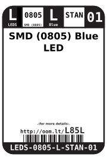
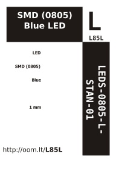

Contents
========

* [LEDS-0805-L-STAN-01>SMD (0805) Blue LED](#leds-0805-l-stan-01smd-0805-blue-led)
	* [Datasheets](#datasheets)
	* [Labels](#labels)
	* [EDA](#eda)
		* [Symbols](#symbols)
	* [Tags](#tags)

# LEDS-0805-L-STAN-01>SMD (0805) Blue LED

- ID: LEDS-0805-L-STAN-01
- Name: LEDS-0805-L-STAN-01

## Datasheets

- Datasheet: [datasheet.pdf](datasheet.pdf)

## Labels
  
  

|Front|Inventory|Specifications|
| :---: | :---: | :---: |
||||

## EDA

### Symbols

## Tags

- hexID: L85L
- oompSort: LEDS0805STAN
- oompType: LEDS
- oompSize: 0805
- oompColor: L
- oompDesc: STAN
- oompIndex: 01
- oompVersion: 98
- ooWidth: 1.25 mm
- ooLength: 2.0 mm
- ooNumPins: 2
- ooDesignator: D1
