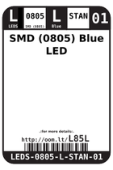
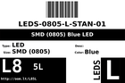

Contents
========

* [L85L > SMD (0805) Blue LED](#l85l--smd-0805-blue-led)
	* [Datasheets](#datasheets)
	* [Labels](#labels)
	* [EDA](#eda)
	* [Images](#images)
	* [Tags](#tags)

# L85L > SMD (0805) Blue LED

- ID: LEDS-0805-L-STAN-01
- Hex ID: L85L
- Name: SMD (0805) Blue LED
- Description: SMD (0805) Blue LED
- Long Link: [http://oom.lt/LEDS-0805-L-STAN-01](http://oom.lt/LEDS-0805-L-STAN-01)
- Short Link: [http://oom.lt/L85L](http://oom.lt/L85L)

## Datasheets

- Datasheet: [datasheet.pdf](datasheet.pdf)

## Labels
  
  

|label-front|label-inventory|label-spec|
| :---: | :---: | :---: |
||||

## EDA

### Footprints
  

|  [kicad/FOOTPRINT-kicad-kicad-footprints-Capacitor_SMD-C_0805_2012Metric](https://github.com/oomlout/oomlout_OOMP_eda/tree/main/footprints/kicad/FOOTPRINT-kicad-kicad-footprints-Capacitor_SMD-C_0805_2012Metric/)|  [kicad/FOOTPRINT-kicad-kicad-footprints-Capacitor_SMD-C_0805_2012Metric_Pad1.18x1.45mm_HandSolder](https://github.com/oomlout/oomlout_OOMP_eda/tree/main/footprints/kicad/FOOTPRINT-kicad-kicad-footprints-Capacitor_SMD-C_0805_2012Metric_Pad1.18x1.45mm_HandSolder/)|  [eagle/FOOTPRINT-eagle-Adafruit-Eagle-Library-adafruit-085CS_1W](https://github.com/oomlout/oomlout_OOMP_eda/tree/main/footprints/eagle/FOOTPRINT-eagle-Adafruit-Eagle-Library-adafruit-085CS_1W/)|  [eagle/FOOTPRINT-eagle-Adafruit-Eagle-Library-adafruit-085CS_1R](https://github.com/oomlout/oomlout_OOMP_eda/tree/main/footprints/eagle/FOOTPRINT-eagle-Adafruit-Eagle-Library-adafruit-085CS_1R/)|
| :---: | :---: | :---: | :---: |
|  [eagle/FOOTPRINT-eagle-Adafruit-Eagle-Library-adafruit-085CS_1AW](https://github.com/oomlout/oomlout_OOMP_eda/tree/main/footprints/eagle/FOOTPRINT-eagle-Adafruit-Eagle-Library-adafruit-085CS_1AW/)|  [eagle/FOOTPRINT-eagle-Adafruit-Eagle-Library-adafruit-085CS_1AR](https://github.com/oomlout/oomlout_OOMP_eda/tree/main/footprints/eagle/FOOTPRINT-eagle-Adafruit-Eagle-Library-adafruit-085CS_1AR/)|  [eagle/FOOTPRINT-eagle-Pimoroni-Eagle-Library-pimoroni-rc-0805_SENSE](https://github.com/oomlout/oomlout_OOMP_eda/tree/main/footprints/eagle/FOOTPRINT-eagle-Pimoroni-Eagle-Library-pimoroni-rc-0805_SENSE/)|  [eagle/FOOTPRINT-eagle-Pimoroni-Eagle-Library-pimoroni-rc-0805](https://github.com/oomlout/oomlout_OOMP_eda/tree/main/footprints/eagle/FOOTPRINT-eagle-Pimoroni-Eagle-Library-pimoroni-rc-0805/)|
|||||

### Instances
  
  
Used 23 times.  
Prevalance: (23\10986) 0.2094%  

|OOMP Instances|
| :---: |
|[PROJ-ADAF-1588-STAN-01  Adafruit Bluefruit Classic PCBs  Used 2 times. LED3, LED4](https://github.com/oomlout/oomlout_OOMP_projects/tree/main/PROJ-ADAF-1588-STAN-01/)|
|[PROJ-ADAF-1628-STAN-01  Adafruit Bluefruit EZ Link Shield PCB  Used 2 times. LED3, LED4](https://github.com/oomlout/oomlout_OOMP_projects/tree/main/PROJ-ADAF-1628-STAN-01/)|
|[PROJ-ADAF-1944-STAN-01  Adafruit PowerBoost 500 Charger PCB  Used 1 times. PWR](https://github.com/oomlout/oomlout_OOMP_projects/tree/main/PROJ-ADAF-1944-STAN-01/)|
|[PROJ-ADAF-1963-STAN-01  Adafruit FONA 800 GSM Breakout PCB  Used 1 times. NETSTAT](https://github.com/oomlout/oomlout_OOMP_projects/tree/main/PROJ-ADAF-1963-STAN-01/)|
|[PROJ-ADAF-2078-STAN-01  Adafruit PowerBoost 500 Shield PCB  Used 1 times. LED3](https://github.com/oomlout/oomlout_OOMP_projects/tree/main/PROJ-ADAF-2078-STAN-01/)|
|[PROJ-ADAF-2218-STAN-01  Adafruit TFP401 HDMI To 40Pin TFT PCB  Used 1 times. LED3](https://github.com/oomlout/oomlout_OOMP_projects/tree/main/PROJ-ADAF-2218-STAN-01/)|
|[PROJ-ADAF-2260-STAN-01  Adafruit 5 HDMI Backpack PCB  Used 1 times. LED3](https://github.com/oomlout/oomlout_OOMP_projects/tree/main/PROJ-ADAF-2260-STAN-01/)|
|[PROJ-ADAF-2267-STAN-01  Adafruit Bluefruit LE USB Friend and Sniffer PCB  Used 1 times. LED4](https://github.com/oomlout/oomlout_OOMP_projects/tree/main/PROJ-ADAF-2267-STAN-01/)|
|[PROJ-ADAF-2406-STAN-01  Adafruit 7 HDMI Backpack PCB  Used 1 times. LED3](https://github.com/oomlout/oomlout_OOMP_projects/tree/main/PROJ-ADAF-2406-STAN-01/)|
|[PROJ-ADAF-2465-STAN-01  Adafruit PowerBoost 1000C  Used 1 times. LED2](https://github.com/oomlout/oomlout_OOMP_projects/tree/main/PROJ-ADAF-2465-STAN-01/)|
|[PROJ-ADAF-2468-STAN-01  Adafruit FONA 800 Shield PCB  Used 1 times. NETSTAT](https://github.com/oomlout/oomlout_OOMP_projects/tree/main/PROJ-ADAF-2468-STAN-01/)|
|[PROJ-ADAF-2487-STAN-01  Adafruit Flora Bluefruit LE PCB  Used 1 times. D2](https://github.com/oomlout/oomlout_OOMP_projects/tree/main/PROJ-ADAF-2487-STAN-01/)|
|[PROJ-ADAF-2542-STAN-01  Adafruit FONA 808 Breakout PCB  Used 1 times. PWRSTAT](https://github.com/oomlout/oomlout_OOMP_projects/tree/main/PROJ-ADAF-2542-STAN-01/)|
|[PROJ-ADAF-2633-STAN-01  Adafruit Bluefruit LE SPI Friend PCB  Used 1 times. D2](https://github.com/oomlout/oomlout_OOMP_projects/tree/main/PROJ-ADAF-2633-STAN-01/)|
|[PROJ-ADAF-2636-STAN-01  Adafruit FONA808 Shield PCB  Used 1 times. NETSTAT](https://github.com/oomlout/oomlout_OOMP_projects/tree/main/PROJ-ADAF-2636-STAN-01/)|
|[PROJ-ADAF-2661-STAN-01  Adafruit Bluefruit LE Micro PCB  Used 1 times. D2](https://github.com/oomlout/oomlout_OOMP_projects/tree/main/PROJ-ADAF-2661-STAN-01/)|
|[PROJ-ADAF-2746-STAN-01  Adafruit Bluefruit LE Shield PCB  Used 1 times. D2](https://github.com/oomlout/oomlout_OOMP_projects/tree/main/PROJ-ADAF-2746-STAN-01/)|
|[PROJ-ADAF-2829-STAN-01  Adafruit Feather 32u4 Bluefruit LE PCB  Used 1 times. D2](https://github.com/oomlout/oomlout_OOMP_projects/tree/main/PROJ-ADAF-2829-STAN-01/)|
|[PROJ-ADAF-2995-STAN-01  Adafruit Feather M0 Bluefruit LE PCB  Used 1 times. D3](https://github.com/oomlout/oomlout_OOMP_projects/tree/main/PROJ-ADAF-2995-STAN-01/)|
|[PROJ-ADAF-3027-STAN-01  Adafruit Feather 32u4 FONA PCB  Used 1 times. NETSTAT](https://github.com/oomlout/oomlout_OOMP_projects/tree/main/PROJ-ADAF-3027-STAN-01/)|
|[PROJ-ARDU-MICRO-STAN-01  Arduino Micro  Used 1 times. ON](https://github.com/oomlout/oomlout_OOMP_projects/tree/main/PROJ-ARDU-MICRO-STAN-01/)|

### Symbols

## Images
  
  

|label-front|label-inventory|label-spec|
| :---: | :---: | :---: |
||||

## Tags

- oompID: LEDS-0805-L-STAN-01
- name: SMD (0805) Blue LED
- hexID: L85L
- oompSort: LEDS0805STAN
- oompType: LEDS
- oompSize: 0805
- oompColor: L
- oompDesc: STAN
- oompIndex: 01
- oompVersion: 98
- ooWidth: 1.25 mm
- ooLength: 2.0 mm
- ooNumPins: 2
- ooDesignator: D1
- oompInstances: {'PROJECT': 'PROJ-ADAF-1588-STAN-01', 'ID': 'LED3'}
- oompInstances: {'PROJECT': 'PROJ-ADAF-1588-STAN-01', 'ID': 'LED4'}
- oompInstances: {'PROJECT': 'PROJ-ADAF-1628-STAN-01', 'ID': 'LED3'}
- oompInstances: {'PROJECT': 'PROJ-ADAF-1628-STAN-01', 'ID': 'LED4'}
- oompInstances: {'PROJECT': 'PROJ-ADAF-1944-STAN-01', 'ID': 'PWR'}
- oompInstances: {'PROJECT': 'PROJ-ADAF-1963-STAN-01', 'ID': 'NETSTAT'}
- oompInstances: {'PROJECT': 'PROJ-ADAF-2078-STAN-01', 'ID': 'LED3'}
- oompInstances: {'PROJECT': 'PROJ-ADAF-2218-STAN-01', 'ID': 'LED3'}
- oompInstances: {'PROJECT': 'PROJ-ADAF-2260-STAN-01', 'ID': 'LED3'}
- oompInstances: {'PROJECT': 'PROJ-ADAF-2267-STAN-01', 'ID': 'LED4'}
- oompInstances: {'PROJECT': 'PROJ-ADAF-2406-STAN-01', 'ID': 'LED3'}
- oompInstances: {'PROJECT': 'PROJ-ADAF-2465-STAN-01', 'ID': 'LED2'}
- oompInstances: {'PROJECT': 'PROJ-ADAF-2468-STAN-01', 'ID': 'NETSTAT'}
- oompInstances: {'PROJECT': 'PROJ-ADAF-2487-STAN-01', 'ID': 'D2'}
- oompInstances: {'PROJECT': 'PROJ-ADAF-2542-STAN-01', 'ID': 'PWRSTAT'}
- oompInstances: {'PROJECT': 'PROJ-ADAF-2633-STAN-01', 'ID': 'D2'}
- oompInstances: {'PROJECT': 'PROJ-ADAF-2636-STAN-01', 'ID': 'NETSTAT'}
- oompInstances: {'PROJECT': 'PROJ-ADAF-2661-STAN-01', 'ID': 'D2'}
- oompInstances: {'PROJECT': 'PROJ-ADAF-2746-STAN-01', 'ID': 'D2'}
- oompInstances: {'PROJECT': 'PROJ-ADAF-2829-STAN-01', 'ID': 'D2'}
- oompInstances: {'PROJECT': 'PROJ-ADAF-2995-STAN-01', 'ID': 'D3'}
- oompInstances: {'PROJECT': 'PROJ-ADAF-3027-STAN-01', 'ID': 'NETSTAT'}
- oompInstances: {'PROJECT': 'PROJ-ARDU-MICRO-STAN-01', 'ID': 'ON'}
- footprintEagle: FOOTPRINT-eagle-Adafruit-Eagle-Library-adafruit-085CS_1W
- footprintEagle: FOOTPRINT-eagle-Adafruit-Eagle-Library-adafruit-085CS_1R
- footprintEagle: FOOTPRINT-eagle-Adafruit-Eagle-Library-adafruit-085CS_1AW
- footprintEagle: FOOTPRINT-eagle-Adafruit-Eagle-Library-adafruit-085CS_1AR
- footprintEagle: FOOTPRINT-eagle-Pimoroni-Eagle-Library-pimoroni-rc-0805_SENSE
- footprintEagle: FOOTPRINT-eagle-Pimoroni-Eagle-Library-pimoroni-rc-0805
- footprintKicad: FOOTPRINT-kicad-kicad-footprints-Capacitor_SMD-C_0805_2012Metric
- footprintKicad: FOOTPRINT-kicad-kicad-footprints-Capacitor_SMD-C_0805_2012Metric_Pad1.18x1.45mm_HandSolder
