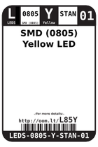
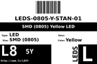
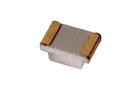

Contents
========

* [L85Y > SMD (0805) Yellow LED](#l85y--smd-0805-yellow-led)
	* [Datasheets](#datasheets)
	* [Labels](#labels)
	* [EDA](#eda)
	* [Images](#images)
	* [Tags](#tags)
  
![][im]
# L85Y > SMD (0805) Yellow LED

- ID: LEDS-0805-Y-STAN-01
- Hex ID: L85Y
- Name: SMD (0805) Yellow LED
- Description: SMD (0805) Yellow LED
- Long Link: [http://oom.lt/LEDS-0805-Y-STAN-01](http://oom.lt/LEDS-0805-Y-STAN-01)
- Short Link: [http://oom.lt/L85Y](http://oom.lt/L85Y)

## Datasheets

- Datasheet: [datasheet.pdf](datasheet.pdf)

## Labels
  
  

|label-front|label-inventory|label-spec|
| :---: | :---: | :---: |
||||

## EDA

### Instances
  
  
Used 29 times.  
Prevalance: (29\9905) 0.2928%  

|OOMP Instances|
| :---: |
|[PROJ-ADAF-1272-STAN-01  Adafruit GPS Logger Shield PCB  Used 1 times. LED4](https://github.com/oomlout/oomlout_OOMP_projects/tree/main/PROJ-ADAF-1272-STAN-01/)|
|[PROJ-ADAF-2078-STAN-01  Adafruit PowerBoost 500 Shield PCB  Used 1 times. LED1](https://github.com/oomlout/oomlout_OOMP_projects/tree/main/PROJ-ADAF-2078-STAN-01/)|
|[PROJ-ADAF-2267-STAN-01  Adafruit Bluefruit LE USB Friend and Sniffer PCB  Used 1 times. LED1](https://github.com/oomlout/oomlout_OOMP_projects/tree/main/PROJ-ADAF-2267-STAN-01/)|
|[PROJ-ADAF-2466-STAN-01  Adafruit METRO 328 PCB  Used 2 times. RXLED, TXLED](https://github.com/oomlout/oomlout_OOMP_projects/tree/main/PROJ-ADAF-2466-STAN-01/)|
|[PROJ-ADAF-2999-STAN-01  Adafruit ATWINC1500 WiFi Breakout PCB  Used 1 times. D2](https://github.com/oomlout/oomlout_OOMP_projects/tree/main/PROJ-ADAF-2999-STAN-01/)|
|[PROJ-ADAF-3382-STAN-01  Adafruit Metro M4 Express PCB  Used 2 times. RXLED, TXLED](https://github.com/oomlout/oomlout_OOMP_projects/tree/main/PROJ-ADAF-3382-STAN-01/)|
|[PROJ-ADAF-3458-STAN-01  Adafruit Feather 328P PCB  Used 2 times. D1, D5](https://github.com/oomlout/oomlout_OOMP_projects/tree/main/PROJ-ADAF-3458-STAN-01/)|
|[PROJ-ADAF-3505-STAN-01  Adafruit Metro M0 Express PCB  Used 2 times. RXLED, TXLED](https://github.com/oomlout/oomlout_OOMP_projects/tree/main/PROJ-ADAF-3505-STAN-01/)|
|[PROJ-ADAF-4000-STAN-01  Adafruit Metro M4 Express AirLift PCB  Used 2 times. RXLED, TXLED](https://github.com/oomlout/oomlout_OOMP_projects/tree/main/PROJ-ADAF-4000-STAN-01/)|
|[PROJ-ADAF-4064-STAN-01  Adafruit Grand Central PCB  Used 2 times. RXLED, TXLED](https://github.com/oomlout/oomlout_OOMP_projects/tree/main/PROJ-ADAF-4064-STAN-01/)|
|[PROJ-ADAF-659-STAN-01  Adafruit Flora Mainboard  Used 2 times. RXLED, TXLED](https://github.com/oomlout/oomlout_OOMP_projects/tree/main/PROJ-ADAF-659-STAN-01/)|
|[PROJ-ARDU-LEO-STAN-01  Arduino Leonardo  Used 3 times. L, RX, TX](https://github.com/oomlout/oomlout_OOMP_projects/tree/main/PROJ-ARDU-LEO-STAN-01/)|
|[PROJ-ARDU-MICRO-STAN-01  Arduino Micro  Used 2 times. RX, TX](https://github.com/oomlout/oomlout_OOMP_projects/tree/main/PROJ-ARDU-MICRO-STAN-01/)|
|[PROJ-ARDU-UNO-REV3-01  Arduino Rev3 Uno  Used 3 times. L, RX, TX](https://github.com/oomlout/oomlout_OOMP_projects/tree/main/PROJ-ARDU-UNO-REV3-01/)|
|[PROJ-ARDU-UNO-REV3-SM  Arduino Rev3 Uno (SMD)  Used 3 times. L, RX, TX](https://github.com/oomlout/oomlout_OOMP_projects/tree/main/PROJ-ARDU-UNO-REV3-SM/)|

### Symbols

## Images
  
  

|image|image_BOTTOM|label-front|label-inventory|label-spec|
| :---: | :---: | :---: | :---: | :---: |
||||||

## Tags

- oompID: LEDS-0805-Y-STAN-01
- name: SMD (0805) Yellow LED
- hexID: L85Y
- oompSort: 0805Y
- oompType: LEDS
- oompSize: 0805
- oompColor: Y
- oompDesc: STAN
- oompIndex: 01
- oompVersion: 99
- oompSkip: true
- ooWidth: 2 mm
- ooHeight: 0.8 mm
- ooLength: 1.25 mm
- ooNumPins: 2
- ooLensColor: 
- ooForwardVoltage: 2.4
- ooForwardCurrent: 25 mA
- ooIntensity: 
- ooPowerAngle: 
- ooWavelength: 
- oompClass: Surface Mount
- oompClassCode: SMDS
- oompBbls: template;XXXX-0805-X-XXXX-XX-bbls
- oompDiag: template;XXXX-0805-X-XXXX-XX-diag
- oompIden: template;XXXX-0805-X-XXXX-XX-iden
- oompSchem: template;LEDS-XXXX-X-XXXX-XX-schem
- oompSimp: template;XXXX-0805-X-XXXX-XX-simp
- ooDesignator: D1
- oompInstances: {'PROJECT': 'PROJ-ADAF-1272-STAN-01', 'ID': 'LED4'}
- oompInstances: {'PROJECT': 'PROJ-ADAF-2078-STAN-01', 'ID': 'LED1'}
- oompInstances: {'PROJECT': 'PROJ-ADAF-2267-STAN-01', 'ID': 'LED1'}
- oompInstances: {'PROJECT': 'PROJ-ADAF-2466-STAN-01', 'ID': 'RXLED'}
- oompInstances: {'PROJECT': 'PROJ-ADAF-2466-STAN-01', 'ID': 'TXLED'}
- oompInstances: {'PROJECT': 'PROJ-ADAF-2999-STAN-01', 'ID': 'D2'}
- oompInstances: {'PROJECT': 'PROJ-ADAF-3382-STAN-01', 'ID': 'RXLED'}
- oompInstances: {'PROJECT': 'PROJ-ADAF-3382-STAN-01', 'ID': 'TXLED'}
- oompInstances: {'PROJECT': 'PROJ-ADAF-3458-STAN-01', 'ID': 'D1'}
- oompInstances: {'PROJECT': 'PROJ-ADAF-3458-STAN-01', 'ID': 'D5'}
- oompInstances: {'PROJECT': 'PROJ-ADAF-3505-STAN-01', 'ID': 'RXLED'}
- oompInstances: {'PROJECT': 'PROJ-ADAF-3505-STAN-01', 'ID': 'TXLED'}
- oompInstances: {'PROJECT': 'PROJ-ADAF-4000-STAN-01', 'ID': 'RXLED'}
- oompInstances: {'PROJECT': 'PROJ-ADAF-4000-STAN-01', 'ID': 'TXLED'}
- oompInstances: {'PROJECT': 'PROJ-ADAF-4064-STAN-01', 'ID': 'RXLED'}
- oompInstances: {'PROJECT': 'PROJ-ADAF-4064-STAN-01', 'ID': 'TXLED'}
- oompInstances: {'PROJECT': 'PROJ-ADAF-659-STAN-01', 'ID': 'RXLED'}
- oompInstances: {'PROJECT': 'PROJ-ADAF-659-STAN-01', 'ID': 'TXLED'}
- oompInstances: {'PROJECT': 'PROJ-ARDU-LEO-STAN-01', 'ID': 'L'}
- oompInstances: {'PROJECT': 'PROJ-ARDU-LEO-STAN-01', 'ID': 'RX'}
- oompInstances: {'PROJECT': 'PROJ-ARDU-LEO-STAN-01', 'ID': 'TX'}
- oompInstances: {'PROJECT': 'PROJ-ARDU-MICRO-STAN-01', 'ID': 'RX'}
- oompInstances: {'PROJECT': 'PROJ-ARDU-MICRO-STAN-01', 'ID': 'TX'}
- oompInstances: {'PROJECT': 'PROJ-ARDU-UNO-REV3-01', 'ID': 'L'}
- oompInstances: {'PROJECT': 'PROJ-ARDU-UNO-REV3-01', 'ID': 'RX'}
- oompInstances: {'PROJECT': 'PROJ-ARDU-UNO-REV3-01', 'ID': 'TX'}
- oompInstances: {'PROJECT': 'PROJ-ARDU-UNO-REV3-SM', 'ID': 'L'}
- oompInstances: {'PROJECT': 'PROJ-ARDU-UNO-REV3-SM', 'ID': 'RX'}
- oompInstances: {'PROJECT': 'PROJ-ARDU-UNO-REV3-SM', 'ID': 'TX'}

[im]: image_450.jpg
