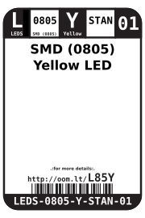
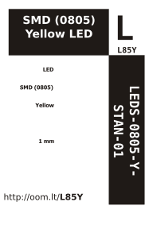

Contents
========

* [LEDS-0805-Y-STAN-01>SMD (0805) Yellow LED](#leds-0805-y-stan-01smd-0805-yellow-led)
	* [Images](#images)
	* [Datasheets](#datasheets)
	* [Labels](#labels)
	* [EDA](#eda)
		* [Symbols](#symbols)
	* [Tags](#tags)
  
![][im]
# LEDS-0805-Y-STAN-01>SMD (0805) Yellow LED

- ID: LEDS-0805-Y-STAN-01
- Name: LEDS-0805-Y-STAN-01

## Images
  
  

|image|image_BOTTOM|
| :---: | :---: |
|||

## Datasheets

- Datasheet: [datasheet.pdf](datasheet.pdf)

## Labels
  
  

|label-front|label-inventory|label-spec|
| :---: | :---: | :---: |
||||

## EDA

### Symbols

## Tags

- oompID: LEDS-0805-Y-STAN-01
- name: SMD (0805) Yellow LED
- hexID: L85Y
- oompSort: 0805Y
- oompType: LEDS
- oompSize: 0805
- oompColor: Y
- oompDesc: STAN
- oompIndex: 01
- oompVersion: 99
- oompSkip: true
- ooWidth: 2 mm
- ooHeight: 0.8 mm
- ooLength: 1.25 mm
- ooNumPins: 2
- ooLensColor: 
- ooForwardVoltage: 2.4
- ooForwardCurrent: 25 mA
- ooIntensity: 
- ooPowerAngle: 
- ooWavelength: 
- oompClass: Surface Mount
- oompClassCode: SMDS
- oompBbls: template;XXXX-0805-X-XXXX-XX-bbls
- oompDiag: template;XXXX-0805-X-XXXX-XX-diag
- oompIden: template;XXXX-0805-X-XXXX-XX-iden
- oompSchem: template;LEDS-XXXX-X-XXXX-XX-schem
- oompSimp: template;XXXX-0805-X-XXXX-XX-simp
- ooDesignator: D1

[im]: image_600.jpg
