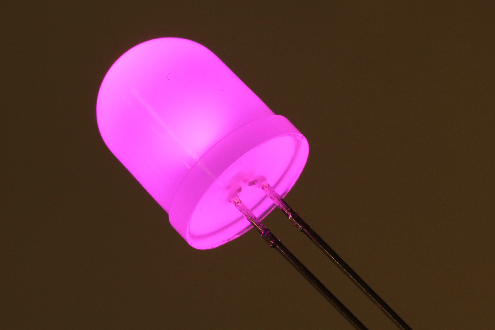
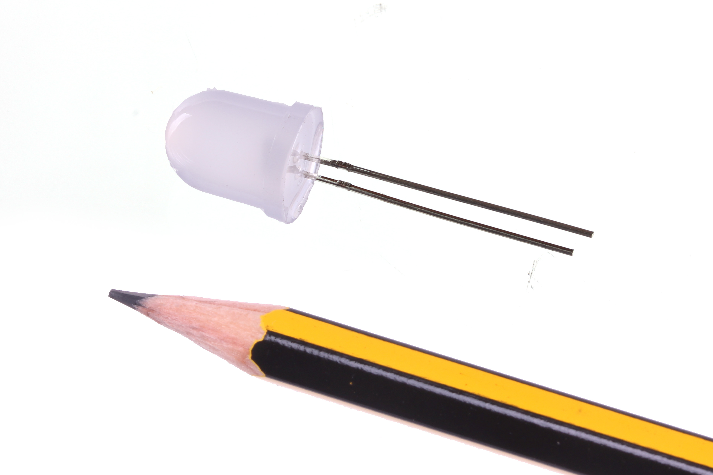
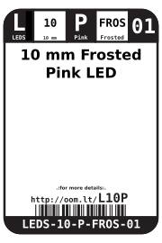
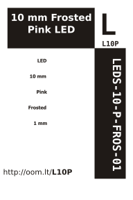

Contents
========

* [LEDS-10-P-FROS-01>10 mm Frosted Pink LED](#leds-10-p-fros-0110-mm-frosted-pink-led)
	* [Images](#images)
	* [Datasheets](#datasheets)
	* [Labels](#labels)
	* [EDA](#eda)
		* [Symbols](#symbols)
	* [Tags](#tags)
  
![][im]
# LEDS-10-P-FROS-01>10 mm Frosted Pink LED

- ID: LEDS-10-P-FROS-01
- Name: LEDS-10-P-FROS-01

## Images
  
  

|Main|Reference|
| :---: | :---: |
|||

## Datasheets

- Datasheet: [datasheet.pdf](datasheet.pdf)

## Labels
  
  

|Front|Inventory|Specifications|
| :---: | :---: | :---: |
||||

## EDA

### Symbols

## Tags

- hexID: L10P
- oompSort: 1010P
- oompType: LEDS
- oompSize: 10
- oompColor: P
- oompDesc: FROS
- oompIndex: 01
- oompVersion: 20
- ooPitch: 2.54 mm
- ooLensColor: Frosted
- ooForwardVoltage: 3.2 V
- ooForwardCurrent: 15 mA
- ooIntensity: 500 mcd
- ooPowerAngle: 50 deg
- ooWavelength: 
- ooChromaticityX: 0.34
- ooChromaticityY: 0.17
- ooFrontDiagram: OOMP-LEDS-10.png
- oompClass: Through Hole Component
- oompClassCode: THTH
- oompBbls: template;LEDS-10-X-XXXX-01-bbls
- oompDiag: template;LEDS-10-X-XXXX-01-diag
- oompIden: template;LEDS-10-X-XXXX-01-iden
- oompSchem: template;LEDS-XXXX-X-XXXX-XX-schem
- oompSimp: template;LEDS-10-X-XXXX-01-simp
- ooDesignator: D1

[im]: image_600.jpg
