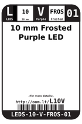
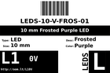
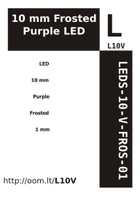
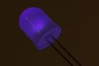

Contents
========

* [L10V > 10 mm Frosted Purple LED](#l10v--10-mm-frosted-purple-led)
	* [Datasheets](#datasheets)
	* [Labels](#labels)
	* [EDA](#eda)
	* [Images](#images)
	* [Tags](#tags)
  
![][im]
# L10V > 10 mm Frosted Purple LED

- ID: LEDS-10-V-FROS-01
- Hex ID: L10V
- Name: 10 mm Frosted Purple LED
- Description: 10 mm Frosted Purple LED
- Long Link: [http://oom.lt/LEDS-10-V-FROS-01](http://oom.lt/LEDS-10-V-FROS-01)
- Short Link: [http://oom.lt/L10V](http://oom.lt/L10V)

## Datasheets

- Datasheet: [datasheet.pdf](datasheet.pdf)

## Labels
  
  

|label-front|label-inventory|label-spec|
| :---: | :---: | :---: |
||||

## EDA

### Symbols

## Images
  
  

|image|image_RE|label-front|label-inventory|label-spec|
| :---: | :---: | :---: | :---: | :---: |
||||||

## Tags

- oompID: LEDS-10-V-FROS-01
- name: 10 mm Frosted Purple LED
- hexID: L10V
- oompSort: 1010V
- oompType: LEDS
- oompSize: 10
- oompColor: V
- oompDesc: FROS
- oompIndex: 01
- oompVersion: 20
- ooPitch: 2.54 mm
- ooLensColor: Frosted
- ooForwardVoltage: 3.3 V
- ooForwardCurrent: 15 mA
- ooIntensity: 200 mcd
- ooPowerAngle: 50 deg
- ooWavelength: 403 nm
- ooFrontDiagram: OOMP-LEDS-10.png
- oompClass: Through Hole Component
- oompClassCode: THTH
- oompBbls: template;LEDS-10-X-XXXX-01-bbls
- oompDiag: template;LEDS-10-X-XXXX-01-diag
- oompIden: template;LEDS-10-X-XXXX-01-iden
- oompSchem: template;LEDS-XXXX-X-XXXX-XX-schem
- oompSimp: template;LEDS-10-X-XXXX-01-simp
- ooDesignator: D1

[im]: image_450.jpg
