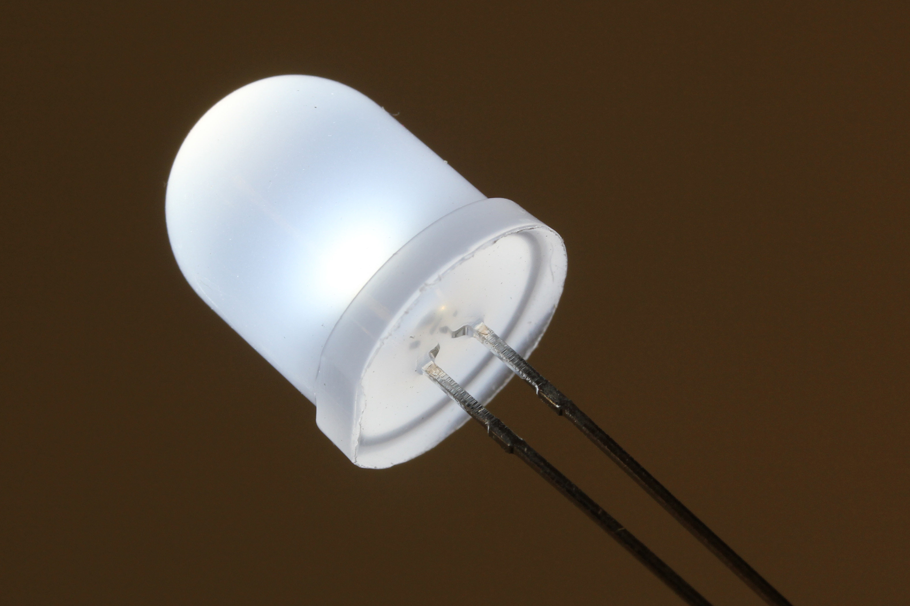

Contents
========

* [LEDS-10-W-FROS-01>10 mm Frosted White LED](#leds-10-w-fros-0110-mm-frosted-white-led)
	* [Images](#images)
	* [Datasheets](#datasheets)
	* [EDA](#eda)
		* [Footprints](#footprints)
		* [Symbols](#symbols)
	* [Tags](#tags)
  
![][im]
# LEDS-10-W-FROS-01>10 mm Frosted White LED

- ID: LEDS-10-W-FROS-01
- Name: LEDS-10-W-FROS-01

## Images
  
  

|Main|Reference|
| :---: | :---: |
|||

## Datasheets

- Datasheet: [datasheet.pdf](datasheet.pdf)

## EDA

### Footprints
  

|||||
| :---: | :---: | :---: | :---: |

### Symbols

## Tags

- index: 391
- index: 3973
- oompID: LEDS-10-W-FROS-01
- name: 10 mm Frosted White LED
- hexID: L10W
- oompSort: 1010W
- oompType: LEDS
- oompSize: 10
- oompColor: W
- oompDesc: FROS
- oompIndex: 01
- oompVersion: 20
- ooPitch: 2.54 mm
- ooLensColor: Frosted
- ooForwardVoltage: 3.0 V
- ooForwardCurrent: 15 mA
- ooIntensity: 1,000 mcd
- ooPowerAngle: 57 deg
- ooWavelength: 
- ooChromaticityX: 0.32
- ooChromaticityY: 0.34
- ooFrontDiagram: OOMP-LEDS-10.png
- oompClass: Through Hole Component
- oompClassCode: THTH
- oompBbls: template;LEDS-10-X-XXXX-01-bbls
- oompDiag: template;LEDS-10-X-XXXX-01-diag
- oompIden: template;LEDS-10-X-XXXX-01-iden
- oompSchem: template;LEDS-XXXX-X-XXXX-XX-schem
- oompSimp: template;LEDS-10-X-XXXX-01-simp
- ooDesignator: D1

[im]: image_600.jpg
