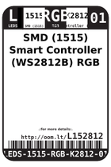
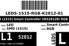
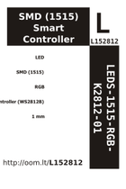

Contents
========

* [L152812 > ](#l152812--)
	* [Labels](#labels)
	* [EDA](#eda)
	* [Images](#images)
	* [Tags](#tags)

# L152812 > 

- ID: LEDS-1515-RGB-K2812-01
- Hex ID: L152812
- Name: 
- Description: 
- Long Link: [http://oom.lt/LEDS-1515-RGB-K2812-01](http://oom.lt/LEDS-1515-RGB-K2812-01)
- Short Link: [http://oom.lt/L152812](http://oom.lt/L152812)

## Labels
  
  

|label-front|label-inventory|label-spec|
| :---: | :---: | :---: |
||||

## EDA

### Symbols
  

|[  SYMBOL-kicad-kicad-symbols-Device-LED](https://github.com/oomlout/oomlout_OOMP_eda/tree/main/SYMBOL/kicad/kicad-symbols/Device/LED/)||||
| :---: | :---: | :---: | :---: |

## Images
  
  

|label-front|label-inventory|label-spec|
| :---: | :---: | :---: |
||||

## Tags

- oompType: LEDS
- oompSize: 1515
- oompColor: RGB
- oompDesc: K2812
- oompIndex: 01
- hexID: L152812
- oompID: LEDS-1515-RGB-K2812-01
- symbolKicad: SYMBOL-kicad-kicad-symbols-Device-LED
