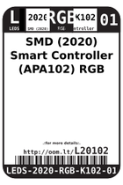
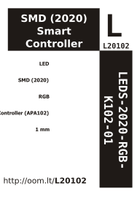

Contents
========

* [L20102 > SMD (2020) Smart Controller (APA102) RGB LED](#l20102--smd-2020-smart-controller-apa102-rgb-led)
	* [Labels](#labels)
	* [EDA](#eda)
	* [Images](#images)
	* [Tags](#tags)

# L20102 > SMD (2020) Smart Controller (APA102) RGB LED

- ID: LEDS-2020-RGB-K102-01
- Hex ID: L20102
- Name: SMD (2020) Smart Controller (APA102) RGB LED
- Description: SMD (2020) Smart Controller (APA102) RGB LED
- Long Link: [http://oom.lt/LEDS-2020-RGB-K102-01](http://oom.lt/LEDS-2020-RGB-K102-01)
- Short Link: [http://oom.lt/L20102](http://oom.lt/L20102)

## Labels
  
  

|label-front|label-inventory|label-spec|
| :---: | :---: | :---: |
||||

## EDA
  

### Instances
  
Used 260 times.  
Prevalance: (260\10986) 2.3666%  

|Project|Occur- rences|Identifiers|
| :---: | :---: | :---: |
|[PROJ-ADAF-3364-STAN-01 Adafruit pIRKey PCB](https://github.com/oomlout/oomlout_OOMP_projects/tree/main/PROJ-ADAF-3364-STAN-01/)|[1](https://github.com/oomlout/oomlout_OOMP_projects/tree/main/PROJ-ADAF-3364-STAN-01/)|[LED2](https://github.com/oomlout/oomlout_OOMP_projects/tree/main/PROJ-ADAF-3364-STAN-01/)|
|[PROJ-ADAF-3444-STAN-01 DotStar 2020 8x8 Matrix PCB](https://github.com/oomlout/oomlout_OOMP_projects/tree/main/PROJ-ADAF-3444-STAN-01/)|[64](https://github.com/oomlout/oomlout_OOMP_projects/tree/main/PROJ-ADAF-3444-STAN-01/)|[LED1, LED2, LED3, LED4, LED5, LED6, LED7, LED8, LED9, LED10, LED11, LED12, LED13, LED14, LED15, LED16, LED17, LED18, LED19, LED20, LED21, LED22, LED23, LED24, LED25, LED26, LED27, LED28, LED29, LED30, LED31, LED32, LED33, LED34, LED35, LED36, LED37, LED38, LED39, LED40, LED41, LED42, LED43, LED44, LED45, LED46, LED47, LED48, LED49, LED50, LED51, LED52, LED53, LED54, LED55, LED56, LED57, LED58, LED59, LED60, LED61, LED62, LED63, LED64](https://github.com/oomlout/oomlout_OOMP_projects/tree/main/PROJ-ADAF-3444-STAN-01/)|
|[PROJ-ADAF-3449-STAN-01 Adafruit DotStar FeatherWing PCB](https://github.com/oomlout/oomlout_OOMP_projects/tree/main/PROJ-ADAF-3449-STAN-01/)|[72](https://github.com/oomlout/oomlout_OOMP_projects/tree/main/PROJ-ADAF-3449-STAN-01/)|[LED1, LED2, LED3, LED4, LED5, LED6, LED7, LED8, LED9, LED10, LED11, LED12, LED13, LED14, LED15, LED16, LED17, LED18, LED19, LED20, LED21, LED22, LED23, LED24, LED25, LED26, LED27, LED28, LED29, LED30, LED31, LED32, LED33, LED34, LED35, LED36, LED37, LED38, LED39, LED40, LED41, LED42, LED43, LED44, LED45, LED46, LED47, LED48, LED49, LED50, LED51, LED52, LED53, LED54, LED55, LED56, LED57, LED58, LED59, LED60, LED61, LED62, LED63, LED64, LED65, LED66, LED67, LED68, LED69, LED70, LED71, LED72](https://github.com/oomlout/oomlout_OOMP_projects/tree/main/PROJ-ADAF-3449-STAN-01/)|
|[PROJ-ADAF-3500-STAN-01 Adafruit Trinket M0 PCB](https://github.com/oomlout/oomlout_OOMP_projects/tree/main/PROJ-ADAF-3500-STAN-01/)|[1](https://github.com/oomlout/oomlout_OOMP_projects/tree/main/PROJ-ADAF-3500-STAN-01/)|[LED1](https://github.com/oomlout/oomlout_OOMP_projects/tree/main/PROJ-ADAF-3500-STAN-01/)|
|[PROJ-ADAF-3501-STAN-01 Adafruit Gemma M0 PCB](https://github.com/oomlout/oomlout_OOMP_projects/tree/main/PROJ-ADAF-3501-STAN-01/)|[1](https://github.com/oomlout/oomlout_OOMP_projects/tree/main/PROJ-ADAF-3501-STAN-01/)|[LED1](https://github.com/oomlout/oomlout_OOMP_projects/tree/main/PROJ-ADAF-3501-STAN-01/)|
|[PROJ-ADAF-4319-STAN-01 Adafruit PyRuler PCB](https://github.com/oomlout/oomlout_OOMP_projects/tree/main/PROJ-ADAF-4319-STAN-01/)|[1](https://github.com/oomlout/oomlout_OOMP_projects/tree/main/PROJ-ADAF-4319-STAN-01/)|[LED1](https://github.com/oomlout/oomlout_OOMP_projects/tree/main/PROJ-ADAF-4319-STAN-01/)|
|[PROJ-SPAR-14965-STAN-01 LuMini 3 Inch](https://github.com/oomlout/oomlout_OOMP_projects/tree/main/PROJ-SPAR-14965-STAN-01/)|[60](https://github.com/oomlout/oomlout_OOMP_projects/tree/main/PROJ-SPAR-14965-STAN-01/)|[D1, D2, D3, D4, D5, D6, D7, D8, D9, D10, D11, D12, D13, D14, D15, D16, D17, D18, D19, D20, D21, D22, D23, D24, D25, D26, D27, D28, D29, D30, D31, D32, D33, D34, D35, D36, D37, D38, D39, D40, D41, D42, D43, D44, D45, D46, D47, D48, D49, D50, D51, D52, D53, D54, D55, D56, D57, D58, D59, D60](https://github.com/oomlout/oomlout_OOMP_projects/tree/main/PROJ-SPAR-14965-STAN-01/)|
|[PROJ-SPAR-14966-STAN-01 LuMini 2 Inch](https://github.com/oomlout/oomlout_OOMP_projects/tree/main/PROJ-SPAR-14966-STAN-01/)|[40](https://github.com/oomlout/oomlout_OOMP_projects/tree/main/PROJ-SPAR-14966-STAN-01/)|[D1, D2, D3, D4, D5, D6, D7, D8, D9, D10, D11, D12, D13, D14, D15, D16, D17, D18, D19, D20, D21, D22, D23, D24, D25, D26, D27, D28, D29, D30, D31, D32, D33, D34, D35, D36, D37, D38, D39, D40](https://github.com/oomlout/oomlout_OOMP_projects/tree/main/PROJ-SPAR-14966-STAN-01/)|
|[PROJ-SPAR-14967-STAN-01 LuMini 1 Inch](https://github.com/oomlout/oomlout_OOMP_projects/tree/main/PROJ-SPAR-14967-STAN-01/)|[20](https://github.com/oomlout/oomlout_OOMP_projects/tree/main/PROJ-SPAR-14967-STAN-01/)|[D1, D2, D3, D4, D5, D6, D7, D8, D9, D10, D11, D12, D13, D14, D15, D16, D17, D18, D19, D20](https://github.com/oomlout/oomlout_OOMP_projects/tree/main/PROJ-SPAR-14967-STAN-01/)|

## Images
  
  

|label-front|label-inventory|label-spec|
| :---: | :---: | :---: |
||||

## Tags

- oompType: LEDS
- oompSize: 2020
- oompColor: RGB
- oompDesc: K102
- oompIndex: 01
- hexID: L20102
- oompID: LEDS-2020-RGB-K102-01
- oompInstances: {'PROJECT': 'PROJ-ADAF-3364-STAN-01', 'ID': 'LED2'}
- oompInstances: {'PROJECT': 'PROJ-ADAF-3444-STAN-01', 'ID': 'LED1'}
- oompInstances: {'PROJECT': 'PROJ-ADAF-3444-STAN-01', 'ID': 'LED2'}
- oompInstances: {'PROJECT': 'PROJ-ADAF-3444-STAN-01', 'ID': 'LED3'}
- oompInstances: {'PROJECT': 'PROJ-ADAF-3444-STAN-01', 'ID': 'LED4'}
- oompInstances: {'PROJECT': 'PROJ-ADAF-3444-STAN-01', 'ID': 'LED5'}
- oompInstances: {'PROJECT': 'PROJ-ADAF-3444-STAN-01', 'ID': 'LED6'}
- oompInstances: {'PROJECT': 'PROJ-ADAF-3444-STAN-01', 'ID': 'LED7'}
- oompInstances: {'PROJECT': 'PROJ-ADAF-3444-STAN-01', 'ID': 'LED8'}
- oompInstances: {'PROJECT': 'PROJ-ADAF-3444-STAN-01', 'ID': 'LED9'}
- oompInstances: {'PROJECT': 'PROJ-ADAF-3444-STAN-01', 'ID': 'LED10'}
- oompInstances: {'PROJECT': 'PROJ-ADAF-3444-STAN-01', 'ID': 'LED11'}
- oompInstances: {'PROJECT': 'PROJ-ADAF-3444-STAN-01', 'ID': 'LED12'}
- oompInstances: {'PROJECT': 'PROJ-ADAF-3444-STAN-01', 'ID': 'LED13'}
- oompInstances: {'PROJECT': 'PROJ-ADAF-3444-STAN-01', 'ID': 'LED14'}
- oompInstances: {'PROJECT': 'PROJ-ADAF-3444-STAN-01', 'ID': 'LED15'}
- oompInstances: {'PROJECT': 'PROJ-ADAF-3444-STAN-01', 'ID': 'LED16'}
- oompInstances: {'PROJECT': 'PROJ-ADAF-3444-STAN-01', 'ID': 'LED17'}
- oompInstances: {'PROJECT': 'PROJ-ADAF-3444-STAN-01', 'ID': 'LED18'}
- oompInstances: {'PROJECT': 'PROJ-ADAF-3444-STAN-01', 'ID': 'LED19'}
- oompInstances: {'PROJECT': 'PROJ-ADAF-3444-STAN-01', 'ID': 'LED20'}
- oompInstances: {'PROJECT': 'PROJ-ADAF-3444-STAN-01', 'ID': 'LED21'}
- oompInstances: {'PROJECT': 'PROJ-ADAF-3444-STAN-01', 'ID': 'LED22'}
- oompInstances: {'PROJECT': 'PROJ-ADAF-3444-STAN-01', 'ID': 'LED23'}
- oompInstances: {'PROJECT': 'PROJ-ADAF-3444-STAN-01', 'ID': 'LED24'}
- oompInstances: {'PROJECT': 'PROJ-ADAF-3444-STAN-01', 'ID': 'LED25'}
- oompInstances: {'PROJECT': 'PROJ-ADAF-3444-STAN-01', 'ID': 'LED26'}
- oompInstances: {'PROJECT': 'PROJ-ADAF-3444-STAN-01', 'ID': 'LED27'}
- oompInstances: {'PROJECT': 'PROJ-ADAF-3444-STAN-01', 'ID': 'LED28'}
- oompInstances: {'PROJECT': 'PROJ-ADAF-3444-STAN-01', 'ID': 'LED29'}
- oompInstances: {'PROJECT': 'PROJ-ADAF-3444-STAN-01', 'ID': 'LED30'}
- oompInstances: {'PROJECT': 'PROJ-ADAF-3444-STAN-01', 'ID': 'LED31'}
- oompInstances: {'PROJECT': 'PROJ-ADAF-3444-STAN-01', 'ID': 'LED32'}
- oompInstances: {'PROJECT': 'PROJ-ADAF-3444-STAN-01', 'ID': 'LED33'}
- oompInstances: {'PROJECT': 'PROJ-ADAF-3444-STAN-01', 'ID': 'LED34'}
- oompInstances: {'PROJECT': 'PROJ-ADAF-3444-STAN-01', 'ID': 'LED35'}
- oompInstances: {'PROJECT': 'PROJ-ADAF-3444-STAN-01', 'ID': 'LED36'}
- oompInstances: {'PROJECT': 'PROJ-ADAF-3444-STAN-01', 'ID': 'LED37'}
- oompInstances: {'PROJECT': 'PROJ-ADAF-3444-STAN-01', 'ID': 'LED38'}
- oompInstances: {'PROJECT': 'PROJ-ADAF-3444-STAN-01', 'ID': 'LED39'}
- oompInstances: {'PROJECT': 'PROJ-ADAF-3444-STAN-01', 'ID': 'LED40'}
- oompInstances: {'PROJECT': 'PROJ-ADAF-3444-STAN-01', 'ID': 'LED41'}
- oompInstances: {'PROJECT': 'PROJ-ADAF-3444-STAN-01', 'ID': 'LED42'}
- oompInstances: {'PROJECT': 'PROJ-ADAF-3444-STAN-01', 'ID': 'LED43'}
- oompInstances: {'PROJECT': 'PROJ-ADAF-3444-STAN-01', 'ID': 'LED44'}
- oompInstances: {'PROJECT': 'PROJ-ADAF-3444-STAN-01', 'ID': 'LED45'}
- oompInstances: {'PROJECT': 'PROJ-ADAF-3444-STAN-01', 'ID': 'LED46'}
- oompInstances: {'PROJECT': 'PROJ-ADAF-3444-STAN-01', 'ID': 'LED47'}
- oompInstances: {'PROJECT': 'PROJ-ADAF-3444-STAN-01', 'ID': 'LED48'}
- oompInstances: {'PROJECT': 'PROJ-ADAF-3444-STAN-01', 'ID': 'LED49'}
- oompInstances: {'PROJECT': 'PROJ-ADAF-3444-STAN-01', 'ID': 'LED50'}
- oompInstances: {'PROJECT': 'PROJ-ADAF-3444-STAN-01', 'ID': 'LED51'}
- oompInstances: {'PROJECT': 'PROJ-ADAF-3444-STAN-01', 'ID': 'LED52'}
- oompInstances: {'PROJECT': 'PROJ-ADAF-3444-STAN-01', 'ID': 'LED53'}
- oompInstances: {'PROJECT': 'PROJ-ADAF-3444-STAN-01', 'ID': 'LED54'}
- oompInstances: {'PROJECT': 'PROJ-ADAF-3444-STAN-01', 'ID': 'LED55'}
- oompInstances: {'PROJECT': 'PROJ-ADAF-3444-STAN-01', 'ID': 'LED56'}
- oompInstances: {'PROJECT': 'PROJ-ADAF-3444-STAN-01', 'ID': 'LED57'}
- oompInstances: {'PROJECT': 'PROJ-ADAF-3444-STAN-01', 'ID': 'LED58'}
- oompInstances: {'PROJECT': 'PROJ-ADAF-3444-STAN-01', 'ID': 'LED59'}
- oompInstances: {'PROJECT': 'PROJ-ADAF-3444-STAN-01', 'ID': 'LED60'}
- oompInstances: {'PROJECT': 'PROJ-ADAF-3444-STAN-01', 'ID': 'LED61'}
- oompInstances: {'PROJECT': 'PROJ-ADAF-3444-STAN-01', 'ID': 'LED62'}
- oompInstances: {'PROJECT': 'PROJ-ADAF-3444-STAN-01', 'ID': 'LED63'}
- oompInstances: {'PROJECT': 'PROJ-ADAF-3444-STAN-01', 'ID': 'LED64'}
- oompInstances: {'PROJECT': 'PROJ-ADAF-3449-STAN-01', 'ID': 'LED1'}
- oompInstances: {'PROJECT': 'PROJ-ADAF-3449-STAN-01', 'ID': 'LED2'}
- oompInstances: {'PROJECT': 'PROJ-ADAF-3449-STAN-01', 'ID': 'LED3'}
- oompInstances: {'PROJECT': 'PROJ-ADAF-3449-STAN-01', 'ID': 'LED4'}
- oompInstances: {'PROJECT': 'PROJ-ADAF-3449-STAN-01', 'ID': 'LED5'}
- oompInstances: {'PROJECT': 'PROJ-ADAF-3449-STAN-01', 'ID': 'LED6'}
- oompInstances: {'PROJECT': 'PROJ-ADAF-3449-STAN-01', 'ID': 'LED7'}
- oompInstances: {'PROJECT': 'PROJ-ADAF-3449-STAN-01', 'ID': 'LED8'}
- oompInstances: {'PROJECT': 'PROJ-ADAF-3449-STAN-01', 'ID': 'LED9'}
- oompInstances: {'PROJECT': 'PROJ-ADAF-3449-STAN-01', 'ID': 'LED10'}
- oompInstances: {'PROJECT': 'PROJ-ADAF-3449-STAN-01', 'ID': 'LED11'}
- oompInstances: {'PROJECT': 'PROJ-ADAF-3449-STAN-01', 'ID': 'LED12'}
- oompInstances: {'PROJECT': 'PROJ-ADAF-3449-STAN-01', 'ID': 'LED13'}
- oompInstances: {'PROJECT': 'PROJ-ADAF-3449-STAN-01', 'ID': 'LED14'}
- oompInstances: {'PROJECT': 'PROJ-ADAF-3449-STAN-01', 'ID': 'LED15'}
- oompInstances: {'PROJECT': 'PROJ-ADAF-3449-STAN-01', 'ID': 'LED16'}
- oompInstances: {'PROJECT': 'PROJ-ADAF-3449-STAN-01', 'ID': 'LED17'}
- oompInstances: {'PROJECT': 'PROJ-ADAF-3449-STAN-01', 'ID': 'LED18'}
- oompInstances: {'PROJECT': 'PROJ-ADAF-3449-STAN-01', 'ID': 'LED19'}
- oompInstances: {'PROJECT': 'PROJ-ADAF-3449-STAN-01', 'ID': 'LED20'}
- oompInstances: {'PROJECT': 'PROJ-ADAF-3449-STAN-01', 'ID': 'LED21'}
- oompInstances: {'PROJECT': 'PROJ-ADAF-3449-STAN-01', 'ID': 'LED22'}
- oompInstances: {'PROJECT': 'PROJ-ADAF-3449-STAN-01', 'ID': 'LED23'}
- oompInstances: {'PROJECT': 'PROJ-ADAF-3449-STAN-01', 'ID': 'LED24'}
- oompInstances: {'PROJECT': 'PROJ-ADAF-3449-STAN-01', 'ID': 'LED25'}
- oompInstances: {'PROJECT': 'PROJ-ADAF-3449-STAN-01', 'ID': 'LED26'}
- oompInstances: {'PROJECT': 'PROJ-ADAF-3449-STAN-01', 'ID': 'LED27'}
- oompInstances: {'PROJECT': 'PROJ-ADAF-3449-STAN-01', 'ID': 'LED28'}
- oompInstances: {'PROJECT': 'PROJ-ADAF-3449-STAN-01', 'ID': 'LED29'}
- oompInstances: {'PROJECT': 'PROJ-ADAF-3449-STAN-01', 'ID': 'LED30'}
- oompInstances: {'PROJECT': 'PROJ-ADAF-3449-STAN-01', 'ID': 'LED31'}
- oompInstances: {'PROJECT': 'PROJ-ADAF-3449-STAN-01', 'ID': 'LED32'}
- oompInstances: {'PROJECT': 'PROJ-ADAF-3449-STAN-01', 'ID': 'LED33'}
- oompInstances: {'PROJECT': 'PROJ-ADAF-3449-STAN-01', 'ID': 'LED34'}
- oompInstances: {'PROJECT': 'PROJ-ADAF-3449-STAN-01', 'ID': 'LED35'}
- oompInstances: {'PROJECT': 'PROJ-ADAF-3449-STAN-01', 'ID': 'LED36'}
- oompInstances: {'PROJECT': 'PROJ-ADAF-3449-STAN-01', 'ID': 'LED37'}
- oompInstances: {'PROJECT': 'PROJ-ADAF-3449-STAN-01', 'ID': 'LED38'}
- oompInstances: {'PROJECT': 'PROJ-ADAF-3449-STAN-01', 'ID': 'LED39'}
- oompInstances: {'PROJECT': 'PROJ-ADAF-3449-STAN-01', 'ID': 'LED40'}
- oompInstances: {'PROJECT': 'PROJ-ADAF-3449-STAN-01', 'ID': 'LED41'}
- oompInstances: {'PROJECT': 'PROJ-ADAF-3449-STAN-01', 'ID': 'LED42'}
- oompInstances: {'PROJECT': 'PROJ-ADAF-3449-STAN-01', 'ID': 'LED43'}
- oompInstances: {'PROJECT': 'PROJ-ADAF-3449-STAN-01', 'ID': 'LED44'}
- oompInstances: {'PROJECT': 'PROJ-ADAF-3449-STAN-01', 'ID': 'LED45'}
- oompInstances: {'PROJECT': 'PROJ-ADAF-3449-STAN-01', 'ID': 'LED46'}
- oompInstances: {'PROJECT': 'PROJ-ADAF-3449-STAN-01', 'ID': 'LED47'}
- oompInstances: {'PROJECT': 'PROJ-ADAF-3449-STAN-01', 'ID': 'LED48'}
- oompInstances: {'PROJECT': 'PROJ-ADAF-3449-STAN-01', 'ID': 'LED49'}
- oompInstances: {'PROJECT': 'PROJ-ADAF-3449-STAN-01', 'ID': 'LED50'}
- oompInstances: {'PROJECT': 'PROJ-ADAF-3449-STAN-01', 'ID': 'LED51'}
- oompInstances: {'PROJECT': 'PROJ-ADAF-3449-STAN-01', 'ID': 'LED52'}
- oompInstances: {'PROJECT': 'PROJ-ADAF-3449-STAN-01', 'ID': 'LED53'}
- oompInstances: {'PROJECT': 'PROJ-ADAF-3449-STAN-01', 'ID': 'LED54'}
- oompInstances: {'PROJECT': 'PROJ-ADAF-3449-STAN-01', 'ID': 'LED55'}
- oompInstances: {'PROJECT': 'PROJ-ADAF-3449-STAN-01', 'ID': 'LED56'}
- oompInstances: {'PROJECT': 'PROJ-ADAF-3449-STAN-01', 'ID': 'LED57'}
- oompInstances: {'PROJECT': 'PROJ-ADAF-3449-STAN-01', 'ID': 'LED58'}
- oompInstances: {'PROJECT': 'PROJ-ADAF-3449-STAN-01', 'ID': 'LED59'}
- oompInstances: {'PROJECT': 'PROJ-ADAF-3449-STAN-01', 'ID': 'LED60'}
- oompInstances: {'PROJECT': 'PROJ-ADAF-3449-STAN-01', 'ID': 'LED61'}
- oompInstances: {'PROJECT': 'PROJ-ADAF-3449-STAN-01', 'ID': 'LED62'}
- oompInstances: {'PROJECT': 'PROJ-ADAF-3449-STAN-01', 'ID': 'LED63'}
- oompInstances: {'PROJECT': 'PROJ-ADAF-3449-STAN-01', 'ID': 'LED64'}
- oompInstances: {'PROJECT': 'PROJ-ADAF-3449-STAN-01', 'ID': 'LED65'}
- oompInstances: {'PROJECT': 'PROJ-ADAF-3449-STAN-01', 'ID': 'LED66'}
- oompInstances: {'PROJECT': 'PROJ-ADAF-3449-STAN-01', 'ID': 'LED67'}
- oompInstances: {'PROJECT': 'PROJ-ADAF-3449-STAN-01', 'ID': 'LED68'}
- oompInstances: {'PROJECT': 'PROJ-ADAF-3449-STAN-01', 'ID': 'LED69'}
- oompInstances: {'PROJECT': 'PROJ-ADAF-3449-STAN-01', 'ID': 'LED70'}
- oompInstances: {'PROJECT': 'PROJ-ADAF-3449-STAN-01', 'ID': 'LED71'}
- oompInstances: {'PROJECT': 'PROJ-ADAF-3449-STAN-01', 'ID': 'LED72'}
- oompInstances: {'PROJECT': 'PROJ-ADAF-3500-STAN-01', 'ID': 'LED1'}
- oompInstances: {'PROJECT': 'PROJ-ADAF-3501-STAN-01', 'ID': 'LED1'}
- oompInstances: {'PROJECT': 'PROJ-ADAF-4319-STAN-01', 'ID': 'LED1'}
- oompInstances: {'PROJECT': 'PROJ-SPAR-14965-STAN-01', 'ID': 'D1'}
- oompInstances: {'PROJECT': 'PROJ-SPAR-14965-STAN-01', 'ID': 'D2'}
- oompInstances: {'PROJECT': 'PROJ-SPAR-14965-STAN-01', 'ID': 'D3'}
- oompInstances: {'PROJECT': 'PROJ-SPAR-14965-STAN-01', 'ID': 'D4'}
- oompInstances: {'PROJECT': 'PROJ-SPAR-14965-STAN-01', 'ID': 'D5'}
- oompInstances: {'PROJECT': 'PROJ-SPAR-14965-STAN-01', 'ID': 'D6'}
- oompInstances: {'PROJECT': 'PROJ-SPAR-14965-STAN-01', 'ID': 'D7'}
- oompInstances: {'PROJECT': 'PROJ-SPAR-14965-STAN-01', 'ID': 'D8'}
- oompInstances: {'PROJECT': 'PROJ-SPAR-14965-STAN-01', 'ID': 'D9'}
- oompInstances: {'PROJECT': 'PROJ-SPAR-14965-STAN-01', 'ID': 'D10'}
- oompInstances: {'PROJECT': 'PROJ-SPAR-14965-STAN-01', 'ID': 'D11'}
- oompInstances: {'PROJECT': 'PROJ-SPAR-14965-STAN-01', 'ID': 'D12'}
- oompInstances: {'PROJECT': 'PROJ-SPAR-14965-STAN-01', 'ID': 'D13'}
- oompInstances: {'PROJECT': 'PROJ-SPAR-14965-STAN-01', 'ID': 'D14'}
- oompInstances: {'PROJECT': 'PROJ-SPAR-14965-STAN-01', 'ID': 'D15'}
- oompInstances: {'PROJECT': 'PROJ-SPAR-14965-STAN-01', 'ID': 'D16'}
- oompInstances: {'PROJECT': 'PROJ-SPAR-14965-STAN-01', 'ID': 'D17'}
- oompInstances: {'PROJECT': 'PROJ-SPAR-14965-STAN-01', 'ID': 'D18'}
- oompInstances: {'PROJECT': 'PROJ-SPAR-14965-STAN-01', 'ID': 'D19'}
- oompInstances: {'PROJECT': 'PROJ-SPAR-14965-STAN-01', 'ID': 'D20'}
- oompInstances: {'PROJECT': 'PROJ-SPAR-14965-STAN-01', 'ID': 'D21'}
- oompInstances: {'PROJECT': 'PROJ-SPAR-14965-STAN-01', 'ID': 'D22'}
- oompInstances: {'PROJECT': 'PROJ-SPAR-14965-STAN-01', 'ID': 'D23'}
- oompInstances: {'PROJECT': 'PROJ-SPAR-14965-STAN-01', 'ID': 'D24'}
- oompInstances: {'PROJECT': 'PROJ-SPAR-14965-STAN-01', 'ID': 'D25'}
- oompInstances: {'PROJECT': 'PROJ-SPAR-14965-STAN-01', 'ID': 'D26'}
- oompInstances: {'PROJECT': 'PROJ-SPAR-14965-STAN-01', 'ID': 'D27'}
- oompInstances: {'PROJECT': 'PROJ-SPAR-14965-STAN-01', 'ID': 'D28'}
- oompInstances: {'PROJECT': 'PROJ-SPAR-14965-STAN-01', 'ID': 'D29'}
- oompInstances: {'PROJECT': 'PROJ-SPAR-14965-STAN-01', 'ID': 'D30'}
- oompInstances: {'PROJECT': 'PROJ-SPAR-14965-STAN-01', 'ID': 'D31'}
- oompInstances: {'PROJECT': 'PROJ-SPAR-14965-STAN-01', 'ID': 'D32'}
- oompInstances: {'PROJECT': 'PROJ-SPAR-14965-STAN-01', 'ID': 'D33'}
- oompInstances: {'PROJECT': 'PROJ-SPAR-14965-STAN-01', 'ID': 'D34'}
- oompInstances: {'PROJECT': 'PROJ-SPAR-14965-STAN-01', 'ID': 'D35'}
- oompInstances: {'PROJECT': 'PROJ-SPAR-14965-STAN-01', 'ID': 'D36'}
- oompInstances: {'PROJECT': 'PROJ-SPAR-14965-STAN-01', 'ID': 'D37'}
- oompInstances: {'PROJECT': 'PROJ-SPAR-14965-STAN-01', 'ID': 'D38'}
- oompInstances: {'PROJECT': 'PROJ-SPAR-14965-STAN-01', 'ID': 'D39'}
- oompInstances: {'PROJECT': 'PROJ-SPAR-14965-STAN-01', 'ID': 'D40'}
- oompInstances: {'PROJECT': 'PROJ-SPAR-14965-STAN-01', 'ID': 'D41'}
- oompInstances: {'PROJECT': 'PROJ-SPAR-14965-STAN-01', 'ID': 'D42'}
- oompInstances: {'PROJECT': 'PROJ-SPAR-14965-STAN-01', 'ID': 'D43'}
- oompInstances: {'PROJECT': 'PROJ-SPAR-14965-STAN-01', 'ID': 'D44'}
- oompInstances: {'PROJECT': 'PROJ-SPAR-14965-STAN-01', 'ID': 'D45'}
- oompInstances: {'PROJECT': 'PROJ-SPAR-14965-STAN-01', 'ID': 'D46'}
- oompInstances: {'PROJECT': 'PROJ-SPAR-14965-STAN-01', 'ID': 'D47'}
- oompInstances: {'PROJECT': 'PROJ-SPAR-14965-STAN-01', 'ID': 'D48'}
- oompInstances: {'PROJECT': 'PROJ-SPAR-14965-STAN-01', 'ID': 'D49'}
- oompInstances: {'PROJECT': 'PROJ-SPAR-14965-STAN-01', 'ID': 'D50'}
- oompInstances: {'PROJECT': 'PROJ-SPAR-14965-STAN-01', 'ID': 'D51'}
- oompInstances: {'PROJECT': 'PROJ-SPAR-14965-STAN-01', 'ID': 'D52'}
- oompInstances: {'PROJECT': 'PROJ-SPAR-14965-STAN-01', 'ID': 'D53'}
- oompInstances: {'PROJECT': 'PROJ-SPAR-14965-STAN-01', 'ID': 'D54'}
- oompInstances: {'PROJECT': 'PROJ-SPAR-14965-STAN-01', 'ID': 'D55'}
- oompInstances: {'PROJECT': 'PROJ-SPAR-14965-STAN-01', 'ID': 'D56'}
- oompInstances: {'PROJECT': 'PROJ-SPAR-14965-STAN-01', 'ID': 'D57'}
- oompInstances: {'PROJECT': 'PROJ-SPAR-14965-STAN-01', 'ID': 'D58'}
- oompInstances: {'PROJECT': 'PROJ-SPAR-14965-STAN-01', 'ID': 'D59'}
- oompInstances: {'PROJECT': 'PROJ-SPAR-14965-STAN-01', 'ID': 'D60'}
- oompInstances: {'PROJECT': 'PROJ-SPAR-14966-STAN-01', 'ID': 'D1'}
- oompInstances: {'PROJECT': 'PROJ-SPAR-14966-STAN-01', 'ID': 'D2'}
- oompInstances: {'PROJECT': 'PROJ-SPAR-14966-STAN-01', 'ID': 'D3'}
- oompInstances: {'PROJECT': 'PROJ-SPAR-14966-STAN-01', 'ID': 'D4'}
- oompInstances: {'PROJECT': 'PROJ-SPAR-14966-STAN-01', 'ID': 'D5'}
- oompInstances: {'PROJECT': 'PROJ-SPAR-14966-STAN-01', 'ID': 'D6'}
- oompInstances: {'PROJECT': 'PROJ-SPAR-14966-STAN-01', 'ID': 'D7'}
- oompInstances: {'PROJECT': 'PROJ-SPAR-14966-STAN-01', 'ID': 'D8'}
- oompInstances: {'PROJECT': 'PROJ-SPAR-14966-STAN-01', 'ID': 'D9'}
- oompInstances: {'PROJECT': 'PROJ-SPAR-14966-STAN-01', 'ID': 'D10'}
- oompInstances: {'PROJECT': 'PROJ-SPAR-14966-STAN-01', 'ID': 'D11'}
- oompInstances: {'PROJECT': 'PROJ-SPAR-14966-STAN-01', 'ID': 'D12'}
- oompInstances: {'PROJECT': 'PROJ-SPAR-14966-STAN-01', 'ID': 'D13'}
- oompInstances: {'PROJECT': 'PROJ-SPAR-14966-STAN-01', 'ID': 'D14'}
- oompInstances: {'PROJECT': 'PROJ-SPAR-14966-STAN-01', 'ID': 'D15'}
- oompInstances: {'PROJECT': 'PROJ-SPAR-14966-STAN-01', 'ID': 'D16'}
- oompInstances: {'PROJECT': 'PROJ-SPAR-14966-STAN-01', 'ID': 'D17'}
- oompInstances: {'PROJECT': 'PROJ-SPAR-14966-STAN-01', 'ID': 'D18'}
- oompInstances: {'PROJECT': 'PROJ-SPAR-14966-STAN-01', 'ID': 'D19'}
- oompInstances: {'PROJECT': 'PROJ-SPAR-14966-STAN-01', 'ID': 'D20'}
- oompInstances: {'PROJECT': 'PROJ-SPAR-14966-STAN-01', 'ID': 'D21'}
- oompInstances: {'PROJECT': 'PROJ-SPAR-14966-STAN-01', 'ID': 'D22'}
- oompInstances: {'PROJECT': 'PROJ-SPAR-14966-STAN-01', 'ID': 'D23'}
- oompInstances: {'PROJECT': 'PROJ-SPAR-14966-STAN-01', 'ID': 'D24'}
- oompInstances: {'PROJECT': 'PROJ-SPAR-14966-STAN-01', 'ID': 'D25'}
- oompInstances: {'PROJECT': 'PROJ-SPAR-14966-STAN-01', 'ID': 'D26'}
- oompInstances: {'PROJECT': 'PROJ-SPAR-14966-STAN-01', 'ID': 'D27'}
- oompInstances: {'PROJECT': 'PROJ-SPAR-14966-STAN-01', 'ID': 'D28'}
- oompInstances: {'PROJECT': 'PROJ-SPAR-14966-STAN-01', 'ID': 'D29'}
- oompInstances: {'PROJECT': 'PROJ-SPAR-14966-STAN-01', 'ID': 'D30'}
- oompInstances: {'PROJECT': 'PROJ-SPAR-14966-STAN-01', 'ID': 'D31'}
- oompInstances: {'PROJECT': 'PROJ-SPAR-14966-STAN-01', 'ID': 'D32'}
- oompInstances: {'PROJECT': 'PROJ-SPAR-14966-STAN-01', 'ID': 'D33'}
- oompInstances: {'PROJECT': 'PROJ-SPAR-14966-STAN-01', 'ID': 'D34'}
- oompInstances: {'PROJECT': 'PROJ-SPAR-14966-STAN-01', 'ID': 'D35'}
- oompInstances: {'PROJECT': 'PROJ-SPAR-14966-STAN-01', 'ID': 'D36'}
- oompInstances: {'PROJECT': 'PROJ-SPAR-14966-STAN-01', 'ID': 'D37'}
- oompInstances: {'PROJECT': 'PROJ-SPAR-14966-STAN-01', 'ID': 'D38'}
- oompInstances: {'PROJECT': 'PROJ-SPAR-14966-STAN-01', 'ID': 'D39'}
- oompInstances: {'PROJECT': 'PROJ-SPAR-14966-STAN-01', 'ID': 'D40'}
- oompInstances: {'PROJECT': 'PROJ-SPAR-14967-STAN-01', 'ID': 'D1'}
- oompInstances: {'PROJECT': 'PROJ-SPAR-14967-STAN-01', 'ID': 'D2'}
- oompInstances: {'PROJECT': 'PROJ-SPAR-14967-STAN-01', 'ID': 'D3'}
- oompInstances: {'PROJECT': 'PROJ-SPAR-14967-STAN-01', 'ID': 'D4'}
- oompInstances: {'PROJECT': 'PROJ-SPAR-14967-STAN-01', 'ID': 'D5'}
- oompInstances: {'PROJECT': 'PROJ-SPAR-14967-STAN-01', 'ID': 'D6'}
- oompInstances: {'PROJECT': 'PROJ-SPAR-14967-STAN-01', 'ID': 'D7'}
- oompInstances: {'PROJECT': 'PROJ-SPAR-14967-STAN-01', 'ID': 'D8'}
- oompInstances: {'PROJECT': 'PROJ-SPAR-14967-STAN-01', 'ID': 'D9'}
- oompInstances: {'PROJECT': 'PROJ-SPAR-14967-STAN-01', 'ID': 'D10'}
- oompInstances: {'PROJECT': 'PROJ-SPAR-14967-STAN-01', 'ID': 'D11'}
- oompInstances: {'PROJECT': 'PROJ-SPAR-14967-STAN-01', 'ID': 'D12'}
- oompInstances: {'PROJECT': 'PROJ-SPAR-14967-STAN-01', 'ID': 'D13'}
- oompInstances: {'PROJECT': 'PROJ-SPAR-14967-STAN-01', 'ID': 'D14'}
- oompInstances: {'PROJECT': 'PROJ-SPAR-14967-STAN-01', 'ID': 'D15'}
- oompInstances: {'PROJECT': 'PROJ-SPAR-14967-STAN-01', 'ID': 'D16'}
- oompInstances: {'PROJECT': 'PROJ-SPAR-14967-STAN-01', 'ID': 'D17'}
- oompInstances: {'PROJECT': 'PROJ-SPAR-14967-STAN-01', 'ID': 'D18'}
- oompInstances: {'PROJECT': 'PROJ-SPAR-14967-STAN-01', 'ID': 'D19'}
- oompInstances: {'PROJECT': 'PROJ-SPAR-14967-STAN-01', 'ID': 'D20'}
