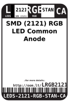
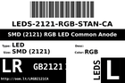
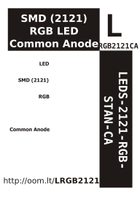

Contents
========

* [LRGB2121CA > SMD (2121) RGB LED Common Anode](#lrgb2121ca--smd-2121-rgb-led-common-anode)
	* [Labels](#labels)
	* [EDA](#eda)
	* [Images](#images)
	* [Tags](#tags)

# LRGB2121CA > SMD (2121) RGB LED Common Anode

- ID: LEDS-2121-RGB-STAN-CA
- Hex ID: LRGB2121CA
- Name: SMD (2121) RGB LED Common Anode
- Description: SMD (2121) RGB LED Common Anode
- Long Link: [http://oom.lt/LEDS-2121-RGB-STAN-CA](http://oom.lt/LEDS-2121-RGB-STAN-CA)
- Short Link: [http://oom.lt/LRGB2121CA](http://oom.lt/LRGB2121CA)

## Labels
  
  

|label-front|label-inventory|label-spec|
| :---: | :---: | :---: |
||||

## EDA
  

### Instances
  
Used 233 times.  
Prevalance: (233\10986) 2.1209%  

|OOMP Instances|
| :---: |
|[PROJ-ADAF-5201-STAN-01  Adafruit IS31FL3741 PCB  Used 117 times. LED1, LED2, LED3, LED4, LED5, LED6, LED7, LED8, LED9, LED10, LED11, LED12, LED13, LED14, LED15, LED16, LED17, LED18, LED19, LED20, LED21, LED22, LED23, LED24, LED25, LED26, LED27, LED28, LED29, LED30, LED31, LED32, LED33, LED34, LED35, LED36, LED37, LED38, LED39, LED40, LED41, LED42, LED43, LED44, LED45, LED46, LED47, LED48, LED49, LED50, LED51, LED52, LED53, LED54, LED55, LED56, LED57, LED58, LED59, LED60, LED61, LED62, LED63, LED64, LED65, LED66, LED67, LED68, LED69, LED70, LED71, LED72, LED73, LED74, LED75, LED76, LED77, LED78, LED79, LED80, LED81, LED82, LED83, LED84, LED85, LED86, LED87, LED88, LED89, LED90, LED91, LED92, LED93, LED94, LED95, LED96, LED97, LED98, LED99, LED100, LED101, LED102, LED103, LED104, LED105, LED106, LED107, LED108, LED109, LED110, LED111, LED112, LED113, LED114, LED115, LED116, LED117](https://github.com/oomlout/oomlout_OOMP_projects/tree/main/PROJ-ADAF-5201-STAN-01/)|
|[PROJ-ADAF-5217-STAN-01  Adafruit EyeLights LED Glasses and Driver PCB  Used 116 times. LED1, LED2, LED3, LED4, LED5, LED6, LED7, LED8, LED9, LED10, LED11, LED12, LED13, LED14, LED15, LED16, LED17, LED18, LED19, LED20, LED21, LED22, LED23, LED24, LED25, LED26, LED27, LED28, LED29, LED30, LED31, LED32, LED33, LED34, LED35, LED36, LED37, LED38, LED39, LED40, LED41, LED42, LED43, LED44, LED45, LED46, LED47, LED48, LED49, LED50, LED51, LED52, LED53, LED54, LED55, LED56, LED57, LED58, LED59, LED60, LED61, LED62, LED63, LED64, LED66, LED67, LED68, LED69, LED70, LED71, LED72, LED73, LED74, LED75, LED76, LED77, LED78, LED79, LED80, LED81, LED82, LED83, LED84, LED85, LED86, LED87, LED88, LED89, LED90, LED91, LED92, LED93, LED94, LED95, LED96, LED97, LED98, LED99, LED100, LED101, LED102, LED103, LED104, LED105, LED106, LED107, LED108, LED109, LED110, LED111, LED112, LED113, LED114, LED115, LED116, LED117](https://github.com/oomlout/oomlout_OOMP_projects/tree/main/PROJ-ADAF-5217-STAN-01/)|

## Images
  
  

|label-front|label-inventory|label-spec|
| :---: | :---: | :---: |
||||

## Tags

- oompType: LEDS
- oompSize: 2121
- oompColor: RGB
- oompDesc: STAN
- oompIndex: CA
- hexID: LRGB2121CA
- oompID: LEDS-2121-RGB-STAN-CA
- oompInstances: {'PROJECT': 'PROJ-ADAF-5201-STAN-01', 'ID': 'LED1'}
- oompInstances: {'PROJECT': 'PROJ-ADAF-5201-STAN-01', 'ID': 'LED2'}
- oompInstances: {'PROJECT': 'PROJ-ADAF-5201-STAN-01', 'ID': 'LED3'}
- oompInstances: {'PROJECT': 'PROJ-ADAF-5201-STAN-01', 'ID': 'LED4'}
- oompInstances: {'PROJECT': 'PROJ-ADAF-5201-STAN-01', 'ID': 'LED5'}
- oompInstances: {'PROJECT': 'PROJ-ADAF-5201-STAN-01', 'ID': 'LED6'}
- oompInstances: {'PROJECT': 'PROJ-ADAF-5201-STAN-01', 'ID': 'LED7'}
- oompInstances: {'PROJECT': 'PROJ-ADAF-5201-STAN-01', 'ID': 'LED8'}
- oompInstances: {'PROJECT': 'PROJ-ADAF-5201-STAN-01', 'ID': 'LED9'}
- oompInstances: {'PROJECT': 'PROJ-ADAF-5201-STAN-01', 'ID': 'LED10'}
- oompInstances: {'PROJECT': 'PROJ-ADAF-5201-STAN-01', 'ID': 'LED11'}
- oompInstances: {'PROJECT': 'PROJ-ADAF-5201-STAN-01', 'ID': 'LED12'}
- oompInstances: {'PROJECT': 'PROJ-ADAF-5201-STAN-01', 'ID': 'LED13'}
- oompInstances: {'PROJECT': 'PROJ-ADAF-5201-STAN-01', 'ID': 'LED14'}
- oompInstances: {'PROJECT': 'PROJ-ADAF-5201-STAN-01', 'ID': 'LED15'}
- oompInstances: {'PROJECT': 'PROJ-ADAF-5201-STAN-01', 'ID': 'LED16'}
- oompInstances: {'PROJECT': 'PROJ-ADAF-5201-STAN-01', 'ID': 'LED17'}
- oompInstances: {'PROJECT': 'PROJ-ADAF-5201-STAN-01', 'ID': 'LED18'}
- oompInstances: {'PROJECT': 'PROJ-ADAF-5201-STAN-01', 'ID': 'LED19'}
- oompInstances: {'PROJECT': 'PROJ-ADAF-5201-STAN-01', 'ID': 'LED20'}
- oompInstances: {'PROJECT': 'PROJ-ADAF-5201-STAN-01', 'ID': 'LED21'}
- oompInstances: {'PROJECT': 'PROJ-ADAF-5201-STAN-01', 'ID': 'LED22'}
- oompInstances: {'PROJECT': 'PROJ-ADAF-5201-STAN-01', 'ID': 'LED23'}
- oompInstances: {'PROJECT': 'PROJ-ADAF-5201-STAN-01', 'ID': 'LED24'}
- oompInstances: {'PROJECT': 'PROJ-ADAF-5201-STAN-01', 'ID': 'LED25'}
- oompInstances: {'PROJECT': 'PROJ-ADAF-5201-STAN-01', 'ID': 'LED26'}
- oompInstances: {'PROJECT': 'PROJ-ADAF-5201-STAN-01', 'ID': 'LED27'}
- oompInstances: {'PROJECT': 'PROJ-ADAF-5201-STAN-01', 'ID': 'LED28'}
- oompInstances: {'PROJECT': 'PROJ-ADAF-5201-STAN-01', 'ID': 'LED29'}
- oompInstances: {'PROJECT': 'PROJ-ADAF-5201-STAN-01', 'ID': 'LED30'}
- oompInstances: {'PROJECT': 'PROJ-ADAF-5201-STAN-01', 'ID': 'LED31'}
- oompInstances: {'PROJECT': 'PROJ-ADAF-5201-STAN-01', 'ID': 'LED32'}
- oompInstances: {'PROJECT': 'PROJ-ADAF-5201-STAN-01', 'ID': 'LED33'}
- oompInstances: {'PROJECT': 'PROJ-ADAF-5201-STAN-01', 'ID': 'LED34'}
- oompInstances: {'PROJECT': 'PROJ-ADAF-5201-STAN-01', 'ID': 'LED35'}
- oompInstances: {'PROJECT': 'PROJ-ADAF-5201-STAN-01', 'ID': 'LED36'}
- oompInstances: {'PROJECT': 'PROJ-ADAF-5201-STAN-01', 'ID': 'LED37'}
- oompInstances: {'PROJECT': 'PROJ-ADAF-5201-STAN-01', 'ID': 'LED38'}
- oompInstances: {'PROJECT': 'PROJ-ADAF-5201-STAN-01', 'ID': 'LED39'}
- oompInstances: {'PROJECT': 'PROJ-ADAF-5201-STAN-01', 'ID': 'LED40'}
- oompInstances: {'PROJECT': 'PROJ-ADAF-5201-STAN-01', 'ID': 'LED41'}
- oompInstances: {'PROJECT': 'PROJ-ADAF-5201-STAN-01', 'ID': 'LED42'}
- oompInstances: {'PROJECT': 'PROJ-ADAF-5201-STAN-01', 'ID': 'LED43'}
- oompInstances: {'PROJECT': 'PROJ-ADAF-5201-STAN-01', 'ID': 'LED44'}
- oompInstances: {'PROJECT': 'PROJ-ADAF-5201-STAN-01', 'ID': 'LED45'}
- oompInstances: {'PROJECT': 'PROJ-ADAF-5201-STAN-01', 'ID': 'LED46'}
- oompInstances: {'PROJECT': 'PROJ-ADAF-5201-STAN-01', 'ID': 'LED47'}
- oompInstances: {'PROJECT': 'PROJ-ADAF-5201-STAN-01', 'ID': 'LED48'}
- oompInstances: {'PROJECT': 'PROJ-ADAF-5201-STAN-01', 'ID': 'LED49'}
- oompInstances: {'PROJECT': 'PROJ-ADAF-5201-STAN-01', 'ID': 'LED50'}
- oompInstances: {'PROJECT': 'PROJ-ADAF-5201-STAN-01', 'ID': 'LED51'}
- oompInstances: {'PROJECT': 'PROJ-ADAF-5201-STAN-01', 'ID': 'LED52'}
- oompInstances: {'PROJECT': 'PROJ-ADAF-5201-STAN-01', 'ID': 'LED53'}
- oompInstances: {'PROJECT': 'PROJ-ADAF-5201-STAN-01', 'ID': 'LED54'}
- oompInstances: {'PROJECT': 'PROJ-ADAF-5201-STAN-01', 'ID': 'LED55'}
- oompInstances: {'PROJECT': 'PROJ-ADAF-5201-STAN-01', 'ID': 'LED56'}
- oompInstances: {'PROJECT': 'PROJ-ADAF-5201-STAN-01', 'ID': 'LED57'}
- oompInstances: {'PROJECT': 'PROJ-ADAF-5201-STAN-01', 'ID': 'LED58'}
- oompInstances: {'PROJECT': 'PROJ-ADAF-5201-STAN-01', 'ID': 'LED59'}
- oompInstances: {'PROJECT': 'PROJ-ADAF-5201-STAN-01', 'ID': 'LED60'}
- oompInstances: {'PROJECT': 'PROJ-ADAF-5201-STAN-01', 'ID': 'LED61'}
- oompInstances: {'PROJECT': 'PROJ-ADAF-5201-STAN-01', 'ID': 'LED62'}
- oompInstances: {'PROJECT': 'PROJ-ADAF-5201-STAN-01', 'ID': 'LED63'}
- oompInstances: {'PROJECT': 'PROJ-ADAF-5201-STAN-01', 'ID': 'LED64'}
- oompInstances: {'PROJECT': 'PROJ-ADAF-5201-STAN-01', 'ID': 'LED65'}
- oompInstances: {'PROJECT': 'PROJ-ADAF-5201-STAN-01', 'ID': 'LED66'}
- oompInstances: {'PROJECT': 'PROJ-ADAF-5201-STAN-01', 'ID': 'LED67'}
- oompInstances: {'PROJECT': 'PROJ-ADAF-5201-STAN-01', 'ID': 'LED68'}
- oompInstances: {'PROJECT': 'PROJ-ADAF-5201-STAN-01', 'ID': 'LED69'}
- oompInstances: {'PROJECT': 'PROJ-ADAF-5201-STAN-01', 'ID': 'LED70'}
- oompInstances: {'PROJECT': 'PROJ-ADAF-5201-STAN-01', 'ID': 'LED71'}
- oompInstances: {'PROJECT': 'PROJ-ADAF-5201-STAN-01', 'ID': 'LED72'}
- oompInstances: {'PROJECT': 'PROJ-ADAF-5201-STAN-01', 'ID': 'LED73'}
- oompInstances: {'PROJECT': 'PROJ-ADAF-5201-STAN-01', 'ID': 'LED74'}
- oompInstances: {'PROJECT': 'PROJ-ADAF-5201-STAN-01', 'ID': 'LED75'}
- oompInstances: {'PROJECT': 'PROJ-ADAF-5201-STAN-01', 'ID': 'LED76'}
- oompInstances: {'PROJECT': 'PROJ-ADAF-5201-STAN-01', 'ID': 'LED77'}
- oompInstances: {'PROJECT': 'PROJ-ADAF-5201-STAN-01', 'ID': 'LED78'}
- oompInstances: {'PROJECT': 'PROJ-ADAF-5201-STAN-01', 'ID': 'LED79'}
- oompInstances: {'PROJECT': 'PROJ-ADAF-5201-STAN-01', 'ID': 'LED80'}
- oompInstances: {'PROJECT': 'PROJ-ADAF-5201-STAN-01', 'ID': 'LED81'}
- oompInstances: {'PROJECT': 'PROJ-ADAF-5201-STAN-01', 'ID': 'LED82'}
- oompInstances: {'PROJECT': 'PROJ-ADAF-5201-STAN-01', 'ID': 'LED83'}
- oompInstances: {'PROJECT': 'PROJ-ADAF-5201-STAN-01', 'ID': 'LED84'}
- oompInstances: {'PROJECT': 'PROJ-ADAF-5201-STAN-01', 'ID': 'LED85'}
- oompInstances: {'PROJECT': 'PROJ-ADAF-5201-STAN-01', 'ID': 'LED86'}
- oompInstances: {'PROJECT': 'PROJ-ADAF-5201-STAN-01', 'ID': 'LED87'}
- oompInstances: {'PROJECT': 'PROJ-ADAF-5201-STAN-01', 'ID': 'LED88'}
- oompInstances: {'PROJECT': 'PROJ-ADAF-5201-STAN-01', 'ID': 'LED89'}
- oompInstances: {'PROJECT': 'PROJ-ADAF-5201-STAN-01', 'ID': 'LED90'}
- oompInstances: {'PROJECT': 'PROJ-ADAF-5201-STAN-01', 'ID': 'LED91'}
- oompInstances: {'PROJECT': 'PROJ-ADAF-5201-STAN-01', 'ID': 'LED92'}
- oompInstances: {'PROJECT': 'PROJ-ADAF-5201-STAN-01', 'ID': 'LED93'}
- oompInstances: {'PROJECT': 'PROJ-ADAF-5201-STAN-01', 'ID': 'LED94'}
- oompInstances: {'PROJECT': 'PROJ-ADAF-5201-STAN-01', 'ID': 'LED95'}
- oompInstances: {'PROJECT': 'PROJ-ADAF-5201-STAN-01', 'ID': 'LED96'}
- oompInstances: {'PROJECT': 'PROJ-ADAF-5201-STAN-01', 'ID': 'LED97'}
- oompInstances: {'PROJECT': 'PROJ-ADAF-5201-STAN-01', 'ID': 'LED98'}
- oompInstances: {'PROJECT': 'PROJ-ADAF-5201-STAN-01', 'ID': 'LED99'}
- oompInstances: {'PROJECT': 'PROJ-ADAF-5201-STAN-01', 'ID': 'LED100'}
- oompInstances: {'PROJECT': 'PROJ-ADAF-5201-STAN-01', 'ID': 'LED101'}
- oompInstances: {'PROJECT': 'PROJ-ADAF-5201-STAN-01', 'ID': 'LED102'}
- oompInstances: {'PROJECT': 'PROJ-ADAF-5201-STAN-01', 'ID': 'LED103'}
- oompInstances: {'PROJECT': 'PROJ-ADAF-5201-STAN-01', 'ID': 'LED104'}
- oompInstances: {'PROJECT': 'PROJ-ADAF-5201-STAN-01', 'ID': 'LED105'}
- oompInstances: {'PROJECT': 'PROJ-ADAF-5201-STAN-01', 'ID': 'LED106'}
- oompInstances: {'PROJECT': 'PROJ-ADAF-5201-STAN-01', 'ID': 'LED107'}
- oompInstances: {'PROJECT': 'PROJ-ADAF-5201-STAN-01', 'ID': 'LED108'}
- oompInstances: {'PROJECT': 'PROJ-ADAF-5201-STAN-01', 'ID': 'LED109'}
- oompInstances: {'PROJECT': 'PROJ-ADAF-5201-STAN-01', 'ID': 'LED110'}
- oompInstances: {'PROJECT': 'PROJ-ADAF-5201-STAN-01', 'ID': 'LED111'}
- oompInstances: {'PROJECT': 'PROJ-ADAF-5201-STAN-01', 'ID': 'LED112'}
- oompInstances: {'PROJECT': 'PROJ-ADAF-5201-STAN-01', 'ID': 'LED113'}
- oompInstances: {'PROJECT': 'PROJ-ADAF-5201-STAN-01', 'ID': 'LED114'}
- oompInstances: {'PROJECT': 'PROJ-ADAF-5201-STAN-01', 'ID': 'LED115'}
- oompInstances: {'PROJECT': 'PROJ-ADAF-5201-STAN-01', 'ID': 'LED116'}
- oompInstances: {'PROJECT': 'PROJ-ADAF-5201-STAN-01', 'ID': 'LED117'}
- oompInstances: {'PROJECT': 'PROJ-ADAF-5217-STAN-01', 'ID': 'LED1'}
- oompInstances: {'PROJECT': 'PROJ-ADAF-5217-STAN-01', 'ID': 'LED2'}
- oompInstances: {'PROJECT': 'PROJ-ADAF-5217-STAN-01', 'ID': 'LED3'}
- oompInstances: {'PROJECT': 'PROJ-ADAF-5217-STAN-01', 'ID': 'LED4'}
- oompInstances: {'PROJECT': 'PROJ-ADAF-5217-STAN-01', 'ID': 'LED5'}
- oompInstances: {'PROJECT': 'PROJ-ADAF-5217-STAN-01', 'ID': 'LED6'}
- oompInstances: {'PROJECT': 'PROJ-ADAF-5217-STAN-01', 'ID': 'LED7'}
- oompInstances: {'PROJECT': 'PROJ-ADAF-5217-STAN-01', 'ID': 'LED8'}
- oompInstances: {'PROJECT': 'PROJ-ADAF-5217-STAN-01', 'ID': 'LED9'}
- oompInstances: {'PROJECT': 'PROJ-ADAF-5217-STAN-01', 'ID': 'LED10'}
- oompInstances: {'PROJECT': 'PROJ-ADAF-5217-STAN-01', 'ID': 'LED11'}
- oompInstances: {'PROJECT': 'PROJ-ADAF-5217-STAN-01', 'ID': 'LED12'}
- oompInstances: {'PROJECT': 'PROJ-ADAF-5217-STAN-01', 'ID': 'LED13'}
- oompInstances: {'PROJECT': 'PROJ-ADAF-5217-STAN-01', 'ID': 'LED14'}
- oompInstances: {'PROJECT': 'PROJ-ADAF-5217-STAN-01', 'ID': 'LED15'}
- oompInstances: {'PROJECT': 'PROJ-ADAF-5217-STAN-01', 'ID': 'LED16'}
- oompInstances: {'PROJECT': 'PROJ-ADAF-5217-STAN-01', 'ID': 'LED17'}
- oompInstances: {'PROJECT': 'PROJ-ADAF-5217-STAN-01', 'ID': 'LED18'}
- oompInstances: {'PROJECT': 'PROJ-ADAF-5217-STAN-01', 'ID': 'LED19'}
- oompInstances: {'PROJECT': 'PROJ-ADAF-5217-STAN-01', 'ID': 'LED20'}
- oompInstances: {'PROJECT': 'PROJ-ADAF-5217-STAN-01', 'ID': 'LED21'}
- oompInstances: {'PROJECT': 'PROJ-ADAF-5217-STAN-01', 'ID': 'LED22'}
- oompInstances: {'PROJECT': 'PROJ-ADAF-5217-STAN-01', 'ID': 'LED23'}
- oompInstances: {'PROJECT': 'PROJ-ADAF-5217-STAN-01', 'ID': 'LED24'}
- oompInstances: {'PROJECT': 'PROJ-ADAF-5217-STAN-01', 'ID': 'LED25'}
- oompInstances: {'PROJECT': 'PROJ-ADAF-5217-STAN-01', 'ID': 'LED26'}
- oompInstances: {'PROJECT': 'PROJ-ADAF-5217-STAN-01', 'ID': 'LED27'}
- oompInstances: {'PROJECT': 'PROJ-ADAF-5217-STAN-01', 'ID': 'LED28'}
- oompInstances: {'PROJECT': 'PROJ-ADAF-5217-STAN-01', 'ID': 'LED29'}
- oompInstances: {'PROJECT': 'PROJ-ADAF-5217-STAN-01', 'ID': 'LED30'}
- oompInstances: {'PROJECT': 'PROJ-ADAF-5217-STAN-01', 'ID': 'LED31'}
- oompInstances: {'PROJECT': 'PROJ-ADAF-5217-STAN-01', 'ID': 'LED32'}
- oompInstances: {'PROJECT': 'PROJ-ADAF-5217-STAN-01', 'ID': 'LED33'}
- oompInstances: {'PROJECT': 'PROJ-ADAF-5217-STAN-01', 'ID': 'LED34'}
- oompInstances: {'PROJECT': 'PROJ-ADAF-5217-STAN-01', 'ID': 'LED35'}
- oompInstances: {'PROJECT': 'PROJ-ADAF-5217-STAN-01', 'ID': 'LED36'}
- oompInstances: {'PROJECT': 'PROJ-ADAF-5217-STAN-01', 'ID': 'LED37'}
- oompInstances: {'PROJECT': 'PROJ-ADAF-5217-STAN-01', 'ID': 'LED38'}
- oompInstances: {'PROJECT': 'PROJ-ADAF-5217-STAN-01', 'ID': 'LED39'}
- oompInstances: {'PROJECT': 'PROJ-ADAF-5217-STAN-01', 'ID': 'LED40'}
- oompInstances: {'PROJECT': 'PROJ-ADAF-5217-STAN-01', 'ID': 'LED41'}
- oompInstances: {'PROJECT': 'PROJ-ADAF-5217-STAN-01', 'ID': 'LED42'}
- oompInstances: {'PROJECT': 'PROJ-ADAF-5217-STAN-01', 'ID': 'LED43'}
- oompInstances: {'PROJECT': 'PROJ-ADAF-5217-STAN-01', 'ID': 'LED44'}
- oompInstances: {'PROJECT': 'PROJ-ADAF-5217-STAN-01', 'ID': 'LED45'}
- oompInstances: {'PROJECT': 'PROJ-ADAF-5217-STAN-01', 'ID': 'LED46'}
- oompInstances: {'PROJECT': 'PROJ-ADAF-5217-STAN-01', 'ID': 'LED47'}
- oompInstances: {'PROJECT': 'PROJ-ADAF-5217-STAN-01', 'ID': 'LED48'}
- oompInstances: {'PROJECT': 'PROJ-ADAF-5217-STAN-01', 'ID': 'LED49'}
- oompInstances: {'PROJECT': 'PROJ-ADAF-5217-STAN-01', 'ID': 'LED50'}
- oompInstances: {'PROJECT': 'PROJ-ADAF-5217-STAN-01', 'ID': 'LED51'}
- oompInstances: {'PROJECT': 'PROJ-ADAF-5217-STAN-01', 'ID': 'LED52'}
- oompInstances: {'PROJECT': 'PROJ-ADAF-5217-STAN-01', 'ID': 'LED53'}
- oompInstances: {'PROJECT': 'PROJ-ADAF-5217-STAN-01', 'ID': 'LED54'}
- oompInstances: {'PROJECT': 'PROJ-ADAF-5217-STAN-01', 'ID': 'LED55'}
- oompInstances: {'PROJECT': 'PROJ-ADAF-5217-STAN-01', 'ID': 'LED56'}
- oompInstances: {'PROJECT': 'PROJ-ADAF-5217-STAN-01', 'ID': 'LED57'}
- oompInstances: {'PROJECT': 'PROJ-ADAF-5217-STAN-01', 'ID': 'LED58'}
- oompInstances: {'PROJECT': 'PROJ-ADAF-5217-STAN-01', 'ID': 'LED59'}
- oompInstances: {'PROJECT': 'PROJ-ADAF-5217-STAN-01', 'ID': 'LED60'}
- oompInstances: {'PROJECT': 'PROJ-ADAF-5217-STAN-01', 'ID': 'LED61'}
- oompInstances: {'PROJECT': 'PROJ-ADAF-5217-STAN-01', 'ID': 'LED62'}
- oompInstances: {'PROJECT': 'PROJ-ADAF-5217-STAN-01', 'ID': 'LED63'}
- oompInstances: {'PROJECT': 'PROJ-ADAF-5217-STAN-01', 'ID': 'LED64'}
- oompInstances: {'PROJECT': 'PROJ-ADAF-5217-STAN-01', 'ID': 'LED66'}
- oompInstances: {'PROJECT': 'PROJ-ADAF-5217-STAN-01', 'ID': 'LED67'}
- oompInstances: {'PROJECT': 'PROJ-ADAF-5217-STAN-01', 'ID': 'LED68'}
- oompInstances: {'PROJECT': 'PROJ-ADAF-5217-STAN-01', 'ID': 'LED69'}
- oompInstances: {'PROJECT': 'PROJ-ADAF-5217-STAN-01', 'ID': 'LED70'}
- oompInstances: {'PROJECT': 'PROJ-ADAF-5217-STAN-01', 'ID': 'LED71'}
- oompInstances: {'PROJECT': 'PROJ-ADAF-5217-STAN-01', 'ID': 'LED72'}
- oompInstances: {'PROJECT': 'PROJ-ADAF-5217-STAN-01', 'ID': 'LED73'}
- oompInstances: {'PROJECT': 'PROJ-ADAF-5217-STAN-01', 'ID': 'LED74'}
- oompInstances: {'PROJECT': 'PROJ-ADAF-5217-STAN-01', 'ID': 'LED75'}
- oompInstances: {'PROJECT': 'PROJ-ADAF-5217-STAN-01', 'ID': 'LED76'}
- oompInstances: {'PROJECT': 'PROJ-ADAF-5217-STAN-01', 'ID': 'LED77'}
- oompInstances: {'PROJECT': 'PROJ-ADAF-5217-STAN-01', 'ID': 'LED78'}
- oompInstances: {'PROJECT': 'PROJ-ADAF-5217-STAN-01', 'ID': 'LED79'}
- oompInstances: {'PROJECT': 'PROJ-ADAF-5217-STAN-01', 'ID': 'LED80'}
- oompInstances: {'PROJECT': 'PROJ-ADAF-5217-STAN-01', 'ID': 'LED81'}
- oompInstances: {'PROJECT': 'PROJ-ADAF-5217-STAN-01', 'ID': 'LED82'}
- oompInstances: {'PROJECT': 'PROJ-ADAF-5217-STAN-01', 'ID': 'LED83'}
- oompInstances: {'PROJECT': 'PROJ-ADAF-5217-STAN-01', 'ID': 'LED84'}
- oompInstances: {'PROJECT': 'PROJ-ADAF-5217-STAN-01', 'ID': 'LED85'}
- oompInstances: {'PROJECT': 'PROJ-ADAF-5217-STAN-01', 'ID': 'LED86'}
- oompInstances: {'PROJECT': 'PROJ-ADAF-5217-STAN-01', 'ID': 'LED87'}
- oompInstances: {'PROJECT': 'PROJ-ADAF-5217-STAN-01', 'ID': 'LED88'}
- oompInstances: {'PROJECT': 'PROJ-ADAF-5217-STAN-01', 'ID': 'LED89'}
- oompInstances: {'PROJECT': 'PROJ-ADAF-5217-STAN-01', 'ID': 'LED90'}
- oompInstances: {'PROJECT': 'PROJ-ADAF-5217-STAN-01', 'ID': 'LED91'}
- oompInstances: {'PROJECT': 'PROJ-ADAF-5217-STAN-01', 'ID': 'LED92'}
- oompInstances: {'PROJECT': 'PROJ-ADAF-5217-STAN-01', 'ID': 'LED93'}
- oompInstances: {'PROJECT': 'PROJ-ADAF-5217-STAN-01', 'ID': 'LED94'}
- oompInstances: {'PROJECT': 'PROJ-ADAF-5217-STAN-01', 'ID': 'LED95'}
- oompInstances: {'PROJECT': 'PROJ-ADAF-5217-STAN-01', 'ID': 'LED96'}
- oompInstances: {'PROJECT': 'PROJ-ADAF-5217-STAN-01', 'ID': 'LED97'}
- oompInstances: {'PROJECT': 'PROJ-ADAF-5217-STAN-01', 'ID': 'LED98'}
- oompInstances: {'PROJECT': 'PROJ-ADAF-5217-STAN-01', 'ID': 'LED99'}
- oompInstances: {'PROJECT': 'PROJ-ADAF-5217-STAN-01', 'ID': 'LED100'}
- oompInstances: {'PROJECT': 'PROJ-ADAF-5217-STAN-01', 'ID': 'LED101'}
- oompInstances: {'PROJECT': 'PROJ-ADAF-5217-STAN-01', 'ID': 'LED102'}
- oompInstances: {'PROJECT': 'PROJ-ADAF-5217-STAN-01', 'ID': 'LED103'}
- oompInstances: {'PROJECT': 'PROJ-ADAF-5217-STAN-01', 'ID': 'LED104'}
- oompInstances: {'PROJECT': 'PROJ-ADAF-5217-STAN-01', 'ID': 'LED105'}
- oompInstances: {'PROJECT': 'PROJ-ADAF-5217-STAN-01', 'ID': 'LED106'}
- oompInstances: {'PROJECT': 'PROJ-ADAF-5217-STAN-01', 'ID': 'LED107'}
- oompInstances: {'PROJECT': 'PROJ-ADAF-5217-STAN-01', 'ID': 'LED108'}
- oompInstances: {'PROJECT': 'PROJ-ADAF-5217-STAN-01', 'ID': 'LED109'}
- oompInstances: {'PROJECT': 'PROJ-ADAF-5217-STAN-01', 'ID': 'LED110'}
- oompInstances: {'PROJECT': 'PROJ-ADAF-5217-STAN-01', 'ID': 'LED111'}
- oompInstances: {'PROJECT': 'PROJ-ADAF-5217-STAN-01', 'ID': 'LED112'}
- oompInstances: {'PROJECT': 'PROJ-ADAF-5217-STAN-01', 'ID': 'LED113'}
- oompInstances: {'PROJECT': 'PROJ-ADAF-5217-STAN-01', 'ID': 'LED114'}
- oompInstances: {'PROJECT': 'PROJ-ADAF-5217-STAN-01', 'ID': 'LED115'}
- oompInstances: {'PROJECT': 'PROJ-ADAF-5217-STAN-01', 'ID': 'LED116'}
- oompInstances: {'PROJECT': 'PROJ-ADAF-5217-STAN-01', 'ID': 'LED117'}
