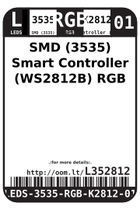

Contents
========

* [L352812 > SMD (3535) Smart Controller (WS2812B) RGB LED](#l352812--smd-3535-smart-controller-ws2812b-rgb-led)
	* [Labels](#labels)
	* [EDA](#eda)
	* [Images](#images)
	* [Tags](#tags)

# L352812 > SMD (3535) Smart Controller (WS2812B) RGB LED

- ID: LEDS-3535-RGB-K2812-01
- Hex ID: L352812
- Name: SMD (3535) Smart Controller (WS2812B) RGB LED
- Description: SMD (3535) Smart Controller (WS2812B) RGB LED
- Long Link: [http://oom.lt/LEDS-3535-RGB-K2812-01](http://oom.lt/LEDS-3535-RGB-K2812-01)
- Short Link: [http://oom.lt/L352812](http://oom.lt/L352812)

## Labels
  
  

|label-front|label-inventory|label-spec|
| :---: | :---: | :---: |
||||

## EDA
  

### Instances
  
Used 125 times.  
Prevalance: (125\10986) 1.1378%  

|Project|Occur- rences|Identifiers|
| :---: | :---: | :---: |
|[PROJ-ADAF-2945-STAN-01 Adafruit NeoPixel FeatherWing PCB](https://github.com/oomlout/oomlout_OOMP_projects/tree/main/PROJ-ADAF-2945-STAN-01/)|[32](https://github.com/oomlout/oomlout_OOMP_projects/tree/main/PROJ-ADAF-2945-STAN-01/)|[LED1, LED2, LED3, LED4, LED5, LED6, LED7, LED8, LED9, LED10, LED11, LED12, LED13, LED14, LED15, LED16, LED17, LED18, LED19, LED20, LED21, LED22, LED23, LED24, LED25, LED26, LED27, LED28, LED29, LED30, LED31, LED32](https://github.com/oomlout/oomlout_OOMP_projects/tree/main/PROJ-ADAF-2945-STAN-01/)|
|[PROJ-ADAF-3000-STAN-01 Adafruit Circuit Playground PCB](https://github.com/oomlout/oomlout_OOMP_projects/tree/main/PROJ-ADAF-3000-STAN-01/)|[10](https://github.com/oomlout/oomlout_OOMP_projects/tree/main/PROJ-ADAF-3000-STAN-01/)|[LED1, LED2, LED3, LED4, LED5, LED6, LED7, LED8, LED9, LED10](https://github.com/oomlout/oomlout_OOMP_projects/tree/main/PROJ-ADAF-3000-STAN-01/)|
|[PROJ-ADAF-3333-STAN-01 Adafruit Circuit Playground Express PCB](https://github.com/oomlout/oomlout_OOMP_projects/tree/main/PROJ-ADAF-3333-STAN-01/)|[10](https://github.com/oomlout/oomlout_OOMP_projects/tree/main/PROJ-ADAF-3333-STAN-01/)|[LED1, LED2, LED3, LED4, LED5, LED6, LED7, LED8, LED9, LED10](https://github.com/oomlout/oomlout_OOMP_projects/tree/main/PROJ-ADAF-3333-STAN-01/)|
|[PROJ-ADAF-3382-STAN-01 Adafruit Metro M4 Express PCB](https://github.com/oomlout/oomlout_OOMP_projects/tree/main/PROJ-ADAF-3382-STAN-01/)|[1](https://github.com/oomlout/oomlout_OOMP_projects/tree/main/PROJ-ADAF-3382-STAN-01/)|[LED1](https://github.com/oomlout/oomlout_OOMP_projects/tree/main/PROJ-ADAF-3382-STAN-01/)|
|[PROJ-ADAF-3403-STAN-01 Adafruit Feather M0 Express PCB](https://github.com/oomlout/oomlout_OOMP_projects/tree/main/PROJ-ADAF-3403-STAN-01/)|[1](https://github.com/oomlout/oomlout_OOMP_projects/tree/main/PROJ-ADAF-3403-STAN-01/)|[LED1](https://github.com/oomlout/oomlout_OOMP_projects/tree/main/PROJ-ADAF-3403-STAN-01/)|
|[PROJ-ADAF-3505-STAN-01 Adafruit Metro M0 Express PCB](https://github.com/oomlout/oomlout_OOMP_projects/tree/main/PROJ-ADAF-3505-STAN-01/)|[1](https://github.com/oomlout/oomlout_OOMP_projects/tree/main/PROJ-ADAF-3505-STAN-01/)|[LED1](https://github.com/oomlout/oomlout_OOMP_projects/tree/main/PROJ-ADAF-3505-STAN-01/)|
|[PROJ-ADAF-3857-STAN-01 Adafruit Feather M4 Express PCB](https://github.com/oomlout/oomlout_OOMP_projects/tree/main/PROJ-ADAF-3857-STAN-01/)|[1](https://github.com/oomlout/oomlout_OOMP_projects/tree/main/PROJ-ADAF-3857-STAN-01/)|[LED1](https://github.com/oomlout/oomlout_OOMP_projects/tree/main/PROJ-ADAF-3857-STAN-01/)|
|[PROJ-ADAF-3900-STAN-01 Adafruit Hallowing M0 PCB](https://github.com/oomlout/oomlout_OOMP_projects/tree/main/PROJ-ADAF-3900-STAN-01/)|[1](https://github.com/oomlout/oomlout_OOMP_projects/tree/main/PROJ-ADAF-3900-STAN-01/)|[LED1](https://github.com/oomlout/oomlout_OOMP_projects/tree/main/PROJ-ADAF-3900-STAN-01/)|
|[PROJ-ADAF-3954-STAN-01 Adafruit NeoTrellis 4x4 PCB](https://github.com/oomlout/oomlout_OOMP_projects/tree/main/PROJ-ADAF-3954-STAN-01/)|[16](https://github.com/oomlout/oomlout_OOMP_projects/tree/main/PROJ-ADAF-3954-STAN-01/)|[LED1, LED2, LED3, LED4, LED5, LED6, LED7, LED8, LED9, LED10, LED11, LED12, LED13, LED14, LED15, LED16](https://github.com/oomlout/oomlout_OOMP_projects/tree/main/PROJ-ADAF-3954-STAN-01/)|
|[PROJ-ADAF-4000-STAN-01 Adafruit Metro M4 Express AirLift PCB](https://github.com/oomlout/oomlout_OOMP_projects/tree/main/PROJ-ADAF-4000-STAN-01/)|[1](https://github.com/oomlout/oomlout_OOMP_projects/tree/main/PROJ-ADAF-4000-STAN-01/)|[LED1](https://github.com/oomlout/oomlout_OOMP_projects/tree/main/PROJ-ADAF-4000-STAN-01/)|
|[PROJ-ADAF-4064-STAN-01 Adafruit Grand Central PCB](https://github.com/oomlout/oomlout_OOMP_projects/tree/main/PROJ-ADAF-4064-STAN-01/)|[1](https://github.com/oomlout/oomlout_OOMP_projects/tree/main/PROJ-ADAF-4064-STAN-01/)|[LED1](https://github.com/oomlout/oomlout_OOMP_projects/tree/main/PROJ-ADAF-4064-STAN-01/)|
|[PROJ-ADAF-4333-STAN-01 Adafruit Circuit Playground Bluefruit PCB](https://github.com/oomlout/oomlout_OOMP_projects/tree/main/PROJ-ADAF-4333-STAN-01/)|[10](https://github.com/oomlout/oomlout_OOMP_projects/tree/main/PROJ-ADAF-4333-STAN-01/)|[LED1, LED2, LED3, LED4, LED5, LED6, LED7, LED8, LED9, LED10](https://github.com/oomlout/oomlout_OOMP_projects/tree/main/PROJ-ADAF-4333-STAN-01/)|
|[PROJ-ADAF-4382-STAN-01 Adafruit Feather STM32F405 Express PCB](https://github.com/oomlout/oomlout_OOMP_projects/tree/main/PROJ-ADAF-4382-STAN-01/)|[1](https://github.com/oomlout/oomlout_OOMP_projects/tree/main/PROJ-ADAF-4382-STAN-01/)|[LED1](https://github.com/oomlout/oomlout_OOMP_projects/tree/main/PROJ-ADAF-4382-STAN-01/)|
|[PROJ-ADAF-4500-STAN-01 Adafruit CLUE PCB](https://github.com/oomlout/oomlout_OOMP_projects/tree/main/PROJ-ADAF-4500-STAN-01/)|[1](https://github.com/oomlout/oomlout_OOMP_projects/tree/main/PROJ-ADAF-4500-STAN-01/)|[LED1](https://github.com/oomlout/oomlout_OOMP_projects/tree/main/PROJ-ADAF-4500-STAN-01/)|
|[PROJ-ADAF-4516-STAN-01 Adafruit Feather nRF52840 Sense PCB](https://github.com/oomlout/oomlout_OOMP_projects/tree/main/PROJ-ADAF-4516-STAN-01/)|[1](https://github.com/oomlout/oomlout_OOMP_projects/tree/main/PROJ-ADAF-4516-STAN-01/)|[LED1](https://github.com/oomlout/oomlout_OOMP_projects/tree/main/PROJ-ADAF-4516-STAN-01/)|
|[PROJ-ADAF-4745-STAN-01 Adafruit MatrixPortal M4 PCB](https://github.com/oomlout/oomlout_OOMP_projects/tree/main/PROJ-ADAF-4745-STAN-01/)|[1](https://github.com/oomlout/oomlout_OOMP_projects/tree/main/PROJ-ADAF-4745-STAN-01/)|[LED1](https://github.com/oomlout/oomlout_OOMP_projects/tree/main/PROJ-ADAF-4745-STAN-01/)|
|[PROJ-ADAF-4759-STAN-01 Adafruit Feather M4 CAN PCB](https://github.com/oomlout/oomlout_OOMP_projects/tree/main/PROJ-ADAF-4759-STAN-01/)|[1](https://github.com/oomlout/oomlout_OOMP_projects/tree/main/PROJ-ADAF-4759-STAN-01/)|[LED1](https://github.com/oomlout/oomlout_OOMP_projects/tree/main/PROJ-ADAF-4759-STAN-01/)|
|[PROJ-ADAF-4775-STAN-01 Adafruit Metro ESP32 S2 PCB](https://github.com/oomlout/oomlout_OOMP_projects/tree/main/PROJ-ADAF-4775-STAN-01/)|[1](https://github.com/oomlout/oomlout_OOMP_projects/tree/main/PROJ-ADAF-4775-STAN-01/)|[LED1](https://github.com/oomlout/oomlout_OOMP_projects/tree/main/PROJ-ADAF-4775-STAN-01/)|
|[PROJ-ADAF-4870-STAN-01 Adafruit Neo Trinkey PCB](https://github.com/oomlout/oomlout_OOMP_projects/tree/main/PROJ-ADAF-4870-STAN-01/)|[4](https://github.com/oomlout/oomlout_OOMP_projects/tree/main/PROJ-ADAF-4870-STAN-01/)|[LED1, LED2, LED3, LED4](https://github.com/oomlout/oomlout_OOMP_projects/tree/main/PROJ-ADAF-4870-STAN-01/)|
|[PROJ-ADAF-4978-STAN-01 Adafruit NeoKey Breakout PCB](https://github.com/oomlout/oomlout_OOMP_projects/tree/main/PROJ-ADAF-4978-STAN-01/)|[1](https://github.com/oomlout/oomlout_OOMP_projects/tree/main/PROJ-ADAF-4978-STAN-01/)|[LED1](https://github.com/oomlout/oomlout_OOMP_projects/tree/main/PROJ-ADAF-4978-STAN-01/)|
|[PROJ-ADAF-4979-STAN-01 Adafruit NeoKey FeatherWing PCB](https://github.com/oomlout/oomlout_OOMP_projects/tree/main/PROJ-ADAF-4979-STAN-01/)|[2](https://github.com/oomlout/oomlout_OOMP_projects/tree/main/PROJ-ADAF-4979-STAN-01/)|[LED1, LED2](https://github.com/oomlout/oomlout_OOMP_projects/tree/main/PROJ-ADAF-4979-STAN-01/)|
|[PROJ-ADAF-4980-STAN-01 Adafruit NeoKey 1x4 PCB](https://github.com/oomlout/oomlout_OOMP_projects/tree/main/PROJ-ADAF-4980-STAN-01/)|[4](https://github.com/oomlout/oomlout_OOMP_projects/tree/main/PROJ-ADAF-4980-STAN-01/)|[LED1, LED2, LED3, LED4](https://github.com/oomlout/oomlout_OOMP_projects/tree/main/PROJ-ADAF-4980-STAN-01/)|
|[PROJ-ADAF-4991-STAN-01 Adafruit I2C QT Rotary Encoder PCB](https://github.com/oomlout/oomlout_OOMP_projects/tree/main/PROJ-ADAF-4991-STAN-01/)|[1](https://github.com/oomlout/oomlout_OOMP_projects/tree/main/PROJ-ADAF-4991-STAN-01/)|[LED1](https://github.com/oomlout/oomlout_OOMP_projects/tree/main/PROJ-ADAF-4991-STAN-01/)|
|[PROJ-ADAF-5020-STAN-01 Adafruit NeoKey Trinkey PCB](https://github.com/oomlout/oomlout_OOMP_projects/tree/main/PROJ-ADAF-5020-STAN-01/)|[1](https://github.com/oomlout/oomlout_OOMP_projects/tree/main/PROJ-ADAF-5020-STAN-01/)|[LED1](https://github.com/oomlout/oomlout_OOMP_projects/tree/main/PROJ-ADAF-5020-STAN-01/)|
|[PROJ-ADAF-5021-STAN-01 Adafruit Slider Trinkey PCB](https://github.com/oomlout/oomlout_OOMP_projects/tree/main/PROJ-ADAF-5021-STAN-01/)|[2](https://github.com/oomlout/oomlout_OOMP_projects/tree/main/PROJ-ADAF-5021-STAN-01/)|[LED1, LED2](https://github.com/oomlout/oomlout_OOMP_projects/tree/main/PROJ-ADAF-5021-STAN-01/)|
|[PROJ-ADAF-5022-STAN-01 Adafruit Proximity Trinkey PCB](https://github.com/oomlout/oomlout_OOMP_projects/tree/main/PROJ-ADAF-5022-STAN-01/)|[2](https://github.com/oomlout/oomlout_OOMP_projects/tree/main/PROJ-ADAF-5022-STAN-01/)|[LED1, LED2](https://github.com/oomlout/oomlout_OOMP_projects/tree/main/PROJ-ADAF-5022-STAN-01/)|
|[PROJ-ADAF-5100-STAN-01 Adafruit MacroPad RP2040 PCB](https://github.com/oomlout/oomlout_OOMP_projects/tree/main/PROJ-ADAF-5100-STAN-01/)|[12](https://github.com/oomlout/oomlout_OOMP_projects/tree/main/PROJ-ADAF-5100-STAN-01/)|[LED1, LED2, LED3, LED4, LED5, LED6, LED7, LED8, LED9, LED10, LED11, LED12](https://github.com/oomlout/oomlout_OOMP_projects/tree/main/PROJ-ADAF-5100-STAN-01/)|
|[PROJ-ADAF-5295-STAN-01 Adafruit NeoSlider PCB](https://github.com/oomlout/oomlout_OOMP_projects/tree/main/PROJ-ADAF-5295-STAN-01/)|[4](https://github.com/oomlout/oomlout_OOMP_projects/tree/main/PROJ-ADAF-5295-STAN-01/)|[LED1, LED2, LED3, LED4](https://github.com/oomlout/oomlout_OOMP_projects/tree/main/PROJ-ADAF-5295-STAN-01/)|
|[PROJ-ADAF-5400-STAN-01 Adafruit ESP32 Feather V2 PCB](https://github.com/oomlout/oomlout_OOMP_projects/tree/main/PROJ-ADAF-5400-STAN-01/)|[1](https://github.com/oomlout/oomlout_OOMP_projects/tree/main/PROJ-ADAF-5400-STAN-01/)|[LED1](https://github.com/oomlout/oomlout_OOMP_projects/tree/main/PROJ-ADAF-5400-STAN-01/)|

## Images
  
  

|label-front|label-inventory|label-spec|
| :---: | :---: | :---: |
||||

## Tags

- oompType: LEDS
- oompSize: 3535
- oompColor: RGB
- oompDesc: K2812
- oompIndex: 01
- hexID: L352812
- oompID: LEDS-3535-RGB-K2812-01
- oompInstances: {'PROJECT': 'PROJ-ADAF-2945-STAN-01', 'ID': 'LED1'}
- oompInstances: {'PROJECT': 'PROJ-ADAF-2945-STAN-01', 'ID': 'LED2'}
- oompInstances: {'PROJECT': 'PROJ-ADAF-2945-STAN-01', 'ID': 'LED3'}
- oompInstances: {'PROJECT': 'PROJ-ADAF-2945-STAN-01', 'ID': 'LED4'}
- oompInstances: {'PROJECT': 'PROJ-ADAF-2945-STAN-01', 'ID': 'LED5'}
- oompInstances: {'PROJECT': 'PROJ-ADAF-2945-STAN-01', 'ID': 'LED6'}
- oompInstances: {'PROJECT': 'PROJ-ADAF-2945-STAN-01', 'ID': 'LED7'}
- oompInstances: {'PROJECT': 'PROJ-ADAF-2945-STAN-01', 'ID': 'LED8'}
- oompInstances: {'PROJECT': 'PROJ-ADAF-2945-STAN-01', 'ID': 'LED9'}
- oompInstances: {'PROJECT': 'PROJ-ADAF-2945-STAN-01', 'ID': 'LED10'}
- oompInstances: {'PROJECT': 'PROJ-ADAF-2945-STAN-01', 'ID': 'LED11'}
- oompInstances: {'PROJECT': 'PROJ-ADAF-2945-STAN-01', 'ID': 'LED12'}
- oompInstances: {'PROJECT': 'PROJ-ADAF-2945-STAN-01', 'ID': 'LED13'}
- oompInstances: {'PROJECT': 'PROJ-ADAF-2945-STAN-01', 'ID': 'LED14'}
- oompInstances: {'PROJECT': 'PROJ-ADAF-2945-STAN-01', 'ID': 'LED15'}
- oompInstances: {'PROJECT': 'PROJ-ADAF-2945-STAN-01', 'ID': 'LED16'}
- oompInstances: {'PROJECT': 'PROJ-ADAF-2945-STAN-01', 'ID': 'LED17'}
- oompInstances: {'PROJECT': 'PROJ-ADAF-2945-STAN-01', 'ID': 'LED18'}
- oompInstances: {'PROJECT': 'PROJ-ADAF-2945-STAN-01', 'ID': 'LED19'}
- oompInstances: {'PROJECT': 'PROJ-ADAF-2945-STAN-01', 'ID': 'LED20'}
- oompInstances: {'PROJECT': 'PROJ-ADAF-2945-STAN-01', 'ID': 'LED21'}
- oompInstances: {'PROJECT': 'PROJ-ADAF-2945-STAN-01', 'ID': 'LED22'}
- oompInstances: {'PROJECT': 'PROJ-ADAF-2945-STAN-01', 'ID': 'LED23'}
- oompInstances: {'PROJECT': 'PROJ-ADAF-2945-STAN-01', 'ID': 'LED24'}
- oompInstances: {'PROJECT': 'PROJ-ADAF-2945-STAN-01', 'ID': 'LED25'}
- oompInstances: {'PROJECT': 'PROJ-ADAF-2945-STAN-01', 'ID': 'LED26'}
- oompInstances: {'PROJECT': 'PROJ-ADAF-2945-STAN-01', 'ID': 'LED27'}
- oompInstances: {'PROJECT': 'PROJ-ADAF-2945-STAN-01', 'ID': 'LED28'}
- oompInstances: {'PROJECT': 'PROJ-ADAF-2945-STAN-01', 'ID': 'LED29'}
- oompInstances: {'PROJECT': 'PROJ-ADAF-2945-STAN-01', 'ID': 'LED30'}
- oompInstances: {'PROJECT': 'PROJ-ADAF-2945-STAN-01', 'ID': 'LED31'}
- oompInstances: {'PROJECT': 'PROJ-ADAF-2945-STAN-01', 'ID': 'LED32'}
- oompInstances: {'PROJECT': 'PROJ-ADAF-3000-STAN-01', 'ID': 'LED1'}
- oompInstances: {'PROJECT': 'PROJ-ADAF-3000-STAN-01', 'ID': 'LED2'}
- oompInstances: {'PROJECT': 'PROJ-ADAF-3000-STAN-01', 'ID': 'LED3'}
- oompInstances: {'PROJECT': 'PROJ-ADAF-3000-STAN-01', 'ID': 'LED4'}
- oompInstances: {'PROJECT': 'PROJ-ADAF-3000-STAN-01', 'ID': 'LED5'}
- oompInstances: {'PROJECT': 'PROJ-ADAF-3000-STAN-01', 'ID': 'LED6'}
- oompInstances: {'PROJECT': 'PROJ-ADAF-3000-STAN-01', 'ID': 'LED7'}
- oompInstances: {'PROJECT': 'PROJ-ADAF-3000-STAN-01', 'ID': 'LED8'}
- oompInstances: {'PROJECT': 'PROJ-ADAF-3000-STAN-01', 'ID': 'LED9'}
- oompInstances: {'PROJECT': 'PROJ-ADAF-3000-STAN-01', 'ID': 'LED10'}
- oompInstances: {'PROJECT': 'PROJ-ADAF-3333-STAN-01', 'ID': 'LED1'}
- oompInstances: {'PROJECT': 'PROJ-ADAF-3333-STAN-01', 'ID': 'LED2'}
- oompInstances: {'PROJECT': 'PROJ-ADAF-3333-STAN-01', 'ID': 'LED3'}
- oompInstances: {'PROJECT': 'PROJ-ADAF-3333-STAN-01', 'ID': 'LED4'}
- oompInstances: {'PROJECT': 'PROJ-ADAF-3333-STAN-01', 'ID': 'LED5'}
- oompInstances: {'PROJECT': 'PROJ-ADAF-3333-STAN-01', 'ID': 'LED6'}
- oompInstances: {'PROJECT': 'PROJ-ADAF-3333-STAN-01', 'ID': 'LED7'}
- oompInstances: {'PROJECT': 'PROJ-ADAF-3333-STAN-01', 'ID': 'LED8'}
- oompInstances: {'PROJECT': 'PROJ-ADAF-3333-STAN-01', 'ID': 'LED9'}
- oompInstances: {'PROJECT': 'PROJ-ADAF-3333-STAN-01', 'ID': 'LED10'}
- oompInstances: {'PROJECT': 'PROJ-ADAF-3382-STAN-01', 'ID': 'LED1'}
- oompInstances: {'PROJECT': 'PROJ-ADAF-3403-STAN-01', 'ID': 'LED1'}
- oompInstances: {'PROJECT': 'PROJ-ADAF-3505-STAN-01', 'ID': 'LED1'}
- oompInstances: {'PROJECT': 'PROJ-ADAF-3857-STAN-01', 'ID': 'LED1'}
- oompInstances: {'PROJECT': 'PROJ-ADAF-3900-STAN-01', 'ID': 'LED1'}
- oompInstances: {'PROJECT': 'PROJ-ADAF-3954-STAN-01', 'ID': 'LED1'}
- oompInstances: {'PROJECT': 'PROJ-ADAF-3954-STAN-01', 'ID': 'LED2'}
- oompInstances: {'PROJECT': 'PROJ-ADAF-3954-STAN-01', 'ID': 'LED3'}
- oompInstances: {'PROJECT': 'PROJ-ADAF-3954-STAN-01', 'ID': 'LED4'}
- oompInstances: {'PROJECT': 'PROJ-ADAF-3954-STAN-01', 'ID': 'LED5'}
- oompInstances: {'PROJECT': 'PROJ-ADAF-3954-STAN-01', 'ID': 'LED6'}
- oompInstances: {'PROJECT': 'PROJ-ADAF-3954-STAN-01', 'ID': 'LED7'}
- oompInstances: {'PROJECT': 'PROJ-ADAF-3954-STAN-01', 'ID': 'LED8'}
- oompInstances: {'PROJECT': 'PROJ-ADAF-3954-STAN-01', 'ID': 'LED9'}
- oompInstances: {'PROJECT': 'PROJ-ADAF-3954-STAN-01', 'ID': 'LED10'}
- oompInstances: {'PROJECT': 'PROJ-ADAF-3954-STAN-01', 'ID': 'LED11'}
- oompInstances: {'PROJECT': 'PROJ-ADAF-3954-STAN-01', 'ID': 'LED12'}
- oompInstances: {'PROJECT': 'PROJ-ADAF-3954-STAN-01', 'ID': 'LED13'}
- oompInstances: {'PROJECT': 'PROJ-ADAF-3954-STAN-01', 'ID': 'LED14'}
- oompInstances: {'PROJECT': 'PROJ-ADAF-3954-STAN-01', 'ID': 'LED15'}
- oompInstances: {'PROJECT': 'PROJ-ADAF-3954-STAN-01', 'ID': 'LED16'}
- oompInstances: {'PROJECT': 'PROJ-ADAF-4000-STAN-01', 'ID': 'LED1'}
- oompInstances: {'PROJECT': 'PROJ-ADAF-4064-STAN-01', 'ID': 'LED1'}
- oompInstances: {'PROJECT': 'PROJ-ADAF-4333-STAN-01', 'ID': 'LED1'}
- oompInstances: {'PROJECT': 'PROJ-ADAF-4333-STAN-01', 'ID': 'LED2'}
- oompInstances: {'PROJECT': 'PROJ-ADAF-4333-STAN-01', 'ID': 'LED3'}
- oompInstances: {'PROJECT': 'PROJ-ADAF-4333-STAN-01', 'ID': 'LED4'}
- oompInstances: {'PROJECT': 'PROJ-ADAF-4333-STAN-01', 'ID': 'LED5'}
- oompInstances: {'PROJECT': 'PROJ-ADAF-4333-STAN-01', 'ID': 'LED6'}
- oompInstances: {'PROJECT': 'PROJ-ADAF-4333-STAN-01', 'ID': 'LED7'}
- oompInstances: {'PROJECT': 'PROJ-ADAF-4333-STAN-01', 'ID': 'LED8'}
- oompInstances: {'PROJECT': 'PROJ-ADAF-4333-STAN-01', 'ID': 'LED9'}
- oompInstances: {'PROJECT': 'PROJ-ADAF-4333-STAN-01', 'ID': 'LED10'}
- oompInstances: {'PROJECT': 'PROJ-ADAF-4382-STAN-01', 'ID': 'LED1'}
- oompInstances: {'PROJECT': 'PROJ-ADAF-4500-STAN-01', 'ID': 'LED1'}
- oompInstances: {'PROJECT': 'PROJ-ADAF-4516-STAN-01', 'ID': 'LED1'}
- oompInstances: {'PROJECT': 'PROJ-ADAF-4745-STAN-01', 'ID': 'LED1'}
- oompInstances: {'PROJECT': 'PROJ-ADAF-4759-STAN-01', 'ID': 'LED1'}
- oompInstances: {'PROJECT': 'PROJ-ADAF-4775-STAN-01', 'ID': 'LED1'}
- oompInstances: {'PROJECT': 'PROJ-ADAF-4870-STAN-01', 'ID': 'LED1'}
- oompInstances: {'PROJECT': 'PROJ-ADAF-4870-STAN-01', 'ID': 'LED2'}
- oompInstances: {'PROJECT': 'PROJ-ADAF-4870-STAN-01', 'ID': 'LED3'}
- oompInstances: {'PROJECT': 'PROJ-ADAF-4870-STAN-01', 'ID': 'LED4'}
- oompInstances: {'PROJECT': 'PROJ-ADAF-4978-STAN-01', 'ID': 'LED1'}
- oompInstances: {'PROJECT': 'PROJ-ADAF-4979-STAN-01', 'ID': 'LED1'}
- oompInstances: {'PROJECT': 'PROJ-ADAF-4979-STAN-01', 'ID': 'LED2'}
- oompInstances: {'PROJECT': 'PROJ-ADAF-4980-STAN-01', 'ID': 'LED1'}
- oompInstances: {'PROJECT': 'PROJ-ADAF-4980-STAN-01', 'ID': 'LED2'}
- oompInstances: {'PROJECT': 'PROJ-ADAF-4980-STAN-01', 'ID': 'LED3'}
- oompInstances: {'PROJECT': 'PROJ-ADAF-4980-STAN-01', 'ID': 'LED4'}
- oompInstances: {'PROJECT': 'PROJ-ADAF-4991-STAN-01', 'ID': 'LED1'}
- oompInstances: {'PROJECT': 'PROJ-ADAF-5020-STAN-01', 'ID': 'LED1'}
- oompInstances: {'PROJECT': 'PROJ-ADAF-5021-STAN-01', 'ID': 'LED1'}
- oompInstances: {'PROJECT': 'PROJ-ADAF-5021-STAN-01', 'ID': 'LED2'}
- oompInstances: {'PROJECT': 'PROJ-ADAF-5022-STAN-01', 'ID': 'LED1'}
- oompInstances: {'PROJECT': 'PROJ-ADAF-5022-STAN-01', 'ID': 'LED2'}
- oompInstances: {'PROJECT': 'PROJ-ADAF-5100-STAN-01', 'ID': 'LED1'}
- oompInstances: {'PROJECT': 'PROJ-ADAF-5100-STAN-01', 'ID': 'LED2'}
- oompInstances: {'PROJECT': 'PROJ-ADAF-5100-STAN-01', 'ID': 'LED3'}
- oompInstances: {'PROJECT': 'PROJ-ADAF-5100-STAN-01', 'ID': 'LED4'}
- oompInstances: {'PROJECT': 'PROJ-ADAF-5100-STAN-01', 'ID': 'LED5'}
- oompInstances: {'PROJECT': 'PROJ-ADAF-5100-STAN-01', 'ID': 'LED6'}
- oompInstances: {'PROJECT': 'PROJ-ADAF-5100-STAN-01', 'ID': 'LED7'}
- oompInstances: {'PROJECT': 'PROJ-ADAF-5100-STAN-01', 'ID': 'LED8'}
- oompInstances: {'PROJECT': 'PROJ-ADAF-5100-STAN-01', 'ID': 'LED9'}
- oompInstances: {'PROJECT': 'PROJ-ADAF-5100-STAN-01', 'ID': 'LED10'}
- oompInstances: {'PROJECT': 'PROJ-ADAF-5100-STAN-01', 'ID': 'LED11'}
- oompInstances: {'PROJECT': 'PROJ-ADAF-5100-STAN-01', 'ID': 'LED12'}
- oompInstances: {'PROJECT': 'PROJ-ADAF-5295-STAN-01', 'ID': 'LED1'}
- oompInstances: {'PROJECT': 'PROJ-ADAF-5295-STAN-01', 'ID': 'LED2'}
- oompInstances: {'PROJECT': 'PROJ-ADAF-5295-STAN-01', 'ID': 'LED3'}
- oompInstances: {'PROJECT': 'PROJ-ADAF-5295-STAN-01', 'ID': 'LED4'}
- oompInstances: {'PROJECT': 'PROJ-ADAF-5400-STAN-01', 'ID': 'LED1'}
