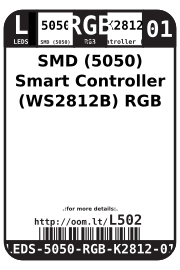
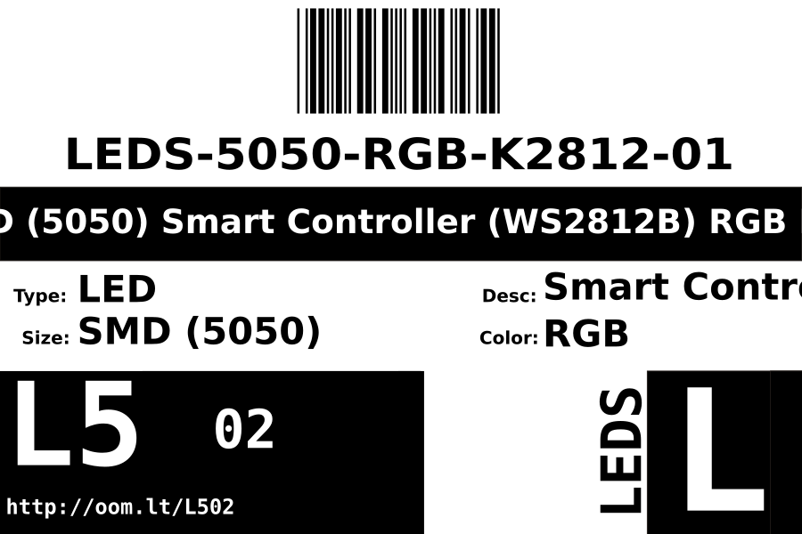

Contents
========

* [LEDS-5050-RGB-K2812-01>SMD (5050) Smart Controller (WS2812B) RGB LED](#leds-5050-rgb-k2812-01smd-5050-smart-controller-ws2812b-rgb-led)
	* [Datasheets](#datasheets)
	* [Labels](#labels)
	* [EDA](#eda)
		* [Symbols](#symbols)
	* [Tags](#tags)

# LEDS-5050-RGB-K2812-01>SMD (5050) Smart Controller (WS2812B) RGB LED

- ID: LEDS-5050-RGB-K2812-01
- Name: LEDS-5050-RGB-K2812-01

## Datasheets

- Datasheet: [datasheet.pdf](datasheet.pdf)

## Labels
  
  

|Front|Inventory|Specifications|
| :---: | :---: | :---: |
||||

## EDA

### Symbols

## Tags

- index: 393
- oompID: LEDS-5050-RGB-K2812-01
- name: SMD (5050) Smart Controller (WS2812B) RGB LED
- hexID: L502
- oompSort: LEDS5050K2812
- oompType: LEDS
- oompSize: 5050
- oompColor: RGB
- oompDesc: K2812
- oompIndex: 01
- oompVersion: 98
- ooWidth: 5
- ooLength: 5
- ooNumPins: 4
- ooDesignator: D1
