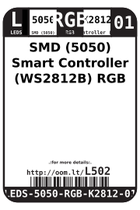
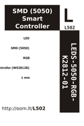

Contents
========

* [L502 > SMD (5050) Smart Controller (WS2812B) RGB LED](#l502--smd-5050-smart-controller-ws2812b-rgb-led)
	* [Datasheets](#datasheets)
	* [Labels](#labels)
	* [EDA](#eda)
	* [Images](#images)
	* [Tags](#tags)

# L502 > SMD (5050) Smart Controller (WS2812B) RGB LED

- ID: LEDS-5050-RGB-K2812-01
- Hex ID: L502
- Name: SMD (5050) Smart Controller (WS2812B) RGB LED
- Description: SMD (5050) Smart Controller (WS2812B) RGB LED
- Long Link: [http://oom.lt/LEDS-5050-RGB-K2812-01](http://oom.lt/LEDS-5050-RGB-K2812-01)
- Long Link: [http://oom.lt/L502](http://oom.lt/L502)

## Datasheets

- Datasheet: [datasheet.pdf](datasheet.pdf)

## Labels
  
  

|label-front|label-inventory|label-spec|
| :---: | :---: | :---: |
||||

## EDA

### Symbols

## Images
  
  

|label-front|label-inventory|label-spec|
| :---: | :---: | :---: |
||||

## Tags

- oompID: LEDS-5050-RGB-K2812-01
- name: SMD (5050) Smart Controller (WS2812B) RGB LED
- hexID: L502
- oompSort: LEDS5050K2812
- oompType: LEDS
- oompSize: 5050
- oompColor: RGB
- oompDesc: K2812
- oompIndex: 01
- oompVersion: 98
- ooWidth: 5
- ooLength: 5
- ooNumPins: 4
- ooDesignator: D1
