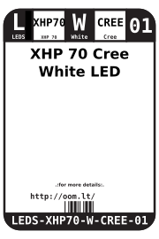
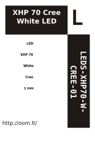

Contents
========

* [LEDS-XHP70-W-CREE-01>XHP 70 Cree White LED](#leds-xhp70-w-cree-01xhp-70-cree-white-led)
	* [Datasheets](#datasheets)
	* [Labels](#labels)
	* [EDA](#eda)
		* [Symbols](#symbols)
	* [Tags](#tags)

# LEDS-XHP70-W-CREE-01>XHP 70 Cree White LED

- ID: LEDS-XHP70-W-CREE-01
- Name: LEDS-XHP70-W-CREE-01

## Datasheets

- Datasheet: [datasheet.pdf](datasheet.pdf)

## Labels
  
  

|label-front|label-inventory|label-spec|
| :---: | :---: | :---: |
||||

## EDA

### Symbols

## Tags

- oompType: LEDS
- oompSize: XHP70
- oompColor: W
- oompDesc: CREE
- oompIndex: 01
- hexID: 
- footprintKicad: FOOTPRINT-kicad-kicad-footprints-LED_SMD-LED_Cree-XHP70_6V
- footprintKicad: FOOTPRINT-kicad-kicad-footprints-LED_SMD-LED_Cree-XHP70_12V
