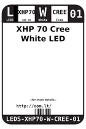

Contents
========

* [ > XHP 70 Cree White LED](#--xhp-70-cree-white-led)
	* [Images](#images)
	* [Datasheets](#datasheets)
	* [Labels](#labels)
	* [EDA](#eda)
	* [Tags](#tags)

#  > XHP 70 Cree White LED

- ID: LEDS-XHP70-W-CREE-01
- Hex ID: 
- Name: XHP 70 Cree White LED
- Description: XHP 70 Cree White LED

## Images
  
  

|label-front|label-inventory|label-spec|
| :---: | :---: | :---: |
||||

## Datasheets

- Datasheet: [datasheet.pdf](datasheet.pdf)

## Labels
  
  

|label-front|label-inventory|label-spec|
| :---: | :---: | :---: |
||||

## EDA

### Symbols

## Tags

- oompType: LEDS
- oompSize: XHP70
- oompColor: W
- oompDesc: CREE
- oompIndex: 01
- hexID: 
- footprintKicad: FOOTPRINT-kicad-kicad-footprints-LED_SMD-LED_Cree-XHP70_6V
- footprintKicad: FOOTPRINT-kicad-kicad-footprints-LED_SMD-LED_Cree-XHP70_12V
- oompID: LEDS-XHP70-W-CREE-01
