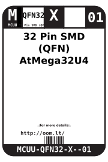
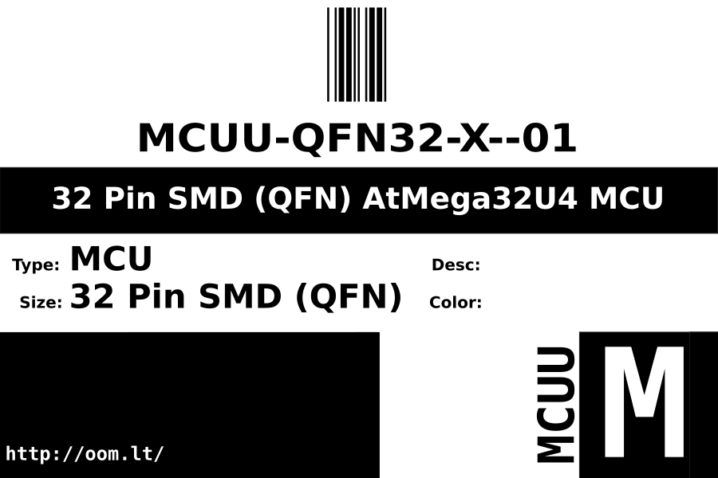
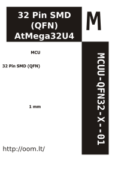

Contents
========

* [MCUU-QFN32-X--01>32 Pin SMD (QFN) AtMega32U4 MCU](#mcuu-qfn32-x--0132-pin-smd-qfn-atmega32u4-mcu)
	* [Labels](#labels)
	* [EDA](#eda)
		* [Symbols](#symbols)
	* [Tags](#tags)

# MCUU-QFN32-X--01>32 Pin SMD (QFN) AtMega32U4 MCU

- ID: MCUU-QFN32-X--01
- Name: MCUU-QFN32-X--01

## Labels
  
  

|label-front|label-inventory|label-spec|
| :---: | :---: | :---: |
||||

## EDA

### Symbols

## Tags

- oompID: MCUU-QFN32-X-K16U2-01
- name: 32 Pin SMD (QFN) AtMega32U4 MCU
- oompType: MCUU
- oompSize: QFN32
- oompColor: X
- oompIndex: 01
- oompVersion: 999
- ooWidth: 5mm
- ooHeight: 0.95mm
- ooLength: 5mm
