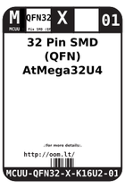
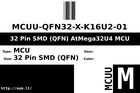

Contents
========

* [ > 32 Pin SMD (QFN) AtMega32U4 MCU](#--32-pin-smd-qfn-atmega32u4-mcu)
	* [Datasheets](#datasheets)
	* [Labels](#labels)
	* [EDA](#eda)
	* [Images](#images)
	* [Tags](#tags)

#  > 32 Pin SMD (QFN) AtMega32U4 MCU

- ID: MCUU-QFN32-X-K16U2-01
- Hex ID: 
- Name: 32 Pin SMD (QFN) AtMega32U4 MCU
- Description: 32 Pin SMD (QFN) AtMega32U4 MCU
- Long Link: [http://oom.lt/MCUU-QFN32-X-K16U2-01](http://oom.lt/MCUU-QFN32-X-K16U2-01)
- Short Link: [http://oom.lt/](http://oom.lt/)

## Datasheets

- Datasheet: [datasheet.pdf](datasheet.pdf)

## Labels
  
  

|label-front|label-inventory|label-spec|
| :---: | :---: | :---: |
||||

## EDA

### Symbols

## Images
  
  

|label-front|label-inventory|label-spec|
| :---: | :---: | :---: |
||||

## Tags

- oompID: MCUU-QFN32-X-K16U2-01
- name: 32 Pin SMD (QFN) AtMega32U4 MCU
- oompType: MCUU
- oompSize: QFN32
- oompColor: X
- oompIndex: 01
- oompVersion: 999
- ooWidth: 5mm
- ooHeight: 0.95mm
- ooLength: 5mm
