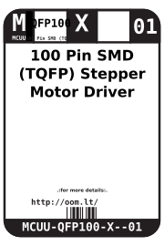
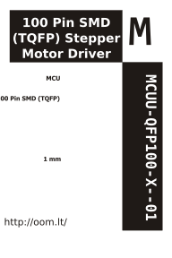

Contents
========

* [MCUU-QFP100-X--01>100 Pin SMD (TQFP) MCU](#mcuu-qfp100-x--01100-pin-smd-tqfp-mcu)
	* [Datasheets](#datasheets)
	* [Labels](#labels)
	* [EDA](#eda)
		* [Symbols](#symbols)
	* [Tags](#tags)

# MCUU-QFP100-X--01>100 Pin SMD (TQFP) MCU

- ID: MCUU-QFP100-X--01
- Name: MCUU-QFP100-X--01

## Datasheets

- Datasheet: [datasheet.pdf](datasheet.pdf)

## Labels
  
  

|Front|Inventory|Specifications|
| :---: | :---: | :---: |
||||

## EDA

### Symbols

## Tags

- oompType: MCUU
- oompSize: QFP100
- oompColor: X
- oompIndex: 01
- oompVersion: 999
- ooWidth: 14mm
- ooHeight: 1mm
- ooLength: 14mm
