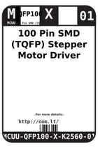
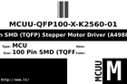

Contents
========

* [ > 100 Pin SMD (TQFP) Stepper Motor Driver (A4988) MCU](#--100-pin-smd-tqfp-stepper-motor-driver-a4988-mcu)
	* [Datasheets](#datasheets)
	* [Labels](#labels)
	* [EDA](#eda)
	* [Images](#images)
	* [Tags](#tags)

#  > 100 Pin SMD (TQFP) Stepper Motor Driver (A4988) MCU

- ID: MCUU-QFP100-X-K2560-01
- Hex ID: 
- Name: 100 Pin SMD (TQFP) Stepper Motor Driver (A4988) MCU
- Description: 100 Pin SMD (TQFP) Stepper Motor Driver (A4988) MCU
- Long Link: [http://oom.lt/MCUU-QFP100-X-K2560-01](http://oom.lt/MCUU-QFP100-X-K2560-01)
- Long Link: [http://oom.lt/](http://oom.lt/)

## Datasheets

- Datasheet: [datasheet.pdf](datasheet.pdf)

## Labels
  
  

|label-front|label-inventory|label-spec|
| :---: | :---: | :---: |
||||

## EDA

### Symbols

## Images
  
  

|label-front|label-inventory|label-spec|
| :---: | :---: | :---: |
||||

## Tags

- oompID: MCUU-QFP100-X-K2560-01
- name: 100 Pin SMD (TQFP) Stepper Motor Driver (A4988) MCU
- oompType: MCUU
- oompSize: QFP100
- oompColor: X
- oompIndex: 01
- oompVersion: 999
- ooWidth: 14mm
- ooHeight: 1mm
- ooLength: 14mm
