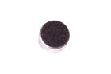
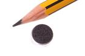
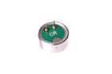
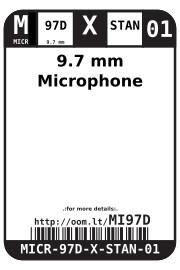
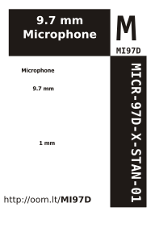

Contents
========

* [MICR-97D-X-STAN-01>9.7 mm Microphone](#micr-97d-x-stan-0197-mm-microphone)
	* [Images](#images)
	* [Datasheets](#datasheets)
	* [Labels](#labels)
	* [EDA](#eda)
		* [Symbols](#symbols)
	* [Tags](#tags)
  
![][im]
# MICR-97D-X-STAN-01>9.7 mm Microphone

- ID: MICR-97D-X-STAN-01
- Name: MICR-97D-X-STAN-01

## Images
  
  

|image|image_RE|image_BOTTOM|
| :---: | :---: | :---: |
||||

## Datasheets

- Datasheet: [datasheet.pdf](datasheet.pdf)

## Labels
  
  

|label-front|label-inventory|label-spec|
| :---: | :---: | :---: |
||||

## EDA

### Symbols

## Tags

- oompID: MICR-97D-X-STAN-01
- name: 9.7 mm Microphone
- hexID: MI97D
- oompSort: MICR97DSTAN
- oompType: MICR
- oompSize: 97D
- oompColor: X
- oompDesc: STAN
- oompIndex: 01
- oompVersion: 98
- ooDiameter: 9.7 mm
- ooNumPins: 2
- ooDesignator: MK1

[im]: image_600.jpg
