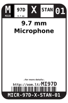
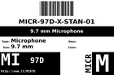
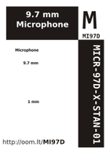

Contents
========

* [MI97D > 9.7 mm Microphone](#mi97d--97-mm-microphone)
	* [Datasheets](#datasheets)
	* [Labels](#labels)
	* [EDA](#eda)
	* [Images](#images)
	* [Tags](#tags)
  
![][im]
# MI97D > 9.7 mm Microphone

- ID: MICR-97D-X-STAN-01
- Hex ID: MI97D
- Name: 9.7 mm Microphone
- Description: 9.7 mm Microphone
- Long Link: [http://oom.lt/MICR-97D-X-STAN-01](http://oom.lt/MICR-97D-X-STAN-01)
- Short Link: [http://oom.lt/MI97D](http://oom.lt/MI97D)

## Datasheets

- Datasheet: [datasheet.pdf](datasheet.pdf)

## Labels
  
  

|label-front|label-inventory|label-spec|
| :---: | :---: | :---: |
||||

## EDA

### Symbols

## Images
  
  

|image|image_RE|image_BOTTOM|label-front|label-inventory|label-spec|
| :---: | :---: | :---: | :---: | :---: | :---: |
|||||||

## Tags

- oompID: MICR-97D-X-STAN-01
- name: 9.7 mm Microphone
- hexID: MI97D
- oompSort: MICR97DSTAN
- oompType: MICR
- oompSize: 97D
- oompColor: X
- oompDesc: STAN
- oompIndex: 01
- oompVersion: 98
- ooDiameter: 9.7 mm
- ooNumPins: 2
- ooDesignator: MK1

[im]: image_450.jpg
