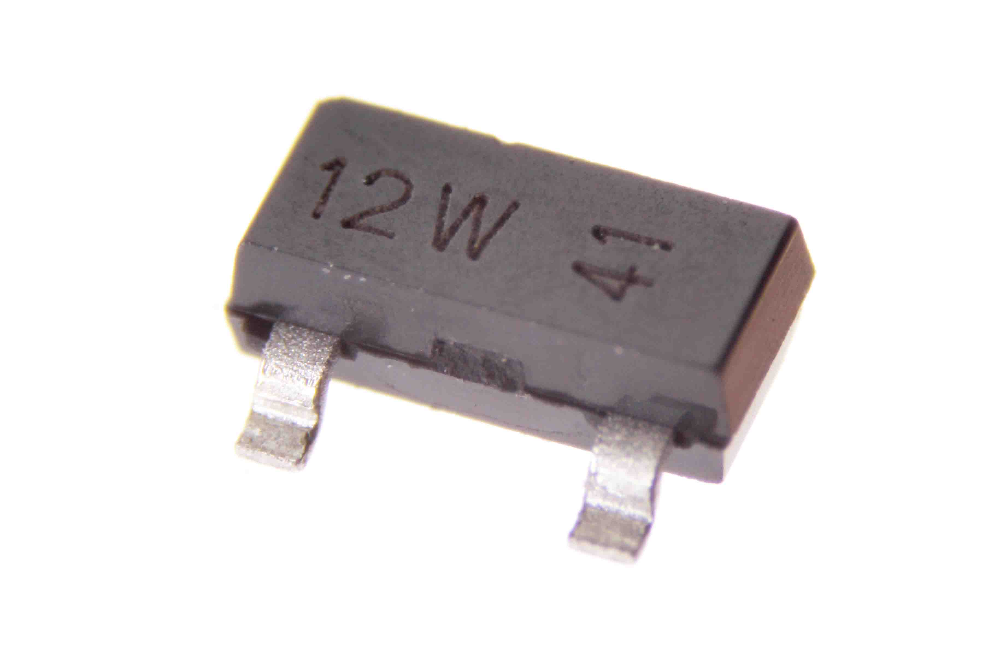

Contents
========

* [MOSN-SO23-X-A03D-01>SMD (SOT-23) 300 mA N-Ch. MOSFET](#mosn-so23-x-a03d-01smd-sot-23-300-ma-n-ch-mosfet)
	* [Images](#images)
	* [Datasheets](#datasheets)
	* [EDA](#eda)
		* [Footprints](#footprints)
		* [Symbols](#symbols)
	* [Tags](#tags)
  
![][im]
# MOSN-SO23-X-A03D-01>SMD (SOT-23) 300 mA N-Ch. MOSFET

- ID: MOSN-SO23-X-A03D-01
- Name: MOSN-SO23-X-A03D-01

## Images
  
  

|Main|
| :---: |
||

## Datasheets

- Datasheet: [datasheet.pdf](datasheet.pdf)

## EDA

### Footprints
  

|||||
| :---: | :---: | :---: | :---: |

### Symbols

## Tags

- index: 397
- oompID: MOSN-SO23-X-A03D-01
- name: SMD (SOT-23) 300 mA N-Ch. MOSFET
- hexID: MNS23D
- oompSort: 
- oompClass: Surface Mount
- oompClassCode: SMDS
- oompType: MOSN
- oompSize: SO23
- oompColor: X
- oompDesc: A03D
- oompIndex: 01
- oompVersion: 40
- ooPin1: Q
- ooPin2: S
- ooPin3: D
- oompBbls: template;XXXX-SO23-X-XXXX-01-bbls
- oompDiag: template;XXXX-SO23-X-XXXX-01-diag
- oompIden: template;XXXX-SO23-X-XXXX-01-iden
- oompSimp: template;XXXX-SO23-X-XXXX-01-simp
- ooPackageMarking: 12W
- ooDesignator: Q1

[im]: image_600.jpg
