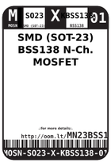
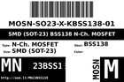
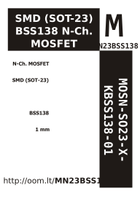

Contents
========

* [MN23BSS138 > SMD (SOT-23) BSS138 N-Ch. MOSFET](#mn23bss138--smd-sot-23-bss138-n-ch-mosfet)
	* [Datasheets](#datasheets)
	* [Labels](#labels)
	* [EDA](#eda)
	* [Images](#images)
	* [Tags](#tags)

# MN23BSS138 > SMD (SOT-23) BSS138 N-Ch. MOSFET

- ID: MOSN-SO23-X-KBSS138-01
- Hex ID: MN23BSS138
- Name: SMD (SOT-23) BSS138 N-Ch. MOSFET
- Description: SMD (SOT-23) BSS138 N-Ch. MOSFET
- Long Link: [http://oom.lt/MOSN-SO23-X-KBSS138-01](http://oom.lt/MOSN-SO23-X-KBSS138-01)
- Short Link: [http://oom.lt/MN23BSS138](http://oom.lt/MN23BSS138)

## Datasheets

- Datasheet: [datasheet.pdf](datasheet.pdf)

## Labels
  
  

|label-front|label-inventory|label-spec|
| :---: | :---: | :---: |
||||

## EDA
  

### Instances
  
Used 104 times.  
Prevalance: (104\10986) 0.9467%  

|Project|Occur- rences|Identifiers|
| :---: | :---: | :---: |
|[PROJ-ADAF-1032-STAN-01 Adafruit L3GD20 Breakout PCB](https://github.com/oomlout/oomlout_OOMP_projects/tree/main/PROJ-ADAF-1032-STAN-01/)|[2](https://github.com/oomlout/oomlout_OOMP_projects/tree/main/PROJ-ADAF-1032-STAN-01/)|[Q1, Q2](https://github.com/oomlout/oomlout_OOMP_projects/tree/main/PROJ-ADAF-1032-STAN-01/)|
|[PROJ-ADAF-1120-STAN-01 Adafruit LSM303 PCB](https://github.com/oomlout/oomlout_OOMP_projects/tree/main/PROJ-ADAF-1120-STAN-01/)|[2](https://github.com/oomlout/oomlout_OOMP_projects/tree/main/PROJ-ADAF-1120-STAN-01/)|[Q1, Q2](https://github.com/oomlout/oomlout_OOMP_projects/tree/main/PROJ-ADAF-1120-STAN-01/)|
|[PROJ-ADAF-1334-STAN-01 Adafruit TCS34725 Color Sensor Breakout PCB](https://github.com/oomlout/oomlout_OOMP_projects/tree/main/PROJ-ADAF-1334-STAN-01/)|[3](https://github.com/oomlout/oomlout_OOMP_projects/tree/main/PROJ-ADAF-1334-STAN-01/)|[Q1, Q2, Q3](https://github.com/oomlout/oomlout_OOMP_projects/tree/main/PROJ-ADAF-1334-STAN-01/)|
|[PROJ-ADAF-1356-STAN-01 Adafruit Flora TCS34725 Color Sensor PCB](https://github.com/oomlout/oomlout_OOMP_projects/tree/main/PROJ-ADAF-1356-STAN-01/)|[1](https://github.com/oomlout/oomlout_OOMP_projects/tree/main/PROJ-ADAF-1356-STAN-01/)|[Q3](https://github.com/oomlout/oomlout_OOMP_projects/tree/main/PROJ-ADAF-1356-STAN-01/)|
|[PROJ-ADAF-1571-STAN-01 Adafruit STMPE610 Breakout PCB](https://github.com/oomlout/oomlout_OOMP_projects/tree/main/PROJ-ADAF-1571-STAN-01/)|[2](https://github.com/oomlout/oomlout_OOMP_projects/tree/main/PROJ-ADAF-1571-STAN-01/)|[Q1, Q2](https://github.com/oomlout/oomlout_OOMP_projects/tree/main/PROJ-ADAF-1571-STAN-01/)|
|[PROJ-ADAF-1603-STAN-01 Adafruit BMP180 PCB](https://github.com/oomlout/oomlout_OOMP_projects/tree/main/PROJ-ADAF-1603-STAN-01/)|[2](https://github.com/oomlout/oomlout_OOMP_projects/tree/main/PROJ-ADAF-1603-STAN-01/)|[Q1, Q2](https://github.com/oomlout/oomlout_OOMP_projects/tree/main/PROJ-ADAF-1603-STAN-01/)|
|[PROJ-ADAF-1746-STAN-01 Adafruit HMC5883 Mag Compass Sensor PCB](https://github.com/oomlout/oomlout_OOMP_projects/tree/main/PROJ-ADAF-1746-STAN-01/)|[2](https://github.com/oomlout/oomlout_OOMP_projects/tree/main/PROJ-ADAF-1746-STAN-01/)|[Q1, Q2](https://github.com/oomlout/oomlout_OOMP_projects/tree/main/PROJ-ADAF-1746-STAN-01/)|
|[PROJ-ADAF-1752-STAN-01 Adafruit MAX9744 Amplifier PCB](https://github.com/oomlout/oomlout_OOMP_projects/tree/main/PROJ-ADAF-1752-STAN-01/)|[2](https://github.com/oomlout/oomlout_OOMP_projects/tree/main/PROJ-ADAF-1752-STAN-01/)|[Q2, Q4](https://github.com/oomlout/oomlout_OOMP_projects/tree/main/PROJ-ADAF-1752-STAN-01/)|
|[PROJ-ADAF-1777-STAN-01 Adafruit Si1145 Light Sensor PCB](https://github.com/oomlout/oomlout_OOMP_projects/tree/main/PROJ-ADAF-1777-STAN-01/)|[2](https://github.com/oomlout/oomlout_OOMP_projects/tree/main/PROJ-ADAF-1777-STAN-01/)|[Q1, Q2](https://github.com/oomlout/oomlout_OOMP_projects/tree/main/PROJ-ADAF-1777-STAN-01/)|
|[PROJ-ADAF-1893-STAN-01 Adafruit MPL3115A2 PCB](https://github.com/oomlout/oomlout_OOMP_projects/tree/main/PROJ-ADAF-1893-STAN-01/)|[2](https://github.com/oomlout/oomlout_OOMP_projects/tree/main/PROJ-ADAF-1893-STAN-01/)|[Q1, Q2](https://github.com/oomlout/oomlout_OOMP_projects/tree/main/PROJ-ADAF-1893-STAN-01/)|
|[PROJ-ADAF-1899-STAN-01 Adafruit HTU21D Breakout PCB](https://github.com/oomlout/oomlout_OOMP_projects/tree/main/PROJ-ADAF-1899-STAN-01/)|[2](https://github.com/oomlout/oomlout_OOMP_projects/tree/main/PROJ-ADAF-1899-STAN-01/)|[Q1, Q2](https://github.com/oomlout/oomlout_OOMP_projects/tree/main/PROJ-ADAF-1899-STAN-01/)|
|[PROJ-ADAF-1958-STAN-01 Adafruit Si4713 PCB](https://github.com/oomlout/oomlout_OOMP_projects/tree/main/PROJ-ADAF-1958-STAN-01/)|[2](https://github.com/oomlout/oomlout_OOMP_projects/tree/main/PROJ-ADAF-1958-STAN-01/)|[Q1, Q2](https://github.com/oomlout/oomlout_OOMP_projects/tree/main/PROJ-ADAF-1958-STAN-01/)|
|[PROJ-ADAF-2019-STAN-01 Adafruit MMA8451 Breakout PCB](https://github.com/oomlout/oomlout_OOMP_projects/tree/main/PROJ-ADAF-2019-STAN-01/)|[2](https://github.com/oomlout/oomlout_OOMP_projects/tree/main/PROJ-ADAF-2019-STAN-01/)|[Q1, Q2](https://github.com/oomlout/oomlout_OOMP_projects/tree/main/PROJ-ADAF-2019-STAN-01/)|
|[PROJ-ADAF-2021-STAN-01 Adafruit LSM9DS0 PCB](https://github.com/oomlout/oomlout_OOMP_projects/tree/main/PROJ-ADAF-2021-STAN-01/)|[2](https://github.com/oomlout/oomlout_OOMP_projects/tree/main/PROJ-ADAF-2021-STAN-01/)|[Q1, Q2](https://github.com/oomlout/oomlout_OOMP_projects/tree/main/PROJ-ADAF-2021-STAN-01/)|
|[PROJ-ADAF-2024-STAN-01 Adafruit MPR121 Capacitive Touch Shield PCB](https://github.com/oomlout/oomlout_OOMP_projects/tree/main/PROJ-ADAF-2024-STAN-01/)|[2](https://github.com/oomlout/oomlout_OOMP_projects/tree/main/PROJ-ADAF-2024-STAN-01/)|[Q1, Q2](https://github.com/oomlout/oomlout_OOMP_projects/tree/main/PROJ-ADAF-2024-STAN-01/)|
|[PROJ-ADAF-2045-STAN-01 Adafruit Si5351A Clock Generator Breakout PCB](https://github.com/oomlout/oomlout_OOMP_projects/tree/main/PROJ-ADAF-2045-STAN-01/)|[2](https://github.com/oomlout/oomlout_OOMP_projects/tree/main/PROJ-ADAF-2045-STAN-01/)|[Q1, Q2](https://github.com/oomlout/oomlout_OOMP_projects/tree/main/PROJ-ADAF-2045-STAN-01/)|
|[PROJ-ADAF-2088-STAN-01 Adafruit 1.44 TFT Breakout PCB](https://github.com/oomlout/oomlout_OOMP_projects/tree/main/PROJ-ADAF-2088-STAN-01/)|[1](https://github.com/oomlout/oomlout_OOMP_projects/tree/main/PROJ-ADAF-2088-STAN-01/)|[Q3](https://github.com/oomlout/oomlout_OOMP_projects/tree/main/PROJ-ADAF-2088-STAN-01/)|
|[PROJ-ADAF-2090-STAN-01 Adafruit 2.8 TFT with Capacitive Touch PCB](https://github.com/oomlout/oomlout_OOMP_projects/tree/main/PROJ-ADAF-2090-STAN-01/)|[3](https://github.com/oomlout/oomlout_OOMP_projects/tree/main/PROJ-ADAF-2090-STAN-01/)|[Q2, Q3, Q4](https://github.com/oomlout/oomlout_OOMP_projects/tree/main/PROJ-ADAF-2090-STAN-01/)|
|[PROJ-ADAF-2190-STAN-01 Adafruit Verter PCB](https://github.com/oomlout/oomlout_OOMP_projects/tree/main/PROJ-ADAF-2190-STAN-01/)|[1](https://github.com/oomlout/oomlout_OOMP_projects/tree/main/PROJ-ADAF-2190-STAN-01/)|[Q1](https://github.com/oomlout/oomlout_OOMP_projects/tree/main/PROJ-ADAF-2190-STAN-01/)|
|[PROJ-ADAF-2200-STAN-01 Adafruit LM4040 Voltage Reference PCB](https://github.com/oomlout/oomlout_OOMP_projects/tree/main/PROJ-ADAF-2200-STAN-01/)|[1](https://github.com/oomlout/oomlout_OOMP_projects/tree/main/PROJ-ADAF-2200-STAN-01/)|[Q1](https://github.com/oomlout/oomlout_OOMP_projects/tree/main/PROJ-ADAF-2200-STAN-01/)|
|[PROJ-ADAF-2218-STAN-01 Adafruit TFP401 HDMI To 40Pin TFT PCB](https://github.com/oomlout/oomlout_OOMP_projects/tree/main/PROJ-ADAF-2218-STAN-01/)|[1](https://github.com/oomlout/oomlout_OOMP_projects/tree/main/PROJ-ADAF-2218-STAN-01/)|[Q1](https://github.com/oomlout/oomlout_OOMP_projects/tree/main/PROJ-ADAF-2218-STAN-01/)|
|[PROJ-ADAF-2260-STAN-01 Adafruit 5 HDMI Backpack PCB](https://github.com/oomlout/oomlout_OOMP_projects/tree/main/PROJ-ADAF-2260-STAN-01/)|[1](https://github.com/oomlout/oomlout_OOMP_projects/tree/main/PROJ-ADAF-2260-STAN-01/)|[Q1](https://github.com/oomlout/oomlout_OOMP_projects/tree/main/PROJ-ADAF-2260-STAN-01/)|
|[PROJ-ADAF-2298-STAN-01 Adafruit PiTFT Plus 2.8 PCB](https://github.com/oomlout/oomlout_OOMP_projects/tree/main/PROJ-ADAF-2298-STAN-01/)|[1](https://github.com/oomlout/oomlout_OOMP_projects/tree/main/PROJ-ADAF-2298-STAN-01/)|[Q2](https://github.com/oomlout/oomlout_OOMP_projects/tree/main/PROJ-ADAF-2298-STAN-01/)|
|[PROJ-ADAF-2406-STAN-01 Adafruit 7 HDMI Backpack PCB](https://github.com/oomlout/oomlout_OOMP_projects/tree/main/PROJ-ADAF-2406-STAN-01/)|[1](https://github.com/oomlout/oomlout_OOMP_projects/tree/main/PROJ-ADAF-2406-STAN-01/)|[Q1](https://github.com/oomlout/oomlout_OOMP_projects/tree/main/PROJ-ADAF-2406-STAN-01/)|
|[PROJ-ADAF-2455-STAN-01 Adafruit PiTFT 2.4 Inch HAT PCB](https://github.com/oomlout/oomlout_OOMP_projects/tree/main/PROJ-ADAF-2455-STAN-01/)|[1](https://github.com/oomlout/oomlout_OOMP_projects/tree/main/PROJ-ADAF-2455-STAN-01/)|[Q4](https://github.com/oomlout/oomlout_OOMP_projects/tree/main/PROJ-ADAF-2455-STAN-01/)|
|[PROJ-ADAF-2472-STAN-01 Adafruit BNO055 Breakout PCB](https://github.com/oomlout/oomlout_OOMP_projects/tree/main/PROJ-ADAF-2472-STAN-01/)|[2](https://github.com/oomlout/oomlout_OOMP_projects/tree/main/PROJ-ADAF-2472-STAN-01/)|[Q1, Q2](https://github.com/oomlout/oomlout_OOMP_projects/tree/main/PROJ-ADAF-2472-STAN-01/)|
|[PROJ-ADAF-2616-STAN-01 Adafruit PiTFT Plus 3.2 PCB](https://github.com/oomlout/oomlout_OOMP_projects/tree/main/PROJ-ADAF-2616-STAN-01/)|[1](https://github.com/oomlout/oomlout_OOMP_projects/tree/main/PROJ-ADAF-2616-STAN-01/)|[Q2](https://github.com/oomlout/oomlout_OOMP_projects/tree/main/PROJ-ADAF-2616-STAN-01/)|
|[PROJ-ADAF-2633-STAN-01 Adafruit Bluefruit LE SPI Friend PCB](https://github.com/oomlout/oomlout_OOMP_projects/tree/main/PROJ-ADAF-2633-STAN-01/)|[1](https://github.com/oomlout/oomlout_OOMP_projects/tree/main/PROJ-ADAF-2633-STAN-01/)|[Q1](https://github.com/oomlout/oomlout_OOMP_projects/tree/main/PROJ-ADAF-2633-STAN-01/)|
|[PROJ-ADAF-2651-STAN-01 Adafruit BMP280 Breakout PCB](https://github.com/oomlout/oomlout_OOMP_projects/tree/main/PROJ-ADAF-2651-STAN-01/)|[2](https://github.com/oomlout/oomlout_OOMP_projects/tree/main/PROJ-ADAF-2651-STAN-01/)|[Q3, Q4](https://github.com/oomlout/oomlout_OOMP_projects/tree/main/PROJ-ADAF-2651-STAN-01/)|
|[PROJ-ADAF-2652-STAN-01 Adafruit BME280 Breakout PCB](https://github.com/oomlout/oomlout_OOMP_projects/tree/main/PROJ-ADAF-2652-STAN-01/)|[2](https://github.com/oomlout/oomlout_OOMP_projects/tree/main/PROJ-ADAF-2652-STAN-01/)|[Q3, Q4](https://github.com/oomlout/oomlout_OOMP_projects/tree/main/PROJ-ADAF-2652-STAN-01/)|
|[PROJ-ADAF-2746-STAN-01 Adafruit Bluefruit LE Shield PCB](https://github.com/oomlout/oomlout_OOMP_projects/tree/main/PROJ-ADAF-2746-STAN-01/)|[1](https://github.com/oomlout/oomlout_OOMP_projects/tree/main/PROJ-ADAF-2746-STAN-01/)|[Q1](https://github.com/oomlout/oomlout_OOMP_projects/tree/main/PROJ-ADAF-2746-STAN-01/)|
|[PROJ-ADAF-3315-STAN-01 Adafruit 2.4 TFT FeatherWing PCB](https://github.com/oomlout/oomlout_OOMP_projects/tree/main/PROJ-ADAF-3315-STAN-01/)|[1](https://github.com/oomlout/oomlout_OOMP_projects/tree/main/PROJ-ADAF-3315-STAN-01/)|[Q4](https://github.com/oomlout/oomlout_OOMP_projects/tree/main/PROJ-ADAF-3315-STAN-01/)|
|[PROJ-ADAF-3316-STAN-01 Adafruit VL6180X ToF Distance Sensor PCB](https://github.com/oomlout/oomlout_OOMP_projects/tree/main/PROJ-ADAF-3316-STAN-01/)|[2](https://github.com/oomlout/oomlout_OOMP_projects/tree/main/PROJ-ADAF-3316-STAN-01/)|[Q1, Q2](https://github.com/oomlout/oomlout_OOMP_projects/tree/main/PROJ-ADAF-3316-STAN-01/)|
|[PROJ-ADAF-3317-STAN-01 Adafruit VL53L0X ToF Distance Sensor PCB](https://github.com/oomlout/oomlout_OOMP_projects/tree/main/PROJ-ADAF-3317-STAN-01/)|[2](https://github.com/oomlout/oomlout_OOMP_projects/tree/main/PROJ-ADAF-3317-STAN-01/)|[Q1, Q2](https://github.com/oomlout/oomlout_OOMP_projects/tree/main/PROJ-ADAF-3317-STAN-01/)|
|[PROJ-ADAF-3449-STAN-01 Adafruit DotStar FeatherWing PCB](https://github.com/oomlout/oomlout_OOMP_projects/tree/main/PROJ-ADAF-3449-STAN-01/)|[1](https://github.com/oomlout/oomlout_OOMP_projects/tree/main/PROJ-ADAF-3449-STAN-01/)|[Q1](https://github.com/oomlout/oomlout_OOMP_projects/tree/main/PROJ-ADAF-3449-STAN-01/)|
|[PROJ-ADAF-3463-STAN-01 Adafruit FXOS8700 FXAS21002 9 DoF Breakout PCB](https://github.com/oomlout/oomlout_OOMP_projects/tree/main/PROJ-ADAF-3463-STAN-01/)|[3](https://github.com/oomlout/oomlout_OOMP_projects/tree/main/PROJ-ADAF-3463-STAN-01/)|[Q1, Q2, Q3](https://github.com/oomlout/oomlout_OOMP_projects/tree/main/PROJ-ADAF-3463-STAN-01/)|
|[PROJ-ADAF-3538-STAN-01 Adafruit AMG8833 Breakout PCB](https://github.com/oomlout/oomlout_OOMP_projects/tree/main/PROJ-ADAF-3538-STAN-01/)|[2](https://github.com/oomlout/oomlout_OOMP_projects/tree/main/PROJ-ADAF-3538-STAN-01/)|[Q1, Q2](https://github.com/oomlout/oomlout_OOMP_projects/tree/main/PROJ-ADAF-3538-STAN-01/)|
|[PROJ-ADAF-3595-STAN-01 Adafruit APDS9960 Breakout PCB](https://github.com/oomlout/oomlout_OOMP_projects/tree/main/PROJ-ADAF-3595-STAN-01/)|[2](https://github.com/oomlout/oomlout_OOMP_projects/tree/main/PROJ-ADAF-3595-STAN-01/)|[Q1, Q2](https://github.com/oomlout/oomlout_OOMP_projects/tree/main/PROJ-ADAF-3595-STAN-01/)|
|[PROJ-ADAF-3787-STAN-01 Adafruit 1.54 inch 240x240 TFT PCB](https://github.com/oomlout/oomlout_OOMP_projects/tree/main/PROJ-ADAF-3787-STAN-01/)|[1](https://github.com/oomlout/oomlout_OOMP_projects/tree/main/PROJ-ADAF-3787-STAN-01/)|[Q3](https://github.com/oomlout/oomlout_OOMP_projects/tree/main/PROJ-ADAF-3787-STAN-01/)|
|[PROJ-ADAF-3900-STAN-01 Adafruit Hallowing M0 PCB](https://github.com/oomlout/oomlout_OOMP_projects/tree/main/PROJ-ADAF-3900-STAN-01/)|[1](https://github.com/oomlout/oomlout_OOMP_projects/tree/main/PROJ-ADAF-3900-STAN-01/)|[Q3](https://github.com/oomlout/oomlout_OOMP_projects/tree/main/PROJ-ADAF-3900-STAN-01/)|
|[PROJ-ADAF-391-STAN-01 Adafruit BMP085 PCB](https://github.com/oomlout/oomlout_OOMP_projects/tree/main/PROJ-ADAF-391-STAN-01/)|[2](https://github.com/oomlout/oomlout_OOMP_projects/tree/main/PROJ-ADAF-391-STAN-01/)|[Q1, Q2](https://github.com/oomlout/oomlout_OOMP_projects/tree/main/PROJ-ADAF-391-STAN-01/)|
|[PROJ-ADAF-3954-STAN-01 Adafruit NeoTrellis 4x4 PCB](https://github.com/oomlout/oomlout_OOMP_projects/tree/main/PROJ-ADAF-3954-STAN-01/)|[2](https://github.com/oomlout/oomlout_OOMP_projects/tree/main/PROJ-ADAF-3954-STAN-01/)|[Q1, Q2](https://github.com/oomlout/oomlout_OOMP_projects/tree/main/PROJ-ADAF-3954-STAN-01/)|
|[PROJ-ADAF-4132-STAN-01 Adafruit GPIO Expander Bonnet PCBs](https://github.com/oomlout/oomlout_OOMP_projects/tree/main/PROJ-ADAF-4132-STAN-01/)|[2](https://github.com/oomlout/oomlout_OOMP_projects/tree/main/PROJ-ADAF-4132-STAN-01/)|[Q1, Q2](https://github.com/oomlout/oomlout_OOMP_projects/tree/main/PROJ-ADAF-4132-STAN-01/)|
|[PROJ-ADAF-4201-STAN-01 Adafruit AirLift Breakout PCB](https://github.com/oomlout/oomlout_OOMP_projects/tree/main/PROJ-ADAF-4201-STAN-01/)|[1](https://github.com/oomlout/oomlout_OOMP_projects/tree/main/PROJ-ADAF-4201-STAN-01/)|[Q3](https://github.com/oomlout/oomlout_OOMP_projects/tree/main/PROJ-ADAF-4201-STAN-01/)|
|[PROJ-ADAF-4300-STAN-01 Adafruit Hallowing M4 PCB](https://github.com/oomlout/oomlout_OOMP_projects/tree/main/PROJ-ADAF-4300-STAN-01/)|[1](https://github.com/oomlout/oomlout_OOMP_projects/tree/main/PROJ-ADAF-4300-STAN-01/)|[Q4](https://github.com/oomlout/oomlout_OOMP_projects/tree/main/PROJ-ADAF-4300-STAN-01/)|
|[PROJ-ADAF-4311-STAN-01 Adafruit 2.0 inch 240x320 TFT PCB](https://github.com/oomlout/oomlout_OOMP_projects/tree/main/PROJ-ADAF-4311-STAN-01/)|[1](https://github.com/oomlout/oomlout_OOMP_projects/tree/main/PROJ-ADAF-4311-STAN-01/)|[Q1](https://github.com/oomlout/oomlout_OOMP_projects/tree/main/PROJ-ADAF-4311-STAN-01/)|
|[PROJ-ADAF-4313-STAN-01 Adafruit 1.3 inch 240x240 TFT PCB](https://github.com/oomlout/oomlout_OOMP_projects/tree/main/PROJ-ADAF-4313-STAN-01/)|[1](https://github.com/oomlout/oomlout_OOMP_projects/tree/main/PROJ-ADAF-4313-STAN-01/)|[Q3](https://github.com/oomlout/oomlout_OOMP_projects/tree/main/PROJ-ADAF-4313-STAN-01/)|
|[PROJ-ADAF-4367-STAN-01 Adafruit TFT Gizmo PCB](https://github.com/oomlout/oomlout_OOMP_projects/tree/main/PROJ-ADAF-4367-STAN-01/)|[1](https://github.com/oomlout/oomlout_OOMP_projects/tree/main/PROJ-ADAF-4367-STAN-01/)|[Q1](https://github.com/oomlout/oomlout_OOMP_projects/tree/main/PROJ-ADAF-4367-STAN-01/)|
|[PROJ-ADAF-4500-STAN-01 Adafruit CLUE PCB](https://github.com/oomlout/oomlout_OOMP_projects/tree/main/PROJ-ADAF-4500-STAN-01/)|[2](https://github.com/oomlout/oomlout_OOMP_projects/tree/main/PROJ-ADAF-4500-STAN-01/)|[Q1, Q3](https://github.com/oomlout/oomlout_OOMP_projects/tree/main/PROJ-ADAF-4500-STAN-01/)|
|[PROJ-ADAF-4506-STAN-01 Adafruit 1.3in Color TFT Bonnet PCB](https://github.com/oomlout/oomlout_OOMP_projects/tree/main/PROJ-ADAF-4506-STAN-01/)|[1](https://github.com/oomlout/oomlout_OOMP_projects/tree/main/PROJ-ADAF-4506-STAN-01/)|[Q3](https://github.com/oomlout/oomlout_OOMP_projects/tree/main/PROJ-ADAF-4506-STAN-01/)|
|[PROJ-ADAF-4534-STAN-01 Adafruit Bonsai Buckaroo PCB](https://github.com/oomlout/oomlout_OOMP_projects/tree/main/PROJ-ADAF-4534-STAN-01/)|[2](https://github.com/oomlout/oomlout_OOMP_projects/tree/main/PROJ-ADAF-4534-STAN-01/)|[Q1, Q2](https://github.com/oomlout/oomlout_OOMP_projects/tree/main/PROJ-ADAF-4534-STAN-01/)|
|[PROJ-ADAF-4985-STAN-01 Adafruit FunHouse PCB](https://github.com/oomlout/oomlout_OOMP_projects/tree/main/PROJ-ADAF-4985-STAN-01/)|[2](https://github.com/oomlout/oomlout_OOMP_projects/tree/main/PROJ-ADAF-4985-STAN-01/)|[Q1, Q4](https://github.com/oomlout/oomlout_OOMP_projects/tree/main/PROJ-ADAF-4985-STAN-01/)|
|[PROJ-ADAF-512-STAN-01 Adafruit 9 DOF and 10 DOF PCBs](https://github.com/oomlout/oomlout_OOMP_projects/tree/main/PROJ-ADAF-512-STAN-01/)|[2](https://github.com/oomlout/oomlout_OOMP_projects/tree/main/PROJ-ADAF-512-STAN-01/)|[Q1, Q2](https://github.com/oomlout/oomlout_OOMP_projects/tree/main/PROJ-ADAF-512-STAN-01/)|
|[PROJ-ADAF-5206-STAN-01 Adafruit 1.69in 280x240 Round Rectangle TFT PCB](https://github.com/oomlout/oomlout_OOMP_projects/tree/main/PROJ-ADAF-5206-STAN-01/)|[1](https://github.com/oomlout/oomlout_OOMP_projects/tree/main/PROJ-ADAF-5206-STAN-01/)|[Q3](https://github.com/oomlout/oomlout_OOMP_projects/tree/main/PROJ-ADAF-5206-STAN-01/)|
|[PROJ-ADAF-5300-STAN-01 Adafruit ESP32 S2 TFT Feather PCB](https://github.com/oomlout/oomlout_OOMP_projects/tree/main/PROJ-ADAF-5300-STAN-01/)|[1](https://github.com/oomlout/oomlout_OOMP_projects/tree/main/PROJ-ADAF-5300-STAN-01/)|[Q1](https://github.com/oomlout/oomlout_OOMP_projects/tree/main/PROJ-ADAF-5300-STAN-01/)|
|[PROJ-ADAF-5393-STAN-01 Adafruit 1.47in 320x172 Round Rectangle TFT PCB](https://github.com/oomlout/oomlout_OOMP_projects/tree/main/PROJ-ADAF-5393-STAN-01/)|[1](https://github.com/oomlout/oomlout_OOMP_projects/tree/main/PROJ-ADAF-5393-STAN-01/)|[Q3](https://github.com/oomlout/oomlout_OOMP_projects/tree/main/PROJ-ADAF-5393-STAN-01/)|
|[PROJ-ADAF-5394-STAN-01 Adafruit 1.9in 320x170 Color IPS TFT PCB](https://github.com/oomlout/oomlout_OOMP_projects/tree/main/PROJ-ADAF-5394-STAN-01/)|[1](https://github.com/oomlout/oomlout_OOMP_projects/tree/main/PROJ-ADAF-5394-STAN-01/)|[Q3](https://github.com/oomlout/oomlout_OOMP_projects/tree/main/PROJ-ADAF-5394-STAN-01/)|
|[PROJ-ADAF-757-STAN-01 4 Channel Level Shifter PCB](https://github.com/oomlout/oomlout_OOMP_projects/tree/main/PROJ-ADAF-757-STAN-01/)|[4](https://github.com/oomlout/oomlout_OOMP_projects/tree/main/PROJ-ADAF-757-STAN-01/)|[Q1, Q2, Q3, Q4](https://github.com/oomlout/oomlout_OOMP_projects/tree/main/PROJ-ADAF-757-STAN-01/)|
|[PROJ-ADAF-789-STAN-01 Adafruit PN532 RFID NFC Shield](https://github.com/oomlout/oomlout_OOMP_projects/tree/main/PROJ-ADAF-789-STAN-01/)|[5](https://github.com/oomlout/oomlout_OOMP_projects/tree/main/PROJ-ADAF-789-STAN-01/)|[Q1, Q2, Q3, Q4, Q6](https://github.com/oomlout/oomlout_OOMP_projects/tree/main/PROJ-ADAF-789-STAN-01/)|
|[PROJ-ADAF-931-STAN-01 Adafruit 128x32 I2C OLED Breakout PCB](https://github.com/oomlout/oomlout_OOMP_projects/tree/main/PROJ-ADAF-931-STAN-01/)|[2](https://github.com/oomlout/oomlout_OOMP_projects/tree/main/PROJ-ADAF-931-STAN-01/)|[Q1, Q2](https://github.com/oomlout/oomlout_OOMP_projects/tree/main/PROJ-ADAF-931-STAN-01/)|
|[PROJ-ADAF-938-STAN-01 Adafruit 1.3inch 128x64 Mono OLED PCB](https://github.com/oomlout/oomlout_OOMP_projects/tree/main/PROJ-ADAF-938-STAN-01/)|[2](https://github.com/oomlout/oomlout_OOMP_projects/tree/main/PROJ-ADAF-938-STAN-01/)|[Q1, Q2](https://github.com/oomlout/oomlout_OOMP_projects/tree/main/PROJ-ADAF-938-STAN-01/)|

## Images
  
  

|label-front|label-inventory|label-spec|
| :---: | :---: | :---: |
||||

## Tags

- oompType: MOSN
- oompSize: SO23
- oompColor: X
- oompDesc: KBSS138
- oompIndex: 01
- hexID: MN23BSS138
- oompID: MOSN-SO23-X-KBSS138-01
- oompInstances: {'PROJECT': 'PROJ-ADAF-1032-STAN-01', 'ID': 'Q1'}
- oompInstances: {'PROJECT': 'PROJ-ADAF-1032-STAN-01', 'ID': 'Q2'}
- oompInstances: {'PROJECT': 'PROJ-ADAF-1120-STAN-01', 'ID': 'Q1'}
- oompInstances: {'PROJECT': 'PROJ-ADAF-1120-STAN-01', 'ID': 'Q2'}
- oompInstances: {'PROJECT': 'PROJ-ADAF-1334-STAN-01', 'ID': 'Q1'}
- oompInstances: {'PROJECT': 'PROJ-ADAF-1334-STAN-01', 'ID': 'Q2'}
- oompInstances: {'PROJECT': 'PROJ-ADAF-1334-STAN-01', 'ID': 'Q3'}
- oompInstances: {'PROJECT': 'PROJ-ADAF-1356-STAN-01', 'ID': 'Q3'}
- oompInstances: {'PROJECT': 'PROJ-ADAF-1571-STAN-01', 'ID': 'Q1'}
- oompInstances: {'PROJECT': 'PROJ-ADAF-1571-STAN-01', 'ID': 'Q2'}
- oompInstances: {'PROJECT': 'PROJ-ADAF-1603-STAN-01', 'ID': 'Q1'}
- oompInstances: {'PROJECT': 'PROJ-ADAF-1603-STAN-01', 'ID': 'Q2'}
- oompInstances: {'PROJECT': 'PROJ-ADAF-1746-STAN-01', 'ID': 'Q1'}
- oompInstances: {'PROJECT': 'PROJ-ADAF-1746-STAN-01', 'ID': 'Q2'}
- oompInstances: {'PROJECT': 'PROJ-ADAF-1752-STAN-01', 'ID': 'Q2'}
- oompInstances: {'PROJECT': 'PROJ-ADAF-1752-STAN-01', 'ID': 'Q4'}
- oompInstances: {'PROJECT': 'PROJ-ADAF-1777-STAN-01', 'ID': 'Q1'}
- oompInstances: {'PROJECT': 'PROJ-ADAF-1777-STAN-01', 'ID': 'Q2'}
- oompInstances: {'PROJECT': 'PROJ-ADAF-1893-STAN-01', 'ID': 'Q1'}
- oompInstances: {'PROJECT': 'PROJ-ADAF-1893-STAN-01', 'ID': 'Q2'}
- oompInstances: {'PROJECT': 'PROJ-ADAF-1899-STAN-01', 'ID': 'Q1'}
- oompInstances: {'PROJECT': 'PROJ-ADAF-1899-STAN-01', 'ID': 'Q2'}
- oompInstances: {'PROJECT': 'PROJ-ADAF-1958-STAN-01', 'ID': 'Q1'}
- oompInstances: {'PROJECT': 'PROJ-ADAF-1958-STAN-01', 'ID': 'Q2'}
- oompInstances: {'PROJECT': 'PROJ-ADAF-2019-STAN-01', 'ID': 'Q1'}
- oompInstances: {'PROJECT': 'PROJ-ADAF-2019-STAN-01', 'ID': 'Q2'}
- oompInstances: {'PROJECT': 'PROJ-ADAF-2021-STAN-01', 'ID': 'Q1'}
- oompInstances: {'PROJECT': 'PROJ-ADAF-2021-STAN-01', 'ID': 'Q2'}
- oompInstances: {'PROJECT': 'PROJ-ADAF-2024-STAN-01', 'ID': 'Q1'}
- oompInstances: {'PROJECT': 'PROJ-ADAF-2024-STAN-01', 'ID': 'Q2'}
- oompInstances: {'PROJECT': 'PROJ-ADAF-2045-STAN-01', 'ID': 'Q1'}
- oompInstances: {'PROJECT': 'PROJ-ADAF-2045-STAN-01', 'ID': 'Q2'}
- oompInstances: {'PROJECT': 'PROJ-ADAF-2088-STAN-01', 'ID': 'Q3'}
- oompInstances: {'PROJECT': 'PROJ-ADAF-2090-STAN-01', 'ID': 'Q2'}
- oompInstances: {'PROJECT': 'PROJ-ADAF-2090-STAN-01', 'ID': 'Q3'}
- oompInstances: {'PROJECT': 'PROJ-ADAF-2090-STAN-01', 'ID': 'Q4'}
- oompInstances: {'PROJECT': 'PROJ-ADAF-2190-STAN-01', 'ID': 'Q1'}
- oompInstances: {'PROJECT': 'PROJ-ADAF-2200-STAN-01', 'ID': 'Q1'}
- oompInstances: {'PROJECT': 'PROJ-ADAF-2218-STAN-01', 'ID': 'Q1'}
- oompInstances: {'PROJECT': 'PROJ-ADAF-2260-STAN-01', 'ID': 'Q1'}
- oompInstances: {'PROJECT': 'PROJ-ADAF-2298-STAN-01', 'ID': 'Q2'}
- oompInstances: {'PROJECT': 'PROJ-ADAF-2406-STAN-01', 'ID': 'Q1'}
- oompInstances: {'PROJECT': 'PROJ-ADAF-2455-STAN-01', 'ID': 'Q4'}
- oompInstances: {'PROJECT': 'PROJ-ADAF-2472-STAN-01', 'ID': 'Q1'}
- oompInstances: {'PROJECT': 'PROJ-ADAF-2472-STAN-01', 'ID': 'Q2'}
- oompInstances: {'PROJECT': 'PROJ-ADAF-2616-STAN-01', 'ID': 'Q2'}
- oompInstances: {'PROJECT': 'PROJ-ADAF-2633-STAN-01', 'ID': 'Q1'}
- oompInstances: {'PROJECT': 'PROJ-ADAF-2651-STAN-01', 'ID': 'Q3'}
- oompInstances: {'PROJECT': 'PROJ-ADAF-2651-STAN-01', 'ID': 'Q4'}
- oompInstances: {'PROJECT': 'PROJ-ADAF-2652-STAN-01', 'ID': 'Q3'}
- oompInstances: {'PROJECT': 'PROJ-ADAF-2652-STAN-01', 'ID': 'Q4'}
- oompInstances: {'PROJECT': 'PROJ-ADAF-2746-STAN-01', 'ID': 'Q1'}
- oompInstances: {'PROJECT': 'PROJ-ADAF-3315-STAN-01', 'ID': 'Q4'}
- oompInstances: {'PROJECT': 'PROJ-ADAF-3316-STAN-01', 'ID': 'Q1'}
- oompInstances: {'PROJECT': 'PROJ-ADAF-3316-STAN-01', 'ID': 'Q2'}
- oompInstances: {'PROJECT': 'PROJ-ADAF-3317-STAN-01', 'ID': 'Q1'}
- oompInstances: {'PROJECT': 'PROJ-ADAF-3317-STAN-01', 'ID': 'Q2'}
- oompInstances: {'PROJECT': 'PROJ-ADAF-3449-STAN-01', 'ID': 'Q1'}
- oompInstances: {'PROJECT': 'PROJ-ADAF-3463-STAN-01', 'ID': 'Q1'}
- oompInstances: {'PROJECT': 'PROJ-ADAF-3463-STAN-01', 'ID': 'Q2'}
- oompInstances: {'PROJECT': 'PROJ-ADAF-3463-STAN-01', 'ID': 'Q3'}
- oompInstances: {'PROJECT': 'PROJ-ADAF-3538-STAN-01', 'ID': 'Q1'}
- oompInstances: {'PROJECT': 'PROJ-ADAF-3538-STAN-01', 'ID': 'Q2'}
- oompInstances: {'PROJECT': 'PROJ-ADAF-3595-STAN-01', 'ID': 'Q1'}
- oompInstances: {'PROJECT': 'PROJ-ADAF-3595-STAN-01', 'ID': 'Q2'}
- oompInstances: {'PROJECT': 'PROJ-ADAF-3787-STAN-01', 'ID': 'Q3'}
- oompInstances: {'PROJECT': 'PROJ-ADAF-3900-STAN-01', 'ID': 'Q3'}
- oompInstances: {'PROJECT': 'PROJ-ADAF-391-STAN-01', 'ID': 'Q1'}
- oompInstances: {'PROJECT': 'PROJ-ADAF-391-STAN-01', 'ID': 'Q2'}
- oompInstances: {'PROJECT': 'PROJ-ADAF-3954-STAN-01', 'ID': 'Q1'}
- oompInstances: {'PROJECT': 'PROJ-ADAF-3954-STAN-01', 'ID': 'Q2'}
- oompInstances: {'PROJECT': 'PROJ-ADAF-4132-STAN-01', 'ID': 'Q1'}
- oompInstances: {'PROJECT': 'PROJ-ADAF-4132-STAN-01', 'ID': 'Q2'}
- oompInstances: {'PROJECT': 'PROJ-ADAF-4201-STAN-01', 'ID': 'Q3'}
- oompInstances: {'PROJECT': 'PROJ-ADAF-4300-STAN-01', 'ID': 'Q4'}
- oompInstances: {'PROJECT': 'PROJ-ADAF-4311-STAN-01', 'ID': 'Q1'}
- oompInstances: {'PROJECT': 'PROJ-ADAF-4313-STAN-01', 'ID': 'Q3'}
- oompInstances: {'PROJECT': 'PROJ-ADAF-4367-STAN-01', 'ID': 'Q1'}
- oompInstances: {'PROJECT': 'PROJ-ADAF-4500-STAN-01', 'ID': 'Q1'}
- oompInstances: {'PROJECT': 'PROJ-ADAF-4500-STAN-01', 'ID': 'Q3'}
- oompInstances: {'PROJECT': 'PROJ-ADAF-4506-STAN-01', 'ID': 'Q3'}
- oompInstances: {'PROJECT': 'PROJ-ADAF-4534-STAN-01', 'ID': 'Q1'}
- oompInstances: {'PROJECT': 'PROJ-ADAF-4534-STAN-01', 'ID': 'Q2'}
- oompInstances: {'PROJECT': 'PROJ-ADAF-4985-STAN-01', 'ID': 'Q1'}
- oompInstances: {'PROJECT': 'PROJ-ADAF-4985-STAN-01', 'ID': 'Q4'}
- oompInstances: {'PROJECT': 'PROJ-ADAF-512-STAN-01', 'ID': 'Q1'}
- oompInstances: {'PROJECT': 'PROJ-ADAF-512-STAN-01', 'ID': 'Q2'}
- oompInstances: {'PROJECT': 'PROJ-ADAF-5206-STAN-01', 'ID': 'Q3'}
- oompInstances: {'PROJECT': 'PROJ-ADAF-5300-STAN-01', 'ID': 'Q1'}
- oompInstances: {'PROJECT': 'PROJ-ADAF-5393-STAN-01', 'ID': 'Q3'}
- oompInstances: {'PROJECT': 'PROJ-ADAF-5394-STAN-01', 'ID': 'Q3'}
- oompInstances: {'PROJECT': 'PROJ-ADAF-757-STAN-01', 'ID': 'Q1'}
- oompInstances: {'PROJECT': 'PROJ-ADAF-757-STAN-01', 'ID': 'Q2'}
- oompInstances: {'PROJECT': 'PROJ-ADAF-757-STAN-01', 'ID': 'Q3'}
- oompInstances: {'PROJECT': 'PROJ-ADAF-757-STAN-01', 'ID': 'Q4'}
- oompInstances: {'PROJECT': 'PROJ-ADAF-789-STAN-01', 'ID': 'Q1'}
- oompInstances: {'PROJECT': 'PROJ-ADAF-789-STAN-01', 'ID': 'Q2'}
- oompInstances: {'PROJECT': 'PROJ-ADAF-789-STAN-01', 'ID': 'Q3'}
- oompInstances: {'PROJECT': 'PROJ-ADAF-789-STAN-01', 'ID': 'Q4'}
- oompInstances: {'PROJECT': 'PROJ-ADAF-789-STAN-01', 'ID': 'Q6'}
- oompInstances: {'PROJECT': 'PROJ-ADAF-931-STAN-01', 'ID': 'Q1'}
- oompInstances: {'PROJECT': 'PROJ-ADAF-931-STAN-01', 'ID': 'Q2'}
- oompInstances: {'PROJECT': 'PROJ-ADAF-938-STAN-01', 'ID': 'Q1'}
- oompInstances: {'PROJECT': 'PROJ-ADAF-938-STAN-01', 'ID': 'Q2'}
