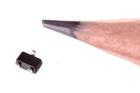
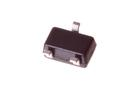
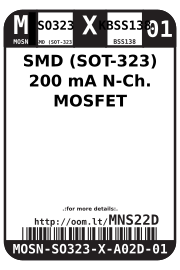
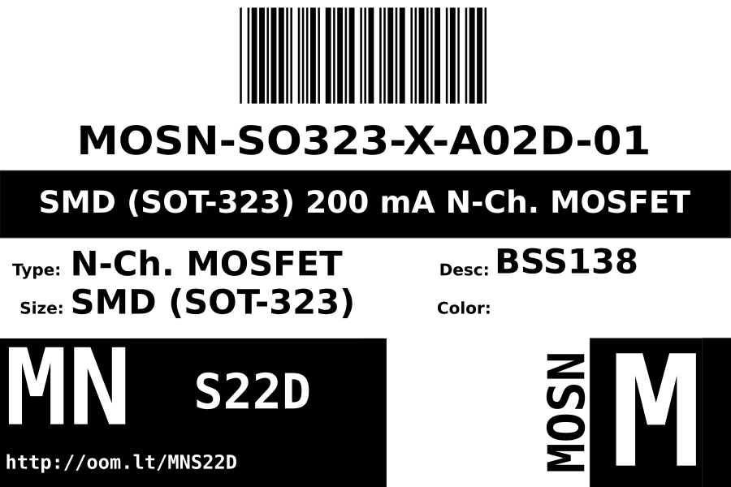

Contents
========

* [MOSN-SO323-X-A02D-01>SMD (SOT-323) 200 mA N-Ch. MOSFET](#mosn-so323-x-a02d-01smd-sot-323-200-ma-n-ch-mosfet)
	* [Images](#images)
	* [Datasheets](#datasheets)
	* [Labels](#labels)
	* [EDA](#eda)
		* [Symbols](#symbols)
	* [Tags](#tags)
  
![][im]
# MOSN-SO323-X-A02D-01>SMD (SOT-323) 200 mA N-Ch. MOSFET

- ID: MOSN-SO323-X-A02D-01
- Name: MOSN-SO323-X-A02D-01

## Images
  
  

|image|image_RE|image_BOTTOM|
| :---: | :---: | :---: |
||||

## Datasheets

- Datasheet: [datasheet.pdf](datasheet.pdf)

## Labels
  
  

|label-front|label-inventory|label-spec|
| :---: | :---: | :---: |
||||

## EDA

### Symbols

## Tags

- oompID: MOSN-SO323-X-A02D-01
- name: SMD (SOT-323) 200 mA N-Ch. MOSFET
- hexID: MNS22D
- oompSort: MOSNSO323A02D
- oompType: MOSN
- oompSize: SO323
- oompColor: X
- oompDesc: A02D
- oompIndex: 01
- oompVersion: 98
- ooNumPins: 3
- ooPin1: G
- ooPin2: S
- ooPin3: D
- oompBbls: template;XXXX-SO323-X-XXXX-01-bbls
- oompDiag: template;XXXX-SO323-X-XXXX-01-diag
- oompIden: template;XXXX-SO323-X-XXXX-01-iden
- oompSimp: template;XXXX-SO323-X-XXXX-01-simp
- ooPackageMarking: K38
- ooDesignator: Q1

[im]: image_600.jpg
