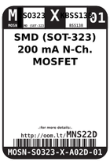

Contents
========

* [MNS22D > SMD (SOT-323) 200 mA N-Ch. MOSFET](#mns22d--smd-sot-323-200-ma-n-ch-mosfet)
	* [Labels](#labels)
	* [EDA](#eda)
	* [Images](#images)
	* [Tags](#tags)

# MNS22D > SMD (SOT-323) 200 mA N-Ch. MOSFET

- ID: MOSN-SO323-X-A02D-01
- Hex ID: MNS22D
- Name: SMD (SOT-323) 200 mA N-Ch. MOSFET
- Description: SMD (SOT-323) 200 mA N-Ch. MOSFET
- Long Link: [http://oom.lt/MOSN-SO323-X-A02D-01](http://oom.lt/MOSN-SO323-X-A02D-01)
- Short Link: [http://oom.lt/MNS22D](http://oom.lt/MNS22D)

## Labels
  
  

|label-front|label-inventory|label-spec|
| :---: | :---: | :---: |
||||

## EDA

### Symbols

## Images
  
  

|label-front|label-inventory|label-spec|
| :---: | :---: | :---: |
||||

## Tags

- oompID: MOSN-SO323-X-A02D-01
- name: SMD (SOT-323) 200 mA N-Ch. MOSFET
- hexID: MNS22D
- oompSort: MOSNSO323A02D
- oompType: MOSN
- oompSize: SO323
- oompColor: X
- oompDesc: KBSS138
- oompIndex: 01
- oompVersion: 98
- ooNumPins: 3
- ooPin1: G
- ooPin2: S
- ooPin3: D
- oompBbls: template;XXXX-SO323-X-XXXX-01-bbls
- oompDiag: template;XXXX-SO323-X-XXXX-01-diag
- oompIden: template;XXXX-SO323-X-XXXX-01-iden
- oompSimp: template;XXXX-SO323-X-XXXX-01-simp
- ooPackageMarking: K38
- ooDesignator: Q1
