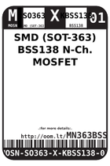
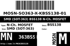
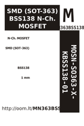

Contents
========

* [MN363BSS138 > SMD (SOT-363) BSS138 N-Ch. MOSFET](#mn363bss138--smd-sot-363-bss138-n-ch-mosfet)
	* [Datasheets](#datasheets)
	* [Labels](#labels)
	* [EDA](#eda)
	* [Images](#images)
	* [Tags](#tags)

# MN363BSS138 > SMD (SOT-363) BSS138 N-Ch. MOSFET

- ID: MOSN-SO363-X-KBSS138-01
- Hex ID: MN363BSS138
- Name: SMD (SOT-363) BSS138 N-Ch. MOSFET
- Description: SMD (SOT-363) BSS138 N-Ch. MOSFET
- Long Link: [http://oom.lt/MOSN-SO363-X-KBSS138-01](http://oom.lt/MOSN-SO363-X-KBSS138-01)
- Short Link: [http://oom.lt/MN363BSS138](http://oom.lt/MN363BSS138)

## Datasheets

- Datasheet: [datasheet.pdf](datasheet.pdf)

## Labels
  
  

|label-front|label-inventory|label-spec|
| :---: | :---: | :---: |
||||

## EDA
  

### Instances
  
Used 54 times.  
Prevalance: (54\10986) 0.4915%  

|Project|Occur- rences|Identifiers|
| :---: | :---: | :---: |
|[PROJ-ADAF-1231-STAN-01 Adafruit_ADXL345_PCB](https://github.com/oomlout/oomlout_OOMP_projects/tree/main/PROJ-ADAF-1231-STAN-01/)|[1](https://github.com/oomlout/oomlout_OOMP_projects/tree/main/PROJ-ADAF-1231-STAN-01/)|[Q2](https://github.com/oomlout/oomlout_OOMP_projects/tree/main/PROJ-ADAF-1231-STAN-01/)|
|[PROJ-ADAF-1982-STAN-01 Adafruit MPR121 PCB](https://github.com/oomlout/oomlout_OOMP_projects/tree/main/PROJ-ADAF-1982-STAN-01/)|[1](https://github.com/oomlout/oomlout_OOMP_projects/tree/main/PROJ-ADAF-1982-STAN-01/)|[Q3](https://github.com/oomlout/oomlout_OOMP_projects/tree/main/PROJ-ADAF-1982-STAN-01/)|
|[PROJ-ADAF-2809-STAN-01 Adafruit LIS3DH Breakout PCB](https://github.com/oomlout/oomlout_OOMP_projects/tree/main/PROJ-ADAF-2809-STAN-01/)|[1](https://github.com/oomlout/oomlout_OOMP_projects/tree/main/PROJ-ADAF-2809-STAN-01/)|[Q2](https://github.com/oomlout/oomlout_OOMP_projects/tree/main/PROJ-ADAF-2809-STAN-01/)|
|[PROJ-ADAF-3251-STAN-01 Adafruit Si7021 PCB](https://github.com/oomlout/oomlout_OOMP_projects/tree/main/PROJ-ADAF-3251-STAN-01/)|[1](https://github.com/oomlout/oomlout_OOMP_projects/tree/main/PROJ-ADAF-3251-STAN-01/)|[Q3](https://github.com/oomlout/oomlout_OOMP_projects/tree/main/PROJ-ADAF-3251-STAN-01/)|
|[PROJ-ADAF-3387-STAN-01 Adafruit LSM9DS1 Breakout PCB](https://github.com/oomlout/oomlout_OOMP_projects/tree/main/PROJ-ADAF-3387-STAN-01/)|[1](https://github.com/oomlout/oomlout_OOMP_projects/tree/main/PROJ-ADAF-3387-STAN-01/)|[Q2](https://github.com/oomlout/oomlout_OOMP_projects/tree/main/PROJ-ADAF-3387-STAN-01/)|
|[PROJ-ADAF-3660-STAN-01 Adafruit BME680 PCB](https://github.com/oomlout/oomlout_OOMP_projects/tree/main/PROJ-ADAF-3660-STAN-01/)|[1](https://github.com/oomlout/oomlout_OOMP_projects/tree/main/PROJ-ADAF-3660-STAN-01/)|[Q2](https://github.com/oomlout/oomlout_OOMP_projects/tree/main/PROJ-ADAF-3660-STAN-01/)|
|[PROJ-ADAF-3709-STAN-01 Adafruit SGP30 PCB](https://github.com/oomlout/oomlout_OOMP_projects/tree/main/PROJ-ADAF-3709-STAN-01/)|[1](https://github.com/oomlout/oomlout_OOMP_projects/tree/main/PROJ-ADAF-3709-STAN-01/)|[Q2](https://github.com/oomlout/oomlout_OOMP_projects/tree/main/PROJ-ADAF-3709-STAN-01/)|
|[PROJ-ADAF-3779-STAN-01 Adafruit AS7262 Breakout PCB](https://github.com/oomlout/oomlout_OOMP_projects/tree/main/PROJ-ADAF-3779-STAN-01/)|[1](https://github.com/oomlout/oomlout_OOMP_projects/tree/main/PROJ-ADAF-3779-STAN-01/)|[Q3](https://github.com/oomlout/oomlout_OOMP_projects/tree/main/PROJ-ADAF-3779-STAN-01/)|
|[PROJ-ADAF-3886-STAN-01 Adafruit MPU6050 PCB](https://github.com/oomlout/oomlout_OOMP_projects/tree/main/PROJ-ADAF-3886-STAN-01/)|[1](https://github.com/oomlout/oomlout_OOMP_projects/tree/main/PROJ-ADAF-3886-STAN-01/)|[Q2](https://github.com/oomlout/oomlout_OOMP_projects/tree/main/PROJ-ADAF-3886-STAN-01/)|
|[PROJ-ADAF-3966-STAN-01 Adafruit BMP3xx PCB](https://github.com/oomlout/oomlout_OOMP_projects/tree/main/PROJ-ADAF-3966-STAN-01/)|[1](https://github.com/oomlout/oomlout_OOMP_projects/tree/main/PROJ-ADAF-3966-STAN-01/)|[Q2](https://github.com/oomlout/oomlout_OOMP_projects/tree/main/PROJ-ADAF-3966-STAN-01/)|
|[PROJ-ADAF-3967-STAN-01 Adafruit VL53L1X PCB](https://github.com/oomlout/oomlout_OOMP_projects/tree/main/PROJ-ADAF-3967-STAN-01/)|[1](https://github.com/oomlout/oomlout_OOMP_projects/tree/main/PROJ-ADAF-3967-STAN-01/)|[Q3](https://github.com/oomlout/oomlout_OOMP_projects/tree/main/PROJ-ADAF-3967-STAN-01/)|
|[PROJ-ADAF-4022-STAN-01 Adafruit MLX90393 PCB](https://github.com/oomlout/oomlout_OOMP_projects/tree/main/PROJ-ADAF-4022-STAN-01/)|[1](https://github.com/oomlout/oomlout_OOMP_projects/tree/main/PROJ-ADAF-4022-STAN-01/)|[Q1](https://github.com/oomlout/oomlout_OOMP_projects/tree/main/PROJ-ADAF-4022-STAN-01/)|
|[PROJ-ADAF-4161-STAN-01 Adafruit VCNL4040 PCB](https://github.com/oomlout/oomlout_OOMP_projects/tree/main/PROJ-ADAF-4161-STAN-01/)|[1](https://github.com/oomlout/oomlout_OOMP_projects/tree/main/PROJ-ADAF-4161-STAN-01/)|[Q2](https://github.com/oomlout/oomlout_OOMP_projects/tree/main/PROJ-ADAF-4161-STAN-01/)|
|[PROJ-ADAF-4300-STAN-01 Adafruit Hallowing M4 PCB](https://github.com/oomlout/oomlout_OOMP_projects/tree/main/PROJ-ADAF-4300-STAN-01/)|[1](https://github.com/oomlout/oomlout_OOMP_projects/tree/main/PROJ-ADAF-4300-STAN-01/)|[Q7](https://github.com/oomlout/oomlout_OOMP_projects/tree/main/PROJ-ADAF-4300-STAN-01/)|
|[PROJ-ADAF-4344-STAN-01 Adafruit MSA301 PCB](https://github.com/oomlout/oomlout_OOMP_projects/tree/main/PROJ-ADAF-4344-STAN-01/)|[1](https://github.com/oomlout/oomlout_OOMP_projects/tree/main/PROJ-ADAF-4344-STAN-01/)|[Q2](https://github.com/oomlout/oomlout_OOMP_projects/tree/main/PROJ-ADAF-4344-STAN-01/)|
|[PROJ-ADAF-4366-STAN-01 Adafruit TLV493D PCB](https://github.com/oomlout/oomlout_OOMP_projects/tree/main/PROJ-ADAF-4366-STAN-01/)|[1](https://github.com/oomlout/oomlout_OOMP_projects/tree/main/PROJ-ADAF-4366-STAN-01/)|[Q2](https://github.com/oomlout/oomlout_OOMP_projects/tree/main/PROJ-ADAF-4366-STAN-01/)|
|[PROJ-ADAF-4407-STAN-01 Adafruit MLX90640 PCB](https://github.com/oomlout/oomlout_OOMP_projects/tree/main/PROJ-ADAF-4407-STAN-01/)|[1](https://github.com/oomlout/oomlout_OOMP_projects/tree/main/PROJ-ADAF-4407-STAN-01/)|[Q2](https://github.com/oomlout/oomlout_OOMP_projects/tree/main/PROJ-ADAF-4407-STAN-01/)|
|[PROJ-ADAF-4413-STAN-01 Adafruit LSM303AGR PCB](https://github.com/oomlout/oomlout_OOMP_projects/tree/main/PROJ-ADAF-4413-STAN-01/)|[1](https://github.com/oomlout/oomlout_OOMP_projects/tree/main/PROJ-ADAF-4413-STAN-01/)|[Q2](https://github.com/oomlout/oomlout_OOMP_projects/tree/main/PROJ-ADAF-4413-STAN-01/)|
|[PROJ-ADAF-4415-STAN-01 Adafruit PA1010D Mini GPS PCB](https://github.com/oomlout/oomlout_OOMP_projects/tree/main/PROJ-ADAF-4415-STAN-01/)|[1](https://github.com/oomlout/oomlout_OOMP_projects/tree/main/PROJ-ADAF-4415-STAN-01/)|[Q2](https://github.com/oomlout/oomlout_OOMP_projects/tree/main/PROJ-ADAF-4415-STAN-01/)|
|[PROJ-ADAF-4438-STAN-01 Adafruit LSM6DSOX PCB](https://github.com/oomlout/oomlout_OOMP_projects/tree/main/PROJ-ADAF-4438-STAN-01/)|[1](https://github.com/oomlout/oomlout_OOMP_projects/tree/main/PROJ-ADAF-4438-STAN-01/)|[Q2](https://github.com/oomlout/oomlout_OOMP_projects/tree/main/PROJ-ADAF-4438-STAN-01/)|
|[PROJ-ADAF-4464-STAN-01 Adafruit ICM20649 PCB](https://github.com/oomlout/oomlout_OOMP_projects/tree/main/PROJ-ADAF-4464-STAN-01/)|[1](https://github.com/oomlout/oomlout_OOMP_projects/tree/main/PROJ-ADAF-4464-STAN-01/)|[Q2](https://github.com/oomlout/oomlout_OOMP_projects/tree/main/PROJ-ADAF-4464-STAN-01/)|
|[PROJ-ADAF-4479-STAN-01 Adafruit LIS3MDL PCB](https://github.com/oomlout/oomlout_OOMP_projects/tree/main/PROJ-ADAF-4479-STAN-01/)|[1](https://github.com/oomlout/oomlout_OOMP_projects/tree/main/PROJ-ADAF-4479-STAN-01/)|[Q2](https://github.com/oomlout/oomlout_OOMP_projects/tree/main/PROJ-ADAF-4479-STAN-01/)|
|[PROJ-ADAF-4480-STAN-01 Adafruit LSM6DS33 PCB](https://github.com/oomlout/oomlout_OOMP_projects/tree/main/PROJ-ADAF-4480-STAN-01/)|[1](https://github.com/oomlout/oomlout_OOMP_projects/tree/main/PROJ-ADAF-4480-STAN-01/)|[Q2](https://github.com/oomlout/oomlout_OOMP_projects/tree/main/PROJ-ADAF-4480-STAN-01/)|
|[PROJ-ADAF-4485-STAN-01 Adafruit LSM6DS33 LIS3MDL PCB](https://github.com/oomlout/oomlout_OOMP_projects/tree/main/PROJ-ADAF-4485-STAN-01/)|[1](https://github.com/oomlout/oomlout_OOMP_projects/tree/main/PROJ-ADAF-4485-STAN-01/)|[Q2](https://github.com/oomlout/oomlout_OOMP_projects/tree/main/PROJ-ADAF-4485-STAN-01/)|
|[PROJ-ADAF-4488-STAN-01 Adafruit LIS2MDL PCB](https://github.com/oomlout/oomlout_OOMP_projects/tree/main/PROJ-ADAF-4488-STAN-01/)|[1](https://github.com/oomlout/oomlout_OOMP_projects/tree/main/PROJ-ADAF-4488-STAN-01/)|[Q2](https://github.com/oomlout/oomlout_OOMP_projects/tree/main/PROJ-ADAF-4488-STAN-01/)|
|[PROJ-ADAF-4494-STAN-01 Adafruit DPS310 PCB](https://github.com/oomlout/oomlout_OOMP_projects/tree/main/PROJ-ADAF-4494-STAN-01/)|[1](https://github.com/oomlout/oomlout_OOMP_projects/tree/main/PROJ-ADAF-4494-STAN-01/)|[Q2](https://github.com/oomlout/oomlout_OOMP_projects/tree/main/PROJ-ADAF-4494-STAN-01/)|
|[PROJ-ADAF-4517-STAN-01 Adafruit LSM6DSOX LIS3MDL PCB](https://github.com/oomlout/oomlout_OOMP_projects/tree/main/PROJ-ADAF-4517-STAN-01/)|[1](https://github.com/oomlout/oomlout_OOMP_projects/tree/main/PROJ-ADAF-4517-STAN-01/)|[Q2](https://github.com/oomlout/oomlout_OOMP_projects/tree/main/PROJ-ADAF-4517-STAN-01/)|
|[PROJ-ADAF-4530-STAN-01 Adafruit LPS2X PCB](https://github.com/oomlout/oomlout_OOMP_projects/tree/main/PROJ-ADAF-4530-STAN-01/)|[1](https://github.com/oomlout/oomlout_OOMP_projects/tree/main/PROJ-ADAF-4530-STAN-01/)|[Q2](https://github.com/oomlout/oomlout_OOMP_projects/tree/main/PROJ-ADAF-4530-STAN-01/)|
|[PROJ-ADAF-4535-STAN-01 Adafruit HTS221 PCB](https://github.com/oomlout/oomlout_OOMP_projects/tree/main/PROJ-ADAF-4535-STAN-01/)|[1](https://github.com/oomlout/oomlout_OOMP_projects/tree/main/PROJ-ADAF-4535-STAN-01/)|[Q2](https://github.com/oomlout/oomlout_OOMP_projects/tree/main/PROJ-ADAF-4535-STAN-01/)|
|[PROJ-ADAF-4632-STAN-01 Adafruit PMSA003I PCB](https://github.com/oomlout/oomlout_OOMP_projects/tree/main/PROJ-ADAF-4632-STAN-01/)|[1](https://github.com/oomlout/oomlout_OOMP_projects/tree/main/PROJ-ADAF-4632-STAN-01/)|[Q2](https://github.com/oomlout/oomlout_OOMP_projects/tree/main/PROJ-ADAF-4632-STAN-01/)|
|[PROJ-ADAF-4636-STAN-01 Adafruit SHTC3 PCB](https://github.com/oomlout/oomlout_OOMP_projects/tree/main/PROJ-ADAF-4636-STAN-01/)|[1](https://github.com/oomlout/oomlout_OOMP_projects/tree/main/PROJ-ADAF-4636-STAN-01/)|[Q2](https://github.com/oomlout/oomlout_OOMP_projects/tree/main/PROJ-ADAF-4636-STAN-01/)|
|[PROJ-ADAF-4681-STAN-01 Adafruit BH1750 PCB](https://github.com/oomlout/oomlout_OOMP_projects/tree/main/PROJ-ADAF-4681-STAN-01/)|[1](https://github.com/oomlout/oomlout_OOMP_projects/tree/main/PROJ-ADAF-4681-STAN-01/)|[Q2](https://github.com/oomlout/oomlout_OOMP_projects/tree/main/PROJ-ADAF-4681-STAN-01/)|
|[PROJ-ADAF-4698-STAN-01 Adafruit AS7341 PCB](https://github.com/oomlout/oomlout_OOMP_projects/tree/main/PROJ-ADAF-4698-STAN-01/)|[1](https://github.com/oomlout/oomlout_OOMP_projects/tree/main/PROJ-ADAF-4698-STAN-01/)|[Q2](https://github.com/oomlout/oomlout_OOMP_projects/tree/main/PROJ-ADAF-4698-STAN-01/)|
|[PROJ-ADAF-4716-STAN-01 Adafruit MS8607 PCB](https://github.com/oomlout/oomlout_OOMP_projects/tree/main/PROJ-ADAF-4716-STAN-01/)|[1](https://github.com/oomlout/oomlout_OOMP_projects/tree/main/PROJ-ADAF-4716-STAN-01/)|[Q2](https://github.com/oomlout/oomlout_OOMP_projects/tree/main/PROJ-ADAF-4716-STAN-01/)|
|[PROJ-ADAF-4741-STAN-01 Adafruit Grayscale 1.5 inch 128x128 OLED PCB](https://github.com/oomlout/oomlout_OOMP_projects/tree/main/PROJ-ADAF-4741-STAN-01/)|[1](https://github.com/oomlout/oomlout_OOMP_projects/tree/main/PROJ-ADAF-4741-STAN-01/)|[Q2](https://github.com/oomlout/oomlout_OOMP_projects/tree/main/PROJ-ADAF-4741-STAN-01/)|
|[PROJ-ADAF-4754-STAN-01 Adafruit BNO08x PCB](https://github.com/oomlout/oomlout_OOMP_projects/tree/main/PROJ-ADAF-4754-STAN-01/)|[1](https://github.com/oomlout/oomlout_OOMP_projects/tree/main/PROJ-ADAF-4754-STAN-01/)|[Q2](https://github.com/oomlout/oomlout_OOMP_projects/tree/main/PROJ-ADAF-4754-STAN-01/)|
|[PROJ-ADAF-4829-STAN-01 Adafruit SGP40 PCB](https://github.com/oomlout/oomlout_OOMP_projects/tree/main/PROJ-ADAF-4829-STAN-01/)|[1](https://github.com/oomlout/oomlout_OOMP_projects/tree/main/PROJ-ADAF-4829-STAN-01/)|[Q2](https://github.com/oomlout/oomlout_OOMP_projects/tree/main/PROJ-ADAF-4829-STAN-01/)|
|[PROJ-ADAF-4831-STAN-01 Adafruit LTR390 PCB](https://github.com/oomlout/oomlout_OOMP_projects/tree/main/PROJ-ADAF-4831-STAN-01/)|[1](https://github.com/oomlout/oomlout_OOMP_projects/tree/main/PROJ-ADAF-4831-STAN-01/)|[Q2](https://github.com/oomlout/oomlout_OOMP_projects/tree/main/PROJ-ADAF-4831-STAN-01/)|
|[PROJ-ADAF-4836-STAN-01 Adafruit Wii Nunchuck Breakout Adapter PCB](https://github.com/oomlout/oomlout_OOMP_projects/tree/main/PROJ-ADAF-4836-STAN-01/)|[1](https://github.com/oomlout/oomlout_OOMP_projects/tree/main/PROJ-ADAF-4836-STAN-01/)|[Q2](https://github.com/oomlout/oomlout_OOMP_projects/tree/main/PROJ-ADAF-4836-STAN-01/)|
|[PROJ-ADAF-4867-STAN-01 Adafruit SCD 30 PCB](https://github.com/oomlout/oomlout_OOMP_projects/tree/main/PROJ-ADAF-4867-STAN-01/)|[1](https://github.com/oomlout/oomlout_OOMP_projects/tree/main/PROJ-ADAF-4867-STAN-01/)|[Q2](https://github.com/oomlout/oomlout_OOMP_projects/tree/main/PROJ-ADAF-4867-STAN-01/)|
|[PROJ-ADAF-4885-STAN-01 Adafruit SHT40 PCB](https://github.com/oomlout/oomlout_OOMP_projects/tree/main/PROJ-ADAF-4885-STAN-01/)|[1](https://github.com/oomlout/oomlout_OOMP_projects/tree/main/PROJ-ADAF-4885-STAN-01/)|[Q2](https://github.com/oomlout/oomlout_OOMP_projects/tree/main/PROJ-ADAF-4885-STAN-01/)|
|[PROJ-ADAF-4980-STAN-01 Adafruit NeoKey 1x4 PCB](https://github.com/oomlout/oomlout_OOMP_projects/tree/main/PROJ-ADAF-4980-STAN-01/)|[1](https://github.com/oomlout/oomlout_OOMP_projects/tree/main/PROJ-ADAF-4980-STAN-01/)|[Q2](https://github.com/oomlout/oomlout_OOMP_projects/tree/main/PROJ-ADAF-4980-STAN-01/)|
|[PROJ-ADAF-4991-STAN-01 Adafruit I2C QT Rotary Encoder PCB](https://github.com/oomlout/oomlout_OOMP_projects/tree/main/PROJ-ADAF-4991-STAN-01/)|[1](https://github.com/oomlout/oomlout_OOMP_projects/tree/main/PROJ-ADAF-4991-STAN-01/)|[Q2](https://github.com/oomlout/oomlout_OOMP_projects/tree/main/PROJ-ADAF-4991-STAN-01/)|
|[PROJ-ADAF-5146-STAN-01 Adafruit 24LC32 PCB](https://github.com/oomlout/oomlout_OOMP_projects/tree/main/PROJ-ADAF-5146-STAN-01/)|[1](https://github.com/oomlout/oomlout_OOMP_projects/tree/main/PROJ-ADAF-5146-STAN-01/)|[Q2](https://github.com/oomlout/oomlout_OOMP_projects/tree/main/PROJ-ADAF-5146-STAN-01/)|
|[PROJ-ADAF-5190-STAN-01 Adafruit SCD 4x PCB](https://github.com/oomlout/oomlout_OOMP_projects/tree/main/PROJ-ADAF-5190-STAN-01/)|[1](https://github.com/oomlout/oomlout_OOMP_projects/tree/main/PROJ-ADAF-5190-STAN-01/)|[Q2](https://github.com/oomlout/oomlout_OOMP_projects/tree/main/PROJ-ADAF-5190-STAN-01/)|
|[PROJ-ADAF-5296-STAN-01 Adafruit LED Arcade Button 1x4 PCB](https://github.com/oomlout/oomlout_OOMP_projects/tree/main/PROJ-ADAF-5296-STAN-01/)|[2](https://github.com/oomlout/oomlout_OOMP_projects/tree/main/PROJ-ADAF-5296-STAN-01/)|[Q1, Q3](https://github.com/oomlout/oomlout_OOMP_projects/tree/main/PROJ-ADAF-5296-STAN-01/)|
|[PROJ-ADAF-5297-STAN-01 Adafruit 1.12in 128x128 OLED PCB](https://github.com/oomlout/oomlout_OOMP_projects/tree/main/PROJ-ADAF-5297-STAN-01/)|[1](https://github.com/oomlout/oomlout_OOMP_projects/tree/main/PROJ-ADAF-5297-STAN-01/)|[Q2](https://github.com/oomlout/oomlout_OOMP_projects/tree/main/PROJ-ADAF-5297-STAN-01/)|
|[PROJ-ADAF-5309-STAN-01 Adafruit_MSA311_PCB](https://github.com/oomlout/oomlout_OOMP_projects/tree/main/PROJ-ADAF-5309-STAN-01/)|[1](https://github.com/oomlout/oomlout_OOMP_projects/tree/main/PROJ-ADAF-5309-STAN-01/)|[Q2](https://github.com/oomlout/oomlout_OOMP_projects/tree/main/PROJ-ADAF-5309-STAN-01/)|
|[PROJ-ADAF-5374-STAN-01 Adafruit_ADXL375_PCB](https://github.com/oomlout/oomlout_OOMP_projects/tree/main/PROJ-ADAF-5374-STAN-01/)|[1](https://github.com/oomlout/oomlout_OOMP_projects/tree/main/PROJ-ADAF-5374-STAN-01/)|[Q2](https://github.com/oomlout/oomlout_OOMP_projects/tree/main/PROJ-ADAF-5374-STAN-01/)|
|[PROJ-ADAF-5378-STAN-01 Adafruit VEML7700 PCB](https://github.com/oomlout/oomlout_OOMP_projects/tree/main/PROJ-ADAF-5378-STAN-01/)|[1](https://github.com/oomlout/oomlout_OOMP_projects/tree/main/PROJ-ADAF-5378-STAN-01/)|[Q2](https://github.com/oomlout/oomlout_OOMP_projects/tree/main/PROJ-ADAF-5378-STAN-01/)|
|[PROJ-ADAF-5396-STAN-01 Adafruit VL53L4CD PCB](https://github.com/oomlout/oomlout_OOMP_projects/tree/main/PROJ-ADAF-5396-STAN-01/)|[1](https://github.com/oomlout/oomlout_OOMP_projects/tree/main/PROJ-ADAF-5396-STAN-01/)|[Q3](https://github.com/oomlout/oomlout_OOMP_projects/tree/main/PROJ-ADAF-5396-STAN-01/)|
|[PROJ-ADAF-5423-STAN-01 Adafruit TSC2007 PCB](https://github.com/oomlout/oomlout_OOMP_projects/tree/main/PROJ-ADAF-5423-STAN-01/)|[1](https://github.com/oomlout/oomlout_OOMP_projects/tree/main/PROJ-ADAF-5423-STAN-01/)|[Q2](https://github.com/oomlout/oomlout_OOMP_projects/tree/main/PROJ-ADAF-5423-STAN-01/)|
|[PROJ-ADAF-5425-STAN-01 Adafruit VL53L4CX PCB](https://github.com/oomlout/oomlout_OOMP_projects/tree/main/PROJ-ADAF-5425-STAN-01/)|[1](https://github.com/oomlout/oomlout_OOMP_projects/tree/main/PROJ-ADAF-5425-STAN-01/)|[Q3](https://github.com/oomlout/oomlout_OOMP_projects/tree/main/PROJ-ADAF-5425-STAN-01/)|

## Images
  
  

|label-front|label-inventory|label-spec|
| :---: | :---: | :---: |
||||

## Tags

- oompType: MOSN
- oompSize: SO363
- oompColor: X
- oompDesc: KBSS138
- oompIndex: 01
- hexID: MN363BSS138
- oompID: MOSN-SO363-X-KBSS138-01
- oompInstances: {'PROJECT': 'PROJ-ADAF-1231-STAN-01', 'ID': 'Q2'}
- oompInstances: {'PROJECT': 'PROJ-ADAF-1982-STAN-01', 'ID': 'Q3'}
- oompInstances: {'PROJECT': 'PROJ-ADAF-2809-STAN-01', 'ID': 'Q2'}
- oompInstances: {'PROJECT': 'PROJ-ADAF-3251-STAN-01', 'ID': 'Q3'}
- oompInstances: {'PROJECT': 'PROJ-ADAF-3387-STAN-01', 'ID': 'Q2'}
- oompInstances: {'PROJECT': 'PROJ-ADAF-3660-STAN-01', 'ID': 'Q2'}
- oompInstances: {'PROJECT': 'PROJ-ADAF-3709-STAN-01', 'ID': 'Q2'}
- oompInstances: {'PROJECT': 'PROJ-ADAF-3779-STAN-01', 'ID': 'Q3'}
- oompInstances: {'PROJECT': 'PROJ-ADAF-3886-STAN-01', 'ID': 'Q2'}
- oompInstances: {'PROJECT': 'PROJ-ADAF-3966-STAN-01', 'ID': 'Q2'}
- oompInstances: {'PROJECT': 'PROJ-ADAF-3967-STAN-01', 'ID': 'Q3'}
- oompInstances: {'PROJECT': 'PROJ-ADAF-4022-STAN-01', 'ID': 'Q1'}
- oompInstances: {'PROJECT': 'PROJ-ADAF-4161-STAN-01', 'ID': 'Q2'}
- oompInstances: {'PROJECT': 'PROJ-ADAF-4300-STAN-01', 'ID': 'Q7'}
- oompInstances: {'PROJECT': 'PROJ-ADAF-4344-STAN-01', 'ID': 'Q2'}
- oompInstances: {'PROJECT': 'PROJ-ADAF-4366-STAN-01', 'ID': 'Q2'}
- oompInstances: {'PROJECT': 'PROJ-ADAF-4407-STAN-01', 'ID': 'Q2'}
- oompInstances: {'PROJECT': 'PROJ-ADAF-4413-STAN-01', 'ID': 'Q2'}
- oompInstances: {'PROJECT': 'PROJ-ADAF-4415-STAN-01', 'ID': 'Q2'}
- oompInstances: {'PROJECT': 'PROJ-ADAF-4438-STAN-01', 'ID': 'Q2'}
- oompInstances: {'PROJECT': 'PROJ-ADAF-4464-STAN-01', 'ID': 'Q2'}
- oompInstances: {'PROJECT': 'PROJ-ADAF-4479-STAN-01', 'ID': 'Q2'}
- oompInstances: {'PROJECT': 'PROJ-ADAF-4480-STAN-01', 'ID': 'Q2'}
- oompInstances: {'PROJECT': 'PROJ-ADAF-4485-STAN-01', 'ID': 'Q2'}
- oompInstances: {'PROJECT': 'PROJ-ADAF-4488-STAN-01', 'ID': 'Q2'}
- oompInstances: {'PROJECT': 'PROJ-ADAF-4494-STAN-01', 'ID': 'Q2'}
- oompInstances: {'PROJECT': 'PROJ-ADAF-4517-STAN-01', 'ID': 'Q2'}
- oompInstances: {'PROJECT': 'PROJ-ADAF-4530-STAN-01', 'ID': 'Q2'}
- oompInstances: {'PROJECT': 'PROJ-ADAF-4535-STAN-01', 'ID': 'Q2'}
- oompInstances: {'PROJECT': 'PROJ-ADAF-4632-STAN-01', 'ID': 'Q2'}
- oompInstances: {'PROJECT': 'PROJ-ADAF-4636-STAN-01', 'ID': 'Q2'}
- oompInstances: {'PROJECT': 'PROJ-ADAF-4681-STAN-01', 'ID': 'Q2'}
- oompInstances: {'PROJECT': 'PROJ-ADAF-4698-STAN-01', 'ID': 'Q2'}
- oompInstances: {'PROJECT': 'PROJ-ADAF-4716-STAN-01', 'ID': 'Q2'}
- oompInstances: {'PROJECT': 'PROJ-ADAF-4741-STAN-01', 'ID': 'Q2'}
- oompInstances: {'PROJECT': 'PROJ-ADAF-4754-STAN-01', 'ID': 'Q2'}
- oompInstances: {'PROJECT': 'PROJ-ADAF-4829-STAN-01', 'ID': 'Q2'}
- oompInstances: {'PROJECT': 'PROJ-ADAF-4831-STAN-01', 'ID': 'Q2'}
- oompInstances: {'PROJECT': 'PROJ-ADAF-4836-STAN-01', 'ID': 'Q2'}
- oompInstances: {'PROJECT': 'PROJ-ADAF-4867-STAN-01', 'ID': 'Q2'}
- oompInstances: {'PROJECT': 'PROJ-ADAF-4885-STAN-01', 'ID': 'Q2'}
- oompInstances: {'PROJECT': 'PROJ-ADAF-4980-STAN-01', 'ID': 'Q2'}
- oompInstances: {'PROJECT': 'PROJ-ADAF-4991-STAN-01', 'ID': 'Q2'}
- oompInstances: {'PROJECT': 'PROJ-ADAF-5146-STAN-01', 'ID': 'Q2'}
- oompInstances: {'PROJECT': 'PROJ-ADAF-5190-STAN-01', 'ID': 'Q2'}
- oompInstances: {'PROJECT': 'PROJ-ADAF-5296-STAN-01', 'ID': 'Q1'}
- oompInstances: {'PROJECT': 'PROJ-ADAF-5296-STAN-01', 'ID': 'Q3'}
- oompInstances: {'PROJECT': 'PROJ-ADAF-5297-STAN-01', 'ID': 'Q2'}
- oompInstances: {'PROJECT': 'PROJ-ADAF-5309-STAN-01', 'ID': 'Q2'}
- oompInstances: {'PROJECT': 'PROJ-ADAF-5374-STAN-01', 'ID': 'Q2'}
- oompInstances: {'PROJECT': 'PROJ-ADAF-5378-STAN-01', 'ID': 'Q2'}
- oompInstances: {'PROJECT': 'PROJ-ADAF-5396-STAN-01', 'ID': 'Q3'}
- oompInstances: {'PROJECT': 'PROJ-ADAF-5423-STAN-01', 'ID': 'Q2'}
- oompInstances: {'PROJECT': 'PROJ-ADAF-5425-STAN-01', 'ID': 'Q3'}
