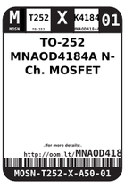
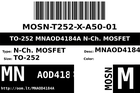

Contents
========

* [MNAOD4184A > TO-252 MNAOD4184A N-Ch. MOSFET](#mnaod4184a--to-252-mnaod4184a-n-ch-mosfet)
	* [Labels](#labels)
	* [EDA](#eda)
	* [Images](#images)
	* [Tags](#tags)

# MNAOD4184A > TO-252 MNAOD4184A N-Ch. MOSFET

- ID: MOSN-T252-X-A50-01
- Hex ID: MNAOD4184A
- Name: TO-252 MNAOD4184A N-Ch. MOSFET
- Description: TO-252 MNAOD4184A N-Ch. MOSFET
- Long Link: [http://oom.lt/MOSN-T252-X-A50-01](http://oom.lt/MOSN-T252-X-A50-01)
- Short Link: [http://oom.lt/MNAOD4184A](http://oom.lt/MNAOD4184A)

## Labels
  
  

|label-front|label-inventory|label-spec|
| :---: | :---: | :---: |
||||

## EDA

### Footprints
  

|  [FOOTPRINT-kicad-kicad-footprints-Package_TO_SOT_SMD-TO-252-3_TabPin2](https://github.com/oomlout/oomlout_OOMP_eda/tree/main/FOOTPRINT/kicad/kicad-footprints/Package_TO_SOT_SMD/TO-252-3_TabPin2/)||||
| :---: | :---: | :---: | :---: |

## Images
  
  

|label-front|label-inventory|label-spec|
| :---: | :---: | :---: |
||||

## Tags

- oompID: MOSN-T252-X-A50-01
- hexID: MNAOD4184A
- oompSort: 
- oompClass: Surface Mount
- oompClassCode: SMDS
- oompType: MOSN
- oompSize: T252
- oompColor: X
- oompDesc: K4184
- oompIndex: 01
- oompVersion: 40
- ooPin1: Q
- ooPin2: D
- ooPin3: S
- ooDesignator: Q1
- footprintKicad: FOOTPRINT-kicad-kicad-footprints-Package_TO_SOT_SMD-TO-252-3_TabPin2
- manufacturerPartNumber: AOD4184A
