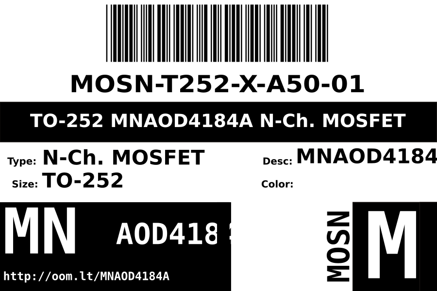

Contents
========

* [MOSN-T252-X-A50-01>TO-252 50 Amp N-Ch. MOSFET](#mosn-t252-x-a50-01to-252-50-amp-n-ch-mosfet)
	* [Datasheets](#datasheets)
	* [Labels](#labels)
	* [EDA](#eda)
		* [Symbols](#symbols)
	* [Tags](#tags)

# MOSN-T252-X-A50-01>TO-252 50 Amp N-Ch. MOSFET

- ID: MOSN-T252-X-A50-01
- Name: MOSN-T252-X-A50-01

## Datasheets

- Datasheet: [datasheet.pdf](datasheet.pdf)

## Labels
  
  

|Front|Inventory|Specifications|
| :---: | :---: | :---: |
||||

## EDA

### Symbols

## Tags

- oompID: MOSN-T252-X-A50-01
- hexID: MNAOD4184A
- oompSort: 
- oompClass: Surface Mount
- oompClassCode: SMDS
- oompType: MOSN
- oompSize: T252
- oompColor: X
- oompDesc: A50
- oompIndex: 01
- oompVersion: 40
- ooPin1: Q
- ooPin2: D
- ooPin3: S
- ooDesignator: Q1
- manufacturerPartNumber: AOD4184A
