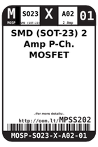
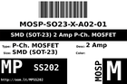

Contents
========

* [MPSS202 > SMD (SOT-23) 2 Amp P-Ch. MOSFET](#mpss202--smd-sot-23-2-amp-p-ch-mosfet)
	* [Datasheets](#datasheets)
	* [Labels](#labels)
	* [EDA](#eda)
	* [Images](#images)
	* [Tags](#tags)

# MPSS202 > SMD (SOT-23) 2 Amp P-Ch. MOSFET

- ID: MOSP-SO23-X-A02-01
- Hex ID: MPSS202
- Name: SMD (SOT-23) 2 Amp P-Ch. MOSFET
- Description: SMD (SOT-23) 2 Amp P-Ch. MOSFET
- Long Link: [http://oom.lt/MOSP-SO23-X-A02-01](http://oom.lt/MOSP-SO23-X-A02-01)
- Short Link: [http://oom.lt/MPSS202](http://oom.lt/MPSS202)

## Datasheets

- Datasheet: [datasheet.pdf](datasheet.pdf)

## Labels
  
  

|label-front|label-inventory|label-spec|
| :---: | :---: | :---: |
||||

## EDA

### Symbols

## Images
  
  

|label-front|label-inventory|label-spec|
| :---: | :---: | :---: |
||||

## Tags

- oompID: MOSP-SO23-X-A02-01
- name: SMD (SOT-23) 2 Amp P-Ch. MOSFET
- hexID: MPSS202
- oompSort: SO2302.000
- oompType: MOSP
- oompSize: SO23
- oompColor: X
- oompDesc: A02
- oompIndex: 01
- oompVersion: 99
- oompSkip: true
- ooWidth: 3 mm
- ooHeight: 1 mm
- ooLength: 2.3 mm
- com: SMD
- ooPackageMarking: 340
- ooPackageMarking: 340
- ooNumPins: 3
- oompClass: Surface Mount
- oompClassCode: SMDS
- ooPin1: G
- ooPin2: S
- ooPin3: D
- oompBbls: template;XXXX-SO23-X-XXXX-01-bbls
- oompDiag: template;XXXX-SO23-X-XXXX-01-diag
- oompIden: template;XXXX-SO23-X-XXXX-01-iden
- oompSimp: template;XXXX-SO23-X-XXXX-01-simp
- ooDesignator: Q1
